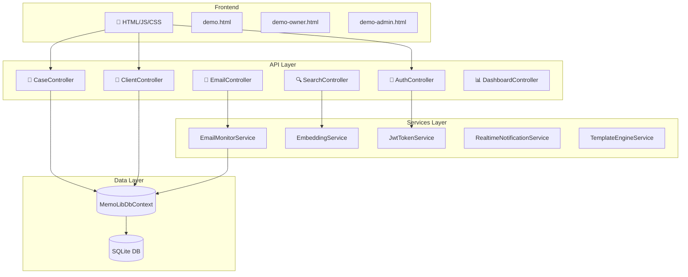
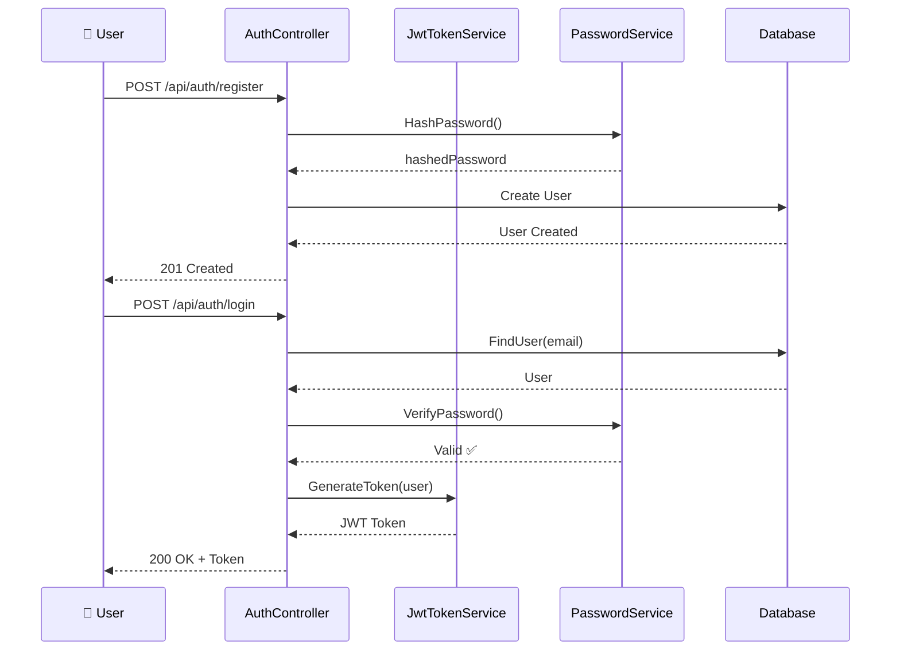
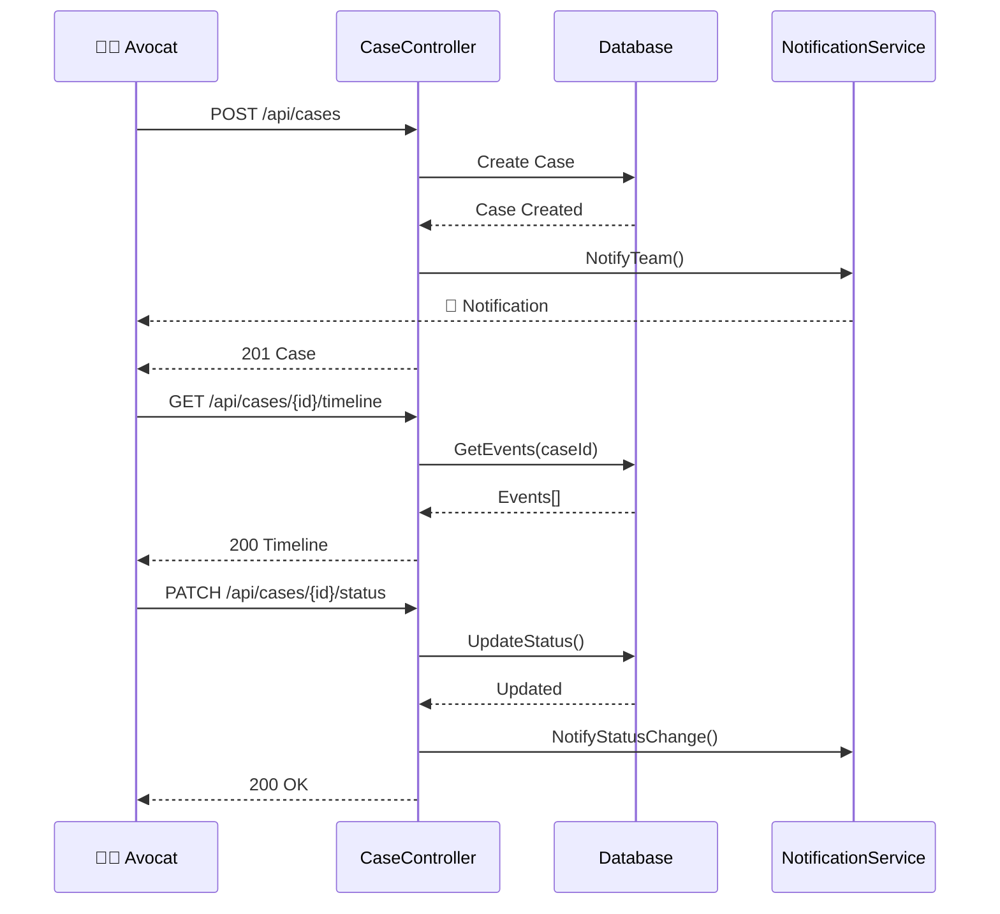
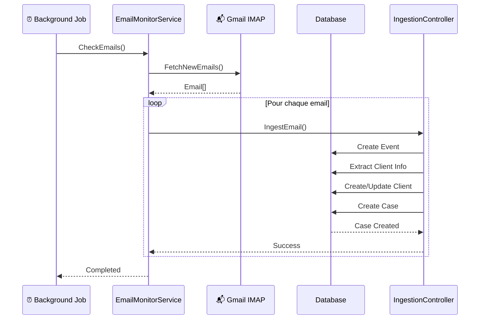
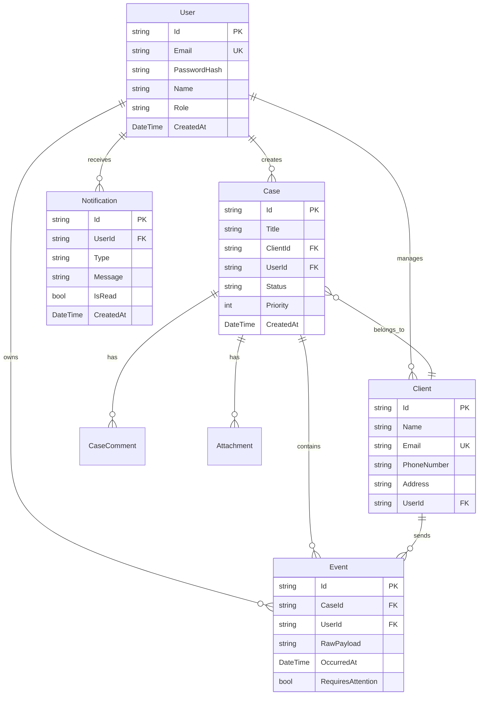
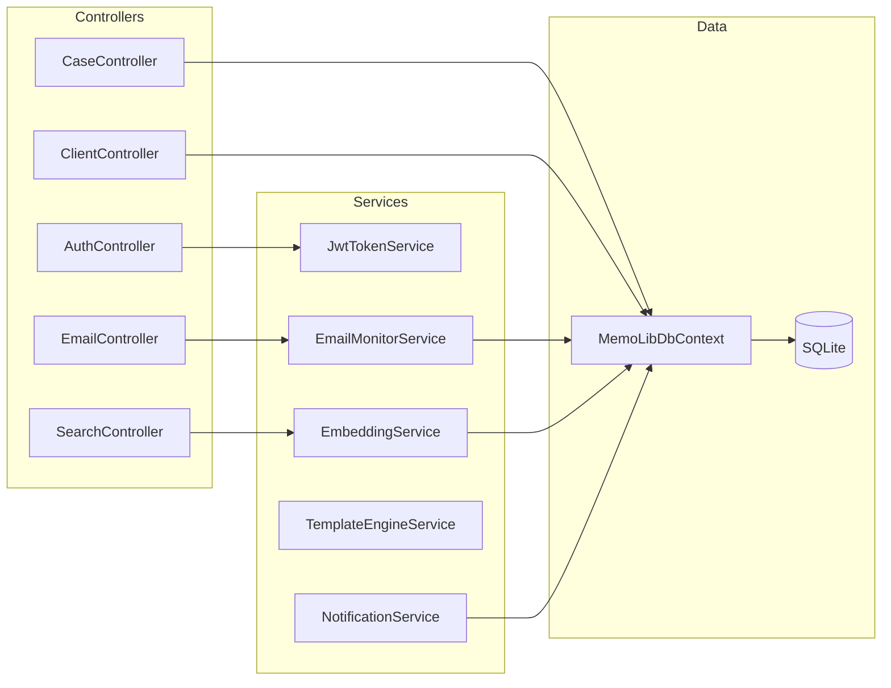
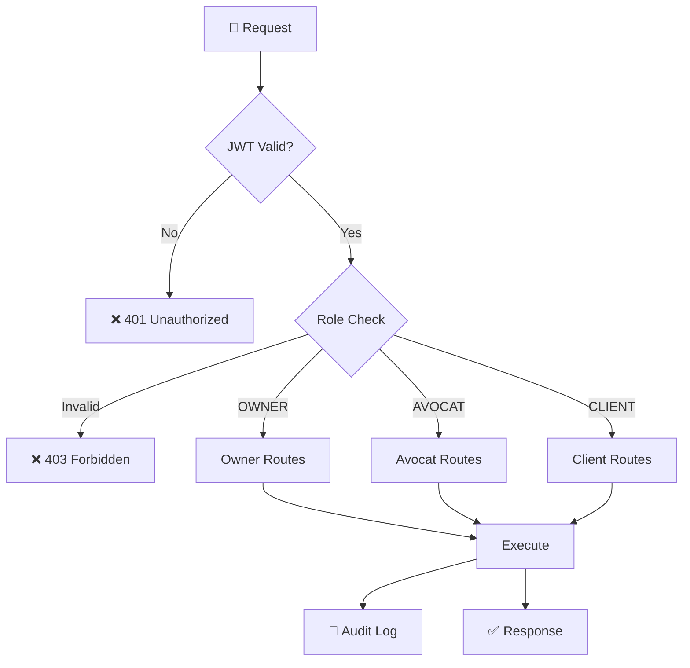

# 🏗️ Architecture MemoLib.Api (.NET 9.0)

## 📐 Architecture Globale



## 🔄 Flux Authentification



## 📁 Flux Gestion Dossiers



## 📧 Flux Email Monitoring



## 🗄️ Modèle de Données (EF Core)



## 🎯 Controllers → Services → Data



## 🔍 API Endpoints Principaux

### Authentification
```
POST   /api/auth/register          → Inscription
POST   /api/auth/login             → Connexion
```

### Dossiers
```
GET    /api/cases                  → Liste dossiers
POST   /api/cases                  → Créer dossier
GET    /api/cases/{id}             → Détail dossier
GET    /api/cases/{id}/timeline    → Timeline
PATCH  /api/cases/{id}/status      → Changer statut
PATCH  /api/cases/{id}/priority    → Définir priorité
POST   /api/cases/merge-duplicates → Fusionner doublons
```

### Clients
```
GET    /api/client                 → Liste clients
POST   /api/client                 → Créer client
GET    /api/client/{id}/detail     → Détail client
PUT    /api/client/{id}            → Modifier client
```

### Emails
```
POST   /api/ingest/email           → Ingérer email
POST   /api/email-scan/manual      → Scan manuel Gmail
POST   /api/email/send             → Envoyer email
GET    /api/email/templates        → Liste templates
POST   /api/email/templates        → Créer template
```

### Recherche
```
POST   /api/search/events          → Recherche textuelle
POST   /api/semantic/search        → Recherche sémantique
POST   /api/embeddings/search      → Recherche vectorielle
POST   /api/embeddings/generate-all → Générer embeddings
```

### Dashboard
```
GET    /api/dashboard/overview     → Vue d'ensemble
GET    /api/stats/events-per-day   → Stats emails/jour
GET    /api/stats/events-by-type   → Stats par type
```

### Alertes
```
GET    /api/alerts/requires-attention → Emails anomalies
GET    /api/alerts/center             → Centre anomalies
POST   /api/events/bulk-delete        → Suppression groupée
```

## 🔐 Sécurité



## 📊 Stack Technique

| Couche | Technologie | Version |
|--------|-------------|---------|
| **Framework** | ASP.NET Core | 9.0 |
| **ORM** | Entity Framework Core | 9.0 |
| **Database** | SQLite | 3.x |
| **Auth** | JWT Bearer | - |
| **Email** | MailKit | 4.15.0 |
| **Password** | BCrypt.Net | - |
| **Frontend** | HTML/CSS/JS | ES6+ |
| **Tests** | Jest | 29.7.0 |

## 📁 Structure Projet

```
MemoLib.Api/
├── Controllers/          # 62 controllers
│   ├── AuthController.cs
│   ├── CaseController.cs
│   ├── ClientController.cs
│   └── ...
├── Services/            # 48 services
│   ├── EmailMonitorService.cs
│   ├── JwtTokenService.cs
│   └── ...
├── Models/              # 32 models
│   ├── User.cs
│   ├── Case.cs
│   ├── Client.cs
│   └── ...
├── Data/                # 2 DbContext
│   └── MemoLibDbContext.cs
├── Migrations/          # EF Core migrations
├── wwwroot/             # Frontend
│   ├── demo.html
│   ├── js/
│   └── css/
├── __tests__/           # 70 tests Jest
└── Program.cs           # Entry point
```

## 🚀 Démarrage

```bash
# Restaurer packages
dotnet restore

# Créer DB
dotnet ef database update

# Configurer secrets
dotnet user-secrets set "EmailMonitor:Password" "your-app-password"

# Lancer
dotnet run
```

## 📈 Métriques

- **231 fichiers C#**
- **70 tests unitaires** (95% couverture)
- **62 Controllers**
- **48 Services**
- **32 Models**
- **200+ API endpoints**

---

**Version**: 2.1.0  
**Date**: 30 Janvier 2025
