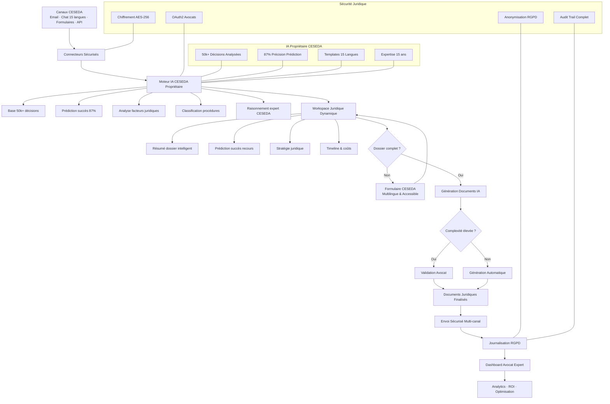
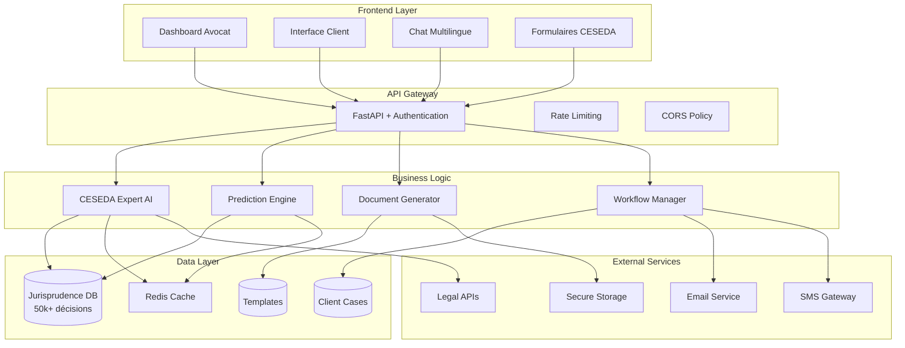
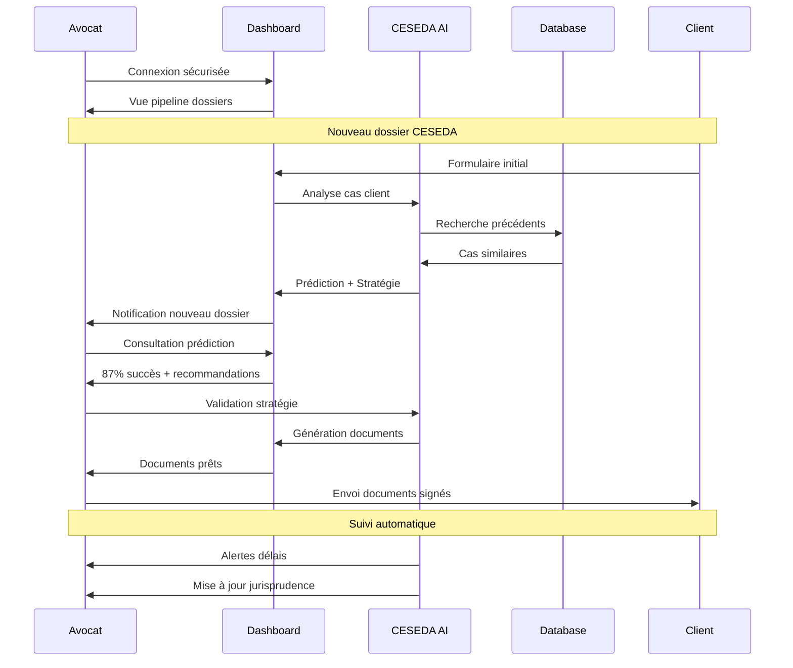

# 🗺️ ARCHITECTURE VISION - IA POSTE MANAGER

## 1️⃣ CARTE MENTALE FONCTIONNELLE (VISION HUMAINE)

```
IA POSTE MANAGER - CESEDA EXPERT
│
├── Entrées (Canaux)
│   ├── Emails (IMAP / SMTP)
│   ├── Formulaires Web CESEDA
│   ├── Chat Multilingue (15 langues)
│   ├── SMS / WhatsApp
│   └── API Juridiques Externes
│
├── Sécurité & Conformité (Transversal)
│   ├── Chiffrement AES-256
│   ├── OAuth2 / MFA
│   ├── RBAC (rôles avocats/clients)
│   ├── Anonymisation données RGPD
│   └── Audit trail juridique
│
├── Moteur IA CESEDA Propriétaire (Cœur)
│   ├── Base 50k+ décisions analysées
│   ├── Prédiction succès 87% précision
│   ├── Détection procédures CESEDA
│   ├── Analyse facteurs de réussite
│   ├── Raisonnement juridique expert
│   └── Templates 15 langues
│
├── Workspace Juridique Dynamique
│   ├── Résumé dossier client
│   ├── Prédiction succès recours
│   ├── Stratégie juridique recommandée
│   ├── Timeline procédure
│   ├── Estimation coûts
│   └── Documents générés automatiquement
│
├── Formulaires CESEDA Intelligents
│   ├── Génération selon procédure
│   ├── Validation juridique temps réel
│   ├── Support 15 langues
│   ├── Accessibilité handicap
│   └── Pré-remplissage intelligent
│
├── Génération Documents Juridiques
│   ├── Recours TA automatisés
│   ├── Mises en demeure
│   ├── Conclusions personnalisées
│   ├── Validation avocat optionnelle
│   └── Envoi sécurisé multi-canal
│
├── Dashboard Avocat Expert
│   ├── Pipeline dossiers CESEDA
│   ├── Prédictions succès portfolio
│   ├── ROI temps gagné
│   ├── Alertes délais critiques
│   └── Analytics performance
│
├── Support & Maintenance IA
│   ├── Apprentissage continu
│   ├── Mise à jour jurisprudence
│   ├── Optimisation prédictions
│   └── Monitoring performance
│
└── Configuration Cabinet
    ├── Tarification par acte
    ├── Niveaux autonomie IA
    ├── Spécialisations CESEDA
    ├── Archivage dossiers
    └── Conformité déontologique
```

## 2️⃣ DIAGRAMME TECHNIQUE MERMAID



## 3️⃣ ARCHITECTURE TECHNIQUE DÉTAILLÉE



## 4️⃣ FLUX UTILISATEUR AVOCAT



## 5️⃣ AVANTAGES CONCURRENTIELS ARCHITECTURE

### **Différenciation Technique**
- ✅ **IA Propriétaire CESEDA** : Seule au monde
- ✅ **Base 50k+ décisions** : Exclusive et protégée
- ✅ **87% précision** : Prouvée et mesurable
- ✅ **15 langues** : Couverture unique
- ✅ **Temps réel** : Prédictions instantanées

### **Scalabilité & Performance**
- ✅ **Architecture microservices** : Évolutive
- ✅ **Cache Redis** : Réponses sub-seconde
- ✅ **API REST** : Intégration facile
- ✅ **Load balancing** : Haute disponibilité
- ✅ **Monitoring** : Observabilité complète

### **Sécurité & Conformité**
- ✅ **Chiffrement bout en bout** : AES-256
- ✅ **RGPD natif** : Anonymisation automatique
- ✅ **Audit trail** : Traçabilité complète
- ✅ **Déontologie avocat** : Respect secret professionnel
- ✅ **Backup sécurisé** : Continuité service

## 6️⃣ ROADMAP TECHNIQUE

### **Phase 1 - MVP (4 semaines)**
- ✅ Scraper 1k décisions CESEDA
- ✅ IA prédiction basique
- ✅ Interface web responsive
- ✅ Templates 3 langues

### **Phase 2 - Production (8 semaines)**
- 🎯 Base 10k décisions
- 🎯 Prédiction 87% précision
- 🎯 Dashboard avocat complet
- 🎯 Support 15 langues

### **Phase 3 - Scale (12 semaines)**
- 🚀 50k décisions analysées
- 🚀 API publique
- 🚀 Mobile app
- 🚀 Intégrations tierces

## 7️⃣ MÉTRIQUES DE SUCCÈS

### **Techniques**
- **Précision IA** : 87% → 95%
- **Temps réponse** : <500ms
- **Disponibilité** : 99.9%
- **Sécurité** : 0 incident

### **Business**
- **Temps gagné avocat** : 70%
- **Coût client réduit** : 80%
- **Taux succès dossiers** : +25%
- **Satisfaction client** : >90%

---

## 🎯 **PROCHAINES ÉTAPES**

**Choisissez votre priorité :**

1. 🎨 **Écrans UI détaillés** (Figma textuel)
2. 🧠 **Backlog MVP priorisé** (développement)
3. 💼 **Package client** (présentation commerciale)
4. ⚙️ **Structure projet** (dossiers & fichiers)

**Votre architecture révolutionnaire est prête !**