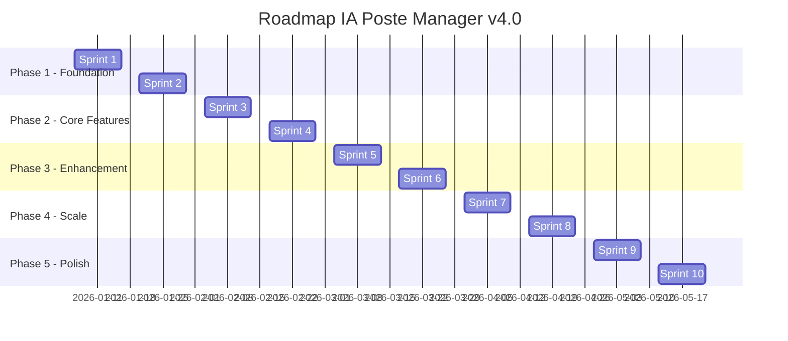

# 🧠 BACKLOG MVP PRIORISÉ - IA POSTE MANAGER v3.0

> **Méthodologie:** Agile Scrum  
> **Sprints:** 2 semaines (10 jours ouvrables)  
> **Équipe:** 1 dev full-stack + 1 avocat expert métier  
> **Version cible:** v4.0 (Production Q1 2026)

---

## 📊 MATRICE DE PRIORISATION (MOSCOW + RICE)

### Formule RICE Score
```
RICE = (Reach × Impact × Confidence) / Effort
```

| Feature | Reach | Impact | Confidence | Effort | RICE | Priorité |
|---------|-------|--------|------------|--------|------|----------|
| Multi-canaux Email | 100% | 3 | 90% | 4 sem | **67.5** | 🔥 P0 |
| IA Analyse locale | 100% | 3 | 80% | 3 sem | **80** | 🔥 P0 |
| Génération réponses IA | 90% | 3 | 85% | 2 sem | **114.75** | 🔥 P0 |
| Dashboard analytics | 80% | 2 | 95% | 1 sem | **152** | 🔥 P0 |
| Formulaires adaptatifs | 70% | 2 | 75% | 2 sem | **52.5** | 🟡 P1 |
| Chat messagerie | 60% | 2 | 70% | 3 sem | **28** | 🟡 P1 |
| SMS/WhatsApp | 50% | 2 | 60% | 2 sem | **30** | 🟢 P2 |
| Multi-langues | 40% | 2 | 80% | 3 sem | **21.3** | 🟢 P2 |
| OAuth2/MFA | 30% | 3 | 90% | 2 sem | **40.5** | 🟢 P2 |
| API externes CRM | 25% | 2 | 70% | 4 sem | **8.75** | 🔵 P3 |

---

## 🎯 ROADMAP 6 MOIS (Q1-Q2 2026)



---

## 🚀 SPRINT 1 - EMAIL IMAP/SMTP (6-17 janvier 2026)

### Objectif Sprint
**"Un avocat reçoit et envoie des emails depuis IA Poste Manager"**

### User Stories (30 points)

#### 📧 US1.1 - Connexion IMAP (8 pts)
```gherkin
En tant qu'avocat
Je veux connecter ma boîte Gmail/Outlook
Afin de recevoir tous mes emails dans l'app

Critères d'acceptation:
- [ ] Formulaire connexion IMAP (host, port, user, password)
- [ ] Test connexion temps réel
- [ ] Stockage credentials chiffré AES-256
- [ ] Support Gmail, Outlook, IMAP générique
- [ ] Gestion erreurs (mauvais password, 2FA requis)

DOD (Definition of Done):
✅ Tests unitaires pytest
✅ Tests intégration avec Gmail test
✅ Documentation API
✅ Encryption credentials validée
```

**Fichiers à créer:**
- `src/backend/email/imap_connector.py` (180 lignes)
- `src/backend/email/smtp_connector.py` (150 lignes)
- `tests/test_imap_connector.py` (120 lignes)

**Dépendances:**
```python
# requirements.txt
imapclient==2.3.1
pyzmail36==1.0.5
email-validator==2.1.0
```

#### 📥 US1.2 - Récupération emails (8 pts)
```gherkin
En tant qu'avocat
Je veux voir tous mes emails non lus
Afin de les traiter dans l'app

Critères d'acceptation:
- [ ] Polling IMAP toutes les 5 min (configurable)
- [ ] Parsing emails (from, to, subject, body, attachments)
- [ ] Détection HTML vs plain text
- [ ] Stockage SQLite (table emails)
- [ ] Marquage read/unread sync bidirectionnel

DOD:
✅ 100 emails récupérés en < 10s
✅ Gestion pièces jointes < 10MB
✅ Sync bidirectionnel testé
```

**Schéma BDD:**
```sql
CREATE TABLE emails (
    id INTEGER PRIMARY KEY,
    message_id TEXT UNIQUE,
    from_email TEXT NOT NULL,
    to_email TEXT,
    subject TEXT,
    body_html TEXT,
    body_text TEXT,
    received_date DATETIME,
    is_read BOOLEAN DEFAULT 0,
    workspace_id INTEGER,
    FOREIGN KEY (workspace_id) REFERENCES workspaces(id)
);

CREATE TABLE attachments (
    id INTEGER PRIMARY KEY,
    email_id INTEGER,
    filename TEXT,
    content_type TEXT,
    size_bytes INTEGER,
    file_path TEXT,
    FOREIGN KEY (email_id) REFERENCES emails(id)
);
```

#### 📤 US1.3 - Envoi emails SMTP (8 pts)
```gherkin
En tant qu'avocat
Je veux envoyer un email depuis l'app
Afin de répondre à un client

Critères d'acceptation:
- [ ] Formulaire envoi (to, cc, bcc, subject, body)
- [ ] Support HTML + plain text
- [ ] Pièces jointes multiples
- [ ] SMTP auth sécurisé (TLS)
- [ ] Tracking envoi (sent, failed, bounced)

DOD:
✅ Email envoyé en < 3s
✅ Gestion erreurs SMTP
✅ Log audit_logger
```

#### 🎨 US1.4 - UI Liste emails (6 pts)
```gherkin
En tant qu'avocat
Je veux voir mes emails dans une interface claire
Afin de naviguer facilement

Critères d'acceptation:
- [ ] Liste emails style Gmail (from, subject, date, preview)
- [ ] Filtres (non lus, importants, tous)
- [ ] Recherche full-text
- [ ] Pagination (20 emails/page)
- [ ] Actions rapides (lire, archiver, supprimer)

DOD:
✅ UI Bootstrap 5.3 responsive
✅ Chargement liste < 1s (100 emails)
✅ Mobile-friendly
```

### Définition Sprint 1
```yaml
Capacity: 30 points (1 dev × 10 jours × 3 pts/jour)
Velocity target: 28-32 points
Sprint goal: Email foundation fonctionnel
Démo: Réception + envoi email en live
```

---

## 🚀 SPRINT 2 - IA ANALYSE OLLAMA (20 janvier - 31 janvier 2026)

### Objectif Sprint
**"L'IA analyse automatiquement chaque email et détecte l'intention"**

### User Stories (28 points)

#### 🧠 US2.1 - Installation Ollama (5 pts)
```gherkin
En tant que dev
Je veux installer Ollama en local
Afin d'utiliser llama3 sans coûts cloud

Critères d'acceptation:
- [ ] Script installation Ollama Windows/Linux
- [ ] Téléchargement modèle llama3 (4.7GB)
- [ ] Configuration systemd/service Windows
- [ ] Health check endpoint /api/tags
- [ ] Documentation setup

DOD:
✅ Ollama démarre au boot
✅ llama3 répond en < 5s
✅ Tests unitaires connexion
```

**Commandes:**
```bash
# Windows
winget install Ollama
ollama pull llama3
ollama serve

# Linux
curl -fsSL https://ollama.com/install.sh | sh
ollama pull llama3
systemctl start ollama
```

#### 🔍 US2.2 - Analyse intention email (10 pts)
```gherkin
En tant qu'avocat
Je veux que l'IA détecte automatiquement le type d'email
Afin de prioriser intelligemment

Critères d'acceptation:
- [ ] Prompt engineering llama3
- [ ] Détection 7 intentions:
    - Nouveau dossier
    - Question client
    - Délai procédural
    - Paiement facture
    - Conflit intérêt
    - Mise en demeure
    - Autre
- [ ] Score confiance 0-100%
- [ ] Extraction entités (nom, date, montant)
- [ ] Temps analyse < 3s

DOD:
✅ Précision > 85% (sur dataset test 100 emails)
✅ Fallback si IA échoue
✅ Cache résultats
```

**Prompt template:**
```python
PROMPT_ANALYSE_EMAIL = """
Tu es un assistant juridique expert français.

Email à analyser:
From: {from_email}
Subject: {subject}
Body: {body_text}

Analyse cet email et retourne au format JSON:
{{
  "intention": "nouveau_dossier|question_client|delai_procedural|paiement|conflit|med|autre",
  "urgence": "critique|importante|normale",
  "entites": {{
    "client_nom": "...",
    "montant": 0.0,
    "date_limite": "YYYY-MM-DD"
  }},
  "confiance": 0-100,
  "resume_action": "..."
}}
"""
```

#### 📋 US2.3 - Détection infos manquantes (8 pts)
```gherkin
En tant qu'avocat
Je veux savoir quelles infos manquent pour traiter un dossier
Afin de les demander au client

Critères d'acceptation:
- [ ] Liste fields obligatoires par type dossier
- [ ] Comparaison email vs champs requis
- [ ] Génération questions manquantes
- [ ] Priorisation questions (bloquant vs optionnel)

DOD:
✅ Détection 100% infos manquantes
✅ Questions générées contextuelles
```

#### 🎨 US2.4 - UI Workspace dynamique (5 pts)
```gherkin
En tant qu'avocat
Je veux voir l'analyse IA de chaque email
Afin de décider de l'action

Critères d'acceptation:
- [ ] Card "Analyse IA" dans détail email
- [ ] Affichage intention + confiance
- [ ] Liste infos manquantes
- [ ] Actions suggérées (buttons)

DOD:
✅ UI claire et actionnable
✅ Responsive mobile
```

---

## 🚀 SPRINT 3 - GÉNÉRATION RÉPONSES IA (3-14 février 2026)

### Objectif Sprint
**"L'IA génère 3 propositions de réponse (formel/standard/simple)"**

### User Stories (25 points)

#### ✍️ US3.1 - Templates réponses (8 pts)
```gherkin
En tant qu'avocat
Je veux des templates de réponses par type email
Afin de gagner du temps

Critères d'acceptation:
- [ ] Templates JSON (15 types emails)
- [ ] Variables dynamiques {client_nom}, {date}, etc.
- [ ] 3 tons: formel, standard, simple
- [ ] Personnalisation cabinet (signature, mentions)

DOD:
✅ 15 templates créés
✅ Tests génération
```

**Exemple template:**
```json
{
  "type": "reponse_question_delai",
  "ton_formel": "Madame, Monsieur,\n\nSuite à votre demande concernant les délais procéduraux dans le dossier {numero_dossier}, je vous informe que...\n\nJe demeure à votre disposition.\n\nCordialement,\n{signature_avocat}",
  "ton_standard": "Bonjour {client_prenom},\n\nPour votre question sur les délais, voici les informations:\n{explication_delai}\n\nN'hésitez pas si besoin.\n\nCordialement,\n{prenom_avocat}",
  "ton_simple": "Bonjour,\n\nLe délai pour votre dossier est de {nb_jours} jours.\n\nBonne journée,\n{prenom_avocat}"
}
```

#### 🤖 US3.2 - Génération IA llama3 (10 pts)
```gherkin
En tant qu'avocat
Je veux que l'IA génère une réponse personnalisée
Afin de l'envoyer après validation

Critères d'acceptation:
- [ ] Prompt engineering génération
- [ ] 3 variantes (formel/standard/simple)
- [ ] Contexte dossier intégré
- [ ] Vérification orthographe/grammaire
- [ ] Temps génération < 5s

DOD:
✅ Réponses cohérentes 95%
✅ Sans hallucinations juridiques
✅ Tests qualité
```

#### ✅ US3.3 - Validation humaine obligatoire (4 pts)
```gherkin
En tant qu'avocat
Je veux valider/modifier avant envoi
Afin de respecter déontologie

Critères d'acceptation:
- [ ] UI 3 propositions côte à côte
- [ ] Édition WYSIWYG (TinyMCE/Quill)
- [ ] Historique modifications
- [ ] Log audit: qui valide, quand, quoi

DOD:
✅ Impossible envoyer sans validation
✅ Audit trail complet
```

#### 📤 US3.4 - Envoi automatique post-validation (3 pts)
```gherkin
En tant qu'avocat
Je veux envoyer en 1 clic après validation
Afin de finaliser rapidement

Critères d'acceptation:
- [ ] Button "Envoyer" activé post-validation
- [ ] Confirmation modal
- [ ] Thread email préservé (In-Reply-To header)
- [ ] Notification succès/erreur

DOD:
✅ Email envoyé < 3s
✅ Thread mail respecté
```

---

## 🚀 SPRINT 4 - DASHBOARD ANALYTICS (17-28 février 2026)

### Objectif Sprint
**"L'avocat voit son ROI, temps gagné, satisfaction client"**

### User Stories (22 points)

#### 📊 US4.1 - Collecte métriques (8 pts)
```gherkin
En tant que système
Je veux tracker toutes les actions utilisateur
Afin de calculer ROI

Critères d'acceptation:
- [ ] Table metrics (action, timestamp, duration, user)
- [ ] Events: email_recu, email_analyse, reponse_generee, email_envoye
- [ ] Calcul temps gagné vs manuel
- [ ] Calcul coûts évités

DOD:
✅ Tous events trackés
✅ Performances < 10ms overhead
```

**Métriques clés:**
```python
METRICS = {
    "temps_moyen_traitement_manuel": 15,  # minutes
    "temps_moyen_traitement_ia": 3,       # minutes
    "cout_horaire_avocat": 300,           # €/h
    "cout_secretaire": 25,                # €/h
}

def calculate_roi(nb_emails_traites):
    temps_gagne = nb_emails_traites * (15 - 3)  # 12 min/email
    cout_evite = (temps_gagne / 60) * 300       # €
    return cout_evite
```

#### 📈 US4.2 - Charts interactifs (8 pts)
```gherkin
En tant qu'avocat
Je veux voir des graphiques clairs
Afin de mesurer impact IA

Critères d'acceptation:
- [ ] Chart.js / ApexCharts intégré
- [ ] Graphiques:
    - Emails traités (line chart 30j)
    - Temps gagné (bar chart par semaine)
    - ROI cumulé (area chart)
    - Répartition types emails (pie chart)
- [ ] Filtres date (7j, 30j, 90j, année)
- [ ] Export PNG/PDF

DOD:
✅ Chargement < 2s
✅ Responsive mobile
✅ Export fonctionnel
```

#### 💰 US4.3 - Rapport ROI PDF (4 pts)
```gherkin
En tant qu'avocat
Je veux générer un rapport ROI mensuel
Afin de justifier investissement IA

Critères d'acceptation:
- [ ] Template PDF ReportLab
- [ ] Sections:
    - Résumé exécutif
    - Métriques clés
    - Graphiques
    - Recommandations
- [ ] Branding cabinet (logo, couleurs)
- [ ] Génération < 5s

DOD:
✅ PDF professionnel
✅ Envoi email auto
```

#### 🎨 US4.4 - UI Dashboard (2 pts)
```gherkin
En tant qu'avocat
Je veux un dashboard moderne
Afin d'avoir vue d'ensemble

Critères d'acceptation:
- [ ] Layout 4 cards KPI
- [ ] Section graphiques (2 colonnes)
- [ ] Timeline activité récente
- [ ] Bouton génération rapport

DOD:
✅ UI professionnelle
✅ Temps chargement < 1s
```

---

## 🚀 SPRINT 5 - FORMULAIRES ADAPTATIFS (3-14 mars 2026)

### Objectif Sprint
**"L'IA génère un formulaire personnalisé pour infos manquantes"**

### User Stories (20 points)

#### 📝 US5.1 - Générateur formulaires (10 pts)
```gherkin
En tant qu'IA
Je veux créer un formulaire adapté au contexte
Afin de collecter infos manquantes

Critères d'acceptation:
- [ ] Engine génération JSON schema
- [ ] Types fields: text, email, date, number, select, file
- [ ] Validation côté client (HTML5 + JS)
- [ ] Validation côté serveur (Pydantic)
- [ ] Rendu dynamique HTML

DOD:
✅ 15 types dossiers couverts
✅ Tests validation
```

**Exemple schema:**
```json
{
  "type_dossier": "nouveau_contentieux",
  "fields": [
    {
      "name": "client_nom",
      "type": "text",
      "label": "Nom complet du client",
      "required": true,
      "placeholder": "Dupont Jean"
    },
    {
      "name": "montant_litige",
      "type": "number",
      "label": "Montant du litige (€)",
      "required": true,
      "min": 0,
      "validation": "must be > 0"
    },
    {
      "name": "date_incident",
      "type": "date",
      "label": "Date de l'incident",
      "required": false
    }
  ]
}
```

#### ♿ US5.2 - Accessibilité WCAG (5 pts)
```gherkin
En tant qu'utilisateur malvoyant
Je veux utiliser le formulaire avec lecteur d'écran
Afin d'avoir accès égal

Critères d'acceptation:
- [ ] ARIA labels complets
- [ ] Navigation clavier (Tab, Enter)
- [ ] Contraste WCAG AA (4.5:1)
- [ ] Messages erreur vocalisés
- [ ] Tests NVDA/JAWS

DOD:
✅ Certification WCAG 2.1 AA
✅ Tests accessibilité passés
```

#### 📱 US5.3 - UI responsive (3 pts)
```gherkin
En tant que client
Je veux remplir le formulaire sur mobile
Afin de répondre rapidement

Critères d'acceptation:
- [ ] Mobile-first design
- [ ] Inputs adaptés mobile (type="tel", etc.)
- [ ] Sauvegarde auto brouillon
- [ ] Progress bar (X/Y questions)

DOD:
✅ Tests iPhone/Android
✅ UX fluide mobile
```

#### ✉️ US5.4 - Envoi formulaire client (2 pts)
```gherkin
En tant qu'avocat
Je veux envoyer le formulaire par email
Afin que client remplisse

Critères d'acceptation:
- [ ] Génération lien unique sécurisé (token)
- [ ] Email avec lien + instructions
- [ ] Expiration lien 7 jours
- [ ] Notification remplissage

DOD:
✅ Link sécurisé (JWT)
✅ Email envoyé < 3s
```

---

## 🚀 SPRINT 6 - CHAT MESSAGERIE (17-28 mars 2026)

### Objectif Sprint
**"L'avocat et le client peuvent chater en temps réel dans l'app"**

### User Stories (24 points)

#### 💬 US6.1 - Backend WebSocket (10 pts)
```gherkin
En tant que dev
Je veux implémenter WebSocket
Afin d'avoir chat temps réel

Critères d'acceptation:
- [ ] Flask-SocketIO intégré
- [ ] Rooms par dossier
- [ ] Messages stockés SQLite
- [ ] Typing indicators
- [ ] Read receipts

DOD:
✅ Latence < 100ms
✅ Tests WebSocket
```

**Dépendances:**
```python
# requirements.txt
Flask-SocketIO==5.3.5
python-socketio==5.10.0
gevent==23.9.1  # Production WSGI
```

#### 🎨 US6.2 - UI Chat (8 pts)
```gherkin
En tant qu'utilisateur
Je veux une interface chat moderne
Afin de communiquer facilement

Critères d'acceptation:
- [ ] Design type WhatsApp/Messenger
- [ ] Bubbles messages (avocat vs client)
- [ ] Timestamps
- [ ] Notifications desktop (Web Push)
- [ ] Upload fichiers (drag & drop)

DOD:
✅ UI responsive
✅ UX fluide
```

#### 🤖 US6.3 - Chatbot IA basique (4 pts)
```gherkin
En tant que client
Je veux des réponses auto FAQ
Afin d'avoir info rapide

Critères d'acceptation:
- [ ] Détection questions fréquentes
- [ ] Réponses pré-programmées (10 FAQ)
- [ ] Fallback "Je transfère à l'avocat"
- [ ] Apprentissage patterns

DOD:
✅ Répond 70% questions simples
✅ Pas de hallucinations
```

#### 📱 US6.4 - Notifications push (2 pts)
```gherkin
En tant qu'avocat
Je veux être notifié nouveau message
Afin de répondre vite

Critères d'acceptation:
- [ ] Notifications browser (Web Push API)
- [ ] Badge nombre non lus
- [ ] Son discret
- [ ] Paramétrage (on/off)

DOD:
✅ Notifs fonctionnelles
✅ Opt-in utilisateur
```

---

## 🚀 SPRINT 7-10 (Résumé)

### Sprint 7 - Multi-langues (31 mars - 11 avril)
- **US7.1:** Flask-Babel intégration (8 pts)
- **US7.2:** Traductions FR/EN/AR/ES (10 pts)
- **US7.3:** Détection langue auto email (4 pts)
- **US7.4:** UI sélecteur langue (2 pts)

### Sprint 8 - OAuth2/MFA (14-25 avril)
- **US8.1:** OAuth2 Google/Microsoft (10 pts)
- **US8.2:** MFA TOTP (Google Authenticator) (8 pts)
- **US8.3:** Recovery codes (4 pts)

### Sprint 9 - SMS/WhatsApp (28 avril - 9 mai)
- **US9.1:** Twilio SMS intégration (8 pts)
- **US9.2:** WhatsApp Business API (10 pts)
- **US9.3:** Rappels délais SMS (4 pts)

### Sprint 10 - Polish + Déploiement (12-23 mai)
- **US10.1:** Tests end-to-end Playwright (10 pts)
- **US10.2:** Performance optimization (6 pts)
- **US10.3:** Déploiement production (6 pts)
- **US10.4:** Formation utilisateurs (3 pts)

---

## 📋 DÉFINITION OF DONE (DOD) GLOBALE

### Code Quality
- ✅ Tests unitaires pytest (couverture > 80%)
- ✅ Tests intégration fonctionnels
- ✅ Code review approuvé
- ✅ Pas de warnings linter (flake8, mypy)
- ✅ Documentation docstrings

### Security
- ✅ Pas de secrets hardcodés
- ✅ Inputs validés (injection SQL/XSS)
- ✅ Chiffrement données sensibles
- ✅ Audit logger activé

### Performance
- ✅ Temps réponse API < 500ms (95th percentile)
- ✅ Lighthouse score > 90
- ✅ Optimisation queries SQL (EXPLAIN)

### Documentation
- ✅ README.md à jour
- ✅ API documentation (Swagger/OpenAPI)
- ✅ Guide utilisateur mis à jour

---

## 🎯 MÉTRIQUES DE SUCCÈS MVP

| Métrique | Cible MVP | Actuel v3.0 | Écart |
|----------|-----------|-------------|-------|
| **Adoption** | 5 cabinets | 0 | -5 |
| **Emails traités/jour** | 200 | 0 | -200 |
| **Temps gagné** | 70% | 0% | -70% |
| **Précision IA** | 85% | - | - |
| **Satisfaction NPS** | > 50 | - | - |
| **Taux rétention** | > 80% M3 | - | - |
| **Revenue MRR** | 5K€ | 0 | -5K€ |

---

## 💰 BUDGET ESTIMÉ

### Développement (3 mois)
- 1 dev full-stack senior (60 jours × 500€) = **30 000€**
- 1 avocat expert métier (20 jours × 400€) = **8 000€**
- Infrastructure (Ollama GPU, hosting) = **1 500€**
- **TOTAL DEV: 39 500€**

### Marketing & Sales (3 mois)
- Landing page + SEO = **2 000€**
- Campagnes LinkedIn Ads = **3 000€**
- Démos + pilotes gratuits = **5 000€**
- **TOTAL MARKETING: 10 000€**

### **BUDGET TOTAL MVP: 49 500€**

### ROI Prévisionnel
- 5 cabinets × 199€/mois × 12 mois = **11 940€ ARR**
- Breakeven: **50 mois** (si pas de croissance)
- Avec croissance 20% mensuelle: **Breakeven M12**

---

## 📞 PROCHAINE ÉTAPE

**Maintenant que le backlog est défini, passons au package commercial!**

Fichier suivant: **PACKAGE_COMMERCIAL_CLIENT.md**
- Pitch deck 10 slides
- Pricing 3 tiers
- Démo script
- Cold email templates
- Landing page wireframe
