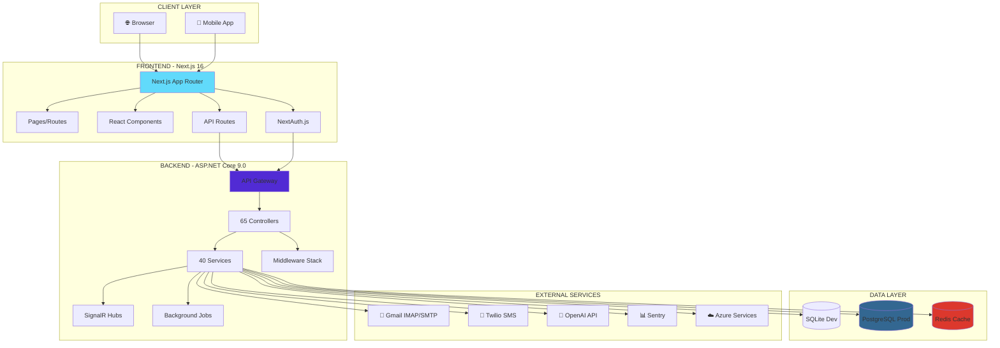
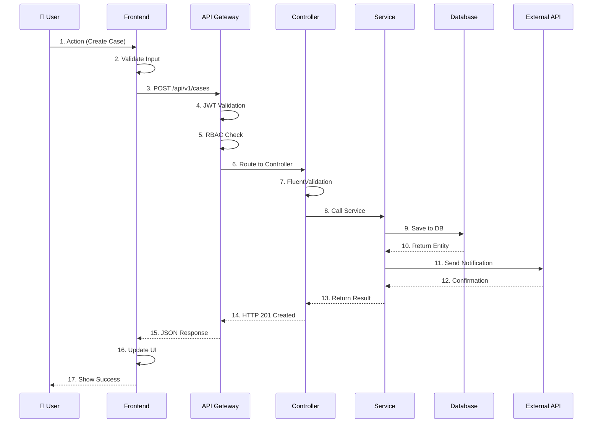
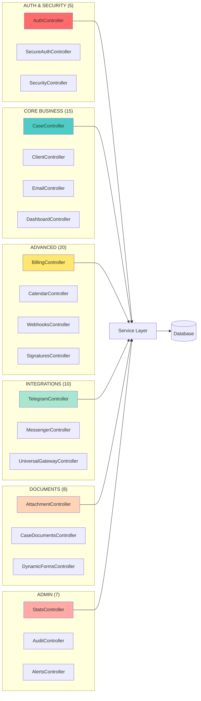
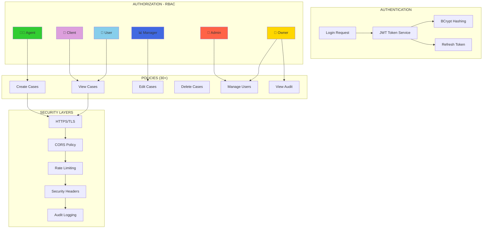
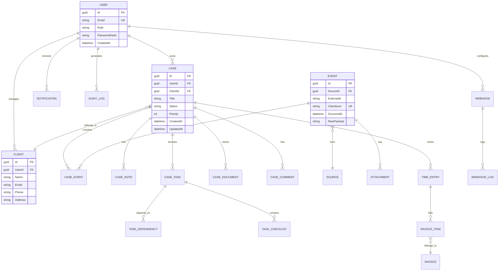
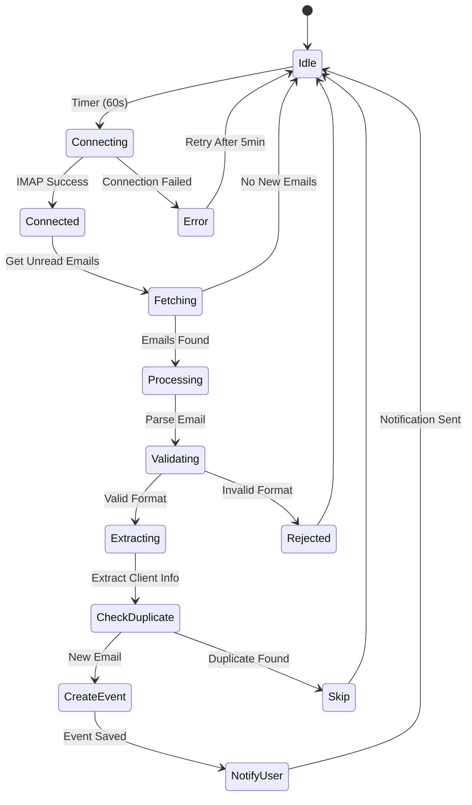
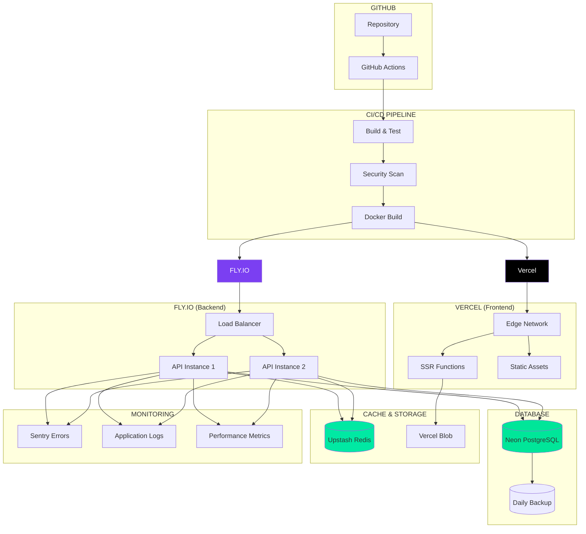
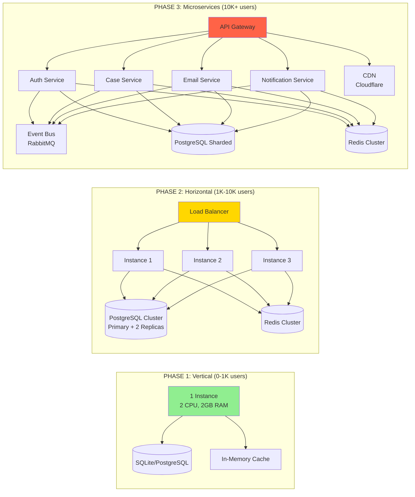
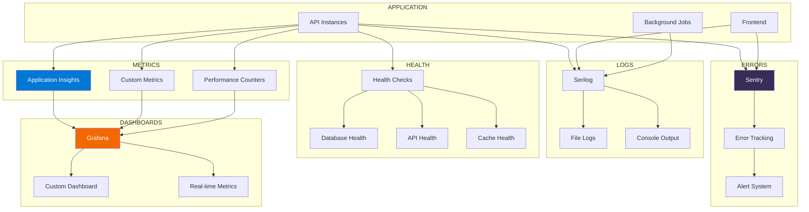
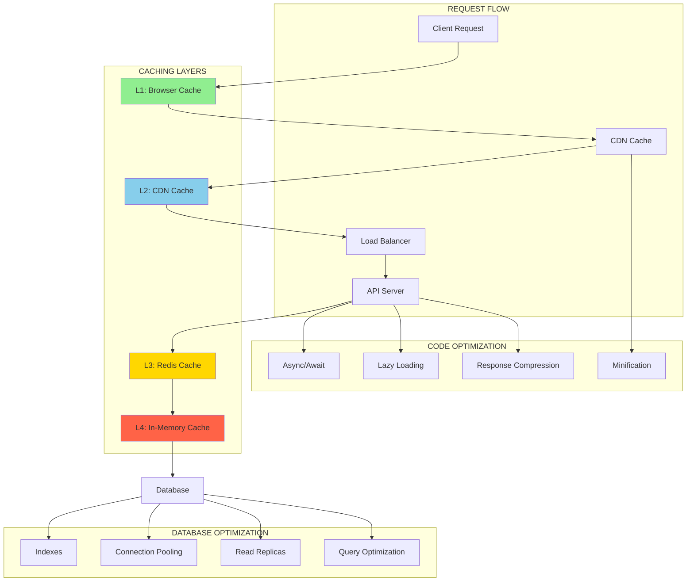

# 📊 DIAGRAMMES ARCHITECTURAUX - MemoLib

**Date**: 27 février 2026  
**Version**: 1.0.0

---

## 🏗️ DIAGRAMME 1: Architecture Globale



---

## 🔄 DIAGRAMME 2: Flux de Données Principal



---

## 🗂️ DIAGRAMME 3: Structure des Controllers



---

## 🔐 DIAGRAMME 4: Sécurité & Authentification



---

## 📦 DIAGRAMME 5: Modèle de Données



---

## 🔄 DIAGRAMME 6: Workflow Email Monitoring



---

## 🚀 DIAGRAMME 7: Déploiement Production



---

## 📊 DIAGRAMME 8: Scalabilité (3 Phases)



---

## 🔍 DIAGRAMME 9: Monitoring & Observabilité



---

## 📈 DIAGRAMME 10: Performance Optimization



---

## 🎯 LÉGENDE

### Couleurs
- 🟢 **Vert**: Développement / OK
- 🔵 **Bleu**: Production / Stable
- 🟡 **Jaune**: Attention / Optimisation
- 🔴 **Rouge**: Critique / Action requise
- 🟣 **Violet**: Externe / Tiers

### Symboles
- 📦 **Boîte**: Composant / Service
- 🗄️ **Cylindre**: Base de données
- ⚡ **Éclair**: Cache / Performance
- 🔒 **Cadenas**: Sécurité
- 📊 **Graphique**: Monitoring
- 🔄 **Flèches**: Flux de données

---

## 📝 NOTES D'UTILISATION

### Visualisation Mermaid
Ces diagrammes utilisent la syntaxe Mermaid et peuvent être visualisés dans:
- GitHub (rendu automatique)
- VS Code (extension Mermaid)
- Mermaid Live Editor: https://mermaid.live
- Documentation sites (GitBook, Docusaurus)

### Export
```bash
# Installer Mermaid CLI
npm install -g @mermaid-js/mermaid-cli

# Générer PNG
mmdc -i DIAGRAMMES_ARCHITECTURE.md -o diagrams.png

# Générer SVG
mmdc -i DIAGRAMMES_ARCHITECTURE.md -o diagrams.svg
```

---

**Dernière mise à jour**: 27 février 2026  
**Auteur**: Architecte Logiciel Senior
