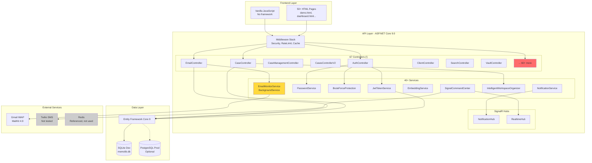
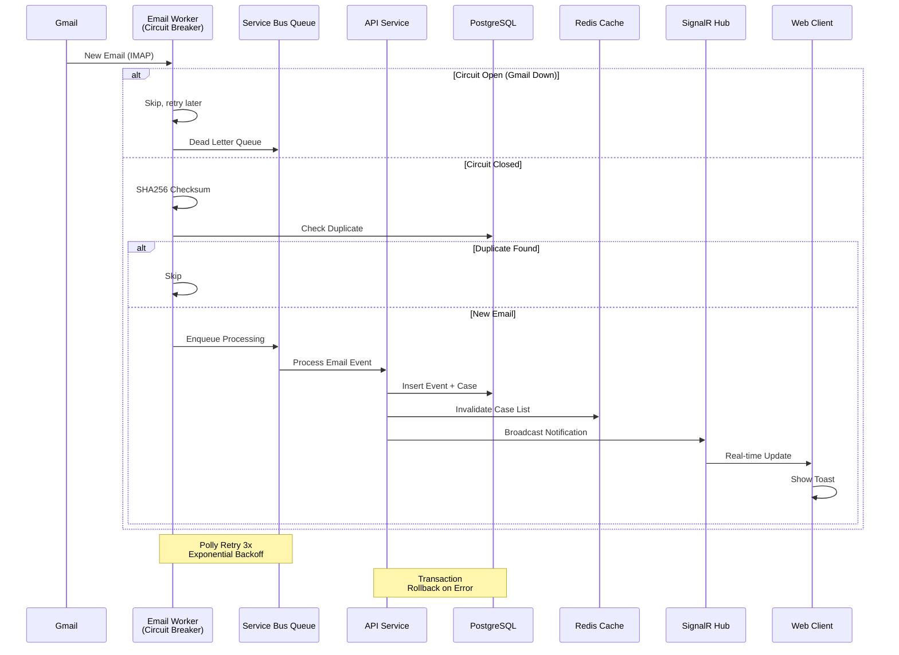
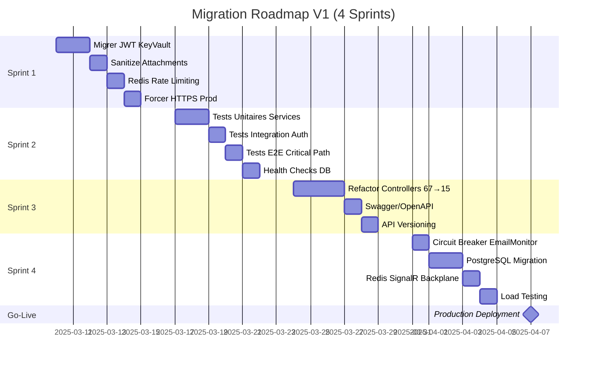

# 📐 DIAGRAMMES ARCHITECTURE - MemoLib

## 1. Architecture Actuelle (AS-IS)

### Problèmes Identifiés (AS-IS)
- 🔴 **67 Controllers** → Maintenance impossible
- 🔴 **EmailMonitor** → Pas de circuit breaker, timeout fixe
- 🔴 **Redis** → Référencé mais pas utilisé
- 🔴 **Tests** → 0% couverture
- 🟡 **SQLite** → Pas de HA en production

---

## 2. Architecture Cible V1 (TO-BE)

```mermaid
graph TB
    subgraph "Frontend Layer (Modernisé)"
        SPA[Modern SPA<br/>React/Vue/Blazor]
        PWA[PWA Support<br/>Offline-first]
    end

    subgraph "API Gateway"
        GATEWAY[API Gateway<br/>Rate Limiting<br/>Auth<br/>Routing]
    end

    subgraph "API Layer - ASP.NET Core 9.0 (Refactoré)"
        MW2[Middleware Stack<br/>+ Circuit Breaker<br/>+ Structured Logging]
        
        subgraph "15 Controllers Max"
            AUTH2[AuthController<br/>login/register/refresh]
            CASES[CasesController<br/>CRUD + timeline]
            CLIENTS[ClientsController<br/>CRUD + extraction]
            EMAILS[EmailController<br/>send + templates]
            SEARCH2[SearchController<br/>unified search]
            ATTACH[AttachmentsController]
            NOTIFS[NotificationsController]
            AUDIT[AuditController]
            DASH[DashboardController]
            WEBHOOKS[WebhooksController]
            VAULT2[VaultController]
            ADMIN[AdminController]
            HEALTH[HealthController]
        end
        
        subgraph "Domain Services (Clean)"
            AUTHSVC[AuthService]
            CASESVC[CaseService]
            EMAILSVC[EmailService<br/>+ Circuit Breaker]
            SEARCHSVC[SearchService]
            NOTIFYSVC[NotificationService]
        end
        
        subgraph "Infrastructure Services"
            CACHE[Distributed Cache<br/>Redis]
            QUEUE[Message Queue<br/>Azure Service Bus]
            SECRETS[Secret Manager<br/>Azure KeyVault]
        end
        
        subgraph "SignalR (Scaled)"
            HUB3[NotificationHub<br/>+ Redis Backplane]
        end
    end

    subgraph "Data Layer (Production-Ready)"
        EF2[Entity Framework Core 9<br/>+ Retry Logic<br/>+ Connection Pooling]
        PGPRIMARY[(PostgreSQL Primary<br/>Automated Backups)]
        PGREPLICA[(PostgreSQL Replica<br/>Read-only)]
    end

    subgraph "Background Workers"
        WORKER1[Email Monitor Worker<br/>+ Polly Retry<br/>+ DLQ]
        WORKER2[Notification Worker]
        WORKER3[Webhook Worker]
    end

    subgraph "External Services (Resilient)"
        GMAIL2[Gmail IMAP<br/>+ Circuit Breaker]
        TWILIO2[Twilio SMS<br/>+ Retry Logic]
        STRIPE[Stripe Billing<br/>Webhooks]
    end

    subgraph "Observability"
        LOGS[Structured Logs<br/>Serilog → Seq/ELK]
        METRICS[Metrics<br/>Prometheus]
        TRACES[Distributed Tracing<br/>OpenTelemetry]
        ALERTS[Alerting<br/>PagerDuty/Slack]
    end

    SPA --> GATEWAY
    PWA --> GATEWAY
    GATEWAY --> MW2
    
    MW2 --> AUTH2
    MW2 --> CASES
    MW2 --> EMAILS
    
    AUTH2 --> AUTHSVC
    CASES --> CASESVC
    EMAILS --> EMAILSVC
    
    AUTHSVC --> SECRETS
    EMAILSVC --> QUEUE
    CASESVC --> CACHE
    
    AUTHSVC --> EF2
    CASESVC --> EF2
    EMAILSVC --> EF2
    
    EF2 --> PGPRIMARY
    EF2 -.Read.-> PGREPLICA
    
    QUEUE --> WORKER1
    QUEUE --> WORKER2
    QUEUE --> WORKER3
    
    WORKER1 --> GMAIL2
    WORKER2 --> HUB3
    WORKER3 --> TWILIO2
    
    HUB3 --> CACHE
    
    MW2 --> LOGS
    AUTHSVC --> METRICS
    CASESVC --> TRACES
    WORKER1 --> ALERTS

    style AUTH2 fill:#4ecdc4
    style CASES fill:#4ecdc4
    style EMAILS fill:#4ecdc4
    style WORKER1 fill:#95e1d3
    style PGPRIMARY fill:#38ada9
    style CACHE fill:#38ada9
    style QUEUE fill:#38ada9
    style SECRETS fill:#38ada9
```

### Améliorations Clés (TO-BE)
- ✅ **15 Controllers** → Maintenance simplifiée
- ✅ **Circuit Breakers** → Résilience Gmail/Twilio
- ✅ **Redis** → Cache distribué + SignalR backplane
- ✅ **Message Queue** → Traitement asynchrone fiable
- ✅ **PostgreSQL HA** → Primary + Replica
- ✅ **Observability** → Logs/Metrics/Traces/Alerts
- ✅ **KeyVault** → Secrets sécurisés
- ✅ **Tests** → 60%+ couverture

---

## 3. Flux Critique: Email Ingestion (TO-BE)

---

## 4. Migration Path: AS-IS → TO-BE

---

## 5. Comparaison Coûts Infrastructure

| Composant | AS-IS (Dev) | TO-BE (Prod) | Coût Mensuel |
|-----------|-------------|--------------|--------------|
| **Compute** | Local | Azure App Service B2 | ~70€ |
| **Database** | SQLite | PostgreSQL Flexible Server | ~50€ |
| **Cache** | In-Memory | Redis Cache Basic | ~15€ |
| **Queue** | - | Service Bus Standard | ~10€ |
| **Secrets** | User Secrets | Key Vault | ~5€ |
| **Monitoring** | File Logs | App Insights | ~20€ |
| **Total** | 0€ | **~170€/mois** | |

**Alternative Low-Cost**:
- Fly.io: ~25€/mois (Postgres + Redis inclus)
- Railway: ~20€/mois (hobby tier)
- Render: ~30€/mois (starter tier)

---

## 📊 Métriques Cibles Architecture

| Métrique | AS-IS | TO-BE | Amélioration |
|----------|-------|-------|--------------|
| **Controllers** | 67 | 15 | -78% |
| **Services** | 40+ | 20 | -50% |
| **Response Time p95** | ? | <500ms | ✅ |
| **Availability** | ? | 99.5% | ✅ |
| **MTTR** | ? | <15min | ✅ |
| **Test Coverage** | 0% | 60% | +60% |

---

**Diagrammes générés le**: 2025-03-09  
**Outils**: Mermaid.js  
**Prochaine mise à jour**: Fin Sprint 1
