# 🏗️ Diagrammes Techniques Architecture - MemoLib

## 📋 Table des Matières

1. [Architecture Système Globale](#1-architecture-système-globale)
2. [Diagrammes de Séquence API](#2-diagrammes-de-séquence-api)
3. [Modèle de Données](#3-modèle-de-données)
4. [Architecture des Services](#4-architecture-des-services)
5. [Flux de Données](#5-flux-de-données)
6. [Sécurité et Authentification](#6-sécurité-et-authentification)
7. [Monitoring et Observabilité](#7-monitoring-et-observabilité)
8. [Déploiement et Infrastructure](#8-déploiement-et-infrastructure)

---

## 1. Architecture Système Globale

### 1.1 Vue d'ensemble Architecture

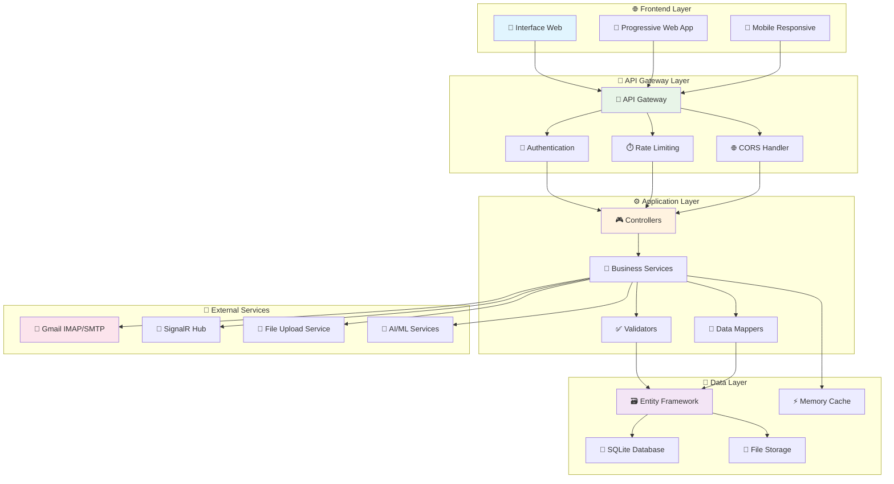

### 1.2 Architecture en Couches Détaillée

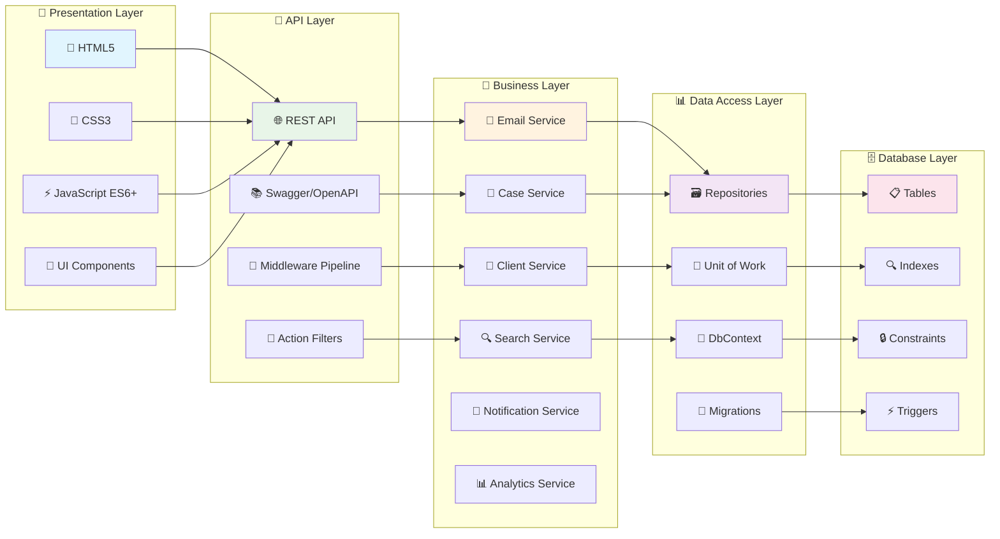

---

## 2. Diagrammes de Séquence API

### 2.1 Séquence Complète Gestion Email

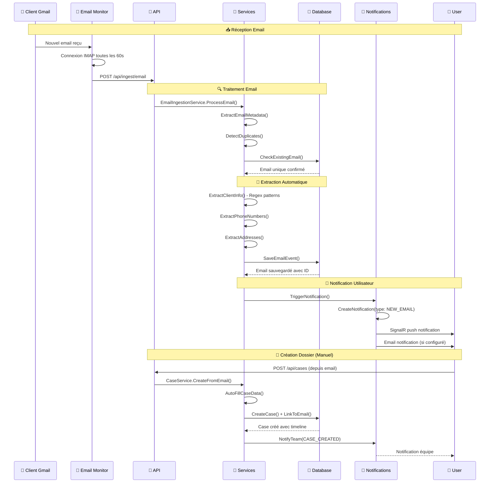

### 2.2 Séquence Workflow Dossier

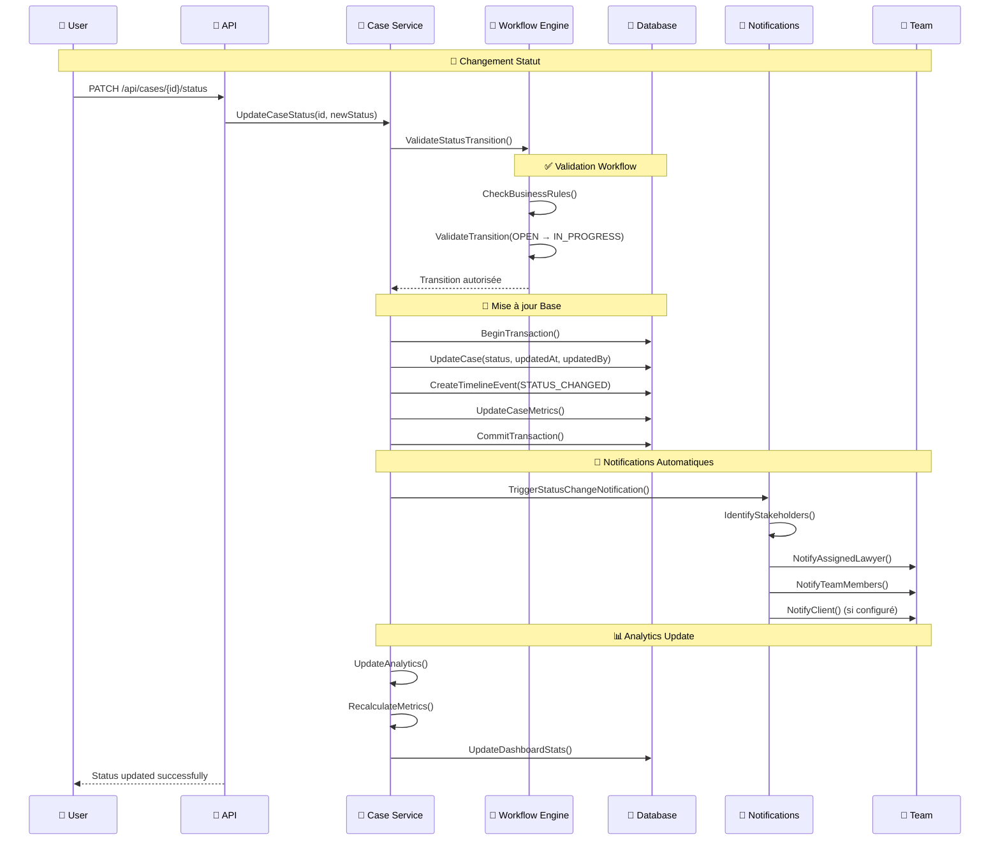

### 2.3 Séquence Recherche Multi-Modale

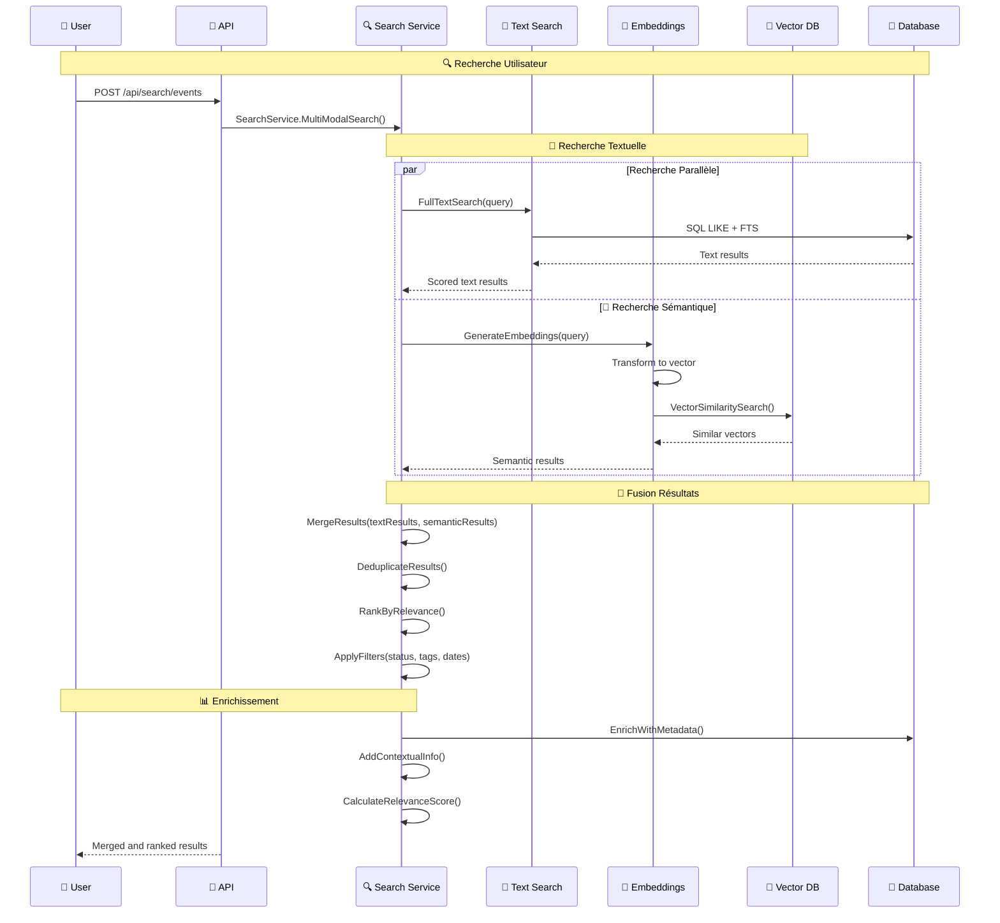

---

## 3. Modèle de Données

### 3.1 Diagramme Entité-Relation Principal

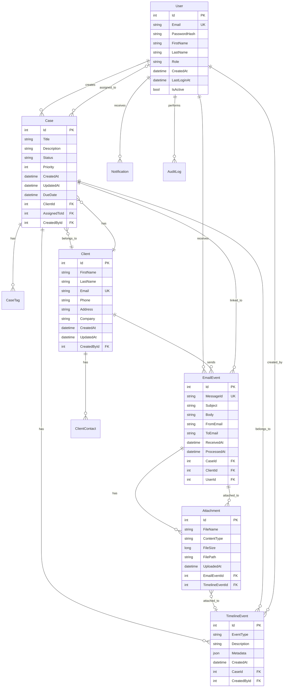

### 3.2 Modèle de Données Avancé

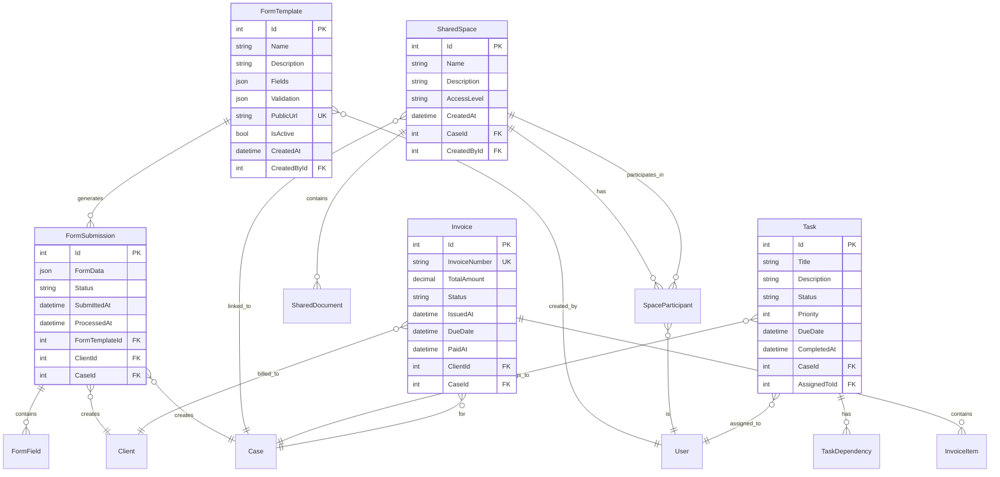

---

## 4. Architecture des Services

### 4.1 Diagramme des Services Métier

```mermaid
graph TB
    subgraph "🔌 API Controllers"
        AuthController[🔐 AuthController]
        CaseController[📁 CaseController]
        EmailController[📧 EmailController]
        ClientController[👥 ClientController]
        SearchController[🔍 SearchController]
    end
    
    subgraph "🔧 Business Services"
        AuthService[🔐 AuthenticationService]
        CaseService[📁 CaseManagementService]
        EmailService[📧 EmailProcessingService]
        ClientService[👥 ClientManagementService]
        SearchService[🔍 SearchService]
        NotificationService[🔔 NotificationService]
        AnalyticsService[📊 AnalyticsService]
    end
    
    subgraph "🛠️ Infrastructure Services"
        EmailMonitor[📧 EmailMonitorService]
        FileService[📁 FileStorageService]
        CacheService[⚡ CacheService]
        AuditService[📋 AuditService]
        ConfigService[⚙️ ConfigurationService]
    end
    
    subgraph "🗃️ Data Services"
        UserRepository[👤 UserRepository]
        CaseRepository[📁 CaseRepository]
        EmailRepository[📧 EmailRepository]
        ClientRepository[👥 ClientRepository]
        UnitOfWork[🔄 UnitOfWork]
    end
    
    AuthController --> AuthService
    CaseController --> CaseService
    EmailController --> EmailService
    ClientController --> ClientService
    SearchController --> SearchService
    
    AuthService --> UserRepository
    CaseService --> CaseRepository
    EmailService --> EmailRepository
    ClientService --> ClientRepository
    
    CaseService --> NotificationService
    EmailService --> EmailMonitor
    SearchService --> CacheService
    
    NotificationService --> AuditService
    EmailMonitor --> FileService
    CacheService --> ConfigService
    
    UserRepository --> UnitOfWork
    CaseRepository --> UnitOfWork
    EmailRepository --> UnitOfWork
    ClientRepository --> UnitOfWork
    
    style AuthController fill:#e1f5fe
    style AuthService fill:#e8f5e8
    style EmailMonitor fill:#fff3e0
    style UserRepository fill:#f3e5f5
```

### 4.2 Injection de Dépendances

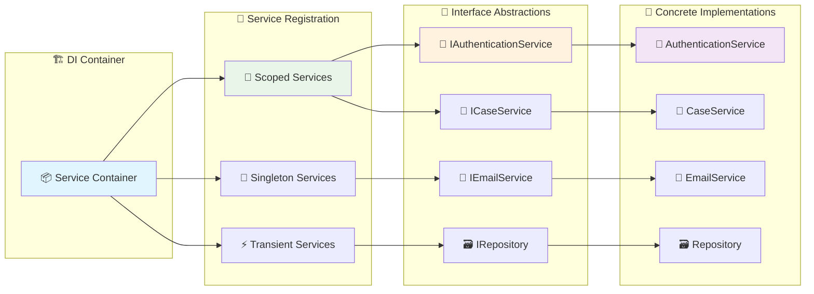

---

## 5. Flux de Données

### 5.1 Flux de Données Email Processing

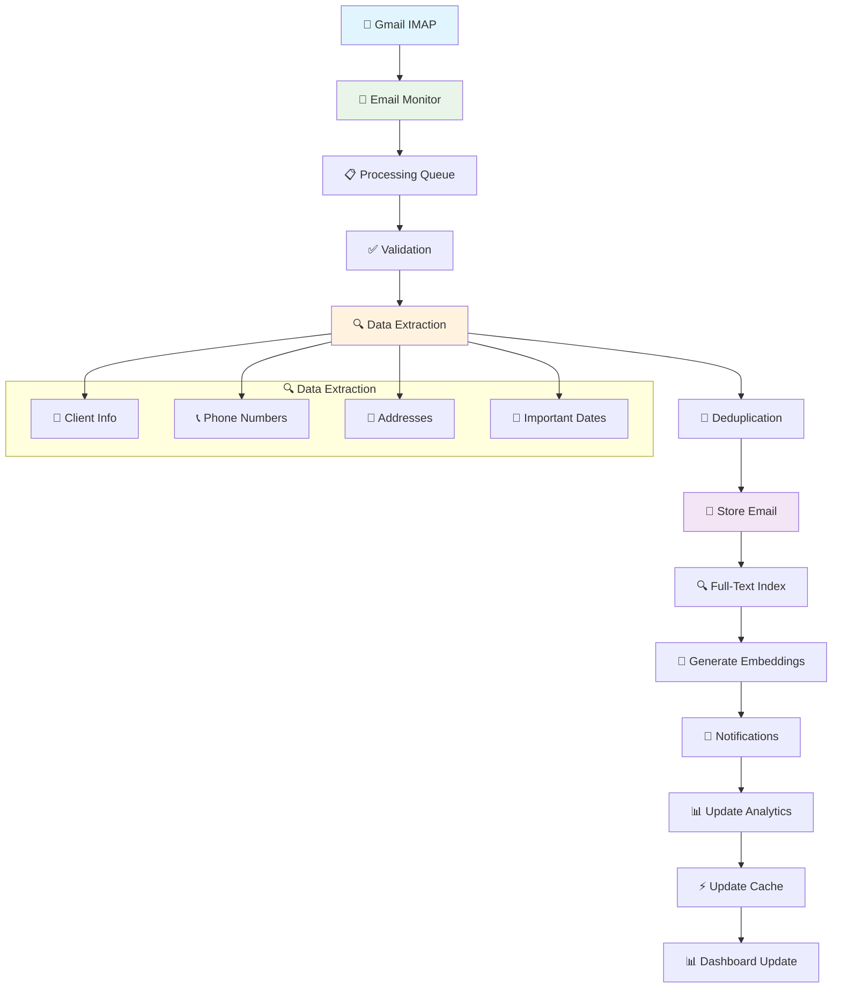

### 5.2 Flux de Données Recherche

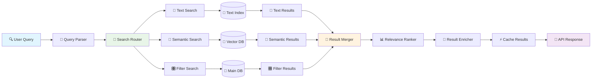

---

## 6. Sécurité et Authentification

### 6.1 Architecture Sécurité

```mermaid
graph TB
    subgraph "🔐 Authentication Layer"
        Login[🔑 Login Endpoint]
        JWT[🎫 JWT Token Service]
        Refresh[🔄 Token Refresh]
        Logout[🚪 Logout Service]
    end
    
    subgraph "🛡️ Authorization Layer"
        RoleCheck[👨💼 Role Verification]
        PermissionCheck[🔒 Permission Check]
        ResourceAccess[📁 Resource Access Control]
        PolicyEngine[📋 Policy Engine]
    end
    
    subgraph "🔒 Security Middleware"
        HTTPS[🔒 HTTPS Enforcement]
        CORS[🌐 CORS Policy]
        RateLimit[⏱️ Rate Limiting]
        InputValidation[✅ Input Validation]
    end
    
    subgraph "🛠️ Security Services"
        PasswordHash[🔐 Password Hashing (BCrypt)]
        Encryption[🔒 Data Encryption]
        AuditLog[📋 Security Audit]
        ThreatDetection[🚨 Threat Detection]
    end
    
    Login --> JWT
    JWT --> RoleCheck
    RoleCheck --> PermissionCheck
    PermissionCheck --> ResourceAccess
    
    HTTPS --> Login
    CORS --> JWT
    RateLimit --> RoleCheck
    InputValidation --> PermissionCheck
    
    JWT --> PasswordHash
    ResourceAccess --> Encryption
    PolicyEngine --> AuditLog
    ThreatDetection --> AuditLog
    
    style Login fill:#e1f5fe
    style RoleCheck fill:#e8f5e8
    style HTTPS fill:#fff3e0
    style PasswordHash fill:#f3e5f5
```

### 6.2 Flux d'Authentification JWT

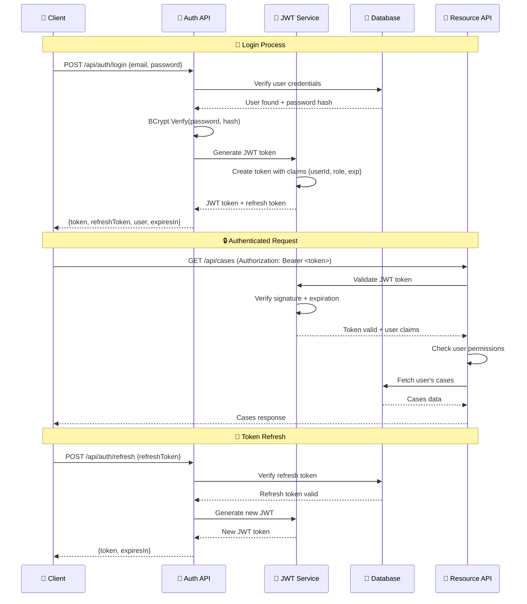

---

## 7. Monitoring et Observabilité

### 7.1 Architecture Monitoring

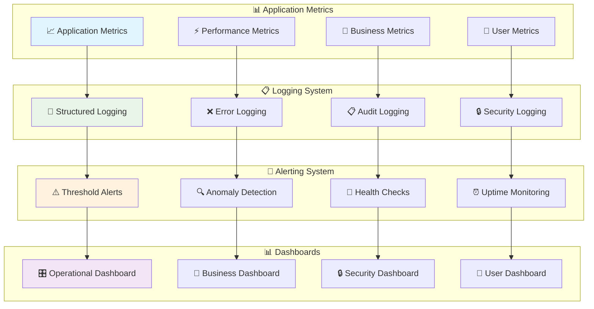

### 7.2 Métriques Clés

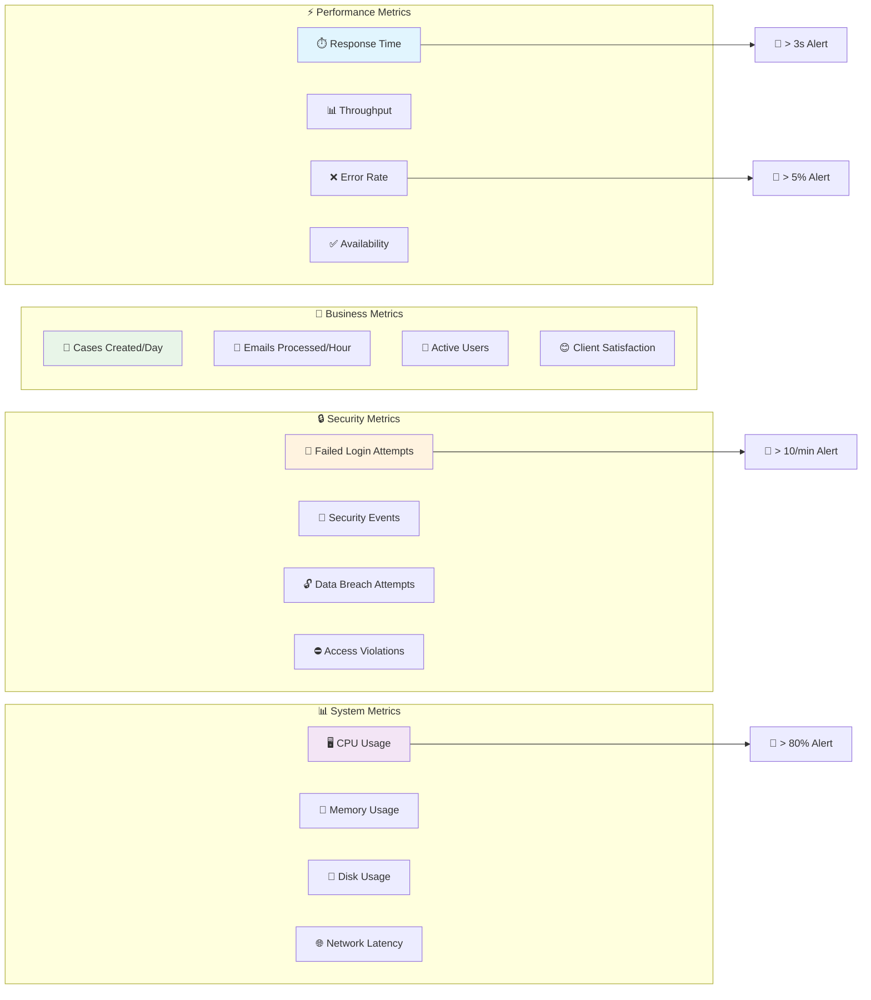

---

## 8. Déploiement et Infrastructure

### 8.1 Architecture de Déploiement Local

```mermaid
graph TB
    subgraph "💻 Local Development"
        DevMachine[🖥️ Developer Machine]
        LocalDB[💾 SQLite Local]
        LocalFiles[📁 Local File Storage]
        LocalCache[⚡ In-Memory Cache]
    end
    
    subgraph "🏢 On-Premise Production"
        WebServer[🌐 Web Server (IIS/Kestrel)]
        AppServer[⚙️ Application Server]
        FileServer[📁 File Server]
        BackupServer[💾 Backup Server]
    end
    
    subgraph "☁️ Cloud Deployment (Optional)"
        AppService[🌐 Azure App Service]
        SQLDatabase[💾 Azure SQL Database]
        BlobStorage[📁 Azure Blob Storage]
        KeyVault[🔐 Azure Key Vault]
    end
    
    DevMachine --> LocalDB
    DevMachine --> LocalFiles
    DevMachine --> LocalCache
    
    WebServer --> AppServer
    AppServer --> FileServer
    FileServer --> BackupServer
    
    AppService --> SQLDatabase
    AppService --> BlobStorage
    AppService --> KeyVault
    
    style DevMachine fill:#e1f5fe
    style WebServer fill:#e8f5e8
    style AppService fill:#fff3e0
```

### 8.2 Pipeline CI/CD

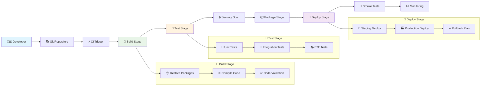

---

## 📊 Métriques Architecture

### Performance Targets

| Composant | Métrique | Target | Limite |
|-----------|----------|---------|---------|
| 🔌 API Response | Temps moyen | < 200ms | < 1s |
| 📧 Email Processing | Throughput | 100 emails/min | 500 emails/min |
| 🔍 Search | Temps réponse | < 500ms | < 2s |
| 💾 Database | Connexions | < 50 concurrent | < 100 concurrent |
| 📊 Dashboard | Refresh | < 3s | < 10s |

### Scalabilité

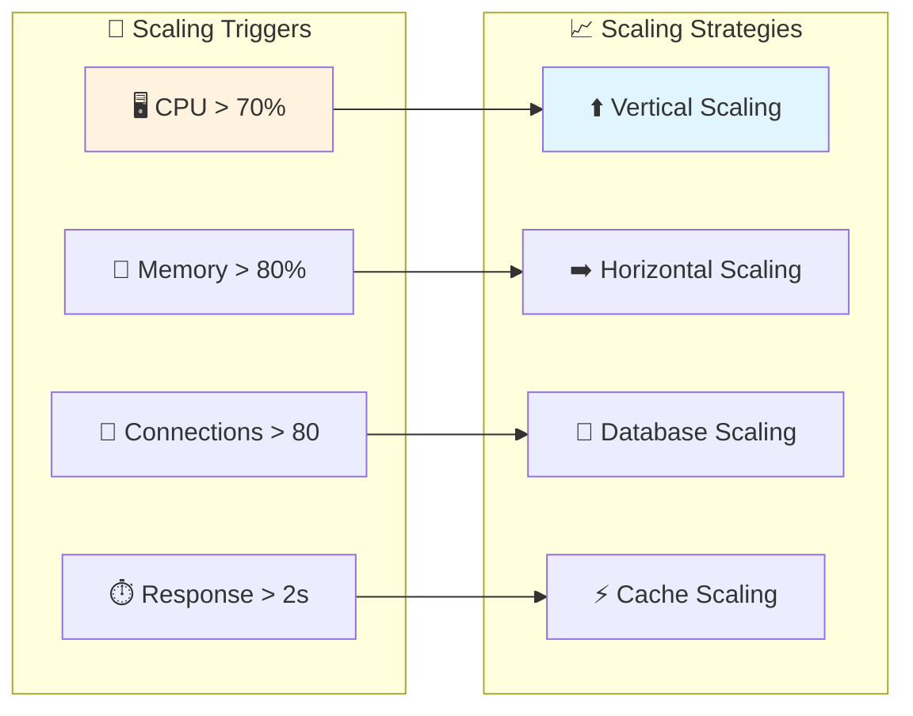

---

## 🔧 Points d'Extension Architecture

### 1. **Microservices Migration Path**
- Extraction des services métier en microservices indépendants
- API Gateway pour routage et authentification centralisée
- Event-driven architecture avec message queues

### 2. **Cloud-Native Enhancements**
- Containerisation avec Docker
- Orchestration avec Kubernetes
- Service mesh pour communication inter-services

### 3. **Advanced Analytics**
- Data warehouse pour analytics avancées
- Machine learning pour prédictions
- Real-time streaming analytics

### 4. **Mobile Applications**
- API-first design pour support mobile natif
- Offline-first architecture
- Push notifications natives

---

## 📝 Conclusion

Cette architecture technique de MemoLib est conçue pour être :

- ✅ **Scalable** : Peut évoluer de 1 à 1000+ utilisateurs
- ✅ **Maintenable** : Code modulaire et bien structuré
- ✅ **Sécurisée** : Sécurité par design à tous les niveaux
- ✅ **Observable** : Monitoring et logging complets
- ✅ **Testable** : Architecture permettant tests automatisés
- ✅ **Évolutive** : Prête pour futures extensions

L'architecture actuelle répond parfaitement aux besoins des cabinets d'avocats tout en gardant une complexité maîtrisée et des coûts optimisés.