# ⚖️ Diagrammes Flux Métier Juridique - MemoLib

## 📋 Table des Matières

1. [Processus Juridiques Principaux](#1-processus-juridiques-principaux)
2. [Gestion des Échéances Légales](#2-gestion-des-échéances-légales)
3. [Workflow Contentieux](#3-workflow-contentieux)
4. [Processus Client-Avocat](#4-processus-client-avocat)
5. [Gestion Documentaire Juridique](#5-gestion-documentaire-juridique)
6. [Facturation et Suivi Temps](#6-facturation-et-suivi-temps)
7. [Conformité et Audit](#7-conformité-et-audit)
8. [Processus Collaboratifs](#8-processus-collaboratifs)

---

## 1. Processus Juridiques Principaux

### 1.1 Cycle de Vie Complet d'un Dossier Juridique

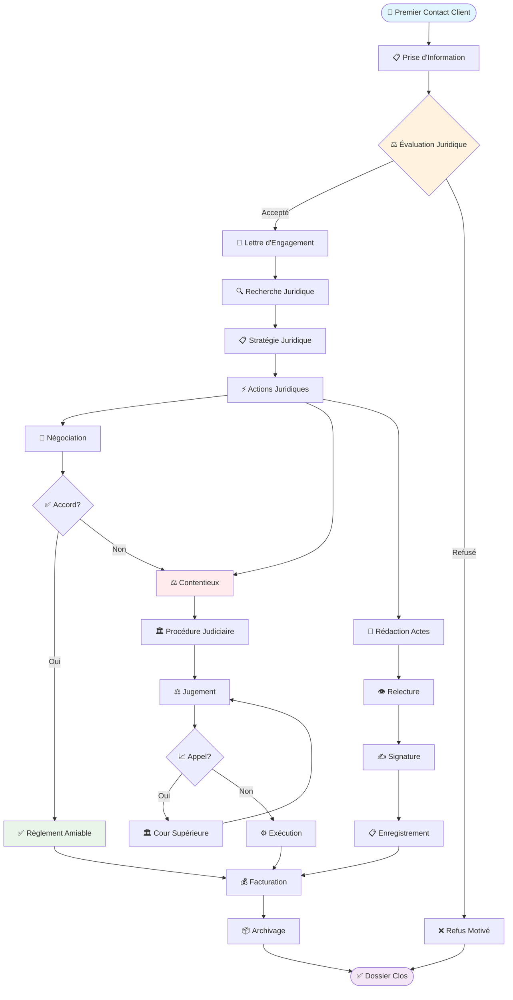

### 1.2 Matrice des Types de Dossiers Juridiques

```mermaid
graph TB
    subgraph "👥 Droit des Personnes"
        Family[👨‍👩‍👧‍👦 Droit de la Famille]
        Divorce[💔 Divorce]
        Custody[👶 Garde d'Enfants]
        Adoption[🤱 Adoption]
    end
    
    subgraph "🏢 Droit des Affaires"
        Corporate[🏢 Droit des Sociétés]
        Contracts[📝 Contrats Commerciaux]
        IP[💡 Propriété Intellectuelle]
        Employment[👔 Droit du Travail]
    end
    
    subgraph "🏠 Droit Immobilier"
        RealEstate[🏠 Transactions Immobilières]
        Lease[📋 Baux Commerciaux]
        Construction[🏗️ Droit de la Construction]
        Zoning[🗺️ Urbanisme]
    end
    
    subgraph "⚖️ Contentieux"
        Civil[⚖️ Contentieux Civil]
        Commercial[💼 Contentieux Commercial]
        Administrative[🏛️ Contentieux Administratif]
        Criminal[🚔 Pénal]
    end
    
    subgraph "🌐 Droit International"
        Immigration[🛂 Droit des Étrangers]
        International[🌍 Droit International]
        European[🇪🇺 Droit Européen]
        Trade[🚢 Commerce International]
    end
    
    Family --> Workflow1[📋 Workflow Familial]
    Corporate --> Workflow2[📋 Workflow Affaires]
    RealEstate --> Workflow3[📋 Workflow Immobilier]
    Civil --> Workflow4[📋 Workflow Contentieux]
    Immigration --> Workflow5[📋 Workflow International]
    
    style Family fill:#fce4ec
    style Corporate fill:#e8f5e8
    style RealEstate fill:#fff3e0
    style Civil fill:#ffebee
    style Immigration fill:#e1f5fe
```

---

## 2. Gestion des Échéances Légales

### 2.1 Système d'Alertes Échéances Critiques

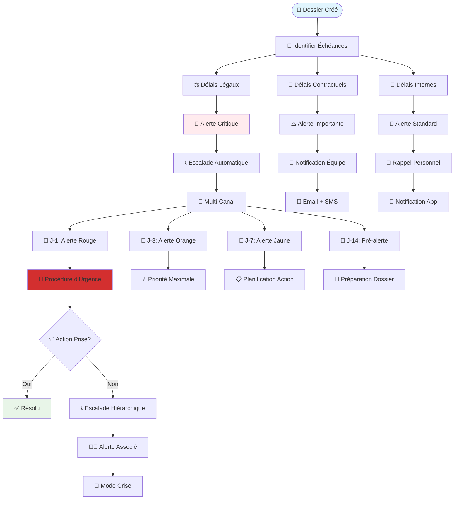

### 2.2 Calendrier Juridique Intelligent

```mermaid
graph TB
    subgraph "📅 Types d'Échéances"
        Appeal[📈 Délais d'Appel]
        Statute[⏰ Prescription]
        Filing[📋 Dépôt de Pièces]
        Hearing[🎤 Audiences]
        Response[📝 Délais de Réponse]
    end
    
    subgraph "🎯 Niveaux de Criticité"
        Level1[🔴 Niveau 1: Délais Légaux Impératifs]
        Level2[🟠 Niveau 2: Délais Contractuels]
        Level3[🟡 Niveau 3: Délais Internes]
        Level4[🔵 Niveau 4: Délais Préparatoires]
    end
    
    subgraph "🔔 Système d'Alertes"
        Immediate[⚡ Immédiate (J-1)]
        Urgent[🚨 Urgente (J-3)]
        Important[⚠️ Importante (J-7)]
        Reminder[📢 Rappel (J-14)]
    end
    
    subgraph "📱 Canaux de Notification"
        SMS[📱 SMS]
        Email[📧 Email]
        Push[📲 Push Notification]
        InApp[📱 In-App Alert]
        Phone[📞 Appel Automatique]
    end
    
    Appeal --> Level1
    Statute --> Level1
    Filing --> Level2
    Hearing --> Level2
    Response --> Level3
    
    Level1 --> Immediate
    Level1 --> Urgent
    Level2 --> Important
    Level3 --> Reminder
    
    Immediate --> SMS
    Immediate --> Phone
    Urgent --> Email
    Urgent --> Push
    Important --> InApp
    Reminder --> Email
    
    style Level1 fill:#ffebee
    style Level2 fill:#fff3e0
    style Immediate fill:#d32f2f
    style SMS fill:#e1f5fe
```

---

## 3. Workflow Contentieux

### 3.1 Procédure Contentieuse Complète

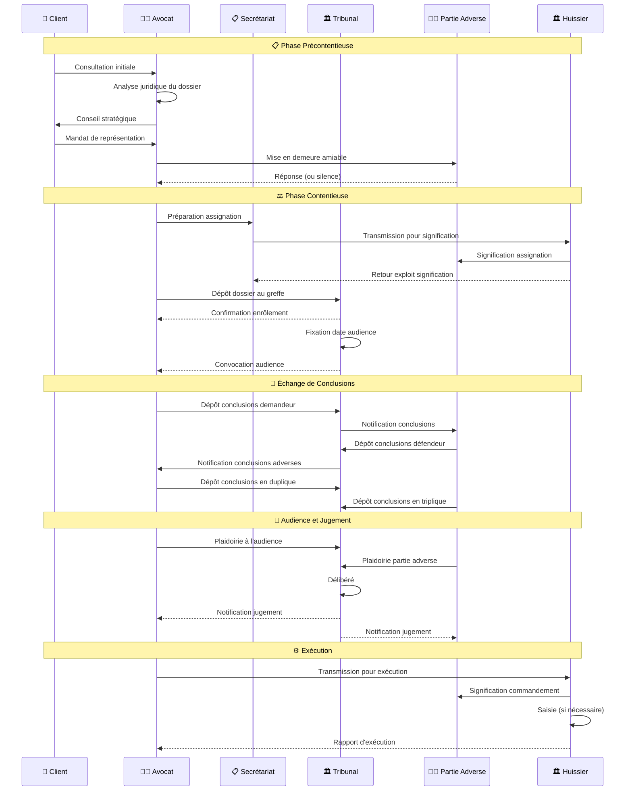

### 3.2 Gestion des Pièces et Preuves

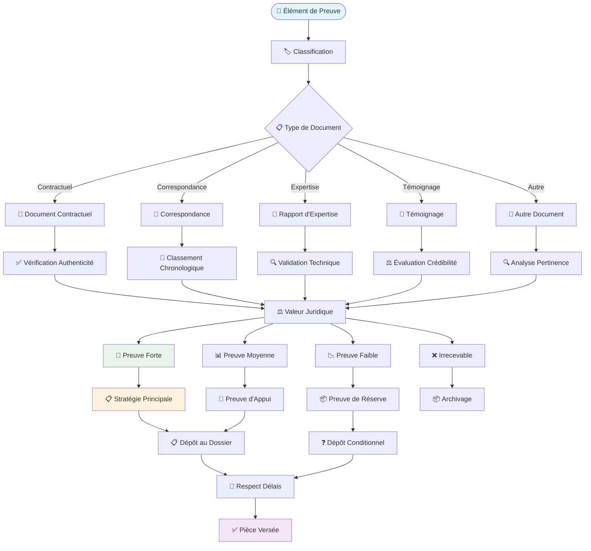

---

## 4. Processus Client-Avocat

### 4.1 Cycle de Relation Client

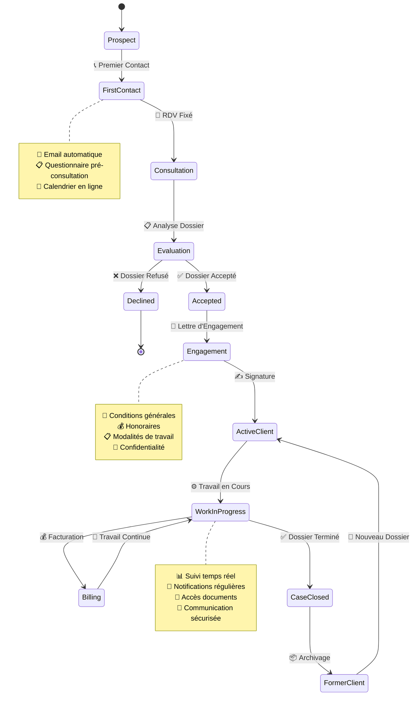

### 4.2 Communication Client Structurée

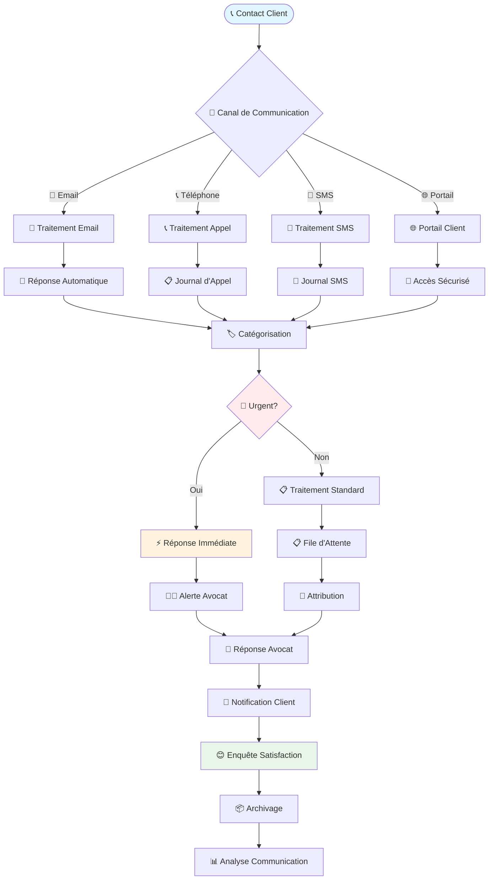

---

## 5. Gestion Documentaire Juridique

### 5.1 Cycle de Vie Document Juridique

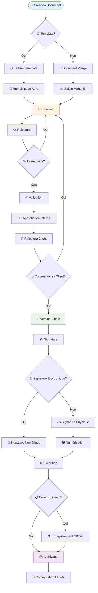

### 5.2 Système de Versioning Documentaire

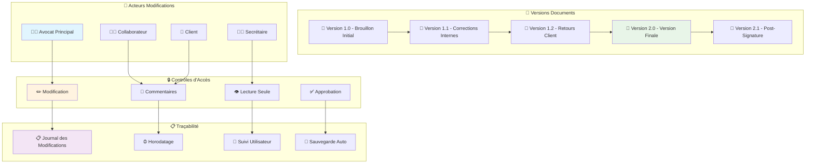

---

## 6. Facturation et Suivi Temps

### 6.1 Processus de Facturation Juridique

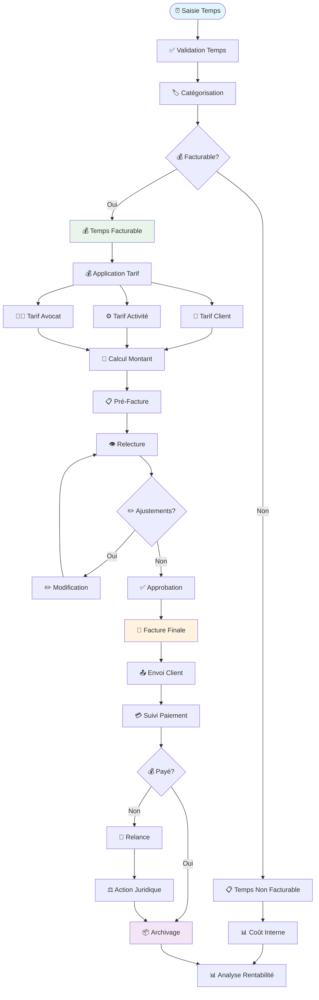

### 6.2 Suivi Temps Détaillé par Activité

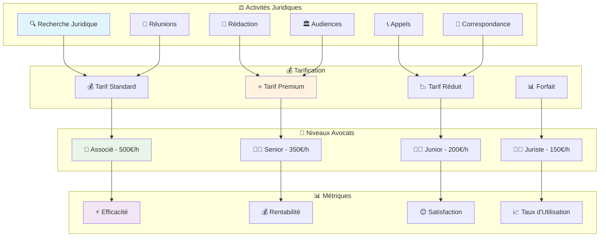

---

## 7. Conformité et Audit

### 7.1 Processus de Conformité Réglementaire

```mermaid
flowchart TD
    Regulation([📋 Exigence Réglementaire]) --> Identification[🔍 Identification Obligation]
    
    Identification --> Assessment[📊 Évaluation Conformité]
    Assessment --> Gap{❌ Écart Identifié?}
    
    Gap -->|Oui| ActionPlan[📋 Plan d'Action]
    Gap -->|Non| Monitoring[👁️ Surveillance Continue]
    
    ActionPlan --> Implementation[⚙️ Mise en Œuvre]
    Implementation --> Verification[✅ Vérification]
    
    Verification --> Compliant{✅ Conforme?}
    Compliant -->|Non| ActionPlan
    Compliant -->|Oui| Documentation[📄 Documentation]
    
    Documentation --> Monitoring
    Monitoring --> PeriodicReview[🔄 Révision Périodique]
    
    PeriodicReview --> RegulationChange{📋 Changement Réglementation?}
    RegulationChange -->|Oui| Assessment
    RegulationChange -->|Non| Monitoring
    
    subgraph "📋 Domaines de Conformité"
        GDPR[🔐 RGPD/Protection Données]
        Professional[⚖️ Déontologie Professionnelle]
        Financial[💰 Réglementation Financière]
        Security[🛡️ Sécurité Informatique]
    end
    
    subgraph "📊 Contrôles"
        DataProtection[🔐 Protection Données Clients]
        ClientFunds[💰 Fonds de Clients (CARPA)]
        ProfessionalSecret[🤐 Secret Professionnel]
        ConflictInterest[⚖️ Conflits d'Intérêts]
    end
    
    GDPR --> DataProtection
    Professional --> ProfessionalSecret
    Financial --> ClientFunds
    Security --> ConflictInterest
    
    style Regulation fill:#e1f5fe
    style Gap fill:#ffebee
    style Documentation fill:#e8f5e8
    style GDPR fill:#fff3e0
```

### 7.2 Audit Trail Complet

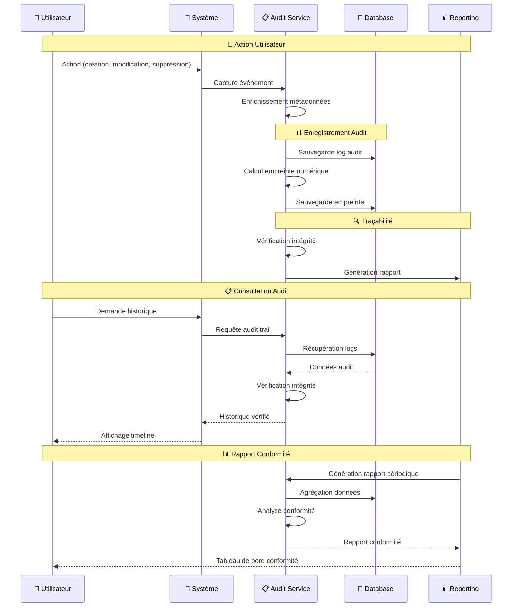

---

## 8. Processus Collaboratifs

### 8.1 Collaboration Interne Cabinet

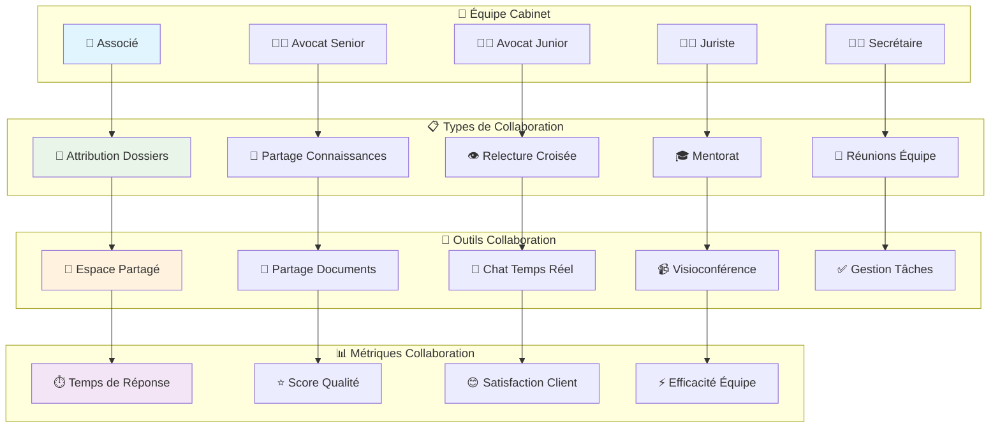

### 8.2 Collaboration Externe (Clients, Confrères)

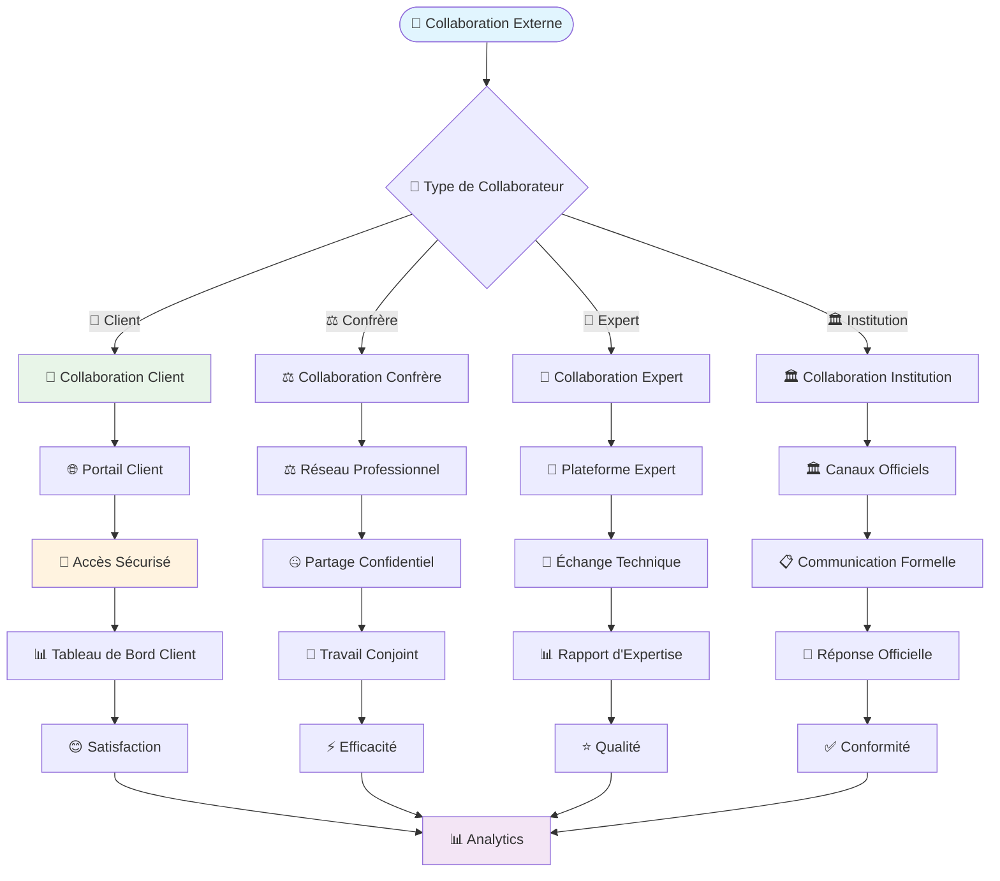

---

## 📊 Métriques Métier Juridique

### KPIs Principaux par Processus

| Processus | KPI Principal | Objectif | Seuil Critique |
|-----------|---------------|----------|----------------|
| ⚖️ Contentieux | Taux de succès | > 80% | < 60% |
| 📅 Échéances | Respect délais | > 98% | < 95% |
| 👤 Relation Client | Satisfaction | > 4.5/5 | < 4.0/5 |
| 💰 Facturation | Taux recouvrement | > 95% | < 90% |
| 📄 Documents | Temps traitement | < 2h | > 8h |
| 🤝 Collaboration | Temps réponse | < 4h | > 24h |

### Tableau de Bord Métier

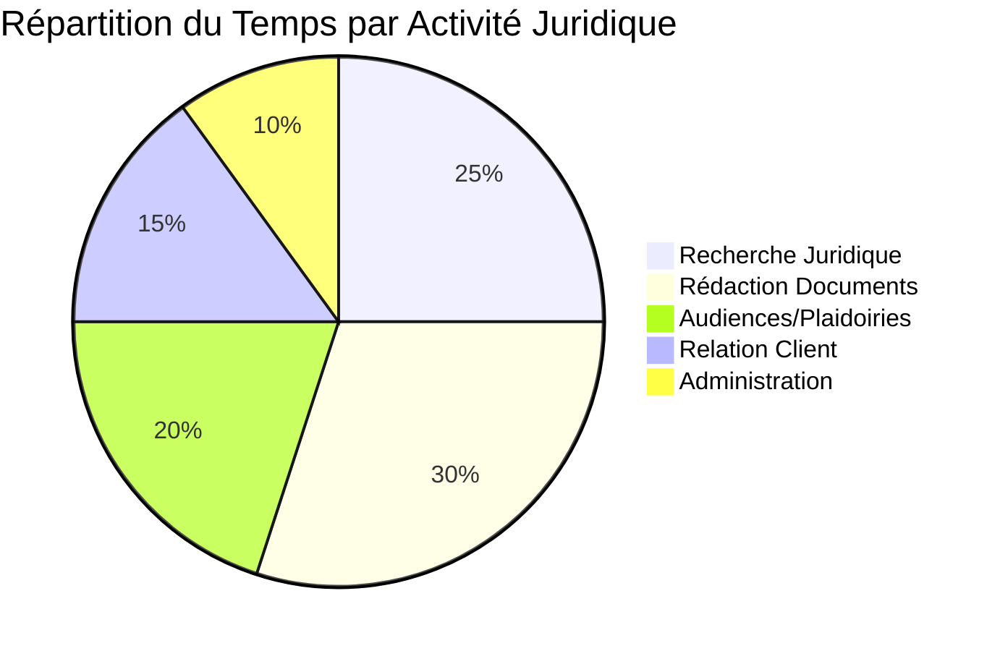

---

## 🎯 Optimisations Métier Identifiées

### 1. **Automatisation Échéances**
- IA prédictive pour anticipation des délais
- Intégration calendriers juridiques officiels
- Alertes multi-canal personnalisées

### 2. **Workflow Contentieux**
- Templates procéduraux automatisés
- Suivi automatique des étapes
- Intégration avec greffes électroniques

### 3. **Relation Client**
- Portail client self-service
- Communication proactive automatisée
- Enquêtes satisfaction automatiques

### 4. **Gestion Documentaire**
- OCR intelligent pour extraction données
- Signature électronique intégrée
- Versioning automatique avec IA

---

## 📝 Conclusion Métier

Ces diagrammes de flux métier juridique couvrent l'ensemble des processus spécifiques aux cabinets d'avocats, de la prise en charge client initial jusqu'à l'archivage final, en passant par tous les aspects réglementaires et collaboratifs.

Ils servent de référence pour :

- ✅ **Optimisation** : Identification des goulots d'étranglement
- ✅ **Formation** : Onboarding des nouveaux collaborateurs
- ✅ **Conformité** : Respect des obligations professionnelles
- ✅ **Qualité** : Standardisation des processus
- ✅ **Efficacité** : Automatisation des tâches répétitives

Chaque processus est conçu pour respecter la déontologie juridique tout en maximisant l'efficacité opérationnelle et la satisfaction client.