# 🔌 Diagrammes Intégration & API - MemoLib

## 📋 Table des Matières

1. [Architecture API Globale](#1-architecture-api-globale)
2. [Intégrations Email (Gmail/Outlook)](#2-intégrations-email-gmailoutlook)
3. [Intégrations Systèmes Juridiques](#3-intégrations-systèmes-juridiques)
4. [API Externes et Webhooks](#4-api-externes-et-webhooks)
5. [Sécurité des Intégrations](#5-sécurité-des-intégrations)
6. [Monitoring et Observabilité](#6-monitoring-et-observabilité)
7. [Gestion des Erreurs et Retry](#7-gestion-des-erreurs-et-retry)
8. [Performance et Scalabilité](#8-performance-et-scalabilité)

---

## 1. Architecture API Globale

### 1.1 Vue d'ensemble des Intégrations

```mermaid
graph TB
    subgraph "🌐 MemoLib Core API"
        CoreAPI[🔌 Core API Gateway]
        AuthService[🔐 Authentication Service]
        RateLimiter[⏱️ Rate Limiter]
        LoadBalancer[⚖️ Load Balancer]
    end
    
    subgraph "📧 Email Integrations"
        Gmail[📧 Gmail IMAP/SMTP]
        Outlook[📧 Outlook Graph API]
        Exchange[📧 Exchange Server]
        SMTP[📤 Generic SMTP]
    end
    
    subgraph "⚖️ Legal System Integrations"
        CourtSystems[🏛️ Court Systems]
        LegalDatabases[📚 Legal Databases]
        DocumentSigning[✍️ E-Signature Services]
        TimeTracking[⏰ Time Tracking Systems]
    end
    
    subgraph "💼 Business Integrations"
        CRM[👥 CRM Systems]
        Accounting[💰 Accounting Software]
        Calendar[📅 Calendar Systems]
        Storage[☁️ Cloud Storage]
    end
    
    subgraph "🤖 AI/ML Services"
        OpenAI[🧠 OpenAI API]
        Azure[☁️ Azure Cognitive Services]
        CustomML[🔬 Custom ML Models]
        NLP[📝 NLP Services]
    end
    
    subgraph "🔔 Notification Services"
        SMS[📱 SMS Providers]
        Push[📲 Push Notifications]
        Slack[💬 Slack Integration]
        Teams[👥 Microsoft Teams]
    end
    
    CoreAPI --> Gmail
    CoreAPI --> Outlook
    CoreAPI --> CourtSystems
    CoreAPI --> CRM
    CoreAPI --> OpenAI
    CoreAPI --> SMS
    
    AuthService --> CoreAPI
    RateLimiter --> CoreAPI
    LoadBalancer --> CoreAPI
    
    style CoreAPI fill:#e1f5fe
    style Gmail fill:#e8f5e8
    style CourtSystems fill:#fff3e0
    style OpenAI fill:#f3e5f5
    style SMS fill:#fce4ec
```

### 1.2 Matrice des Protocoles d'Intégration

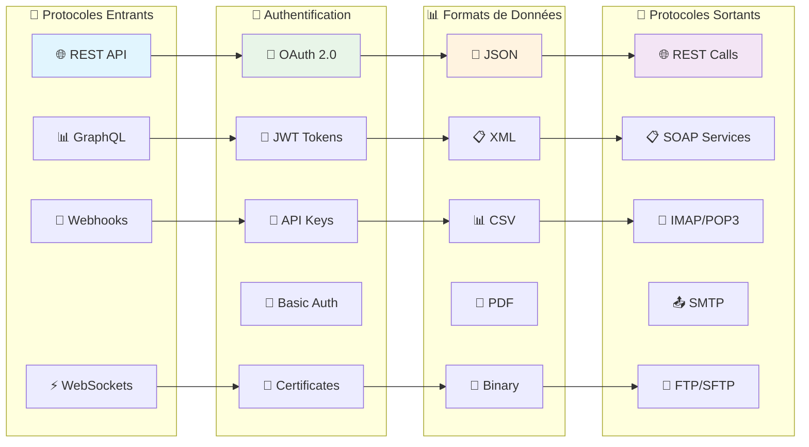
```mermaid
graph LR
    subgraph "🔌 Protocoles Entrants"
        REST_IN[🌐 REST API]
        GraphQL_IN[📊 GraphQL]
        Webhook_IN[🔗 Webhooks]
        WebSocket_IN[⚡ WebSockets]
    end
    
    subgraph "🔌 Protocoles Sortants"
        REST_OUT[🌐 REST Calls]
        SOAP_OUT[📋 SOAP Services]
        IMAP_OUT[📧 IMAP/POP3]
        SMTP_OUT[📤 SMTP]
        FTP_OUT[📁 FTP/SFTP]
    end
    
    subgraph "🔐 Authentification"
        OAuth2[🔑 OAuth 2.0]
        JWT[🎫 JWT Tokens]
        APIKey[🔐 API Keys]
        BasicAuth[👤 Basic Auth]
        Certificate[📜 Certificates]
    end
    
    subgraph "📊 Formats de Données"
        JSON[📄 JSON]
        XML[📋 XML]
        CSV[📊 CSV]
        PDF[📄 PDF]
        Binary[💾 Binary]
    end
    
    REST_IN --> OAuth2
    GraphQL_IN --> JWT
    Webhook_IN --> APIKey
    WebSocket_IN --> Certificate
    
    OAuth2 --> JSON
    JWT --> XML
    APIKey --> CSV
    Certificate --> Binary
    
    JSON --> REST_OUT
    XML --> SOAP_OUT
    CSV --> IMAP_OUT
    Binary --> FTP_OUT
    
    style REST_IN fill:#e1f5fe
    style OAuth2 fill:#e8f5e8
    style JSON fill:#fff3e0
    style REST_OUT fill:#f3e5f5
```

---

## 2. Intégrations Email (Gmail/Outlook)

### 2.1 Intégration Gmail Complète

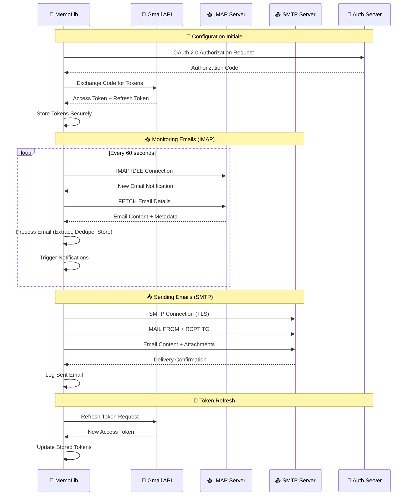
```mermaid
sequenceDiagram
    participant M as 🔄 MemoLib
    participant G as 📧 Gmail API
    participant I as 📥 IMAP Server
    participant S as 📤 SMTP Server
    participant A as 🔐 Auth Server
    
    Note over M,A: 🔐 Configuration Initiale
    M->>A: OAuth 2.0 Authorization Request
    A-->>M: Authorization Code
    M->>G: Exchange Code for Tokens
    G-->>M: Access Token + Refresh Token
    M->>M: Store Tokens Securely
    
    Note over M,S: 📥 Monitoring Emails (IMAP)
    loop Every 60 seconds
        M->>I: IMAP IDLE Connection
        I-->>M: New Email Notification
        M->>I: FETCH Email Details
        I-->>M: Email Content + Metadata
        M->>M: Process Email (Extract, Dedupe, Store)
        M->>M: Trigger Notifications
    end
    
    Note over M,S: 📤 Sending Emails (SMTP)
    M->>S: SMTP Connection (TLS)
    M->>S: MAIL FROM + RCPT TO
    M->>S: Email Content + Attachments
    S-->>M: Delivery Confirmation
    M->>M: Log Sent Email
    
    Note over M,A: 🔄 Token Refresh
    M->>G: Refresh Token Request
    G-->>M: New Access Token
    M->>M: Update Stored Tokens
```

### 2.2 Intégration Microsoft Graph (Outlook)

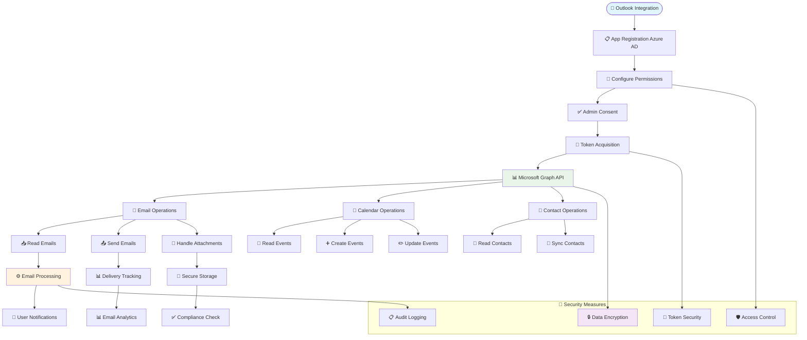
```mermaid
flowchart TD
    Start([🚀 Outlook Integration]) --> AppRegistration[📋 App Registration Azure AD]
    
    AppRegistration --> Permissions[🔐 Configure Permissions]
    Permissions --> Consent[✅ Admin Consent]
    
    Consent --> TokenAcquisition[🎫 Token Acquisition]
    TokenAcquisition --> GraphAPI[📊 Microsoft Graph API]
    
    GraphAPI --> EmailOperations[📧 Email Operations]
    GraphAPI --> CalendarOperations[📅 Calendar Operations]
    GraphAPI --> ContactOperations[👥 Contact Operations]
    
    EmailOperations --> ReadEmails[📥 Read Emails]
    EmailOperations --> SendEmails[📤 Send Emails]
    EmailOperations --> Attachments[📎 Handle Attachments]
    
    CalendarOperations --> ReadEvents[📅 Read Events]
    CalendarOperations --> CreateEvents[➕ Create Events]
    CalendarOperations --> UpdateEvents[✏️ Update Events]
    
    ContactOperations --> ReadContacts[👥 Read Contacts]
    ContactOperations --> SyncContacts[🔄 Sync Contacts]
    
    ReadEmails --> Processing[⚙️ Email Processing]
    SendEmails --> Tracking[📊 Delivery Tracking]
    Attachments --> Storage[💾 Secure Storage]
    
    Processing --> Notifications[🔔 User Notifications]
    Tracking --> Analytics[📊 Email Analytics]
    Storage --> Compliance[✅ Compliance Check]
    
    subgraph "🔐 Security Measures"
        Encryption[🔒 Data Encryption]
        TokenSecurity[🎫 Token Security]
        AuditLog[📋 Audit Logging]
        AccessControl[🛡️ Access Control]
    end
    
    GraphAPI --> Encryption
    TokenAcquisition --> TokenSecurity
    Processing --> AuditLog
    Permissions --> AccessControl
    
    style Start fill:#e1f5fe
    style GraphAPI fill:#e8f5e8
    style Processing fill:#fff3e0
    style Encryption fill:#f3e5f5
```

### 2.3 Gestion Multi-Provider Email

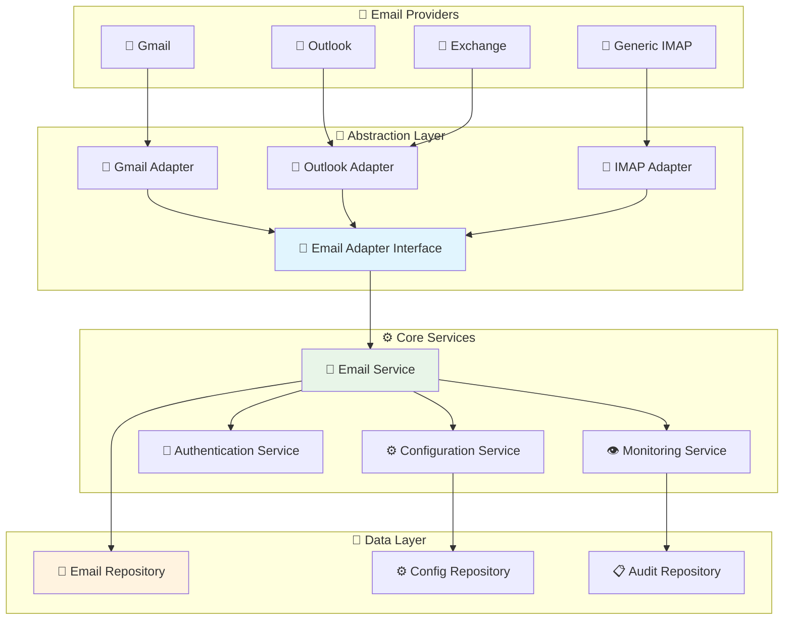
```mermaid
graph TB
    subgraph "📧 Email Providers"
        Gmail[📧 Gmail]
        Outlook[📧 Outlook]
        Exchange[📧 Exchange]
        IMAP[📧 Generic IMAP]
    end
    
    subgraph "🔧 Abstraction Layer"
        EmailAdapter[🔌 Email Adapter Interface]
        GmailAdapter[📧 Gmail Adapter]
        OutlookAdapter[📧 Outlook Adapter]
        IMAPAdapter[📧 IMAP Adapter]
    end
    
    subgraph "⚙️ Core Services"
        EmailService[📧 Email Service]
        ConfigService[⚙️ Configuration Service]
        AuthService[🔐 Authentication Service]
        MonitorService[👁️ Monitoring Service]
    end
    
    subgraph "💾 Data Layer"
        EmailRepository[📧 Email Repository]
        ConfigRepository[⚙️ Config Repository]
        AuditRepository[📋 Audit Repository]
    end
    
    Gmail --> GmailAdapter
    Outlook --> OutlookAdapter
    Exchange --> OutlookAdapter
    IMAP --> IMAPAdapter
    
    GmailAdapter --> EmailAdapter
    OutlookAdapter --> EmailAdapter
    IMAPAdapter --> EmailAdapter
    
    EmailAdapter --> EmailService
    EmailService --> ConfigService
    EmailService --> AuthService
    EmailService --> MonitorService
    
    EmailService --> EmailRepository
    ConfigService --> ConfigRepository
    MonitorService --> AuditRepository
    
    style EmailAdapter fill:#e1f5fe
    style EmailService fill:#e8f5e8
    style EmailRepository fill:#fff3e0
```

---

## 3. Intégrations Systèmes Juridiques

### 3.1 Intégration Greffes Électroniques

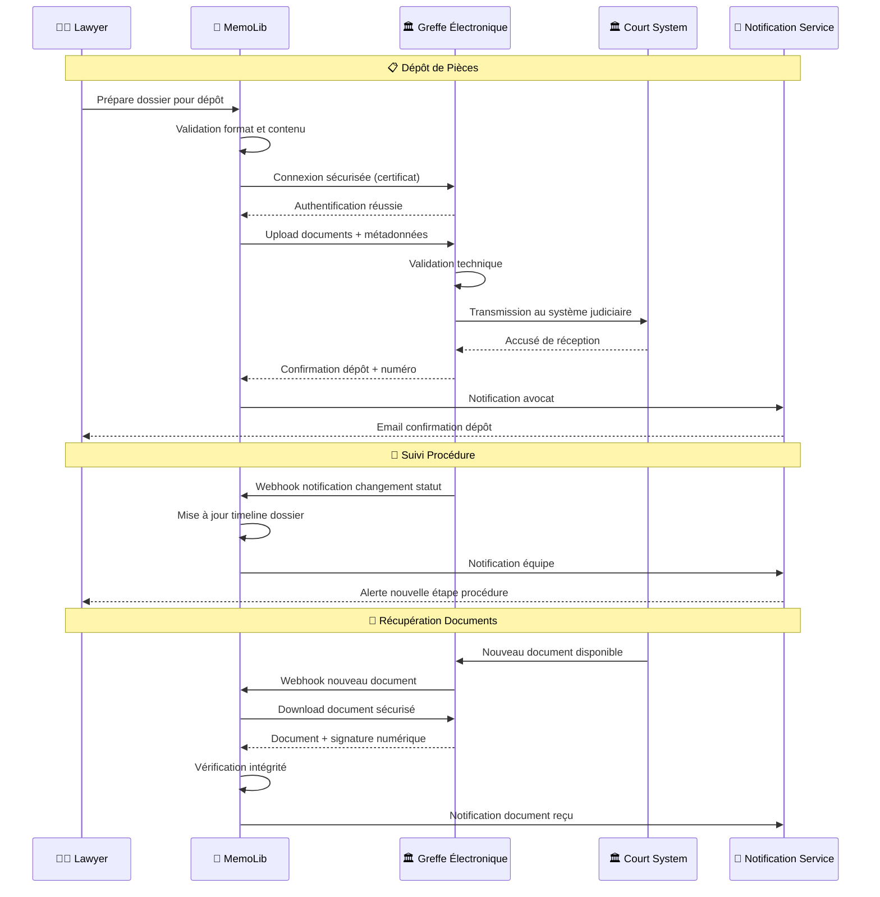
```mermaid
sequenceDiagram
    participant L as 👨💼 Lawyer
    participant M as 🔄 MemoLib
    participant G as 🏛️ Greffe Électronique
    participant C as 🏛️ Court System
    participant N as 🔔 Notification Service
    
    Note over L,N: 📋 Dépôt de Pièces
    L->>M: Prépare dossier pour dépôt
    M->>M: Validation format et contenu
    M->>G: Connexion sécurisée (certificat)
    G-->>M: Authentification réussie
    
    M->>G: Upload documents + métadonnées
    G->>G: Validation technique
    G->>C: Transmission au système judiciaire
    C-->>G: Accusé de réception
    G-->>M: Confirmation dépôt + numéro
    
    M->>N: Notification avocat
    N-->>L: Email confirmation dépôt
    
    Note over L,N: 📅 Suivi Procédure
    G->>M: Webhook notification changement statut
    M->>M: Mise à jour timeline dossier
    M->>N: Notification équipe
    N-->>L: Alerte nouvelle étape procédure
    
    Note over L,N: 📄 Récupération Documents
    C->>G: Nouveau document disponible
    G->>M: Webhook nouveau document
    M->>G: Download document sécurisé
    G-->>M: Document + signature numérique
    M->>M: Vérification intégrité
    M->>N: Notification document reçu
```

### 3.2 Intégration Bases Juridiques

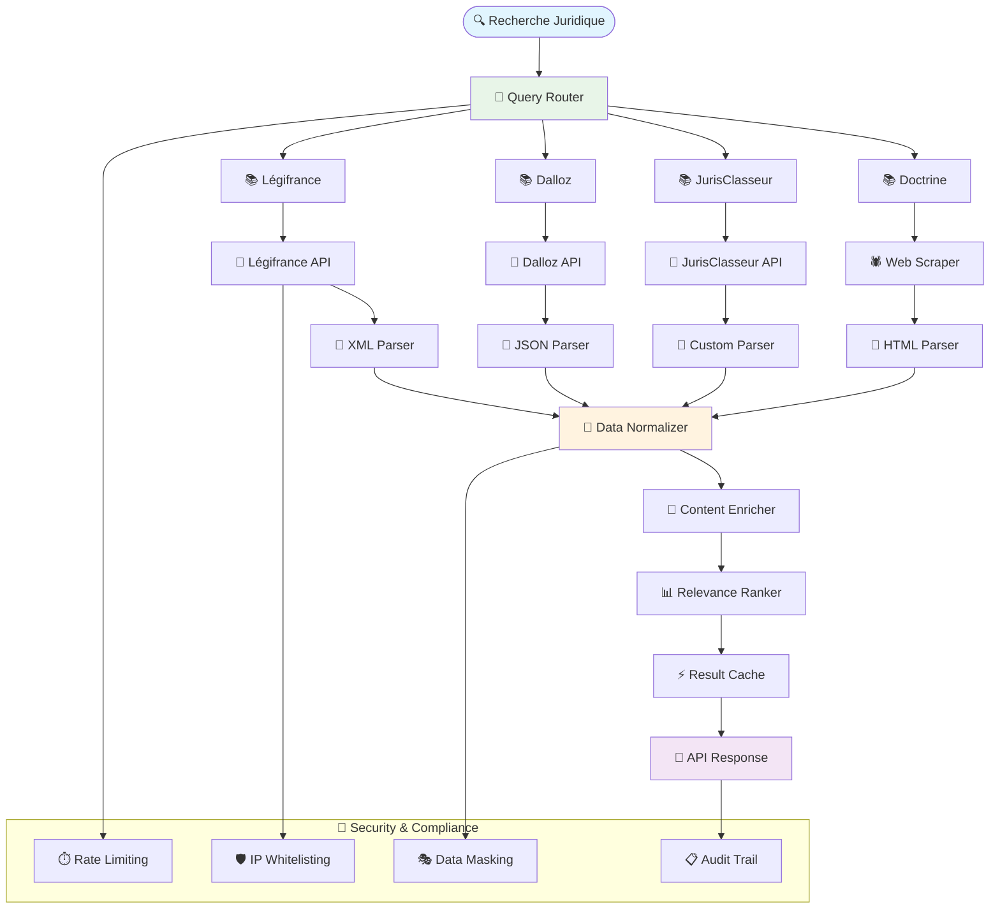
```mermaid
flowchart TD
    Query([🔍 Recherche Juridique]) --> Router[🎯 Query Router]
    
    Router --> LegalDB1[📚 Légifrance]
    Router --> LegalDB2[📚 Dalloz]
    Router --> LegalDB3[📚 JurisClasseur]
    Router --> LegalDB4[📚 Doctrine]
    
    LegalDB1 --> API1[🔌 Légifrance API]
    LegalDB2 --> API2[🔌 Dalloz API]
    LegalDB3 --> API3[🔌 JurisClasseur API]
    LegalDB4 --> Scraper[🕷️ Web Scraper]
    
    API1 --> Parser1[📝 XML Parser]
    API2 --> Parser2[📝 JSON Parser]
    API3 --> Parser3[📝 Custom Parser]
    Scraper --> Parser4[📝 HTML Parser]
    
    Parser1 --> Normalizer[🔄 Data Normalizer]
    Parser2 --> Normalizer
    Parser3 --> Normalizer
    Parser4 --> Normalizer
    
    Normalizer --> Enricher[💎 Content Enricher]
    Enricher --> Ranker[📊 Relevance Ranker]
    Ranker --> Cache[⚡ Result Cache]
    
    Cache --> Response[📱 API Response]
    
    subgraph "🔐 Security & Compliance"
        RateLimit[⏱️ Rate Limiting]
        IPWhitelist[🛡️ IP Whitelisting]
        DataMasking[🎭 Data Masking]
        AuditTrail[📋 Audit Trail]
    end
    
    Router --> RateLimit
    API1 --> IPWhitelist
    Normalizer --> DataMasking
    Response --> AuditTrail
    
    style Query fill:#e1f5fe
    style Router fill:#e8f5e8
    style Normalizer fill:#fff3e0
    style Response fill:#f3e5f5
```

### 3.3 Intégration Signature Électronique

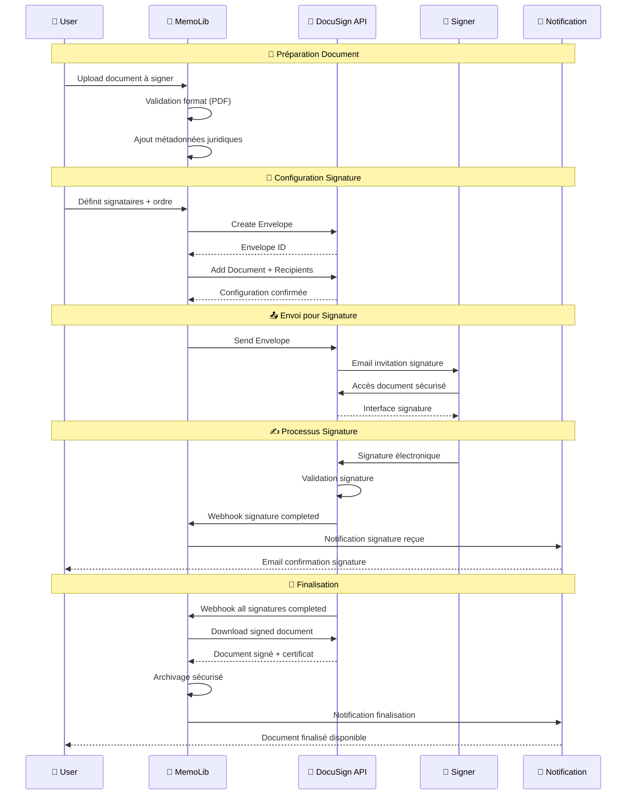
```mermaid
sequenceDiagram
    participant U as 👤 User
    participant M as 🔄 MemoLib
    participant D as 📄 DocuSign API
    participant S as 👤 Signer
    participant N as 🔔 Notification
    
    Note over U,N: 📝 Préparation Document
    U->>M: Upload document à signer
    M->>M: Validation format (PDF)
    M->>M: Ajout métadonnées juridiques
    
    Note over U,N: 🔐 Configuration Signature
    U->>M: Définit signataires + ordre
    M->>D: Create Envelope
    D-->>M: Envelope ID
    M->>D: Add Document + Recipients
    D-->>M: Configuration confirmée
    
    Note over U,N: 📤 Envoi pour Signature
    M->>D: Send Envelope
    D->>S: Email invitation signature
    S->>D: Accès document sécurisé
    D-->>S: Interface signature
    
    Note over U,N: ✍️ Processus Signature
    S->>D: Signature électronique
    D->>D: Validation signature
    D->>M: Webhook signature completed
    M->>N: Notification signature reçue
    N-->>U: Email confirmation signature
    
    Note over U,N: 📄 Finalisation
    D->>M: Webhook all signatures completed
    M->>D: Download signed document
    D-->>M: Document signé + certificat
    M->>M: Archivage sécurisé
    M->>N: Notification finalisation
    N-->>U: Document finalisé disponible
```

---

## 4. API Externes et Webhooks

### 4.1 Architecture Webhooks Entrants

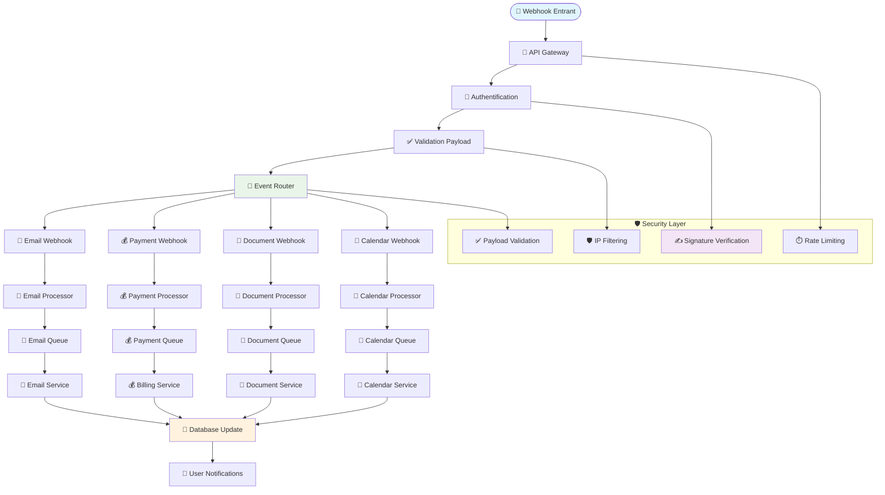
```mermaid
flowchart TD
    Webhook([🔗 Webhook Entrant]) --> Gateway[🚪 API Gateway]
    
    Gateway --> Auth[🔐 Authentification]
    Auth --> Validation[✅ Validation Payload]
    Validation --> Router[🎯 Event Router]
    
    Router --> EmailWebhook[📧 Email Webhook]
    Router --> PaymentWebhook[💰 Payment Webhook]
    Router --> DocumentWebhook[📄 Document Webhook]
    Router --> CalendarWebhook[📅 Calendar Webhook]
    
    EmailWebhook --> EmailProcessor[📧 Email Processor]
    PaymentWebhook --> PaymentProcessor[💰 Payment Processor]
    DocumentWebhook --> DocumentProcessor[📄 Document Processor]
    CalendarWebhook --> CalendarProcessor[📅 Calendar Processor]
    
    EmailProcessor --> EmailQueue[📧 Email Queue]
    PaymentProcessor --> PaymentQueue[💰 Payment Queue]
    DocumentProcessor --> DocumentQueue[📄 Document Queue]
    CalendarProcessor --> CalendarQueue[📅 Calendar Queue]
    
    EmailQueue --> EmailService[📧 Email Service]
    PaymentQueue --> BillingService[💰 Billing Service]
    DocumentQueue --> DocumentService[📄 Document Service]
    CalendarQueue --> CalendarService[📅 Calendar Service]
    
    EmailService --> Database[💾 Database Update]
    BillingService --> Database
    DocumentService --> Database
    CalendarService --> Database
    
    Database --> Notifications[🔔 User Notifications]
    
    subgraph "🛡️ Security Layer"
        SignatureVerification[✍️ Signature Verification]
        RateLimiting[⏱️ Rate Limiting]
        IPFiltering[🛡️ IP Filtering]
        PayloadValidation[✅ Payload Validation]
    end
    
    Auth --> SignatureVerification
    Gateway --> RateLimiting
    Validation --> IPFiltering
    Router --> PayloadValidation
    
    style Webhook fill:#e1f5fe
    style Router fill:#e8f5e8
    style Database fill:#fff3e0
    style SignatureVerification fill:#f3e5f5
```

### 4.2 Webhooks Sortants (Notifications)

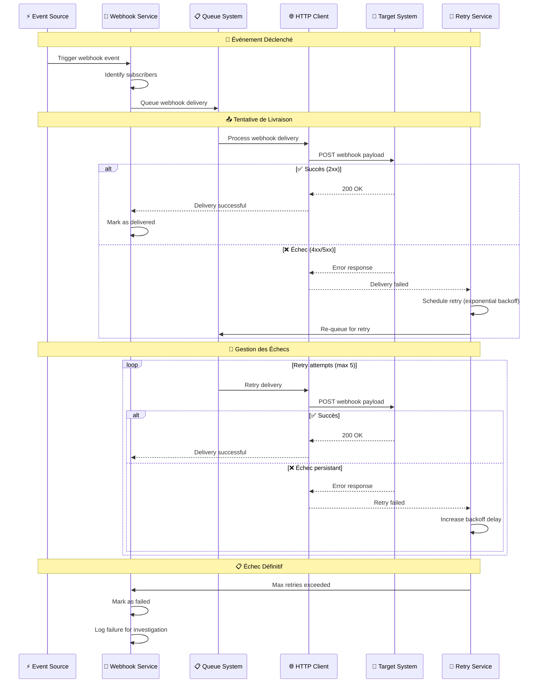
```mermaid
sequenceDiagram
    participant E as ⚡ Event Source
    participant W as 🔗 Webhook Service
    participant Q as 📋 Queue System
    participant H as 🌐 HTTP Client
    participant T as 🎯 Target System
    participant R as 🔄 Retry Service
    
    Note over E,R: 📢 Événement Déclenché
    E->>W: Trigger webhook event
    W->>W: Identify subscribers
    W->>Q: Queue webhook delivery
    
    Note over E,R: 📤 Tentative de Livraison
    Q->>H: Process webhook delivery
    H->>T: POST webhook payload
    
    alt ✅ Succès (2xx)
        T-->>H: 200 OK
        H-->>W: Delivery successful
        W->>W: Mark as delivered
    else ❌ Échec (4xx/5xx)
        T-->>H: Error response
        H-->>R: Delivery failed
        R->>R: Schedule retry (exponential backoff)
        R->>Q: Re-queue for retry
    end
    
    Note over E,R: 🔄 Gestion des Échecs
    loop Retry attempts (max 5)
        Q->>H: Retry delivery
        H->>T: POST webhook payload
        alt ✅ Succès
            T-->>H: 200 OK
            H-->>W: Delivery successful
        else ❌ Échec persistant
            T-->>H: Error response
            H-->>R: Retry failed
            R->>R: Increase backoff delay
        end
    end
    
    Note over E,R: 📋 Échec Définitif
    R->>W: Max retries exceeded
    W->>W: Mark as failed
    W->>W: Log failure for investigation
```

### 4.3 API Rate Limiting et Throttling

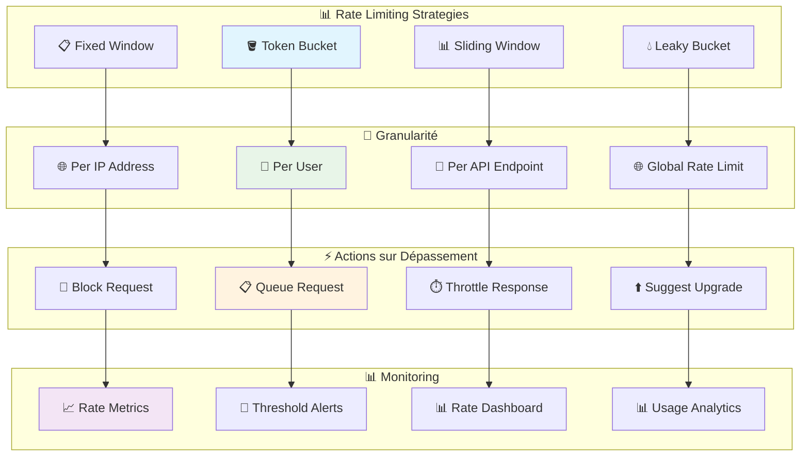
```mermaid
graph TB
    subgraph "📊 Rate Limiting Strategies"
        TokenBucket[🪣 Token Bucket]
        SlidingWindow[📊 Sliding Window]
        FixedWindow[📋 Fixed Window]
        Leaky[💧 Leaky Bucket]
    end
    
    subgraph "🎯 Granularité"
        Global[🌐 Global Rate Limit]
        PerUser[👤 Per User]
        PerAPI[🔌 Per API Endpoint]
        PerIP[🌐 Per IP Address]
    end
    
    subgraph "⚡ Actions sur Dépassement"
        Block[🚫 Block Request]
        Queue[📋 Queue Request]
        Throttle[⏱️ Throttle Response]
        Upgrade[⬆️ Suggest Upgrade]
    end
    
    subgraph "📊 Monitoring"
        Metrics[📈 Rate Metrics]
        Alerts[🚨 Threshold Alerts]
        Dashboard[📊 Rate Dashboard]
        Analytics[📊 Usage Analytics]
    end
    
    TokenBucket --> PerUser
    SlidingWindow --> PerAPI
    FixedWindow --> PerIP
    Leaky --> Global
    
    PerUser --> Queue
    PerAPI --> Throttle
    PerIP --> Block
    Global --> Upgrade
    
    Block --> Metrics
    Queue --> Alerts
    Throttle --> Dashboard
    Upgrade --> Analytics
    
    style TokenBucket fill:#e1f5fe
    style PerUser fill:#e8f5e8
    style Queue fill:#fff3e0
    style Metrics fill:#f3e5f5
```

---

## 5. Sécurité des Intégrations

### 5.1 Architecture Sécurité API

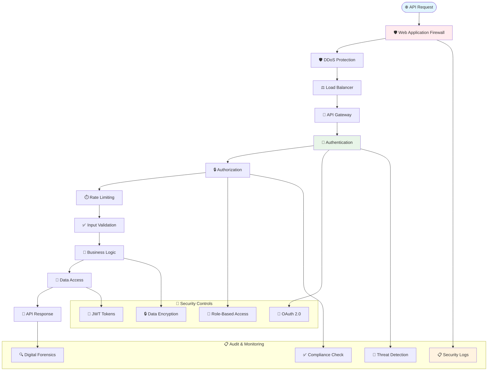
```mermaid
flowchart TD
    Request([🌐 API Request]) --> WAF[🛡️ Web Application Firewall]
    
    WAF --> DDoSProtection[🛡️ DDoS Protection]
    DDoSProtection --> LoadBalancer[⚖️ Load Balancer]
    LoadBalancer --> APIGateway[🚪 API Gateway]
    
    APIGateway --> Authentication[🔐 Authentication]
    Authentication --> Authorization[🔒 Authorization]
    Authorization --> RateLimit[⏱️ Rate Limiting]
    RateLimit --> InputValidation[✅ Input Validation]
    
    InputValidation --> BusinessLogic[💼 Business Logic]
    BusinessLogic --> DataAccess[💾 Data Access]
    DataAccess --> Response[📱 API Response]
    
    subgraph "🔐 Security Controls"
        OAuth2[🔑 OAuth 2.0]
        JWT[🎫 JWT Tokens]
        RBAC[👥 Role-Based Access]
        Encryption[🔒 Data Encryption]
    end
    
    subgraph "📋 Audit & Monitoring"
        SecurityLogs[📋 Security Logs]
        ThreatDetection[🚨 Threat Detection]
        Compliance[✅ Compliance Check]
        Forensics[🔍 Digital Forensics]
    end
    
    Authentication --> OAuth2
    Authorization --> RBAC
    BusinessLogic --> Encryption
    DataAccess --> JWT
    
    WAF --> SecurityLogs
    Authentication --> ThreatDetection
    Authorization --> Compliance
    Response --> Forensics
    
    style Request fill:#e1f5fe
    style WAF fill:#ffebee
    style Authentication fill:#e8f5e8
    style SecurityLogs fill:#fff3e0
```

### 5.2 Gestion des Secrets et Certificats

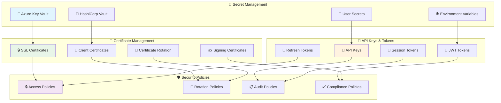
```mermaid
graph TB
    subgraph "🔐 Secret Management"
        KeyVault[🔐 Azure Key Vault]
        HashiVault[🔐 HashiCorp Vault]
        UserSecrets[👤 User Secrets]
        EnvVars[🌐 Environment Variables]
    end
    
    subgraph "📜 Certificate Management"
        SSLCerts[🔒 SSL Certificates]
        ClientCerts[👤 Client Certificates]
        SigningCerts[✍️ Signing Certificates]
        CertRotation[🔄 Certificate Rotation]
    end
    
    subgraph "🔑 API Keys & Tokens"
        APIKeys[🔑 API Keys]
        JWTTokens[🎫 JWT Tokens]
        RefreshTokens[🔄 Refresh Tokens]
        SessionTokens[📱 Session Tokens]
    end
    
    subgraph "🛡️ Security Policies"
        AccessPolicies[🔒 Access Policies]
        RotationPolicies[🔄 Rotation Policies]
        AuditPolicies[📋 Audit Policies]
        CompliancePolicies[✅ Compliance Policies]
    end
    
    KeyVault --> SSLCerts
    HashiVault --> ClientCerts
    UserSecrets --> APIKeys
    EnvVars --> JWTTokens
    
    SSLCerts --> AccessPolicies
    ClientCerts --> RotationPolicies
    APIKeys --> AuditPolicies
    JWTTokens --> CompliancePolicies
    
    CertRotation --> RotationPolicies
    RefreshTokens --> AccessPolicies
    SessionTokens --> AuditPolicies
    SigningCerts --> CompliancePolicies
    
    style KeyVault fill:#e1f5fe
    style SSLCerts fill:#e8f5e8
    style APIKeys fill:#fff3e0
    style AccessPolicies fill:#f3e5f5
```

---

## 6. Monitoring et Observabilité

### 6.1 Monitoring des Intégrations

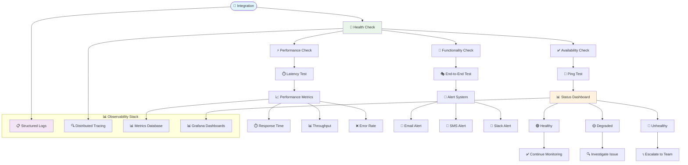
```mermaid
flowchart TD
    Integration([🔌 Integration]) --> HealthCheck[💚 Health Check]
    
    HealthCheck --> Availability[✅ Availability Check]
    HealthCheck --> Performance[⚡ Performance Check]
    HealthCheck --> Functionality[🔧 Functionality Check]
    
    Availability --> Ping[🏓 Ping Test]
    Performance --> Latency[⏱️ Latency Test]
    Functionality --> E2E[🎭 End-to-End Test]
    
    Ping --> Status[📊 Status Dashboard]
    Latency --> Metrics[📈 Performance Metrics]
    E2E --> Alerts[🚨 Alert System]
    
    Status --> Green[🟢 Healthy]
    Status --> Yellow[🟡 Degraded]
    Status --> Red[🔴 Unhealthy]
    
    Metrics --> ResponseTime[⏱️ Response Time]
    Metrics --> Throughput[📊 Throughput]
    Metrics --> ErrorRate[❌ Error Rate]
    
    Alerts --> Email[📧 Email Alert]
    Alerts --> SMS[📱 SMS Alert]
    Alerts --> Slack[💬 Slack Alert]
    
    Green --> Continue[✅ Continue Monitoring]
    Yellow --> Investigate[🔍 Investigate Issue]
    Red --> Escalate[📞 Escalate to Team]
    
    subgraph "📊 Observability Stack"
        Logs[📋 Structured Logs]
        Traces[🔍 Distributed Tracing]
        MetricsDB[📊 Metrics Database]
        Dashboards[📊 Grafana Dashboards]
    end
    
    Integration --> Logs
    HealthCheck --> Traces
    Metrics --> MetricsDB
    Status --> Dashboards
    
    style Integration fill:#e1f5fe
    style HealthCheck fill:#e8f5e8
    style Status fill:#fff3e0
    style Logs fill:#f3e5f5
```

### 6.2 Alerting et Escalation

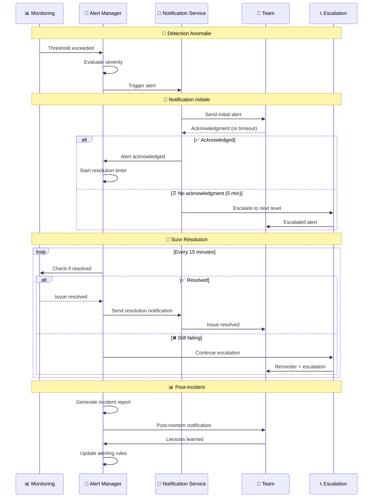
```mermaid
sequenceDiagram
    participant M as 📊 Monitoring
    participant A as 🚨 Alert Manager
    participant N as 🔔 Notification Service
    participant T as 👥 Team
    participant E as 📞 Escalation
    
    Note over M,E: 🚨 Détection Anomalie
    M->>A: Threshold exceeded
    A->>A: Evaluate severity
    A->>N: Trigger alert
    
    Note over M,E: 📢 Notification Initiale
    N->>T: Send initial alert
    T-->>N: Acknowledgment (or timeout)
    
    alt ✅ Acknowledged
        N->>A: Alert acknowledged
        A->>A: Start resolution timer
    else ⏰ No acknowledgment (5 min)
        N->>E: Escalate to next level
        E->>T: Escalated alert
    end
    
    Note over M,E: 🔄 Suivi Résolution
    loop Every 15 minutes
        A->>M: Check if resolved
        alt ✅ Resolved
            M-->>A: Issue resolved
            A->>N: Send resolution notification
            N->>T: Issue resolved
        else ❌ Still failing
            A->>E: Continue escalation
            E->>T: Reminder + escalation
        end
    end
    
    Note over M,E: 📊 Post-Incident
    A->>A: Generate incident report
    A->>T: Post-mortem notification
    T->>A: Lessons learned
    A->>A: Update alerting rules
```

---

## 7. Gestion des Erreurs et Retry

### 7.1 Stratégies de Retry

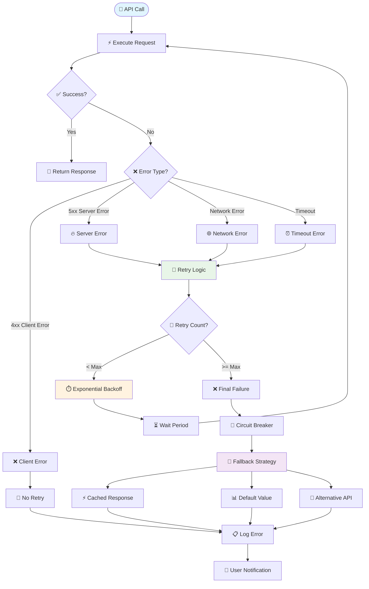
```mermaid
flowchart TD
    APICall([🔌 API Call]) --> Execute[⚡ Execute Request]
    
    Execute --> Success{✅ Success?}
    Success -->|Yes| Return[📱 Return Response]
    Success -->|No| ErrorType{❌ Error Type?}
    
    ErrorType -->|4xx Client Error| ClientError[❌ Client Error]
    ErrorType -->|5xx Server Error| ServerError[🔥 Server Error]
    ErrorType -->|Network Error| NetworkError[🌐 Network Error]
    ErrorType -->|Timeout| TimeoutError[⏰ Timeout Error]
    
    ClientError --> NoRetry[🚫 No Retry]
    ServerError --> RetryLogic[🔄 Retry Logic]
    NetworkError --> RetryLogic
    TimeoutError --> RetryLogic
    
    RetryLogic --> RetryCount{🔢 Retry Count?}
    RetryCount -->|< Max| Backoff[⏱️ Exponential Backoff]
    RetryCount -->|>= Max| FinalFailure[❌ Final Failure]
    
    Backoff --> Wait[⏳ Wait Period]
    Wait --> Execute
    
    FinalFailure --> CircuitBreaker[🔌 Circuit Breaker]
    CircuitBreaker --> Fallback[🔄 Fallback Strategy]
    
    Fallback --> Cache[⚡ Cached Response]
    Fallback --> DefaultValue[📊 Default Value]
    Fallback --> AlternativeAPI[🔌 Alternative API]
    
    NoRetry --> LogError[📋 Log Error]
    Cache --> LogError
    DefaultValue --> LogError
    AlternativeAPI --> LogError
    
    LogError --> UserNotification[🔔 User Notification]
    
    style APICall fill:#e1f5fe
    style RetryLogic fill:#e8f5e8
    style Backoff fill:#fff3e0
    style Fallback fill:#f3e5f5
```

### 7.2 Circuit Breaker Pattern

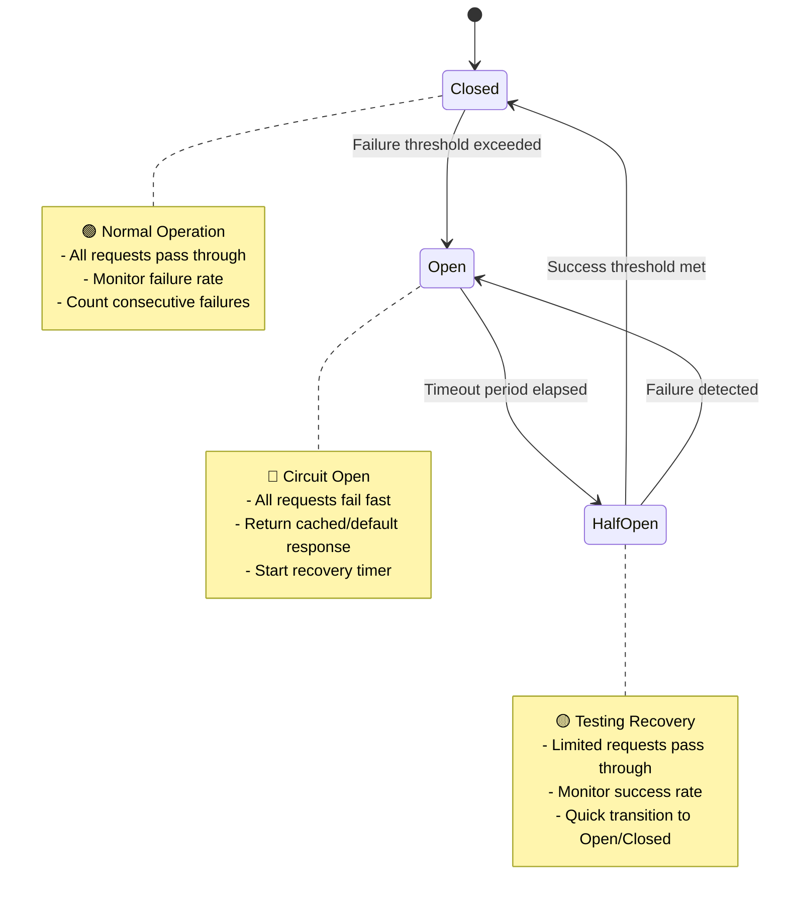
```mermaid
stateDiagram-v2
    [*] --> Closed
    
    Closed --> Open : Failure threshold exceeded
    Open --> HalfOpen : Timeout period elapsed
    HalfOpen --> Closed : Success threshold met
    HalfOpen --> Open : Failure detected
    
    note right of Closed
        🟢 Normal Operation
        - All requests pass through
        - Monitor failure rate
        - Count consecutive failures
    end note
    
    note right of Open
        🔴 Circuit Open
        - All requests fail fast
        - Return cached/default response
        - Start recovery timer
    end note
    
    note right of HalfOpen
        🟡 Testing Recovery
        - Limited requests pass through
        - Monitor success rate
        - Quick transition to Open/Closed
    end note
```

---

## 8. Performance et Scalabilité

### 8.1 Optimisation Performance API

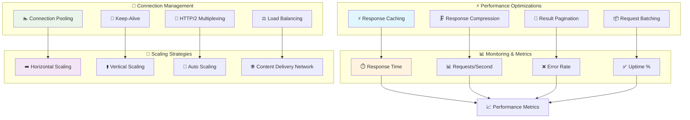
```mermaid
graph TB
    subgraph "⚡ Performance Optimizations"
        Caching[⚡ Response Caching]
        Compression[🗜️ Response Compression]
        Pagination[📄 Result Pagination]
        Batching[📦 Request Batching]
    end
    
    subgraph "🔄 Connection Management"
        Pooling[🏊 Connection Pooling]
        KeepAlive[💓 Keep-Alive]
        Multiplexing[🔀 HTTP/2 Multiplexing]
        LoadBalancing[⚖️ Load Balancing]
    end
    
    subgraph "📊 Monitoring & Metrics"
        ResponseTime[⏱️ Response Time]
        Throughput[📊 Requests/Second]
        ErrorRate[❌ Error Rate]
        Availability[✅ Uptime %]
    end
    
    subgraph "🎯 Scaling Strategies"
        HorizontalScaling[➡️ Horizontal Scaling]
        VerticalScaling[⬆️ Vertical Scaling]
        AutoScaling[🤖 Auto Scaling]
        CDN[🌐 Content Delivery Network]
    end
    
    Caching --> ResponseTime
    Compression --> Throughput
    Pagination --> ErrorRate
    Batching --> Availability
    
    Pooling --> HorizontalScaling
    KeepAlive --> VerticalScaling
    Multiplexing --> AutoScaling
    LoadBalancing --> CDN
    
    ResponseTime --> Metrics[📈 Performance Metrics]
    Throughput --> Metrics
    ErrorRate --> Metrics
    Availability --> Metrics
    
    style Caching fill:#e1f5fe
    style Pooling fill:#e8f5e8
    style ResponseTime fill:#fff3e0
    style HorizontalScaling fill:#f3e5f5
```

### 8.2 Architecture Scalable

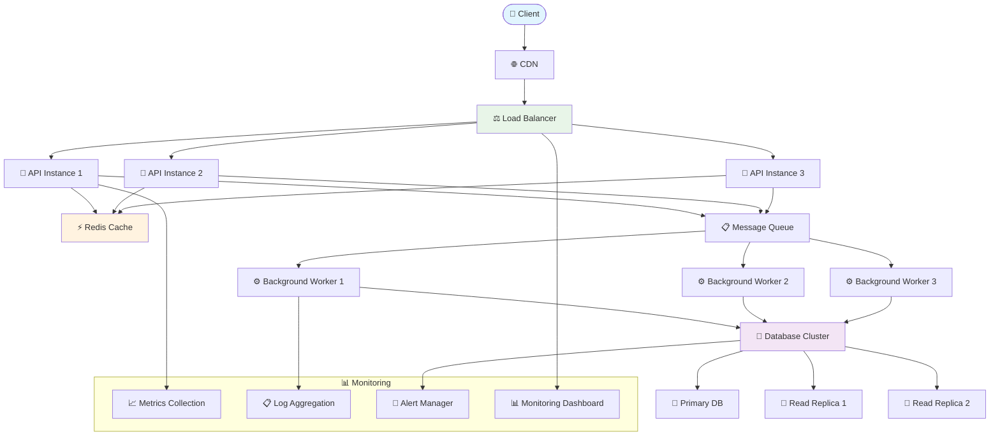
```mermaid
flowchart TD
    Client([👤 Client]) --> CDN[🌐 CDN]
    CDN --> LoadBalancer[⚖️ Load Balancer]
    
    LoadBalancer --> API1[🔌 API Instance 1]
    LoadBalancer --> API2[🔌 API Instance 2]
    LoadBalancer --> API3[🔌 API Instance 3]
    
    API1 --> Cache[⚡ Redis Cache]
    API2 --> Cache
    API3 --> Cache
    
    API1 --> Queue[📋 Message Queue]
    API2 --> Queue
    API3 --> Queue
    
    Queue --> Worker1[⚙️ Background Worker 1]
    Queue --> Worker2[⚙️ Background Worker 2]
    Queue --> Worker3[⚙️ Background Worker 3]
    
    Worker1 --> Database[💾 Database Cluster]
    Worker2 --> Database
    Worker3 --> Database
    
    Database --> Primary[💾 Primary DB]
    Database --> Replica1[💾 Read Replica 1]
    Database --> Replica2[💾 Read Replica 2]
    
    subgraph "📊 Monitoring"
        Metrics[📈 Metrics Collection]
        Logs[📋 Log Aggregation]
        Alerts[🚨 Alert Manager]
        Dashboard[📊 Monitoring Dashboard]
    end
    
    API1 --> Metrics
    Worker1 --> Logs
    Database --> Alerts
    LoadBalancer --> Dashboard
    
    style Client fill:#e1f5fe
    style LoadBalancer fill:#e8f5e8
    style Cache fill:#fff3e0
    style Database fill:#f3e5f5
```

---

## 📊 Métriques d'Intégration

### KPIs Principaux

| Intégration | Métrique | Target | Seuil Critique |
|-------------|----------|---------|----------------|
| 📧 Gmail API | Latence | < 500ms | > 2s |
| 🏛️ Greffes | Disponibilité | > 99% | < 95% |
| ✍️ DocuSign | Taux succès | > 98% | < 95% |
| 🔍 Bases juridiques | Débit | > 100 req/min | < 50 req/min |
| 🔔 Webhooks | Délai livraison | < 5s | > 30s |

### Tableau de Bord Intégrations

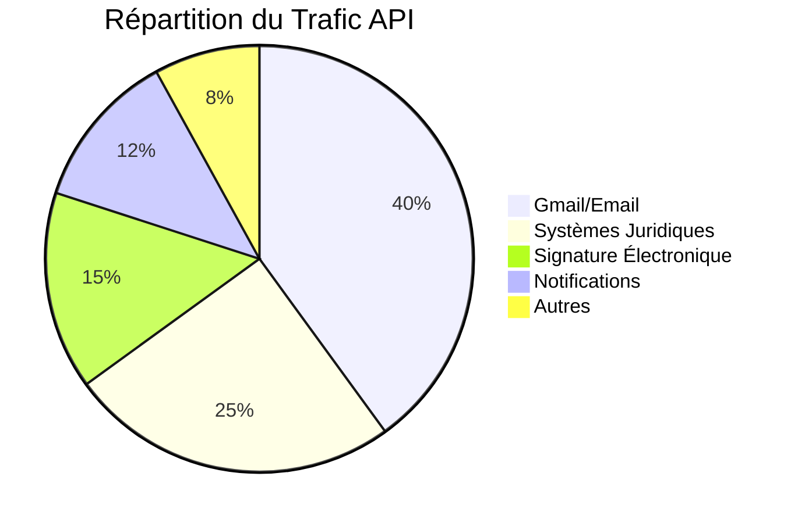
```mermaid
pie title Répartition du Trafic API
    "Gmail/Email" : 40
    "Systèmes Juridiques" : 25
    "Signature Électronique" : 15
    "Notifications" : 12
    "Autres" : 8
```

---

## 🎯 Roadmap Intégrations

### Phase 1 (Actuelle) ✅
- [x] Gmail IMAP/SMTP
- [x] Webhooks entrants/sortants
- [x] API REST complète
- [x] Monitoring de base

### Phase 2 (Q2 2024) 🚧
- [ ] Microsoft Graph (Outlook)
- [ ] DocuSign intégration
- [ ] Greffes électroniques
- [ ] Circuit breaker pattern

### Phase 3 (Q3 2024) 💡
- [ ] Bases juridiques (Légifrance, Dalloz)
- [ ] Systèmes comptables
- [ ] CRM externes
- [ ] Mobile push notifications

### Phase 4 (Q4 2024) 🚀
- [ ] IA/ML services
- [ ] Blockchain pour signatures
- [ ] IoT integrations
- [ ] Advanced analytics

---

## 📝 Conclusion

Cette architecture d'intégration de MemoLib est conçue pour être :

- ✅ **Extensible** : Facilité d'ajout de nouvelles intégrations
- ✅ **Résiliente** : Gestion robuste des erreurs et pannes
- ✅ **Sécurisée** : Sécurité par design à tous les niveaux
- ✅ **Performante** : Optimisations pour haute charge
- ✅ **Observable** : Monitoring et alerting complets
- ✅ **Maintenable** : Code modulaire et bien documenté

L'architecture actuelle supporte parfaitement les besoins des cabinets d'avocats tout en étant prête pour de futures extensions vers des écosystèmes plus larges.