# 🎯 Diagrammes des Parcours Utilisateurs - MemoLib

## 📋 Table des Matières

1. [Vue d'ensemble des Parcours](#1-vue-densemble-des-parcours)
2. [Parcours Authentification](#2-parcours-authentification)
3. [Parcours Gestion Emails](#3-parcours-gestion-emails)
4. [Parcours Gestion Dossiers](#4-parcours-gestion-dossiers)
5. [Parcours Gestion Clients](#5-parcours-gestion-clients)
6. [Parcours Recherche](#6-parcours-recherche)
7. [Parcours Notifications](#7-parcours-notifications)
8. [Parcours Analytics](#8-parcours-analytics)
9. [Parcours Formulaires Publics](#9-parcours-formulaires-publics)
10. [Parcours Erreurs & Exceptions](#10-parcours-erreurs--exceptions)

---

## 1. Vue d'ensemble des Parcours

### 1.1 Diagramme Principal des Parcours Utilisateurs

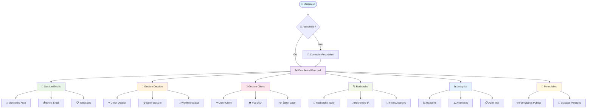

### 1.2 Matrice des Rôles et Parcours

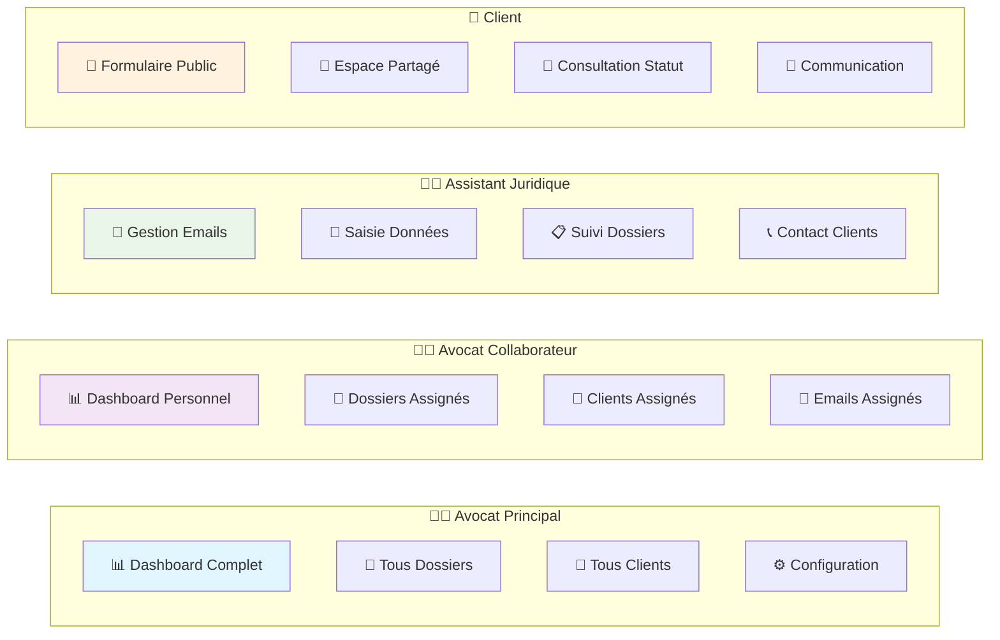

---

## 2. Parcours Authentification

### 2.1 Parcours Inscription/Connexion

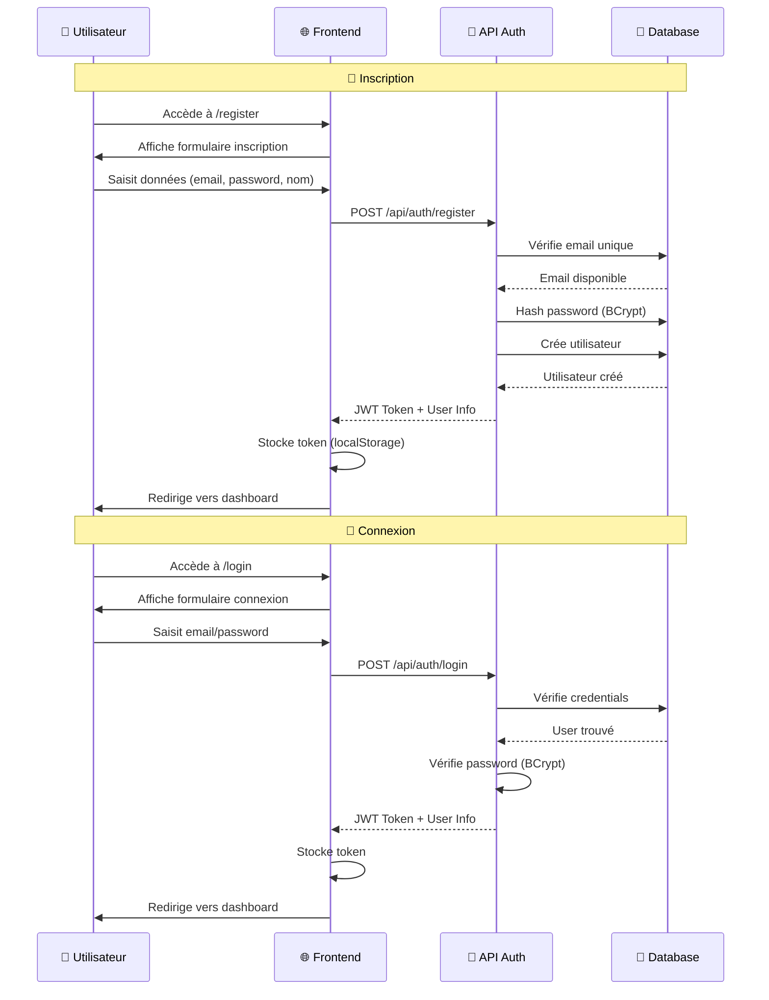

### 2.2 Gestion des Sessions

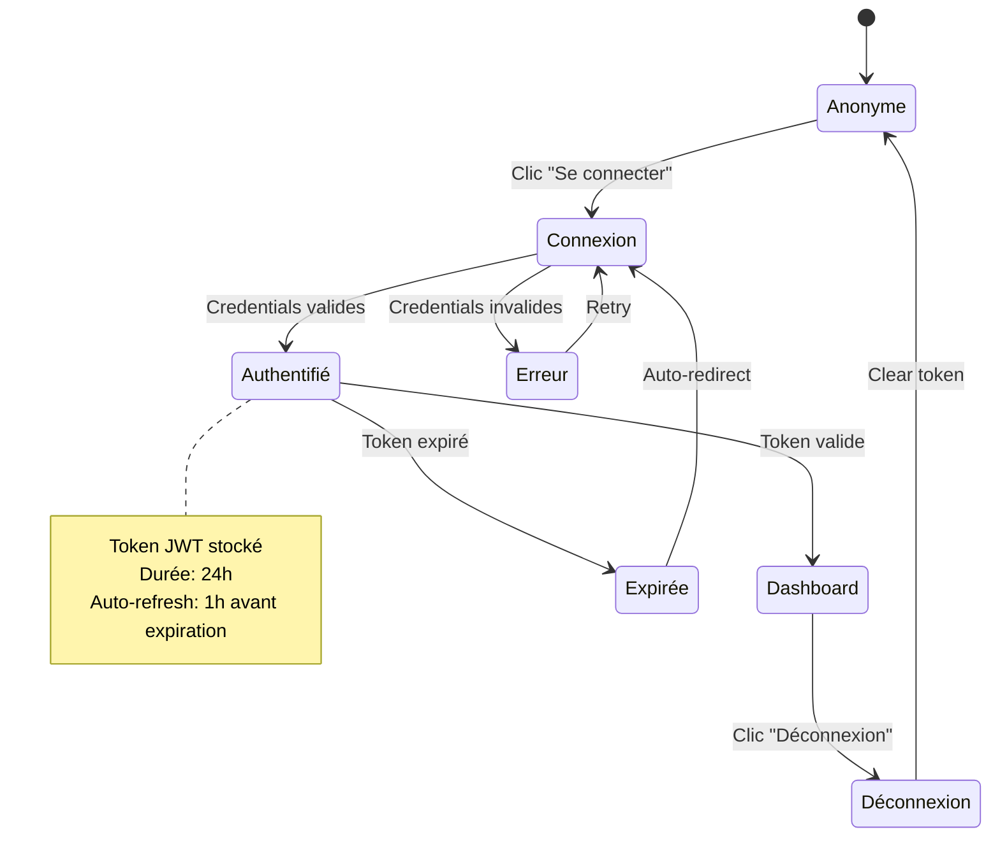

---

## 3. Parcours Gestion Emails

### 3.1 Monitoring Automatique Gmail

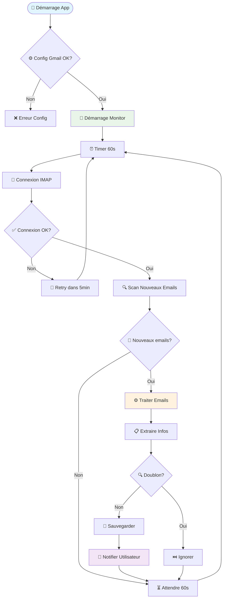

### 3.2 Parcours Envoi Email

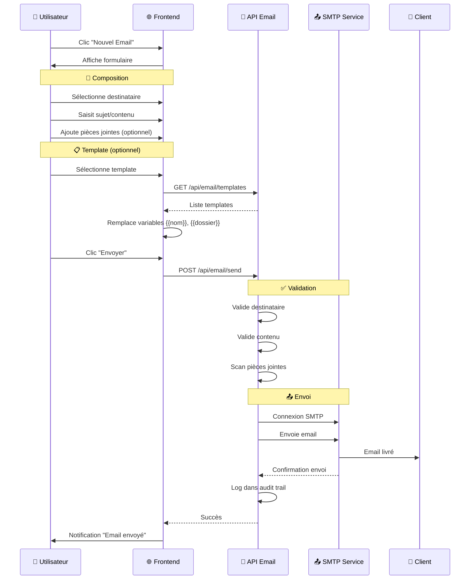

### 3.3 Gestion Templates

```mermaid
graph TB
    subgraph "📋 Gestion Templates"
        Create[➕ Créer Template]
        Edit[✏️ Éditer Template]
        Delete[🗑️ Supprimer Template]
        Use[📤 Utiliser Template]
    end
    
    subgraph "🔧 Variables Dynamiques"
        ClientVar[{{client.nom}}]
        CaseVar[{{dossier.numero}}]
        DateVar[{{date.aujourd_hui}}]
        CustomVar[{{variable.custom}}]
    end
    
    subgraph "📁 Catégories"
        Welcome[🤝 Accueil Client]
        Update[📢 Mise à jour Dossier]
        Request[📋 Demande Documents]
        Closing[✅ Clôture Dossier]
    end
    
    Create --> ClientVar
    Create --> CaseVar
    Create --> DateVar
    
    Use --> Welcome
    Use --> Update
    Use --> Request
    Use --> Closing
    
    Edit --> Preview[👁️ Aperçu Temps Réel]
    Preview --> Validate[✅ Validation]
    Validate --> Save[💾 Sauvegarder]
    
    style Create fill:#e8f5e8
    style Use fill:#fff3e0
    style Preview fill:#f3e5f5
```

---

## 4. Parcours Gestion Dossiers

### 4.1 Création de Dossier

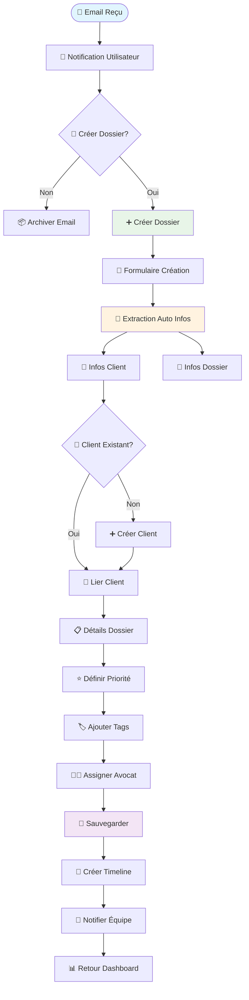

### 4.2 Workflow Statut Dossier

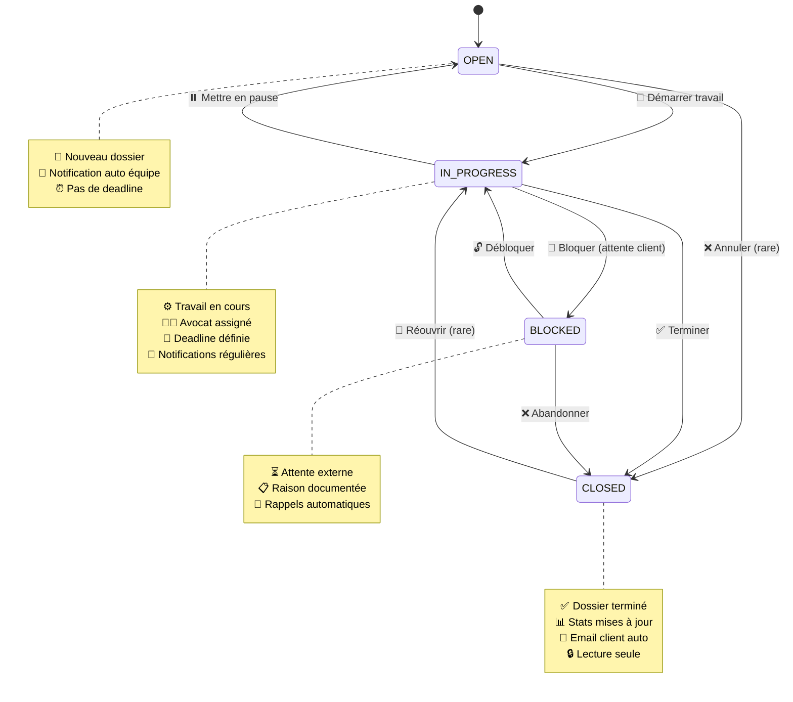

### 4.3 Gestion Priorités et Échéances

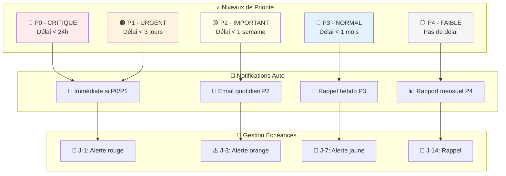

---

## 5. Parcours Gestion Clients

### 5.1 Création et Gestion Client

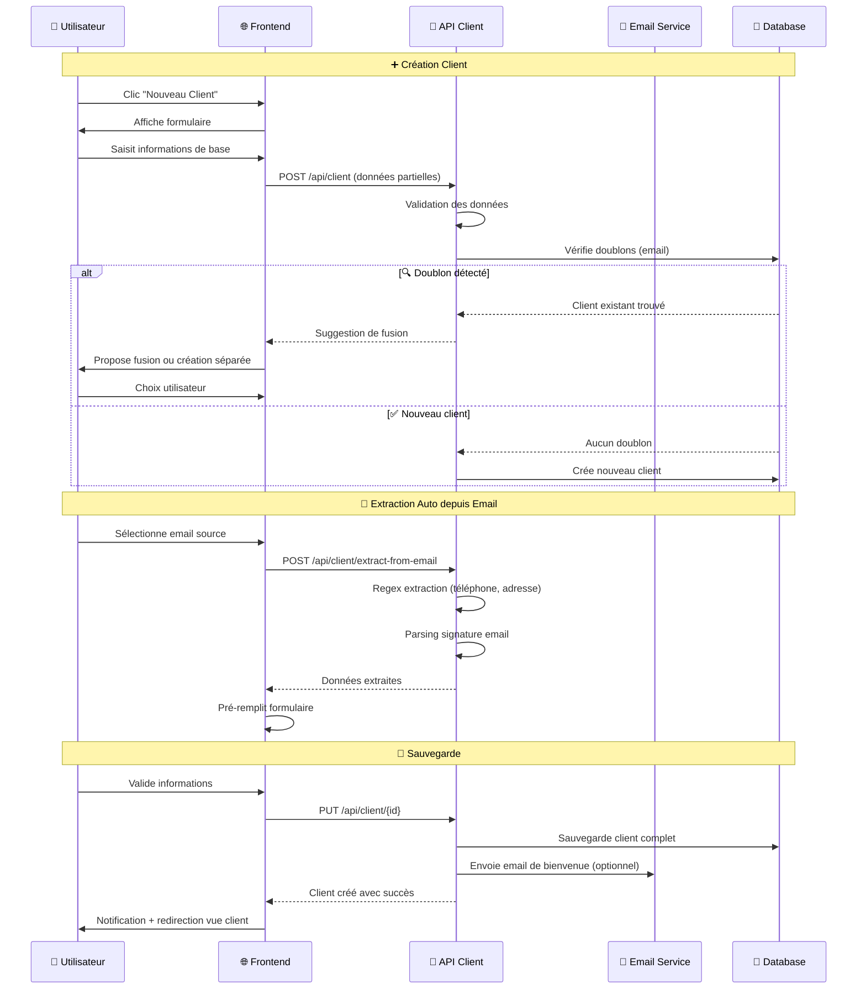

### 5.2 Vue 360° Client

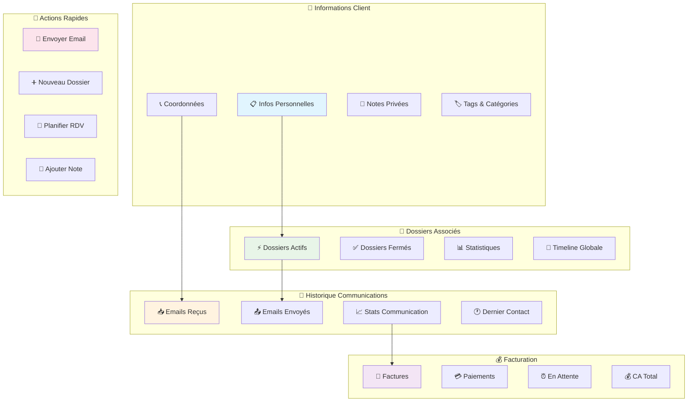

---

## 6. Parcours Recherche

### 6.1 Recherche Multi-Modale

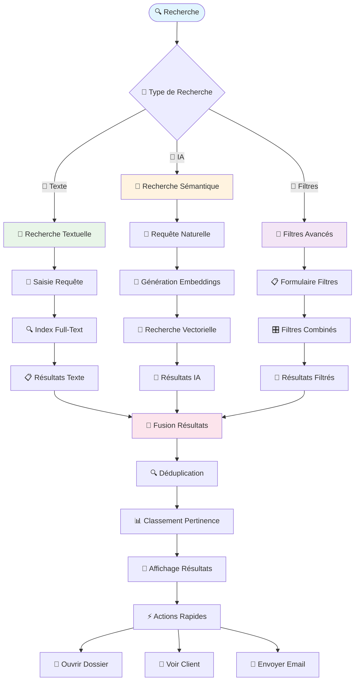

### 6.2 Filtres Avancés

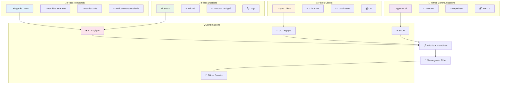

---

## 7. Parcours Notifications

### 7.1 Système de Notifications Temps Réel

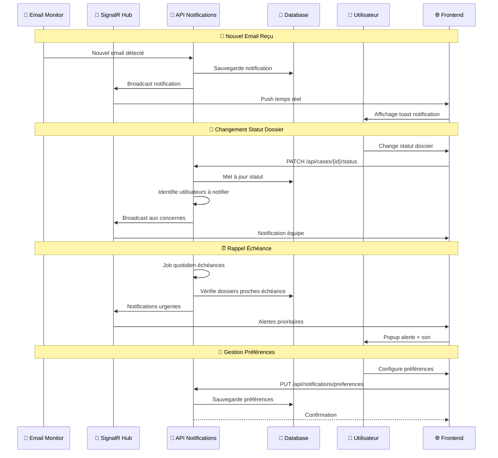

### 7.2 Types de Notifications

```mermaid
graph TB
    subgraph "📧 Notifications Email"
        NewEmail[📥 Nouvel Email]
        EmailSent[📤 Email Envoyé]
        EmailFailed[❌ Échec Envoi]
        EmailBounce[↩️ Email Rejeté]
    end
    
    subgraph "📁 Notifications Dossier"
        CaseCreated[➕ Dossier Créé]
        StatusChanged[🔄 Statut Modifié]
        PriorityChanged[⭐ Priorité Modifiée]
        DeadlineApproaching[⏰ Échéance Proche]
    end
    
    subgraph "👥 Notifications Équipe"
        CaseAssigned[👨‍💼 Dossier Assigné]
        TeamMention[💬 Mention Équipe]
        CommentAdded[💭 Commentaire Ajouté]
        TaskCompleted[✅ Tâche Terminée]
    end
    
    subgraph "🚨 Notifications Urgentes"
        CriticalDeadline[🔴 Échéance Critique]
        SystemError[⚠️ Erreur Système]
        SecurityAlert[🔒 Alerte Sécurité]
        AnomalyDetected[🔍 Anomalie Détectée]
    end
    
    subgraph "🎯 Canaux de Diffusion"
        InApp[📱 In-App (Toast)]
        Browser[🌐 Navigateur (Push)]
        Email[📧 Email]
        SMS[📱 SMS (Critique)]
    end
    
    NewEmail --> InApp
    CaseCreated --> Browser
    DeadlineApproaching --> Email
    CriticalDeadline --> SMS
    
    StatusChanged --> InApp
    TeamMention --> Browser
    SystemError --> Email
    SecurityAlert --> SMS
    
    style NewEmail fill:#e3f2fd
    style CaseCreated fill:#e8f5e8
    style TeamMention fill:#fff3e0
    style CriticalDeadline fill:#ffebee
    style InApp fill:#f3e5f5
```

---

## 8. Parcours Analytics

### 8.1 Dashboard Analytics

```mermaid
graph TB
    subgraph "📊 Métriques Principales"
        TotalCases[📁 Total Dossiers]
        ActiveCases[⚡ Dossiers Actifs]
        ClosedToday[✅ Fermés Aujourd'hui]
        AvgResolution[⏱️ Temps Résolution Moyen]
    end
    
    subgraph "📧 Statistiques Email"
        EmailsReceived[📥 Emails Reçus]
        EmailsSent[📤 Emails Envoyés]
        ResponseTime[⏰ Temps Réponse]
        EmailVolume[📈 Volume par Jour]
    end
    
    subgraph "👥 Performance Équipe"
        CasesPerLawyer[👨‍💼 Dossiers/Avocat]
        ProductivityScore[📊 Score Productivité]
        WorkloadBalance[⚖️ Équilibrage Charge]
        ClientSatisfaction[😊 Satisfaction Client]
    end
    
    subgraph "💰 Métriques Business"
        Revenue[💰 Chiffre d'Affaires]
        BillableHours[⏰ Heures Facturables]
        ClientRetention[🔄 Rétention Client]
        ProfitMargin[📈 Marge Bénéficiaire]
    end
    
    subgraph "🔍 Anomalies Détectées"
        HighVolume[📈 Volume Anormal]
        LongResponse[⏰ Réponse Tardive]
        StuckCases[🚫 Dossiers Bloqués]
        ClientComplaints[😞 Plaintes Client]
    end
    
    TotalCases --> CasesPerLawyer
    EmailsReceived --> ResponseTime
    ActiveCases --> WorkloadBalance
    Revenue --> ProfitMargin
    
    HighVolume --> Alert1[🚨 Alerte Volume]
    LongResponse --> Alert2[⚠️ Alerte Délai]
    StuckCases --> Alert3[🔔 Alerte Blocage]
    
    style TotalCases fill:#e3f2fd
    style EmailsReceived fill:#e8f5e8
    style CasesPerLawyer fill:#fff3e0
    style Revenue fill:#f3e5f5
    style HighVolume fill:#ffebee
```

### 8.2 Centre d'Anomalies

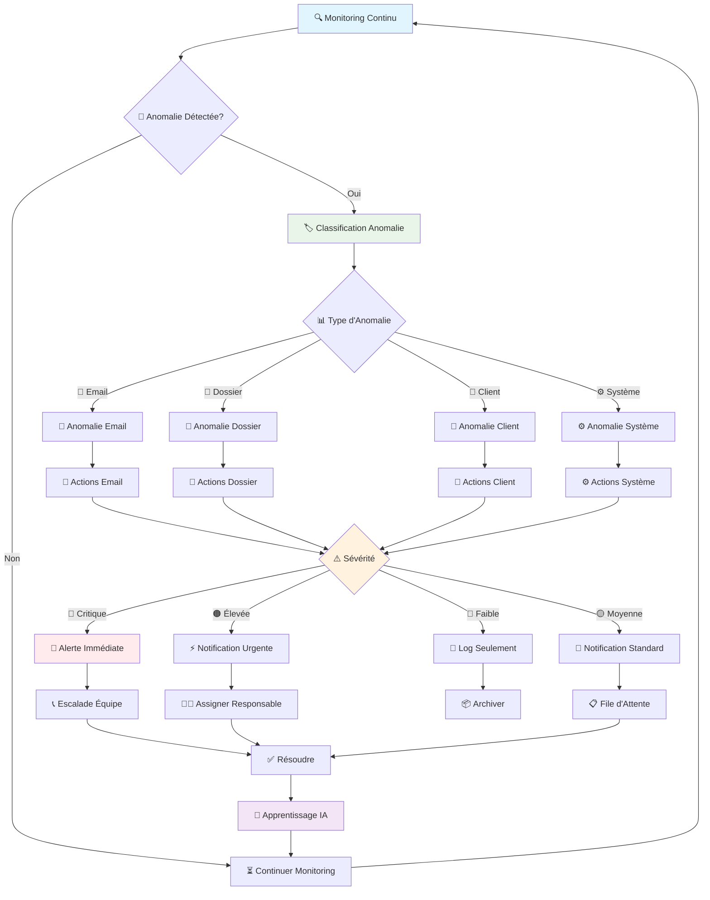

---

## 9. Parcours Formulaires Publics

### 9.1 Création et Gestion Formulaires

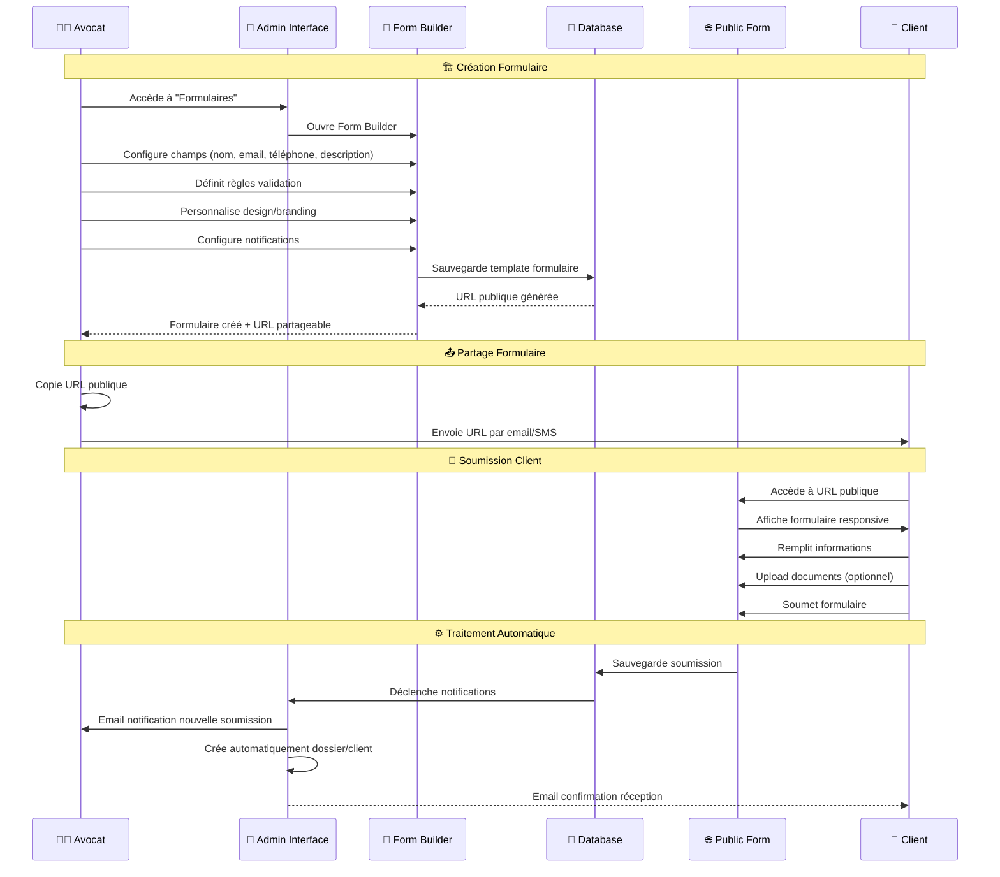

### 9.2 Espaces Partagés Multi-Participants

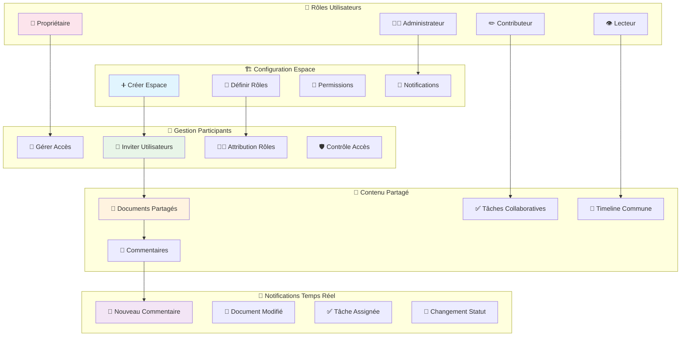

---

## 10. Parcours Erreurs & Exceptions

### 10.1 Gestion Globale des Erreurs

```mermaid
flowchart TD
    Error([❌ Erreur Détectée]) --> Type{🏷️ Type d'Erreur}
    
    Type -->|🔐 Auth| AuthError[🔐 Erreur Authentification]
    Type -->|📧 Email| EmailError[📧 Erreur Email]
    Type -->|💾 DB| DatabaseError[💾 Erreur Base de Données]
    Type -->|🌐 Network| NetworkError[🌐 Erreur Réseau]
    Type -->|📁 File| FileError[📁 Erreur Fichier]
    Type -->|⚙️ System| SystemError[⚙️ Erreur Système]
    
    AuthError --> AuthActions[🔐 Actions Auth]
    EmailError --> EmailActions[📧 Actions Email]
    DatabaseError --> DBActions[💾 Actions DB]
    NetworkError --> NetworkActions[🌐 Actions Réseau]
    FileError --> FileActions[📁 Actions Fichier]
    SystemError --> SystemActions[⚙️ Actions Système]
    
    AuthActions --> Retry1{🔄 Retry Possible?}
    EmailActions --> Retry2{🔄 Retry Possible?}
    DBActions --> Retry3{🔄 Retry Possible?}
    NetworkActions --> Retry4{🔄 Retry Possible?}
    FileActions --> Retry5{🔄 Retry Possible?}
    SystemActions --> Retry6{🔄 Retry Possible?}
    
    Retry1 -->|Oui| AutoRetry1[🔄 Retry Auto]
    Retry2 -->|Oui| AutoRetry2[🔄 Retry Auto]
    Retry3 -->|Oui| AutoRetry3[🔄 Retry Auto]
    Retry4 -->|Oui| AutoRetry4[🔄 Retry Auto]
    Retry5 -->|Oui| AutoRetry5[🔄 Retry Auto]
    Retry6 -->|Oui| AutoRetry6[🔄 Retry Auto]
    
    Retry1 -->|Non| UserNotif1[🔔 Notifier Utilisateur]
    Retry2 -->|Non| UserNotif2[🔔 Notifier Utilisateur]
    Retry3 -->|Non| UserNotif3[🔔 Notifier Utilisateur]
    Retry4 -->|Non| UserNotif4[🔔 Notifier Utilisateur]
    Retry5 -->|Non| UserNotif5[🔔 Notifier Utilisateur]
    Retry6 -->|Non| UserNotif6[🔔 Notifier Utilisateur]
    
    AutoRetry1 --> Success1{✅ Succès?}
    AutoRetry2 --> Success2{✅ Succès?}
    AutoRetry3 --> Success3{✅ Succès?}
    AutoRetry4 --> Success4{✅ Succès?}
    AutoRetry5 --> Success5{✅ Succès?}
    AutoRetry6 --> Success6{✅ Succès?}
    
    Success1 -->|Oui| Resolved[✅ Résolu]
    Success2 -->|Oui| Resolved
    Success3 -->|Oui| Resolved
    Success4 -->|Oui| Resolved
    Success5 -->|Oui| Resolved
    Success6 -->|Oui| Resolved
    
    Success1 -->|Non| UserNotif1
    Success2 -->|Non| UserNotif2
    Success3 -->|Non| UserNotif3
    Success4 -->|Non| UserNotif4
    Success5 -->|Non| UserNotif5
    Success6 -->|Non| UserNotif6
    
    UserNotif1 --> Log[📝 Log Erreur]
    UserNotif2 --> Log
    UserNotif3 --> Log
    UserNotif4 --> Log
    UserNotif5 --> Log
    UserNotif6 --> Log
    
    Log --> Escalate[📞 Escalade si Critique]
    Escalate --> Resolved
    
    style Error fill:#ffebee
    style AuthError fill:#fff3e0
    style AutoRetry1 fill:#e8f5e8
    style Resolved fill:#e1f5fe
```

### 10.2 Messages d'Erreur Utilisateur

```mermaid
graph TB
    subgraph "🔐 Erreurs Authentification"
        InvalidCreds[❌ Identifiants Invalides]
        TokenExpired[⏰ Session Expirée]
        AccessDenied[🚫 Accès Refusé]
        AccountLocked[🔒 Compte Verrouillé]
    end
    
    subgraph "📧 Erreurs Email"
        SMTPFailed[📤 Échec Envoi SMTP]
        IMAPFailed[📥 Échec Réception IMAP]
        AttachmentTooLarge[📎 Pièce Jointe Trop Volumineuse]
        InvalidEmail[📧 Email Invalide]
    end
    
    subgraph "📁 Erreurs Dossier"
        CaseNotFound[🔍 Dossier Introuvable]
        InvalidStatus[❌ Statut Invalide]
        MissingFields[📝 Champs Obligatoires]
        DuplicateCase[🔄 Dossier Dupliqué]
    end
    
    subgraph "💾 Erreurs Système"
        DatabaseDown[💾 Base de Données Indisponible]
        DiskFull[💽 Espace Disque Insuffisant]
        ServiceUnavailable[⚙️ Service Indisponible]
        NetworkTimeout[🌐 Délai Réseau Dépassé]
    end
    
    subgraph "🎨 Messages Utilisateur"
        FriendlyMsg[😊 Message Convivial]
        TechnicalDetails[🔧 Détails Techniques]
        ActionSuggestion[💡 Action Suggérée]
        ContactSupport[📞 Contacter Support]
    end
    
    InvalidCreds --> FriendlyMsg
    SMTPFailed --> TechnicalDetails
    CaseNotFound --> ActionSuggestion
    DatabaseDown --> ContactSupport
    
    FriendlyMsg --> UserAction[👤 Action Utilisateur]
    TechnicalDetails --> UserAction
    ActionSuggestion --> UserAction
    ContactSupport --> UserAction
    
    style InvalidCreds fill:#ffebee
    style SMTPFailed fill:#fff3e0
    style CaseNotFound fill:#e8f5e8
    style DatabaseDown fill:#f3e5f5
    style FriendlyMsg fill:#e1f5fe
```

---

## 📊 Métriques et KPIs des Parcours

### Métriques de Performance par Parcours

| Parcours | Métrique Clé | Objectif | Seuil Alerte |
|----------|--------------|----------|---------------|
| 🔐 Authentification | Temps de connexion | < 2s | > 5s |
| 📧 Monitoring Email | Délai de détection | < 60s | > 300s |
| 📁 Création Dossier | Temps de création | < 30s | > 120s |
| 🔍 Recherche | Temps de réponse | < 1s | > 3s |
| 🔔 Notifications | Délai de livraison | < 5s | > 30s |
| 📊 Analytics | Temps de génération | < 10s | > 60s |

### Taux de Conversion par Parcours

```mermaid
pie title Taux de Réussite des Parcours
    "Authentification" : 98
    "Création Dossier" : 95
    "Envoi Email" : 97
    "Recherche" : 99
    "Notifications" : 96
    "Analytics" : 94
```

---

## 🚀 Points d'Amélioration Identifiés

### Optimisations Prioritaires

1. **🔄 Parcours Monitoring Email**
   - Réduire la latence de détection (60s → 30s)
   - Améliorer la détection des doublons
   - Optimiser l'extraction automatique d'informations

2. **📁 Parcours Création Dossier**
   - Simplifier le formulaire de création
   - Améliorer l'auto-complétion
   - Réduire le nombre d'étapes

3. **🔍 Parcours Recherche**
   - Optimiser les performances de recherche sémantique
   - Améliorer la pertinence des résultats
   - Ajouter la recherche vocale

4. **🔔 Parcours Notifications**
   - Personnaliser les préférences utilisateur
   - Améliorer le groupement des notifications
   - Ajouter les notifications push mobiles

---

## 📝 Conclusion

Ces diagrammes couvrent l'ensemble des parcours utilisateurs de MemoLib, de l'authentification à la gestion des erreurs, en passant par toutes les fonctionnalités métier. Ils servent de référence pour :

- ✅ **Développement** : Guide d'implémentation des fonctionnalités
- ✅ **Tests** : Scénarios de test complets
- ✅ **Formation** : Support de formation utilisateurs
- ✅ **Maintenance** : Documentation technique
- ✅ **Évolution** : Base pour les futures améliorations

Chaque parcours est conçu pour être **intuitif**, **efficace** et **robuste**, avec une gestion d'erreurs complète et des notifications appropriées pour guider l'utilisateur à chaque étape.