# 📊 MemoLib - Diagrammes Visuels

## 🏗️ Architecture Globale

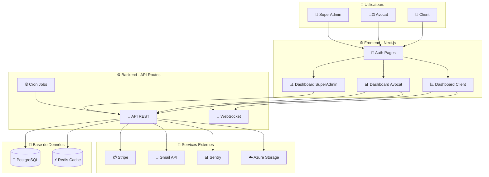

## 👥 Hiérarchie des Rôles

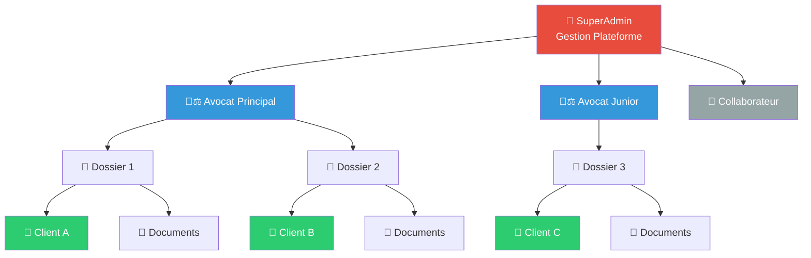

## 📋 Flux Gestion Dossier

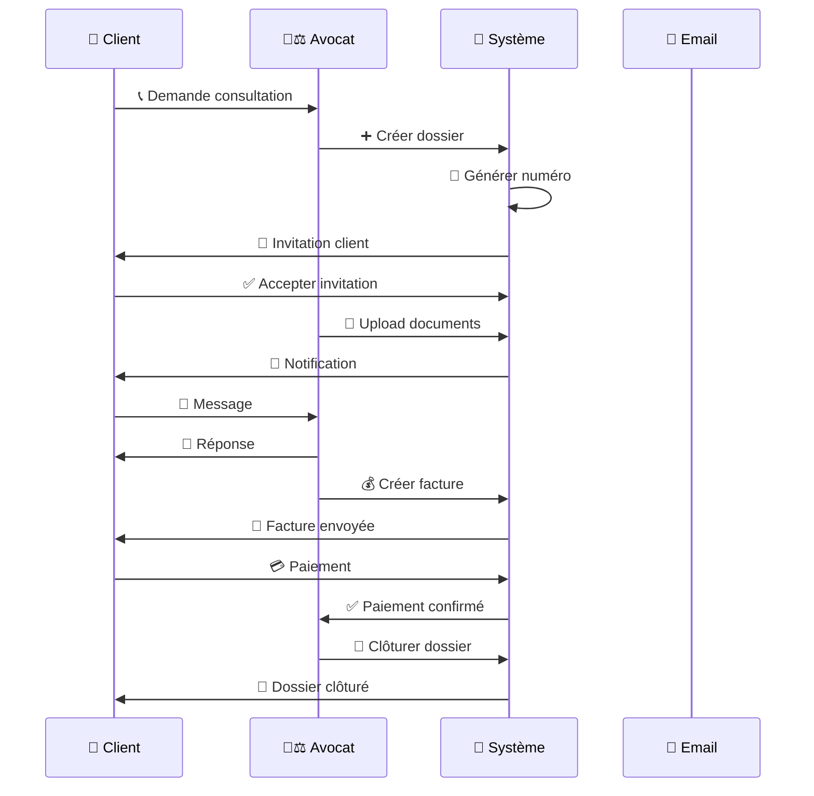

## 🗄️ Modèle de Données

```mermaid
erDiagram
    USERS ||--o{ LAWYERS : "est"
    USERS ||--o{ CLIENTS : "est"
    LAWYERS ||--o{ CASES : "gère"
    CLIENTS ||--o{ CASES : "possède"
    CASES ||--o{ DOCUMENTS : "contient"
    CASES ||--o{ MESSAGES : "contient"
    CASES ||--o{ INVOICES : "génère"
    CASES ||--o{ TASKS : "contient"
    CASES ||--o{ EVENTS : "contient"
    USERS ||--o{ MESSAGES : "envoie"
    USERS ||--o{ TASKS : "assigné"

    USERS {
        uuid id PK
        string email UK
        string password_hash
        enum role
        string full_name
        boolean 2fa_enabled
        timestamp created_at
    }

    LAWYERS {
        uuid user_id PK,FK
        string bar_number
        string specialization
        decimal hourly_rate
    }

    CLIENTS {
        uuid user_id PK,FK
        string siret
        string address
        boolean rgpd_accepted
    }

    CASES {
        uuid id PK
        string case_number UK
        uuid lawyer_id FK
        uuid client_id FK
        enum type
        enum status
        decimal amount
        date deadline
        timestamp created_at
    }

    DOCUMENTS {
        uuid id PK
        uuid case_id FK
        string title
        string file_url
        enum category
        enum visibility
        int version
    }

    MESSAGES {
        uuid id PK
        uuid case_id FK
        uuid sender_id FK
        text content
        timestamp sent_at
    }

    INVOICES {
        uuid id PK
        uuid case_id FK
        string invoice_number UK
        decimal amount
        enum status
        date due_date
    }

    TASKS {
        uuid id PK
        uuid case_id FK
        uuid assigned_to FK
        string title
        enum status
        enum priority
        date due_date
    }

    EVENTS {
        uuid id PK
        uuid case_id FK
        string title
        datetime start_date
        datetime end_date
        enum type
    }
```

## 🔄 Workflow Complet

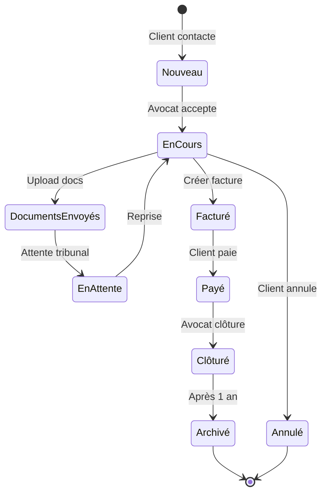

## 📱 Navigation Pages

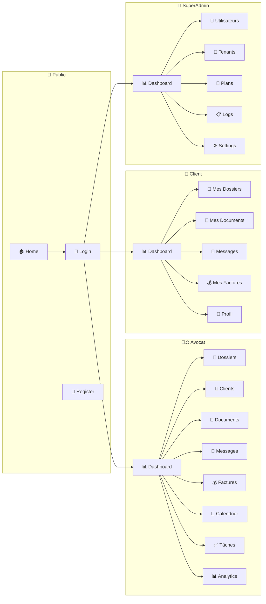

## 🔒 Sécurité & Permissions

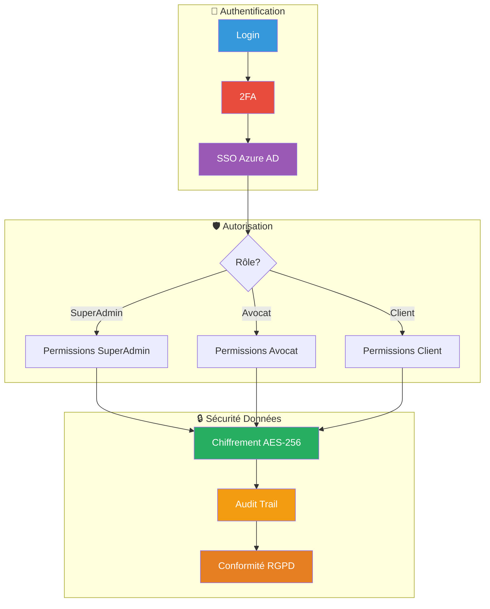

## 📊 Stack Technologique

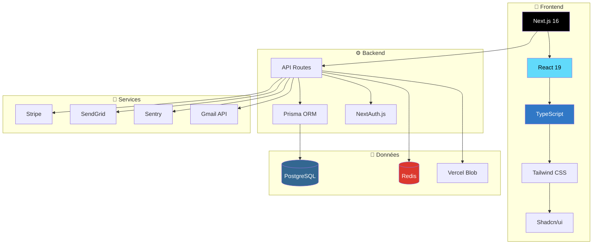

## 📈 Métriques & KPIs

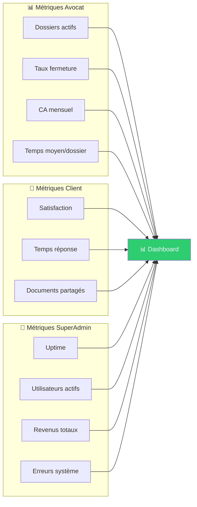

---

## 🎯 Légende

- 🦸 SuperAdmin - Gestion plateforme
- 👨⚖️ Avocat - Gestion cabinet
- 👤 Client - Consultation dossiers
- 📁 Dossier - Cas juridique
- 📄 Document - Fichier
- 💬 Message - Communication
- 💰 Facture - Paiement
- ✅ Tâche - Action à faire
- 📅 Événement - Calendrier
- 🔐 Sécurisé - Chiffré
- ⚡ Temps réel - WebSocket

## 💬 Flux Communication Temps Réel

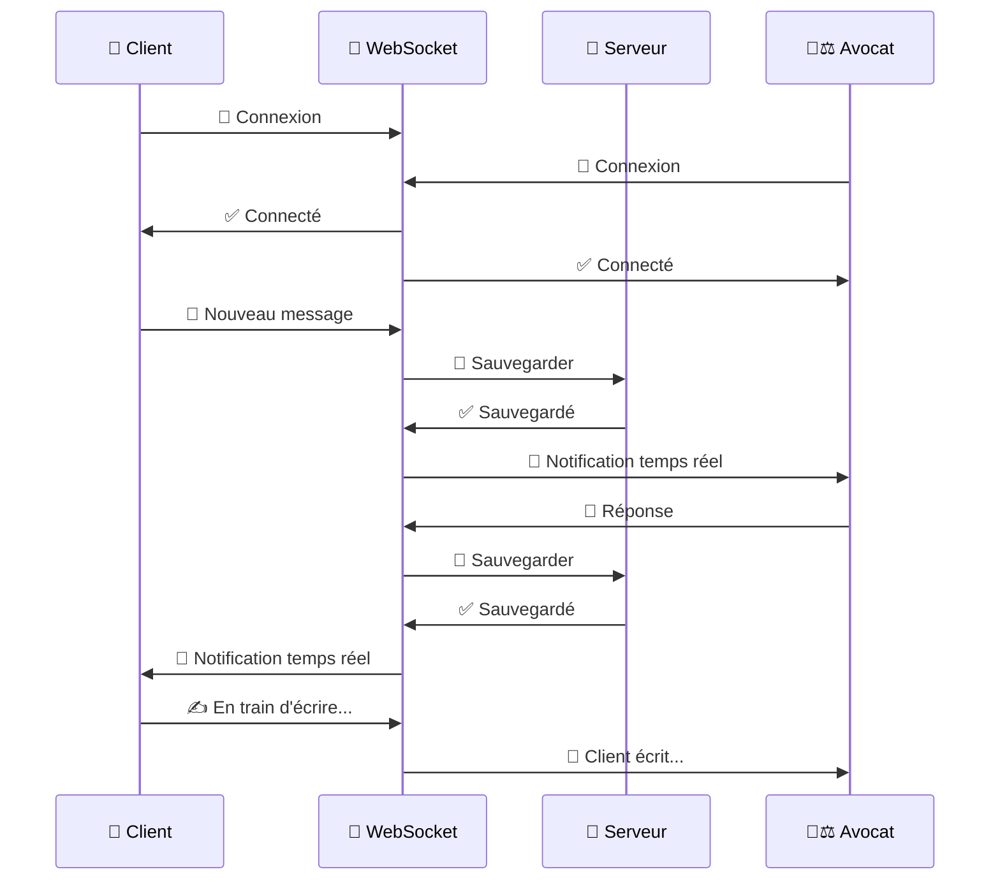

## 💳 Flux Facturation & Paiement

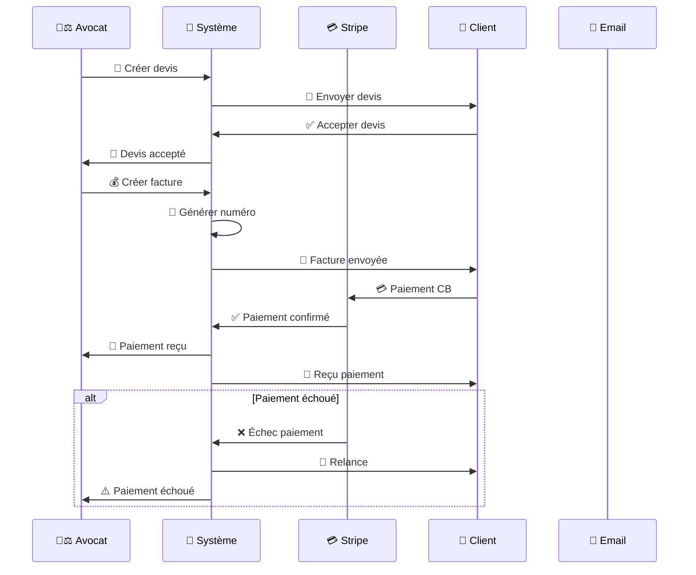

## 📄 Flux Gestion Documents

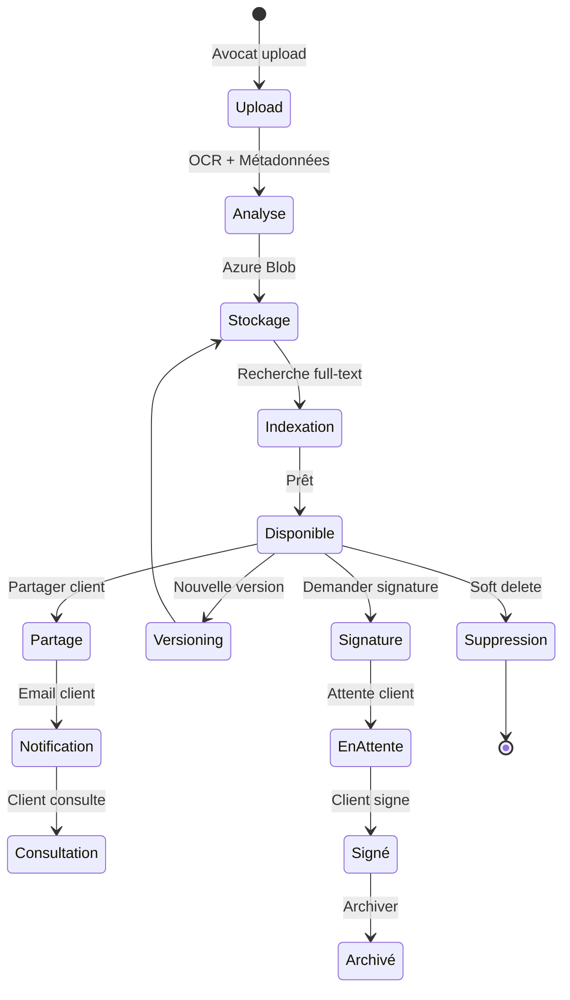

## 🔄 Cycle de Vie Dossier Complet

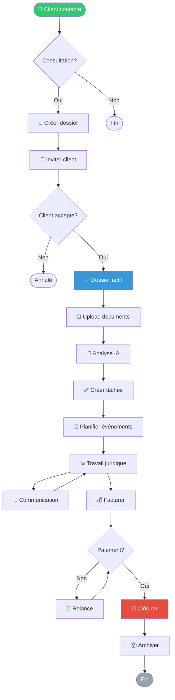

## 🔐 Architecture Sécurité Multi-Couches

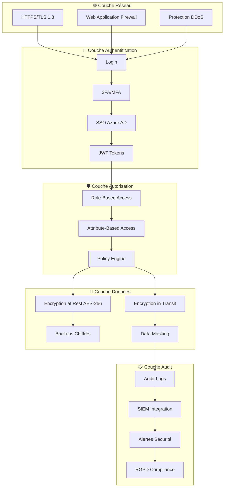

## 📊 Dashboard Analytics - Flux de Données

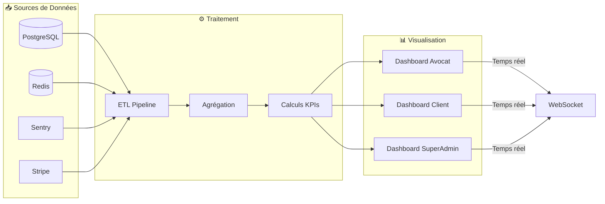

## 🔄 CI/CD Pipeline

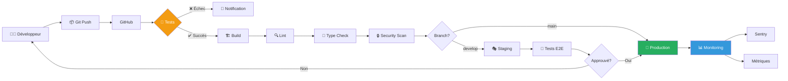

## 📱 Architecture Mobile (Future)

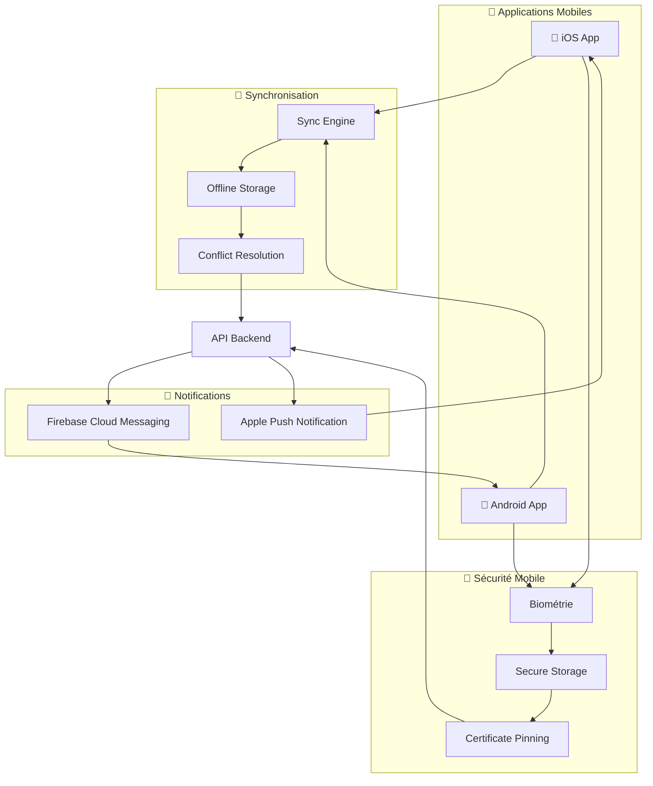

## 🎯 Roadmap Visuelle

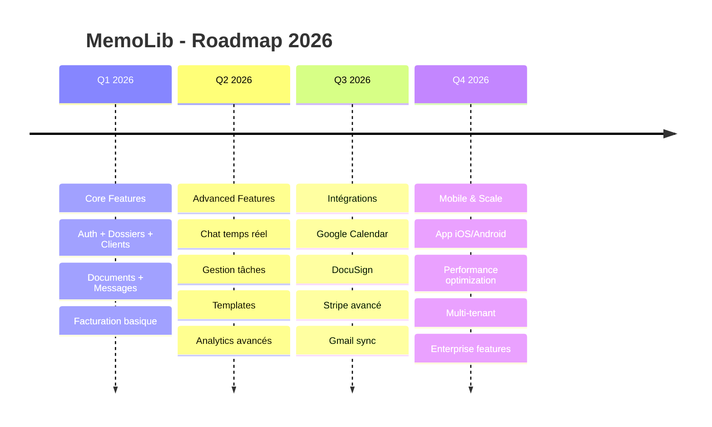
