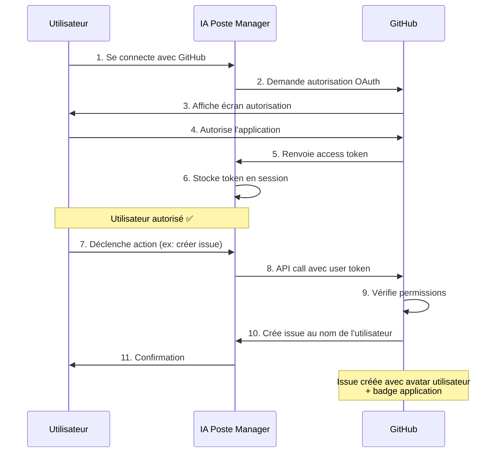

# 🔐 Authentification GitHub User-to-Server

## 📖 Vue d'Ensemble

Ce guide explique comment configurer l'authentification GitHub pour permettre à **IA Poste Manager** d'agir pour le compte des utilisateurs.

---

## 🎯 Cas d'Usage

Votre application peut effectuer des actions pour le compte d'un utilisateur :
- ✅ Créer des issues GitHub automatiquement
- ✅ Poster des commentaires sur PRs
- ✅ Créer des déploiements
- ✅ Gérer les repositories
- ✅ Synchroniser les workspaces avec GitHub Issues

---

## 🔑 Concepts Clés

### 1️⃣ Installation vs Autorisation

**Installation** (Organization/Repo level) :
- L'application a accès aux **ressources** (repos, issues, etc.)
- Configuré par l'admin de l'organisation

**Autorisation** (User level) :
- L'utilisateur autorise l'application à **agir en son nom**
- Chaque utilisateur doit autoriser individuellement

### 2️⃣ Types de Tokens

| Type | Usage | Limitations |
|------|-------|-------------|
| **Installation Token** | Actions de l'app | Attribué à l'app |
| **User Access Token** | Actions utilisateur | Attribué à l'utilisateur + badge app |

### 3️⃣ Limitations de Sécurité

L'application peut accéder uniquement aux ressources où :
- ✅ L'utilisateur a accès
- ✅ L'application a les permissions
- ✅ L'application est installée

---

## ⚙️ Configuration

### Étape 1 : GitHub App Settings

1. **Aller sur** : https://github.com/settings/apps/[your-app-name]

2. **User Permissions** (à activer) :
   ```
   ☑️ Issues: Read & Write
   ☑️ Pull Requests: Read & Write
   ☑️ Contents: Read & Write
   ☑️ Deployments: Read & Write
   ☑️ Metadata: Read
   ```

3. **Callback URL** :
   ```
   http://localhost:3000/api/auth/callback/github
   Production: https://your-domain.com/api/auth/callback/github
   ```

4. **Request user authorization (OAuth) during installation** :
   ```
   ☑️ Activé
   ```

### Étape 2 : Variables d'Environnement

Copier `.env.local.example` → `.env.local` et configurer :

```env
# GitHub App (Installation)
GITHUB_APP_ID=2594935
GITHUB_APP_PRIVATE_KEY_PATH=./github-app-key.pem
GITHUB_WEBHOOK_SECRET=your-webhook-secret

# GitHub OAuth (User Authorization)
GITHUB_CLIENT_ID=Iv23liQZx66Gmczb3xSp
GITHUB_CLIENT_SECRET=your-client-secret
GITHUB_CALLBACK_URL=http://localhost:3000/api/auth/callback/github
```

### Étape 3 : Clé Privée

1. **Générer la clé** : https://github.com/settings/apps/[your-app-name]
   - Scroll to "Private keys"
   - Click "Generate a private key"

2. **Sauvegarder** : `github-app-key.pem` à la racine du projet

3. **Ajouter au .gitignore** :
   ```
   github-app-key.pem
   ```

---

## 💻 Implémentation

### 1️⃣ Configuration NextAuth

```typescript
// src/app/api/auth/[...nextauth]/route.ts
import GitHubProvider from "next-auth/providers/github";

export const authOptions = {
  providers: [
    GitHubProvider({
      clientId: process.env.GITHUB_CLIENT_ID!,
      clientSecret: process.env.GITHUB_CLIENT_SECRET!,
      authorization: {
        params: {
          // Demander les scopes nécessaires
          scope: 'read:user user:email repo write:issues',
        },
      },
    }),
    // ... autres providers
  ],
  callbacks: {
    async jwt({ token, account }) {
      // Sauvegarder le token GitHub
      if (account?.provider === "github") {
        token.githubAccessToken = account.access_token;
        token.githubRefreshToken = account.refresh_token;
      }
      return token;
    },
    async session({ session, token }) {
      // Rendre le token disponible côté client
      session.githubAccessToken = token.githubAccessToken;
      return session;
    },
  },
};
```

### 2️⃣ Générer User Access Token

```typescript
// src/lib/github/user-client.ts
import { getServerSession } from "next-auth";
import { Octokit } from "@octokit/rest";

export async function getUserGitHubClient() {
  const session = await getServerSession();
  
  if (!session?.githubAccessToken) {
    throw new Error("User not authenticated with GitHub");
  }

  return new Octokit({
    auth: session.githubAccessToken,
  });
}
```

### 3️⃣ Actions Pour le Compte de l'Utilisateur

```typescript
// src/lib/github/actions.ts
import { getUserGitHubClient } from "./user-client";

/**
 * Créer une issue pour le compte de l'utilisateur
 */
export async function createIssueAsUser(
  repo: string,
  title: string,
  body: string
) {
  const octokit = await getUserGitHubClient();
  
  const [owner, repoName] = repo.split('/');
  
  const { data } = await octokit.issues.create({
    owner,
    repo: repoName,
    title,
    body,
  });
  
  return data;
}

/**
 * Poster un commentaire pour le compte de l'utilisateur
 */
export async function commentAsUser(
  repo: string,
  issueNumber: number,
  comment: string
) {
  const octokit = await getUserGitHubClient();
  
  const [owner, repoName] = repo.split('/');
  
  const { data } = await octokit.issues.createComment({
    owner,
    repo: repoName,
    issue_number: issueNumber,
    body: comment,
  });
  
  return data;
}

/**
 * Créer un déploiement pour le compte de l'utilisateur
 */
export async function createDeploymentAsUser(
  repo: string,
  ref: string,
  environment: string
) {
  const octokit = await getUserGitHubClient();
  
  const [owner, repoName] = repo.split('/');
  
  const { data } = await octokit.repos.createDeployment({
    owner,
    repo: repoName,
    ref,
    environment,
    auto_merge: false,
  });
  
  return data;
}
```

### 4️⃣ API Route Exemple

```typescript
// src/app/api/github/create-issue/route.ts
import { NextRequest, NextResponse } from 'next/server';
import { createIssueAsUser } from '@/lib/github/actions';
import { getServerSession } from 'next-auth';

export async function POST(req: NextRequest) {
  try {
    const session = await getServerSession();
    
    if (!session) {
      return NextResponse.json(
        { error: 'Unauthorized' },
        { status: 401 }
      );
    }

    const { repo, title, body } = await req.json();

    // Créer l'issue pour le compte de l'utilisateur
    const issue = await createIssueAsUser(repo, title, body);

    return NextResponse.json({
      success: true,
      issue: {
        number: issue.number,
        url: issue.html_url,
        // L'auteur sera l'utilisateur avec le badge app
      },
    });
  } catch (error) {
    console.error('GitHub issue creation error:', error);
    return NextResponse.json(
      { error: 'Failed to create issue' },
      { status: 500 }
    );
  }
}
```

---

## 🔄 Workflow Complet



---

## 🎨 UI - Bouton de Connexion

```tsx
// src/components/GitHubAuthButton.tsx
'use client';

import { signIn, signOut, useSession } from 'next-auth/react';
import { Github } from 'lucide-react';

export function GitHubAuthButton() {
  const { data: session } = useSession();

  if (session?.githubAccessToken) {
    return (
      <button
        onClick={() => signOut()}
        className="flex items-center gap-2 px-4 py-2 bg-gray-800 text-white rounded-lg"
      >
        <Github className="w-5 h-5" />
        Déconnecter GitHub
      </button>
    );
  }

  return (
    <button
      onClick={() => signIn('github')}
      className="flex items-center gap-2 px-4 py-2 bg-gray-800 text-white rounded-lg hover:bg-gray-700"
    >
      <Github className="w-5 h-5" />
      Connecter GitHub
    </button>
  );
}
```

---

## 🔒 Sécurité & Bonnes Pratiques

### ✅ À Faire

- **Demander uniquement les scopes nécessaires**
- **Vérifier les permissions avant chaque action**
- **Logger toutes les actions utilisateur**
- **Implémenter rate limiting**
- **Gérer l'expiration des tokens**

### ❌ À Éviter

- ❌ Stocker les tokens en clair
- ❌ Partager les tokens entre utilisateurs
- ❌ Demander plus de permissions que nécessaire
- ❌ Ignorer les erreurs d'autorisation

### 🔐 Gestion des Tokens

```typescript
// Refresh token si expiré
async function refreshGitHubToken(refreshToken: string) {
  const response = await fetch('https://github.com/login/oauth/access_token', {
    method: 'POST',
    headers: {
      'Content-Type': 'application/json',
      Accept: 'application/json',
    },
    body: JSON.stringify({
      client_id: process.env.GITHUB_CLIENT_ID,
      client_secret: process.env.GITHUB_CLIENT_SECRET,
      grant_type: 'refresh_token',
      refresh_token: refreshToken,
    }),
  });

  return response.json();
}
```

---

## 📊 Audit & Logs

Toutes les actions sont tracées automatiquement :

```typescript
// src/lib/github/audit.ts
import { logger } from '@/lib/logger';

export function logGitHubAction(
  userId: string,
  action: string,
  details: Record<string, any>
) {
  logger.audit(
    `GitHub Action: ${action}`,
    userId,
    'system', // tenantId
    {
      provider: 'github',
      actionType: action,
      programmaticAccessType: 'GitHub App user-to-server token',
      ...details,
    }
  );
}
```

**Dans les logs GitHub** :
- ✅ Acteur : Utilisateur
- ✅ Type d'accès : `GitHub App user-to-server token`

---

## 🧪 Tests

```typescript
// __tests__/lib/github/actions.test.ts
import { createIssueAsUser } from '@/lib/github/actions';

describe('GitHub User Actions', () => {
  it('should create issue as user', async () => {
    const issue = await createIssueAsUser(
      'mobby57/iapostemanager',
      'Test Issue',
      'Created by IA Poste Manager'
    );

    expect(issue.number).toBeDefined();
    expect(issue.user.login).toBe('test-user'); // Utilisateur, pas l'app
  });
});
```

---

## 🚀 Intégration avec IA Poste Manager

### Cas d'Usage Métier

1️⃣ **Synchronisation Dossiers → GitHub Issues**
```typescript
// Créer une issue GitHub pour chaque nouveau dossier
const dossier = await createDossier({ ... });

if (user.githubConnected) {
  await createIssueAsUser(
    user.githubRepo,
    `[DOSSIER] ${dossier.numero} - ${dossier.client}`,
    `Type: ${dossier.typeDossier}\nStatut: ${dossier.statut}\nPriorité: ${dossier.priorite}`
  );
}
```

2️⃣ **Commentaires Automatiques**
```typescript
// Poster un commentaire quand le statut change
await commentAsUser(
  repo,
  issueNumber,
  `📋 **Mise à jour**: Statut changé → ${newStatus}\n\nGénéré par IA Poste Manager`
);
```

3️⃣ **Déploiements Automatiques**
```typescript
// Déployer quand un dossier est terminé
await createDeploymentAsUser(
  repo,
  'main',
  'production'
);
```

---

## ❓ FAQ

**Q: Différence entre App token et User token ?**
> App token → Actions attribuées à l'app
> User token → Actions attribuées à l'utilisateur (avec badge app)

**Q: Que se passe-t-il si l'utilisateur révoque l'autorisation ?**
> Les actions futures échoueront. Redemander l'autorisation.

**Q: L'application doit-elle être installée ET autorisée ?**
> Oui. Installation = accès ressources. Autorisation = agir pour l'utilisateur.

**Q: Compatibilité avec SAML SSO ?**
> L'utilisateur doit démarrer une session SAML active avant de réautoriser.

---

## 📚 Ressources

- [GitHub Apps Documentation](https://docs.github.com/en/apps)
- [User-to-Server Authentication](https://docs.github.com/en/apps/creating-github-apps/authenticating-with-a-github-app/authenticating-as-a-github-app-user)
- [GitHub OAuth Scopes](https://docs.github.com/en/apps/oauth-apps/building-oauth-apps/scopes-for-oauth-apps)
- [Octokit.js](https://github.com/octokit/octokit.js)

---

**✅ Configuration terminée !** Votre application peut maintenant agir pour le compte des utilisateurs. 🎉
