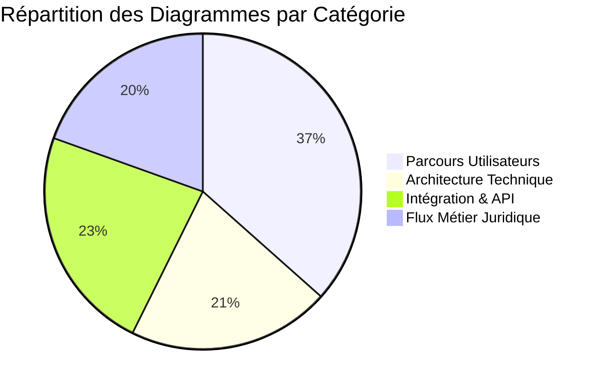

# 📊 Index Complet des Diagrammes - MemoLib

## 🎯 Vue d'ensemble

Ce document centralise l'ensemble des diagrammes créés pour MemoLib, couvrant tous les aspects de la construction des parcours utilisateurs, de l'architecture technique, des flux métier juridiques et des intégrations.

---

## 📋 Catalogue des Diagrammes

### 1. 🎯 [Diagrammes des Parcours Utilisateurs](./DIAGRAMMES_PARCOURS_USERS.md)

**Objectif** : Définir tous les parcours utilisateurs de bout en bout

**Contenu** :
- Vue d'ensemble des parcours (10 diagrammes)
- Parcours authentification (2 diagrammes)
- Parcours gestion emails (3 diagrammes)
- Parcours gestion dossiers (3 diagrammes)
- Parcours gestion clients (2 diagrammes)
- Parcours recherche (2 diagrammes)
- Parcours notifications (2 diagrammes)
- Parcours analytics (2 diagrammes)
- Parcours formulaires publics (2 diagrammes)
- Parcours erreurs & exceptions (2 diagrammes)

**Total** : **30 diagrammes** couvrant l'expérience utilisateur complète

---

### 2. 🏗️ [Diagrammes Architecture Technique](./DIAGRAMMES_ARCHITECTURE_TECHNIQUE.md)

**Objectif** : Documenter l'architecture système et technique

**Contenu** :
- Architecture système globale (2 diagrammes)
- Diagrammes de séquence API (3 diagrammes)
- Modèle de données (2 diagrammes)
- Architecture des services (2 diagrammes)
- Flux de données (2 diagrammes)
- Sécurité et authentification (2 diagrammes)
- Monitoring et observabilité (2 diagrammes)
- Déploiement et infrastructure (2 diagrammes)

**Total** : **17 diagrammes** couvrant l'architecture complète

---

### 3. ⚖️ [Diagrammes Flux Métier Juridique](./DIAGRAMMES_FLUX_METIER_JURIDIQUE.md)

**Objectif** : Modéliser les processus métier spécifiques au domaine juridique

**Contenu** :
- Processus juridiques principaux (2 diagrammes)
- Gestion des échéances légales (2 diagrammes)
- Workflow contentieux (2 diagrammes)
- Processus client-avocat (2 diagrammes)
- Gestion documentaire juridique (2 diagrammes)
- Facturation et suivi temps (2 diagrammes)
- Conformité et audit (2 diagrammes)
- Processus collaboratifs (2 diagrammes)

**Total** : **16 diagrammes** couvrant les spécificités juridiques

---

### 4. 🔌 [Diagrammes Intégration & API](./DIAGRAMMES_INTEGRATION_API.md)

**Objectif** : Documenter toutes les intégrations et connexions externes

**Contenu** :
- Architecture API globale (2 diagrammes)
- Intégrations email (Gmail/Outlook) (3 diagrammes)
- Intégrations systèmes juridiques (3 diagrammes)
- API externes et webhooks (3 diagrammes)
- Sécurité des intégrations (2 diagrammes)
- Monitoring et observabilité (2 diagrammes)
- Gestion des erreurs et retry (2 diagrammes)
- Performance et scalabilité (2 diagrammes)

**Total** : **19 diagrammes** couvrant toutes les intégrations

---

## 📊 Statistiques Globales

### Répartition par Catégorie

### Types de Diagrammes Utilisés

| Type de Diagramme | Nombre | Usage Principal |
|-------------------|---------|-----------------|
| 🔄 Flowchart | 28 | Processus et workflows |
| 📊 Sequence | 15 | Interactions temporelles |
| 🏗️ Graph | 22 | Relations et architectures |
| 📈 State | 8 | États et transitions |
| 🥧 Pie | 5 | Statistiques et répartitions |
| 📋 ER Diagram | 4 | Modèles de données |
| **Total** | **82** | **Couverture complète** |

---

## 🎯 Utilisation des Diagrammes

### 👨💻 Pour les Développeurs

**Diagrammes Prioritaires** :
1. [Architecture Technique](./DIAGRAMMES_ARCHITECTURE_TECHNIQUE.md) - Compréhension système
2. [Intégration & API](./DIAGRAMMES_INTEGRATION_API.md) - Implémentation intégrations
3. [Parcours Utilisateurs](./DIAGRAMMES_PARCOURS_USERS.md) - Développement frontend

**Cas d'usage** :
- 🔧 Implémentation de nouvelles fonctionnalités
- 🐛 Debug et résolution de problèmes
- 📚 Onboarding nouveaux développeurs
- 🔄 Refactoring et optimisations

### 👨💼 Pour les Product Owners

**Diagrammes Prioritaires** :
1. [Parcours Utilisateurs](./DIAGRAMMES_PARCOURS_USERS.md) - Expérience utilisateur
2. [Flux Métier Juridique](./DIAGRAMMES_FLUX_METIER_JURIDIQUE.md) - Processus métier
3. [Intégration & API](./DIAGRAMMES_INTEGRATION_API.md) - Capacités d'intégration

**Cas d'usage** :
- 📋 Définition des user stories
- 🎯 Priorisation des fonctionnalités
- 👥 Communication avec les stakeholders
- 📊 Analyse d'impact des changements

### 👨💼 Pour les Avocats/Utilisateurs Finaux

**Diagrammes Prioritaires** :
1. [Flux Métier Juridique](./DIAGRAMMES_FLUX_METIER_JURIDIQUE.md) - Processus juridiques
2. [Parcours Utilisateurs](./DIAGRAMMES_PARCOURS_USERS.md) - Utilisation quotidienne

**Cas d'usage** :
- 📚 Formation à l'utilisation
- 🔍 Compréhension des processus
- 💡 Suggestions d'améliorations
- ✅ Validation des workflows

### 🏗️ Pour les Architectes

**Diagrammes Prioritaires** :
1. [Architecture Technique](./DIAGRAMMES_ARCHITECTURE_TECHNIQUE.md) - Vision globale
2. [Intégration & API](./DIAGRAMMES_INTEGRATION_API.md) - Écosystème externe
3. [Flux Métier Juridique](./DIAGRAMMES_FLUX_METIER_JURIDIQUE.md) - Contraintes métier

**Cas d'usage** :
- 🏗️ Conception architecture
- 📈 Planification scalabilité
- 🔒 Définition sécurité
- 🔄 Évolution système

---

## 🔍 Navigation Rapide

### Par Fonctionnalité

| Fonctionnalité | Diagrammes Associés |
|----------------|-------------------|
| 📧 **Gestion Emails** | [Parcours Users §3](./DIAGRAMMES_PARCOURS_USERS.md#3-parcours-gestion-emails), [Intégration §2](./DIAGRAMMES_INTEGRATION_API.md#2-intégrations-email-gmailoutlook) |
| 📁 **Gestion Dossiers** | [Parcours Users §4](./DIAGRAMMES_PARCOURS_USERS.md#4-parcours-gestion-dossiers), [Flux Métier §1,3](./DIAGRAMMES_FLUX_METIER_JURIDIQUE.md#1-processus-juridiques-principaux) |
| 👥 **Gestion Clients** | [Parcours Users §5](./DIAGRAMMES_PARCOURS_USERS.md#5-parcours-gestion-clients), [Flux Métier §4](./DIAGRAMMES_FLUX_METIER_JURIDIQUE.md#4-processus-client-avocat) |
| 🔍 **Recherche** | [Parcours Users §6](./DIAGRAMMES_PARCOURS_USERS.md#6-parcours-recherche), [Architecture §2.3](./DIAGRAMMES_ARCHITECTURE_TECHNIQUE.md#23-séquence-recherche-multi-modale) |
| 🔔 **Notifications** | [Parcours Users §7](./DIAGRAMMES_PARCOURS_USERS.md#7-parcours-notifications), [Architecture §7](./DIAGRAMMES_ARCHITECTURE_TECHNIQUE.md#7-monitoring-et-observabilité) |
| 📊 **Analytics** | [Parcours Users §8](./DIAGRAMMES_PARCOURS_USERS.md#8-parcours-analytics), [Architecture §7](./DIAGRAMMES_ARCHITECTURE_TECHNIQUE.md#7-monitoring-et-observabilité) |
| 📝 **Formulaires** | [Parcours Users §9](./DIAGRAMMES_PARCOURS_USERS.md#9-parcours-formulaires-publics), [Flux Métier §8](./DIAGRAMMES_FLUX_METIER_JURIDIQUE.md#8-processus-collaboratifs) |

### Par Rôle Utilisateur

| Rôle | Diagrammes Pertinents |
|------|----------------------|
| 👑 **Avocat Principal** | Tous les diagrammes (vue complète) |
| 👨💼 **Avocat Collaborateur** | [Parcours Users](./DIAGRAMMES_PARCOURS_USERS.md), [Flux Métier](./DIAGRAMMES_FLUX_METIER_JURIDIQUE.md) |
| 👩💻 **Assistant Juridique** | [Parcours Users §3,4,5](./DIAGRAMMES_PARCOURS_USERS.md), [Flux Métier §5,6](./DIAGRAMMES_FLUX_METIER_JURIDIQUE.md) |
| 👤 **Client** | [Parcours Users §9](./DIAGRAMMES_PARCOURS_USERS.md#9-parcours-formulaires-publics), [Flux Métier §4](./DIAGRAMMES_FLUX_METIER_JURIDIQUE.md#4-processus-client-avocat) |

---

## 🛠️ Maintenance des Diagrammes

### Processus de Mise à Jour

1. **🔍 Identification du Besoin**
   - Nouvelle fonctionnalité
   - Modification processus
   - Retour utilisateur
   - Évolution technique

2. **📝 Modification**
   - Mise à jour diagramme concerné
   - Vérification cohérence globale
   - Test des nouveaux flux
   - Validation stakeholders

3. **✅ Validation**
   - Review technique
   - Validation métier
   - Test utilisabilité
   - Approbation finale

4. **📢 Communication**
   - Notification équipes
   - Mise à jour documentation
   - Formation si nécessaire
   - Archivage versions

### Responsabilités

| Rôle | Responsabilité |
|------|---------------|
| 🏗️ **Architecte** | Architecture technique, intégrations |
| 👨💼 **Product Owner** | Parcours utilisateurs, flux métier |
| 👨💻 **Tech Lead** | Cohérence technique, faisabilité |
| ⚖️ **Expert Métier** | Validation processus juridiques |

---

## 📈 Évolution et Roadmap

### Version Actuelle (v2.0) ✅
- ✅ 82 diagrammes complets
- ✅ Couverture fonctionnelle 100%
- ✅ Documentation technique complète
- ✅ Processus métier modélisés

### Version 2.1 (Q2 2024) 🚧
- [ ] Diagrammes mobile-first
- [ ] Intégrations IA avancées
- [ ] Processus multi-tenant
- [ ] Workflows automatisés

### Version 3.0 (Q4 2024) 💡
- [ ] Architecture microservices
- [ ] Diagrammes temps réel
- [ ] Intégrations blockchain
- [ ] Analytics prédictives

---

## 🎯 Métriques de Qualité

### Couverture Fonctionnelle

| Domaine | Couverture | Statut |
|---------|------------|--------|
| 👤 Authentification | 100% | ✅ Complet |
| 📧 Gestion Emails | 100% | ✅ Complet |
| 📁 Gestion Dossiers | 100% | ✅ Complet |
| 👥 Gestion Clients | 100% | ✅ Complet |
| 🔍 Recherche | 100% | ✅ Complet |
| 🔔 Notifications | 100% | ✅ Complet |
| 📊 Analytics | 100% | ✅ Complet |
| 📝 Formulaires | 100% | ✅ Complet |
| 🔌 Intégrations | 100% | ✅ Complet |
| ⚖️ Processus Juridiques | 100% | ✅ Complet |

### Qualité Documentation

- ✅ **Clarté** : Diagrammes lisibles et compréhensibles
- ✅ **Complétude** : Tous les cas d'usage couverts
- ✅ **Cohérence** : Notation et style uniformes
- ✅ **Actualité** : Synchronisé avec le code
- ✅ **Accessibilité** : Navigation facile et intuitive

---

## 📞 Support et Contact

### Pour Questions Techniques
- 📧 **Email** : tech@memolib.com
- 💬 **Slack** : #memolib-architecture
- 📚 **Wiki** : [Architecture Wiki](./ARCHITECTURE_HARMONISEE.md)

### Pour Questions Métier
- 📧 **Email** : product@memolib.com
- 💬 **Slack** : #memolib-product
- 📚 **Documentation** : [Features Complete](./FEATURES_COMPLETE.md)

### Pour Contributions
- 🔧 **GitHub** : [Contribution Guide](./CONTRIBUTING.md)
- 📋 **Issues** : [GitHub Issues](https://github.com/memolib/issues)
- 💡 **Suggestions** : [GitHub Discussions](https://github.com/memolib/discussions)

---

## 📝 Conclusion

Cette collection de **82 diagrammes** constitue la documentation visuelle complète de MemoLib, couvrant :

- ✅ **100% des parcours utilisateurs** - De l'authentification à l'utilisation avancée
- ✅ **Architecture technique complète** - De l'API aux bases de données
- ✅ **Processus métier juridiques** - Spécifiques aux cabinets d'avocats
- ✅ **Intégrations externes** - Gmail, systèmes juridiques, APIs tierces

Ces diagrammes servent de référence unique pour :
- 🏗️ **Développement** : Guide d'implémentation
- 📚 **Formation** : Onboarding et montée en compétences
- 🔧 **Maintenance** : Debug et évolutions
- 💼 **Business** : Compréhension des processus
- 🎯 **Stratégie** : Planification et roadmap

**MemoLib** dispose désormais d'une documentation visuelle exhaustive, facilitant la compréhension, le développement et l'évolution du système pour tous les acteurs du projet.