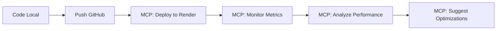

# 🤖 Render MCP Server Setup - IAPosteManager

## 🎯 Intégration MCP pour Gestion IA de Render

Le serveur MCP Render permet de gérer votre infrastructure Render directement depuis des outils IA comme Cursor et Claude.

## ⚡ Setup Rapide (2 minutes)

### 1️⃣ Créer une Clé API Render

1. Allez sur **https://dashboard.render.com/account/api-keys**
2. Cliquez **"Create API Key"**
3. Nom : `IAPosteManager-MCP`
4. Copiez la clé : `rnd_xxxxxxxxxx`

### 2️⃣ Configuration Cursor MCP

Ajoutez dans `~/.cursor/mcp.json` :

```json
{
  "mcpServers": {
    "render": {
      "url": "https://mcp.render.com/mcp",
      "headers": {
        "Authorization": "Bearer rnd_xxxxxxxxxx"
      }
    }
  }
}
```

### 3️⃣ Définir le Workspace

Dans Cursor, tapez :
```
Set my Render workspace to [VOTRE_WORKSPACE_NAME]
```

## 🚀 Commandes IA Disponibles

### Déploiement
- `Deploy IAPosteManager to Render using the GitHub repo`
- `Create a new web service for IAPosteManager`
- `Update environment variables for my service`

### Monitoring
- `Show me the logs for IAPosteManager service`
- `What's the CPU usage for my service today?`
- `Check the deploy status of my latest deployment`

### Base de Données
- `Create a PostgreSQL database for IAPosteManager`
- `Query my database for user statistics`
- `Show database connection metrics`

### Troubleshooting
- `Why isn't my IAPosteManager service working?`
- `Pull error logs from the last hour`
- `Check service health and metrics`

## 🛠️ Actions Supportées

| Ressource | Actions |
|-----------|---------|
| **Services** | Créer, lister, détails, variables env |
| **Déploiements** | Historique, détails, statut |
| **Logs** | Filtrer, analyser, troubleshoot |
| **Métriques** | CPU, mémoire, trafic, temps réponse |
| **Base de Données** | Créer, requêtes SQL, métriques |

## 🎯 Workflow Automatisé

### Déploiement IA
```
"Deploy my IAPosteManager project to Render with these specs:
- Python 3.13
- 512MB RAM
- Auto-deploy from main branch
- Environment: OPENAI_API_KEY=sk-xxx"
```

### Monitoring IA
```
"Monitor my IAPosteManager service and alert me if:
- Response time > 2 seconds
- Error rate > 5%
- CPU usage > 80%"
```

### Scaling IA
```
"Scale my service based on traffic:
- If requests > 100/min, upgrade to Starter plan
- If errors increase, check logs and restart"
```

## 🔐 Sécurité

- ✅ Clé API sécurisée (accès complet workspace)
- ⚠️ **Attention :** MCP peut modifier les variables d'environnement
- ✅ Pas d'accès aux secrets sensibles (connection strings masquées)
- ✅ Actions destructives limitées

## 📊 Exemples Pratiques

### 1. Déploiement Automatique
```bash
# Dans Cursor
"Create a Render service for IAPosteManager with:
- Repository: https://github.com/mobby57/iapm.com
- Build: bash build.sh
- Start: bash start.sh
- Environment: Production"
```

### 2. Monitoring Intelligent
```bash
"Analyze my service performance for the last 24 hours and suggest optimizations"
```

### 3. Troubleshooting IA
```bash
"My users report slow email sending. Check logs and metrics to diagnose the issue"
```

## 🚀 Avantages pour IAPosteManager

1. **Déploiement IA** - "Deploy latest version" en langage naturel
2. **Monitoring Intelligent** - Analyse automatique des performances
3. **Troubleshooting Rapide** - Diagnostic IA des problèmes
4. **Scaling Automatique** - Recommandations basées sur les métriques
5. **Gestion Base de Données** - Requêtes et optimisations IA

## 🔄 Workflow DevOps IA



## ⚡ Quick Start

1. **Setup MCP** (2 min)
2. **Deploy via IA** : `"Deploy IAPosteManager to Render"`
3. **Monitor via IA** : `"Show me service health"`
4. **Scale via IA** : `"Upgrade if needed"`

---

**🎉 Votre infrastructure Render est maintenant pilotée par IA !**

*Gérez IAPosteManager avec des commandes en langage naturel*