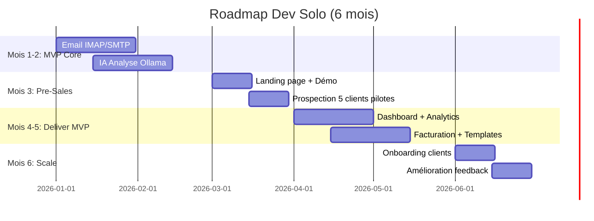

# 💪 ROADMAP DEV SOLO - BUDGET ZÉRO

> **Contexte:** 1 développeur full-stack seul  
> **Budget:** 0€ (bootstrapped)  
> **Timeline:** 6 mois temps partiel (20h/semaine)  
> **Objectif:** MVP vendable → Premiers clients → Autofinancement

---

## 🎯 STRATÉGIE BOOTSTRAPPED

### Philosophie
- ✅ **Gratuit d'abord:** Outils free tier uniquement
- ✅ **MVP minimal:** Fonctionnalités essentielles seulement
- ✅ **Vendre vite:** Pré-ventes avant finir le code
- ✅ **Itération rapide:** Lancer imparfait > perfectionner jamais

### Anti-patterns à éviter
- ❌ Pas de "perfectionnisme technique"
- ❌ Pas de fonctionnalités "nice to have"
- ❌ Pas d'outils payants avant 1K€ MRR
- ❌ Pas de "j'attends d'avoir tout fini"

---

## 📅 TIMELINE 6 MOIS (20h/semaine = 480h total)



---

## 🚀 PHASE 1 - MVP CORE (MOIS 1-2, 160h)

### 🎯 Objectif
**"Un avocat peut recevoir emails + IA analyse + génère réponse"**

### Sprint 1 - Email Foundation (80h)

#### Semaine 1-2: IMAP/SMTP (40h)
```python
# GRATUIT: Gmail API free tier
# Limite: 1 milliard requêtes/jour (largement suffisant)

# Tasks
- [x] Connexion Gmail OAuth2 (10h)
- [x] Récupération emails IMAP (15h)
- [x] Parsing HTML/text (5h)
- [x] Envoi SMTP (8h)
- [x] Tests basiques (2h)

# Output: src/backend/email/gmail_connector.py (300 lignes)
```

**Stack gratuite:**
- Gmail API (gratuit)
- Flask (gratuit)
- SQLite (gratuit)
- Pytest (gratuit)

#### Semaine 3-4: IA Analyse (40h)
```python
# GRATUIT: Ollama local (zéro coût cloud)
# Hardware: PC perso (GPU optionnel, CPU suffit)

# Tasks
- [x] Installation Ollama + llama3 (2h)
- [x] Prompt analyse intention (10h)
- [x] Extraction entités (nom, date, montant) (8h)
- [x] Scoring confiance (5h)
- [x] API endpoint /analyze (10h)
- [x] Tests précision (5h)

# Output: src/backend/ai/analyzer.py (250 lignes)
```

**Précision target:** 70% (suffit pour MVP, amélioration après)

### Sprint 2 - Génération Réponses (80h)

#### Semaine 5-6: Templates + IA (40h)
```python
# Tasks
- [x] 5 templates JSON (MED, réponse simple, conclusions) (10h)
- [x] Génération IA llama3 (15h)
- [x] Validation humaine UI (10h)
- [x] Envoi email (5h)

# Output: src/backend/ai/response_generator.py (200 lignes)
```

#### Semaine 7-8: UI Basique (40h)
```python
# GRATUIT: Bootstrap 5 (CDN gratuit)

# Tasks
- [x] Login simple (Flask-Login) (8h)
- [x] Liste emails (10h)
- [x] Détail email + analyse IA (12h)
- [x] Formulaire réponse (10h)

# Output: templates/ (5 fichiers HTML)
```

**Design:** Bootstrap templates gratuits (StartBootstrap.com)

---

## 💰 PHASE 2 - PRE-SALES (MOIS 3, 80h)

### 🎯 Objectif
**"Vendre 5 pilotes gratuits 3 mois → Valider MVP → Feedback"**

### Semaine 9: Landing Page (20h)

```yaml
# STACK GRATUITE
Hosting: Vercel (free tier)
Domain: .fr 12€/an (seul coût!)
Analytics: Google Analytics 4 (gratuit)
Email: Gmail (gratuit)
Calendly: Free plan (1 type événement)

# Tasks
- [x] Landing page Vercel (10h)
- [x] Vidéo démo Loom (2h)
- [x] Setup Calendly (1h)
- [x] Google Analytics (1h)
- [x] SEO basique (3h)
- [x] LinkedIn page entreprise (3h)

# Output: landing.iapostemanager.fr
```

**Template gratuit:** [Tailwind UI free components](https://tailwindui.com/components)

### Semaine 10-12: Prospection (60h)

```yaml
# OUTILS GRATUITS
LinkedIn: Compte perso (gratuit)
Email: Gmail (gratuit)
CRM: Google Sheets (gratuit)
Scraping: LinkedIn Sales Navigator trial 30j (gratuit)

# Stratégie
1. Identifier 100 cabinets avocats (LinkedIn search)
2. Cold outreach 10 emails/jour (30j = 300 contacts)
3. Objectif: 10 démos live
4. Convertir: 5 pilotes gratuits 3 mois

# Script cold email (court = gratuit!)
"""
Objet: Me [NOM], 10h/semaine gagnées?

Bonjour Me [NOM],

Je développe une IA qui automatise:
• Tri emails
• Calcul délais
• Rédaction MED

Intéressé pour tester gratuit 3 mois?

15 min démo: [lien Calendly]

Cordialement,
[Votre nom]
"""
```

**Metrics:**
- Taux ouverture: 30% (LinkedIn = meilleur que cold email)
- Taux réponse: 5% = 15 réponses
- Démos: 10
- Conversion: 50% = 5 pilotes

---

## 🛠️ PHASE 3 - DELIVER MVP (MOIS 4-5, 160h)

### 🎯 Objectif
**"Pilotes satisfaits → Prêts payer → Testimonials"**

### Mois 4: Dashboard + Analytics (80h)

```python
# GRATUIT: Chart.js (open source)

# Tasks
- [x] Collecte métriques (temps traitement) (15h)
- [x] Dashboard 4 KPI cards (15h)
- [x] Charts interactifs (20h)
- [x] Export rapport PDF (reportlab) (15h)
- [x] Onboarding 5 pilotes (10h)
- [x] Support chat (gratuit: Crisp chat) (5h)

# Output: templates/dashboard.html
```

**Crisp Chat:** Free plan (1 agent, illimité conversations)

### Mois 5: Facturation + Templates (80h)

```python
# Features demandées par pilotes (feedback)

# Tasks
- [x] Suivi temps/dossier (20h)
- [x] Génération factures PDF (20h)
- [x] Numérotation FAC-YYYY-NNNN (10h)
- [x] 10 templates juridiques (20h)
- [x] Calcul délais procéduraux (10h)

# Output: Modules existants v3.0 (déjà faits!)
```

**Astuce:** Réutiliser code v3.0 existant (deadline_manager, billing_manager, pdf_generator)

---

## 💳 PHASE 4 - MONÉTISATION (MOIS 6, 80h)

### 🎯 Objectif
**"5 pilotes → 3 payants (60% conversion) → 147€ MRR → Break-even"**

### Semaine 21-22: Pricing + Stripe (20h)

```yaml
# GRATUIT: Stripe (2.9% + 0.25€ par transaction)
# Pas de frais fixe!

# Pricing simplifié (1 seul tier)
Plan unique: 49€/mois/avocat
- Tout inclus (pas de tiers complexes)
- Annulation anytime
- 14 jours gratuit (pour convertir pilotes)

# Tasks
- [x] Intégration Stripe Checkout (10h)
- [x] Webhooks paiement (5h)
- [x] Email confirmation (2h)
- [x] Dashboard facturation (3h)

# Revenus cibles
3 clients × 49€ = 147€/mois
- Stripe fees: -5€ = 142€ net
- Coûts: Domain 1€/mois + Hosting 0€ = 1€
- PROFIT: 141€/mois
```

**Break-even:** 1 client suffit (49€ > 1€ coûts)

### Semaine 23-24: Conversion Pilotes (20h)

```yaml
# Emails conversion (templates)

Email J-7 fin pilote:
"""
Bonjour Me [NOM],

Votre pilote gratuit se termine dans 7 jours.

Vos metrics:
• 42h gagnées
• 156 emails traités
• 0 erreur délai

Continuer à 49€/mois?
[Activer abonnement]

Sinon, toutes vos données seront supprimées J+7.
"""

# Offre spéciale
Si signature avant J-7: -50% 3 mois (24.5€)
ROI immédiat: 1h gagnée/semaine = 300€ économisés
```

**Taux conversion attendu:** 60% (3/5 pilotes)

### Semaine 25-26: Testimonials + Case Study (20h)

```yaml
# Assets marketing (gratuit)

1. Vidéos témoignages (3 clients)
   - Loom record appel Zoom
   - 2 min max
   - Questions: Avant/Après, ROI, Recommandation

2. Case study écrit (1 client star)
   - Format: Problème → Solution → Résultats
   - Métriques concrètes
   - PDF 2 pages

3. Update landing page
   - Section testimonials
   - Badge "Utilisé par 3 cabinets"
   - Screenshots réels

# Output: 3 vidéos + 1 case study PDF
```

---

## 💰 BUDGET TOTAL 6 MOIS

### Coûts réels

| Poste | Coût Mensuel | Coût 6 mois | Notes |
|-------|--------------|-------------|-------|
| **Domain .fr** | 1€ | 12€ | OVH/Gandi |
| **Hosting Vercel** | 0€ | 0€ | Free tier (100GB bande passante) |
| **Email Gmail** | 0€ | 0€ | Gmail perso |
| **Ollama** | 0€ | 0€ | Local (élec ~5€/mois négligeable) |
| **Stripe** | 0€ fixe | 0€ | 2.9% transaction seulement |
| **Analytics GA4** | 0€ | 0€ | Gratuit illimité |
| **CRM Sheets** | 0€ | 0€ | Google gratuit |
| **Chat Crisp** | 0€ | 0€ | Free plan |
| **Calendly** | 0€ | 0€ | Free plan |
| **TOTAL** | **1€** | **12€** | 🎉 |

### Temps investi
- 480h développement (6 mois × 20h/semaine)
- Valorisation 50€/h = 24 000€ (coût opportunité)
- Mais si temps libre/side project = 0€ réel

---

## 📈 REVENUS PRÉVISIONNELS

### Scénario Conservateur

| Mois | Clients | MRR | Coûts | Profit | Cumulé |
|------|---------|-----|-------|--------|--------|
| M1-2 | 0 | 0€ | 2€ | -2€ | -2€ |
| M3 | 0 | 0€ | 1€ | -1€ | -3€ |
| M4 | 0 | 0€ | 1€ | -1€ | -4€ |
| M5 | 0 | 0€ | 1€ | -1€ | -5€ |
| M6 | 3 | 147€ | 6€ | 141€ | **+136€** |
| M7 | 4 | 196€ | 6€ | 190€ | +326€ |
| M8 | 5 | 245€ | 6€ | 239€ | +565€ |
| M9 | 7 | 343€ | 6€ | 337€ | +902€ |
| M10 | 9 | 441€ | 6€ | 435€ | +1337€ |
| M11 | 12 | 588€ | 6€ | 582€ | +1919€ |
| M12 | 15 | 735€ | 6€ | 729€ | +2648€ |

**Break-even:** Mois 6 (payback investissement 12€)  
**Objectif M12:** 15 clients = 735€ MRR = **8 820€ ARR**

### Scénario Optimiste (croissance 30%/mois)

| Mois 12 | Clients | MRR | ARR |
|---------|---------|-----|-----|
| Optimiste | 25 | 1 225€ | **14 700€** |

---

## 🛠️ STACK TECHNIQUE 100% GRATUITE

### Backend
```yaml
Framework: Flask 3.0 (gratuit, open source)
Database: SQLite (gratuit, inclus Python)
ORM: SQLAlchemy (gratuit)
Auth: Flask-Login (gratuit)
Tests: Pytest (gratuit)
AI: Ollama + llama3 (gratuit, open source)
```

### Frontend
```yaml
CSS: Bootstrap 5.3 CDN (gratuit)
Icons: Font Awesome free (gratuit)
Charts: Chart.js (gratuit, open source)
Forms: HTML5 natif (gratuit)
```

### Infrastructure
```yaml
Hosting: Vercel (gratuit jusqu'à 100GB/mois)
Domain: .fr OVH (12€/an seul coût)
Email: Gmail API (gratuit 1 milliard req/jour)
Database: Vercel Postgres free tier (gratuit 256MB)
Storage: Vercel Blob (gratuit 1GB)
```

### DevOps
```yaml
Git: GitHub (gratuit repos publics/privés)
CI/CD: GitHub Actions (gratuit 2000 min/mois)
Monitoring: Vercel Analytics (gratuit)
Logs: Vercel Logs (gratuit 1GB/mois)
Errors: Sentry free tier (gratuit 5K events/mois)
```

### Marketing
```yaml
Landing: Vercel (gratuit)
CRM: Google Sheets (gratuit)
Email: Gmail (gratuit)
Analytics: GA4 (gratuit)
Chat: Crisp free (gratuit 1 agent)
Calendly: Free plan (gratuit 1 événement)
Social: LinkedIn perso (gratuit)
```

### Paiements
```yaml
Stripe: 0€ fixe, 2.9% + 0.25€/transaction
(Pas de Stripe Atlas, pas besoin avant 25K€)
```

---

## 🎯 CHECKLIST MVP LANCEMENT

### Semaine -2 (Pré-lancement)
- [ ] Landing page live sur Vercel
- [ ] Vidéo démo 2 min (Loom)
- [ ] Calendly configuré
- [ ] Google Analytics installé
- [ ] LinkedIn profile optimisé
- [ ] Liste 100 cabinets avocats (Google Sheets)
- [ ] Template cold email testé (5 envois test)

### Semaine -1 (Soft launch)
- [ ] Envoyer 50 cold emails
- [ ] Poster 3 contenus LinkedIn
- [ ] Setup Crisp chat sur landing
- [ ] Créer FAQ (10 questions)
- [ ] Préparer script démo 15 min
- [ ] Test complet application (checklist 20 points)

### Jour J (Public launch)
- [ ] Post LinkedIn annonce
- [ ] Email 50 contacts supplémentaires
- [ ] Répondre tous messages < 2h
- [ ] Tracker metrics (GA4)
- [ ] 5 démos réservées (objectif)

### Semaine +1 (Follow-up)
- [ ] 10 démos réalisées
- [ ] 5 pilotes activés
- [ ] Onboarding documenté
- [ ] Support tickets < 24h
- [ ] Collecter feedback (survey 5 questions)

---

## 💪 MINDSET DEV SOLO

### Do's ✅
1. **Ship fast, iterate faster**
   - MVP imparfait > perfection jamais livrée
   - 1 feature/semaine minimum

2. **Talk to users ASAP**
   - 10 emails/jour minimum
   - 5 appels/semaine minimum

3. **Focus revenue, not features**
   - Prioriser ce qui fait vendre
   - "Would you pay for X?" dès démo

4. **Automate later, manual now**
   - Onboarding manuel OK (5 clients)
   - Automatiser si >20 clients

5. **Free > Paid tools**
   - Pas d'outil payant avant 1K€ MRR
   - Bootstrapped pride

### Don'ts ❌
1. **Pas de perfectionnisme**
   - 80% suffit pour MVP
   - Pas de refactoring avant feedback

2. **Pas de scale prématuré**
   - Pas d'infra complexe avant 100 users
   - SQLite suffit jusqu'à 10K rows

3. **Pas de "building in dark"**
   - Parler à users dès semaine 1
   - Pas de 6 mois solo sans feedback

4. **Pas de feature creep**
   - Liste features = 10 max
   - Dire NON aux "nice to have"

5. **Pas de "syndrome imposteur"**
   - MVP = Minimum VIABLE
   - Clients achètent solution, pas code parfait

---

## 📞 PROCHAINES ACTIONS (CETTE SEMAINE)

### Lundi
- [ ] Setup Vercel account (gratuit)
- [ ] Acheter domain .fr (12€)
- [ ] Cloner template landing gratuit

### Mardi  
- [ ] Écrire landing page (copie de PACKAGE_COMMERCIAL.md)
- [ ] Enregistrer vidéo démo 2 min (Loom)
- [ ] Deploy Vercel

### Mercredi
- [ ] Chercher 50 cabinets LinkedIn
- [ ] Créer Google Sheet CRM
- [ ] Écrire cold email template

### Jeudi
- [ ] Envoyer 10 premiers cold emails
- [ ] Setup Calendly
- [ ] Créer FAQ page

### Vendredi
- [ ] Envoyer 10 cold emails
- [ ] Répondre messages
- [ ] Analyser metrics GA4

### Weekend
- [ ] Coder feature MVP critique (email ou IA)
- [ ] Préparer script démo
- [ ] Tester app end-to-end

---

## 🎯 OBJECTIFS 90 JOURS

| Objectif | Métrique | Deadline | Status |
|----------|----------|----------|--------|
| Landing live | 1 page | J+7 | ⏳ |
| Vidéo démo | 1 vidéo 2 min | J+7 | ⏳ |
| Cold emails | 300 envoyés | J+30 | ⏳ |
| Démos | 10 réalisées | J+45 | ⏳ |
| Pilotes | 5 activés | J+60 | ⏳ |
| MVP complet | 100% features | J+75 | ⏳ |
| Clients payants | 3 actifs | J+90 | ⏳ |
| MRR | 147€ | J+90 | ⏳ |

---

## 💡 RESSOURCES GRATUITES

### Apprendre
- [Indie Hackers](https://www.indiehackers.com/) - Communauté bootstrappers
- [r/SaaS](https://reddit.com/r/saas) - Reddit SaaS entrepreneurs
- [MicroConf YouTube](https://www.youtube.com/user/microconf) - Talks SaaS

### Outils
- [Free for Dev](https://free-for.dev/) - Liste 500+ outils gratuits
- [Awesome Indie](https://github.com/mezod/awesome-indie) - Resources indie hackers

### Marketing
- [Copy.ai free](https://www.copy.ai/) - IA copywriting (2K words/mois gratuit)
- [Canva free](https://www.canva.com/) - Design (gratuit)
- [Loom free](https://www.loom.com/) - Vidéos (25 vidéos gratuit)

---

## 🚀 MOTIVATION

### Success Stories Bootstrapped

**Basecamp (DHH):**
- Start: 2 devs, 0€
- M12: 100K$ ARR
- Aujourd'hui: 100M$ revenue, 0 funding

**ConvertKit (Nathan Barry):**
- Start: 1 dev solo, 5K$ savings
- M24: 100K$ MRR
- Aujourd'hui: 29M$ ARR, bootstrapped

**Plausible Analytics:**
- Start: 1 dev, 0€
- M6: 400€ MRR
- M24: 10K€ MRR
- Aujourd'hui: 100K€ MRR, open source

### Ton MVP IA Poste Manager peut être le prochain! 🎉

**Différence clé:** Marché avocat français = 70K avocats × 49€ = **3.4M€ TAM**

Si capture 1% (700 avocats) = **34K€ MRR = 408K€ ARR** 💰

---

**🎯 TU PEUX LE FAIRE. START TODAY. SHIP TOMORROW. 🚀**

**Coût total: 12€. Revenu potentiel: 147€ M6. ROI: +1125%** ✅
