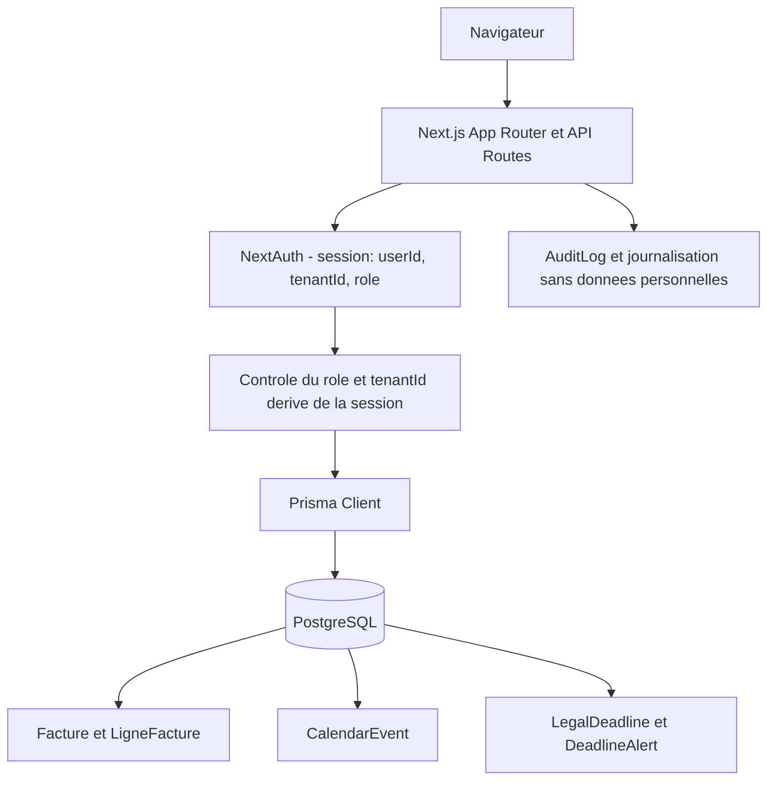

# Guide de developpement MemoLib

Ce document est le point d'entree technique pour contribuer a MemoLib, application Next.js multi-tenant destinee aux cabinets juridiques.

## Prerequis

- Node.js 20 ou plus recent
- npm
- PostgreSQL 17, local ou heberge (Neon est compatible)
- Une copie locale de `.env.example` nommee `.env.local`

Ne jamais versionner `.env.local` ni afficher ses valeurs dans les logs, captures ou tickets. La liste complete des variables est disponible dans [ENVIRONMENT_VARIABLES.md](ENVIRONMENT_VARIABLES.md).

## Demarrage local

```powershell
git clone https://github.com/mobby57/memoLib.git
cd memoLib
npm install
Copy-Item .env.example .env.local
# Renseigner DATABASE_URL, NEXTAUTH_SECRET et NEXTAUTH_URL dans .env.local
npx prisma generate
npx prisma migrate deploy
npm run dev
```

L'application est alors disponible sur `http://localhost:3000`.

Pour un environnement local minimal, les integrations externes optionnelles (Stripe, fournisseurs IA, SMTP, SMS) peuvent rester desactivees. Les routes qui en dependent doivent retourner une erreur explicite de configuration, jamais une fausse reussite.

## Architecture

| Zone | Emplacement | Responsabilite |
| --- | --- | --- |
| Application web et API | `src/app/` | App Router Next.js, pages, layouts, Route Handlers |
| Composants UI | `src/components/` | Composants React reutilisables |
| Logique metier | `src/lib/` | Authentification, services, securite, cron, conformite |
| Frontend historique | `src/frontend/` | Services et composants encore utilises par certains flux |
| Base de donnees | `prisma/schema.prisma` | Modeles Prisma et relations PostgreSQL |
| Migrations | `prisma/migrations/` | Evolution versionnee du schema |
| Tests | `src/__tests__/`, `tests/` | Jest, Vitest et Playwright |
| Automatisation | `.github/workflows/`, `vercel.json` | CI/CD et taches planifiees |

Par defaut, les composants dans `src/app` sont des Server Components. Ajouter `"use client"` seulement pour les hooks React, les interactions navigateur ou un provider client.

### Flux multi-tenant



Le routage actuel repose sur les routes localisees et la session. Un sous-domaine par tenant peut etre ajoute ulterieurement, mais ne doit pas devenir la seule source d'autorisation : le `tenantId` de la session et les filtres Prisma restent obligatoires.

## Modeles metier existants

Le schema contient deja les domaines de facturation et d'agenda. Avant d'ajouter un modele, etendre ces entites pour eviter deux sources de verite :

| Besoin | Modele existant | Points importants |
| --- | --- | --- |
| Factures | `Facture`, `LigneFacture`, `Paiement` | `tenantId`, numero unique par tenant, lien client/dossier, PDF et Stripe |
| Agenda et audiences | `CalendarEvent` | `tenantId`, `userId`, liens facultatifs client/dossier et synchronisation Google/Outlook |
| Delais juridiques | `LegalDeadline`, `DeadlineAlert` | lien dossier/client, alertes, suspension, acquittement et escalation |
| Avocat | `User` | le role et l'identite de l'avocat proviennent du compte authentifie, pas d'un modele parallele |

Pour la facturation, conserver l'unicite `@@unique([tenantId, numero])` et les relations client/dossier. Toute evolution des montants doit evaluer l'usage de `Decimal` PostgreSQL : les montants monetaires ne doivent pas etre recalcules avec des flottants binaires sans regle d'arrondi explicite.

Pour l'agenda, reutiliser `CalendarEvent` plutot que creer des modeles `Avocat`, `RDV` ou `DelaiLegal` en doublon. Les disponibilites, blocages et conflits doivent d'abord etre modeles comme des types ou statuts d'evenements, avec une verification de chevauchement dans une transaction.

## Base de donnees et Prisma

Modifier `prisma/schema.prisma` puis creer une migration pour toute modification qui change la structure PostgreSQL :

```powershell
npx prisma migrate dev --name description-courte
npx prisma generate
```

En CI et production, appliquer uniquement les migrations deja versionnees :

```powershell
npx prisma migrate deploy
```

Regles a respecter :

- toute relation doit definir un `onDelete` adapte ;
- les modeles metier comportent `createdAt` et `updatedAt` ;
- ajouter des index pour les filtres usuels, notamment `tenantId` ;
- utiliser des transactions Prisma pour les ecritures dependantes ;
- ne pas supprimer des donnees de tenant dans une operation ciblee sur un utilisateur.

Exemple de modele multi-tenant :

```prisma
model Dossier {
  id        String   @id @default(cuid())
  tenantId  String
  clientId  String
  nom       String
  createdAt DateTime @default(now())
  updatedAt DateTime @updatedAt

  @@index([tenantId])
  @@index([tenantId, clientId])
}
```

## Authentification, tenants et API

Les Route Handlers sont dans `src/app/api/**/route.ts`. Une route protegee doit :

1. Recuperer la session avec `getServerSession(authOptions)`.
2. Deriver `userId`, `tenantId` et `role` de la session, jamais du corps de requete.
3. Filtrer toutes les lectures et ecritures par `tenantId`.
4. Verifier le role autorise avant toute mutation.
5. Valider le payload avec Zod et retourner des codes HTTP explicites.

Les entrees libres (email entrant, OCR, texte ou IA) suivent obligatoirement le flux :

```text
entree brute -> adaptation/parsing -> brouillon structure -> validation humaine -> API metier
```

Une route metier ne doit pas creer directement un dossier, un client ou un delai depuis un texte non structure.

Exemple minimal de mutation protegee :

```ts
import { getServerSession } from 'next-auth';
import { NextResponse } from 'next/server';
import { z } from 'zod';
import { authOptions } from '@/lib/auth/authOptions';
import prisma from '@/lib/prisma';

const CreateDossierSchema = z.object({
  nom: z.string().trim().min(1).max(255),
  clientId: z.string().min(1),
});

export async function POST(request: Request) {
  const session = await getServerSession(authOptions);
  const user = session?.user as { id?: string; tenantId?: string; role?: string } | undefined;
  if (!user?.id) return NextResponse.json({ error: 'Non autorisé' }, { status: 401 });
  if (!user.tenantId || !['ADMIN', 'LAWYER'].includes(user.role?.toUpperCase() ?? '')) {
    return NextResponse.json({ error: 'Accès interdit' }, { status: 403 });
  }

  const parsed = CreateDossierSchema.safeParse(await request.json());
  if (!parsed.success) {
    return NextResponse.json({ error: 'Payload invalide' }, { status: 400 });
  }

  const dossier = await prisma.dossier.create({
    data: { ...parsed.data, tenantId: user.tenantId, responsableId: user.id },
  });
  return NextResponse.json(dossier, { status: 201 });
}
```

### Delais legaux

`/api/legal-deadlines` est un exemple de route multi-tenant securisee :

- lecture limitee au tenant de la session ;
- creation et mise a jour reservees aux roles internes autorises ;
- dossier et client verifies dans le meme tenant ;
- auteur et tenant imposes par la session ;
- alertes J-7, J-3 et J-1 exclusives dans `src/lib/cron/deadline-alerts.ts`.

Les acquittements, suspensions et reactivations appliquent les memes controles. Une suspension genere un rappel seulement apres 14 jours via le cron, et non immediatement.

## Taches planifiees

Les taches Vercel sont declarees dans `vercel.json`. Les handlers sont dans `src/app/api/cron/` et les services dans `src/lib/cron/`.

- `deadline-alerts` : alertes J-7, J-3, J-1, transitions overdue et rappels de suspension ;
- `escalation` : escalade des emails et delais non traites ;
- `cost-alerts` : surveillance des couts.

Chaque endpoint cron doit verifier `CRON_SECRET`. En local, utiliser un header `Authorization: Bearer <CRON_SECRET>` ou, lorsque configure par Vercel, le token de l'URL planifiee. Les services doivent etre idempotents : une execution concurrente ne doit ni dupliquer une notification ni marquer une action comme effectuee avant sa persistance.

Pour les taches qui modifient plusieurs enregistrements, utiliser une transaction et, si necessaire, un marqueur ou une contrainte unique d'idempotence. Ne pas se reposer sur un simple `findFirst` suivi d'un `create` pour garantir l'unicite sous concurrence.

## Tests et qualite

Avant une pull request, lancer au minimum :

```powershell
npm run type-check
npm run lint
npm test
```

Tests utiles pendant le developpement :

```powershell
# Un fichier Jest
npx jest --runInBand src/__tests__/api/legal-deadlines.test.ts

# Tests unitaires
npm run test:unit

# Tests E2E
npx playwright test
```

Ajouter des tests pour chaque controle d'autorisation, isolation tenant, erreur de validation, transition d'etat et operation RGPD modifies.

Exemple de test d'isolation tenant :

```ts
it('refuse une lecture sur un autre tenant', async () => {
  mockGetServerSession.mockResolvedValue({
    user: { id: 'user-a', tenantId: 'tenant-a', role: 'LAWYER' },
  });

  const response = await GET(
    new NextRequest('http://localhost/api/legal-deadlines?tenantId=tenant-b')
  );

  expect(response.status).toBe(403);
  expect(prisma.legalDeadline.findMany).not.toHaveBeenCalled();
});
```

Les tests E2E Playwright completent ces tests de route : utiliser des comptes et des donnees de seed distincts par tenant, verifier l'absence de la donnee d'un autre tenant dans l'UI et dans l'API, puis nettoyer les donnees de test. Ne pas fabriquer un cookie NextAuth a la main dans les tests sans reutiliser le mecanisme de session reel du projet.

## Securite et conformite

- Ne jamais inclure de credentials, token, adresse email ou donnees client reelles dans le code ou les logs.
- Les webhooks doivent verifier leur signature, dedupliquer avec un identifiant ou checksum et etre idempotents.
- Les erreurs API ne doivent jamais exposer stack trace, secret ou donnees personnelles.
- Conserver les headers de securite dans `vercel.json` (CSP, HSTS, anti-clickjacking).
- Les operations RGPD anonymisent les donnees personnelles ciblees, tout en preservant les donnees partagees et les obligations legales de conservation.

Consulter aussi [SECURITY_ARCHITECTURE.md](SECURITY_ARCHITECTURE.md), [SECURITY_CHECKLIST.md](SECURITY_CHECKLIST.md) et [CONFORMITE_RGPD_CHECKLIST.md](CONFORMITE_RGPD_CHECKLIST.md).

### Checklist multi-tenant

- [ ] `tenantId` est derive de la session pour chaque requete protegee.
- [ ] Chaque requete Prisma metier est bornee par `tenantId`.
- [ ] Les cles uniques et index composites incluent `tenantId` lorsque la donnee est propre au cabinet.
- [ ] Les acces par identifiant verifient egalement le tenant, pas uniquement `id`.
- [ ] Les ecritures dependantes sont executees dans une transaction.
- [ ] Les webhooks valident signature, idempotence et tenant cible avant traitement.
- [ ] Les tests couvrent les tentatives A vers B et B vers A.

La Row-Level Security PostgreSQL peut etre ajoutee comme defense en profondeur, mais ne remplace pas les controles applicatifs. Son adoption exige de definir `app.tenant_id` dans chaque transaction et doit faire l'objet d'une migration, de tests de contournement SQL et d'une validation operationnelle avant activation.

Ne pas utiliser `SET LOCAL` avec une interpolation de chaine. Lors de l'implementation RLS, definir le contexte tenant dans une transaction avec une requete parametree ou une fonction SQL dediee, puis verifier que les connexions poolées ne conservent jamais un contexte tenant precedent.

## Evolutions de schema

`Facture`, `LigneFacture`, `Paiement`, `CalendarEvent` et `LegalDeadline` sont deja presents dans le schema. Une migration qui tente de recreer ces tables, ou d'introduire en parallele `Avocat`, `Agenda`, `RDV` et `DelaiLegal`, est incompatible avec le modele existant.

Pour une evolution de facturation ou d'agenda :

1. Modifier le modele existant dans `prisma/schema.prisma`.
2. Creer la migration avec `npx prisma migrate dev --name description-courte`.
3. Verifier les contraintes, indexes et `onDelete` generes.
4. Ajouter les tests d'isolation tenant et de compatibilite des donnees existantes.
5. Appliquer en production avec `npx prisma migrate deploy`.

## Workflow Git

1. Creer une branche `feature/`, `bugfix/` ou `hotfix/` depuis la branche d'integration.
2. Garder les changements limites au besoin traite.
3. Verifier types, lint et tests pertinents.
4. Ouvrir une pull request avec le contexte, les impacts de migration et les tests executes.

Utiliser les commits conventionnels : `feat:`, `fix:`, `docs:`, `test:`, `refactor:` ou `chore:`.
