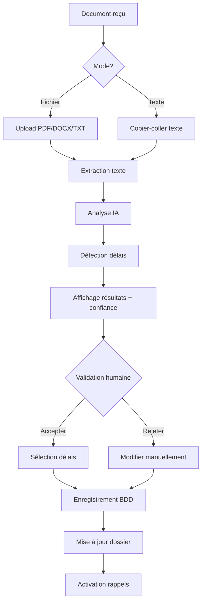

# 🤖 Extraction Automatique de Délais par IA

## Vue d'ensemble

Le système d'extraction automatique de délais permet d'analyser les documents administratifs et judiciaires (OQTF, arrêtés préfectoraux, convocations, jugements) pour **extraire automatiquement tous les délais et échéances** grâce à l'Intelligence Artificielle.

## 🎯 Fonctionnalités

### ✅ Ce qui est implémenté

1. **Modèle de données Echeance** (Prisma)
   - Type de délai (recours contentieux, audience, prescription, etc.)
   - Dates d'échéance et de référence
   - Statut automatique (à venir, proche, urgent, dépassé)
   - Priorité calculée (critique, haute, normale, basse)
   - Source (manuel, IA auto, IA validé)
   - Score de confiance IA (0-1)
   - Texte extrait du document source
   - Système de rappels (J-7, J-3, J-1)
   - Validation humaine

2. **Service d'extraction** (`deadlineExtractor.ts`)
   - Analyse de texte brut ou fichiers (PDF, DOCX, TXT)
   - Détection automatique du type de document
   - Extraction multi-délais
   - Calcul automatique du statut et priorité
   - Support des délais CESEDA spécifiques

3. **API REST**
   - `POST /api/dossiers/[id]/extract-deadlines` - Analyse un document
   - `POST /api/dossiers/[id]/echeances` - Crée des échéances
   - `GET /api/dossiers/[id]/echeances` - Liste les échéances

4. **Interface utilisateur** (`DeadlineExtractor.tsx`)
   - Upload de fichier ou saisie de texte
   - Affichage des résultats avec score de confiance
   - Sélection manuelle des délais à conserver
   - Validation avant enregistrement

## 📋 Types de délais détectés

| Type | Description | Exemple |
|------|-------------|---------|
| `delai_recours_contentieux` | Recours devant TA, CAA, CE | 48h OQTF, 2 mois refus titre |
| `delai_recours_gracieux` | Recours gracieux préfecture | 2 mois recours gracieux |
| `audience` | Dates d'audience CNDA, TA, CAA | Audience CNDA 15/03/2026 |
| `depot_memoire` | Dépôt mémoires complémentaires | Dépôt mémoire avant 01/02/2026 |
| `reponse_prefecture` | Délai réponse préfecture | Réponse préfecture 4 mois |
| `expiration_titre` | Expiration titre, récépissé, APS | Récépissé expire 30/04/2026 |
| `oqtf_execution` | Délai exécution volontaire OQTF | 30 jours départ volontaire |
| `prescription` | Délais de prescription | Prescription 2 ans |
| `convocation` | Convocations préfecture, police | Convocation préfecture 10/02/2026 |
| `autre` | Autres délais | - |

## 🚀 Comment utiliser

### 1. Depuis la page Dossiers

```tsx
import DeadlineExtractor from '@/components/DeadlineExtractor';

// Dans votre composant
<DeadlineExtractor 
  dossierId={dossier.id}
  onDeadlinesExtracted={(deadlines) => {
    console.log('Délais extraits:', deadlines);
  }}
  onDeadlinesSaved={(saved) => {
    console.log('Délais enregistrés:', saved);
    // Rafraîchir la liste des échéances
    fetchEcheances();
  }}
/>
```

### 2. Depuis le formulaire de création de dossier

Ajouter le composant dans le modal de création :

```tsx
{showCreateModal && (
  <Modal>
    {/* Formulaire classique */}
    
    {/* Section extraction de délais */}
    <div className="mt-6 border-t pt-6">
      <h3 className="font-semibold mb-4">Documents initiaux</h3>
      <DeadlineExtractor 
        dossierId={newDossierId}
        onDeadlinesSaved={handleDeadlinesSaved}
      />
    </div>
  </Modal>
)}
```

### 3. Via l'API directement

```typescript
// Extraction depuis un fichier
const formData = new FormData();
formData.append('file', file);
formData.append('autoSave', 'false');

const response = await fetch(`/api/dossiers/${dossierId}/extract-deadlines`, {
  method: 'POST',
  body: formData
});

const result = await response.json();
console.log('Délais extraits:', result.deadlines);

// Sauvegarde des délais sélectionnés
await fetch(`/api/dossiers/${dossierId}/echeances`, {
  method: 'POST',
  headers: { 'Content-Type': 'application/json' },
  body: JSON.stringify({
    deadlines: result.deadlines.filter((d, i) => selectedIndices.includes(i))
  })
});
```

## 📊 Structure des données

### ExtractedDeadline

```typescript
interface ExtractedDeadline {
  type: string;                    // Type de délai
  titre: string;                   // "Délai recours contentieux OQTF"
  description?: string;            // Détails complémentaires
  dateEcheance: Date;              // Date limite
  dateReference?: Date;            // Date de notification/décision
  delaiJours?: number;             // Nombre de jours (ex: 48h = 2)
  priorite: 'critique' | 'haute' | 'normale' | 'basse';
  aiConfidence: number;            // 0-1 (confiance IA)
  extractedText: string;           // Texte source
  metadata?: {
    juridiction?: string;
    typeRecours?: string;
    article?: string;
  };
}
```

### Modèle Prisma Echeance

```prisma
model Echeance {
  id            String    @id @default(uuid())
  tenantId      String
  dossierId     String
  
  type          String    // delai_recours_contentieux, audience, etc.
  titre         String
  description   String?
  
  dateEcheance  DateTime
  dateReference DateTime?
  delaiJours    Int?
  
  statut        String    @default("a_venir")
  priorite      String    @default("normale")
  
  source        String    @default("manuel")
  aiConfidence  Float?
  extractedText String?
  documentId    String?
  
  validePar     String?
  valideAt      DateTime?
  
  // Rappels
  rappelAvant   Int       @default(7)
  rappelEnvoye  Boolean   @default(false)
  rappelJ7      Boolean   @default(false)
  rappelJ3      Boolean   @default(false)
  rappelJ1      Boolean   @default(false)
  
  createdBy     String
  createdAt     DateTime  @default(now())
  updatedAt     DateTime  @updatedAt
}
```

## 🔧 Configuration IA

Le système utilise le service `aiService.ts` configuré dans votre application.

### Ollama (local)

```env
OLLAMA_ENABLED=true
OLLAMA_URL=http://localhost:11434
OLLAMA_MODEL=llama3.2:latest
```

### OpenAI (cloud)

```env
OPENAI_API_KEY=sk-...
OPENAI_MODEL=gpt-4
```

## 📝 Prompt système

Le système utilise un prompt expert en droit CESEDA qui :
- Identifie tous les types de délais
- Extrait les dates au format ISO 8601
- Calcule la priorité automatiquement
- Fournit un score de confiance
- Structure les résultats en JSON

## 🎨 Interface utilisateur

### Modes disponibles

1. **Upload de fichier**
   - Formats : PDF, DOCX, TXT
   - Drag & drop supporté
   - Détection automatique du type de document

2. **Saisie de texte**
   - Copier-coller depuis document
   - Analyse en temps réel
   - Idéal pour tests rapides

### Affichage des résultats

- ✅ Carte par délai avec priorité colorée
- 📊 Score de confiance IA affiché
- 📖 Texte source extractible
- ☑️ Sélection multi-délais
- 💾 Validation avant enregistrement

### Codes couleur priorité

| Priorité | Couleur | Badge |
|----------|---------|-------|
| Critique | Rouge | `bg-red-100 text-red-800` |
| Haute | Orange | `bg-orange-100 text-orange-800` |
| Normale | Bleu | `bg-blue-100 text-blue-800` |
| Basse | Gris | `bg-gray-100 text-gray-800` |

## 🔄 Workflow complet



## 📈 Améliorations futures

### Phase 2 (à implémenter)

- [ ] Parser PDF réel (`pdf-parse`)
- [ ] Parser DOCX réel (`mammoth`)
- [ ] OCR pour documents scannés (`tesseract.js`)
- [ ] Extraction d'images (tampons, signatures)
- [ ] Détection juridiction par logo/en-tête
- [ ] Calcul automatique délais selon calendrier juridique
- [ ] Exclusion jours fériés et week-ends
- [ ] Notifications email/SMS automatiques
- [ ] Synchronisation calendrier (Google, Outlook)
- [ ] Suggestions de stratégie selon délais
- [ ] Historique des extractions
- [ ] Rapport de confiance IA
- [ ] Apprentissage par validation humaine

### Phase 3 (avancé)

- [ ] Multi-langue (anglais, arabe)
- [ ] Support autres juridictions (EU, UK)
- [ ] API webhooks pour notifications externes
- [ ] Dashboard analytics des délais
- [ ] Prédiction risque de dépassement
- [ ] Intégration jurisprudence automatique

## 🐛 Debugging

### Problèmes courants

**Erreur "Extraction PDF non implémentée"**
```bash
npm install pdf-parse
```

**Erreur "Extraction DOCX non implémentée"**
```bash
npm install mammoth
```

**Aucun délai trouvé**
- Vérifier que le texte contient bien des dates
- Tester avec un texte plus court/ciblé
- Vérifier la configuration IA (Ollama/OpenAI)

**Score de confiance faible**
- Document peu structuré
- Dates ambiguës
- Validation humaine recommandée

## 📚 Exemples de documents testés

### OQTF avec délai 48h
```
ARRETE PORTANT OBLIGATION DE QUITTER LE TERRITOIRE FRANÇAIS

Le Préfet de XXX,
[...]
Vous disposez d'un délai de 48 HEURES à compter de la notification 
du présent arrêté pour former un recours contentieux devant le 
Tribunal Administratif de Paris.

Fait à Paris, le 13 janvier 2026
```

**Résultat attendu:**
- Type: `delai_recours_contentieux`
- Date échéance: 15/01/2026 23:59
- Délai: 2 jours
- Priorité: `critique`
- Confiance: > 0.9

### Convocation CNDA
```
CONVOCATION À AUDIENCE

Monsieur XXX est convoqué à l'audience du 15 mars 2026 à 14h00
devant la Cour Nationale du Droit d'Asile (CNDA).

Vous devez déposer votre mémoire complémentaire au plus tard 
15 jours avant la date d'audience, soit avant le 01 mars 2026.
```

**Résultat attendu:**
- 2 délais détectés:
  1. Audience CNDA le 15/03/2026
  2. Dépôt mémoire avant 01/03/2026

## 🔐 Sécurité

- ✅ Authentification NextAuth requise
- ✅ Vérification tenant/client
- ✅ Validation données entrée (Zod)
- ✅ Sanitisation texte uploadé
- ✅ Limite taille fichiers (5MB)
- ✅ Validation format fichier (mimetype)

## 📄 Licence

Propriétaire - Tous droits réservés
