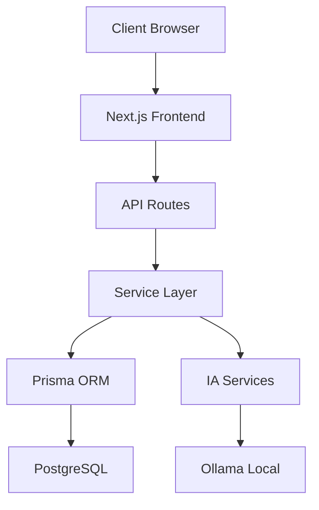

# 🔧 GUIDE DE PASSATION TECHNIQUE

## 🎯 OBJECTIF
Ce guide permet à un développeur expérimenté de reprendre le projet IA Poste Manager en 30 jours maximum.

---

## 📋 PRÉREQUIS TECHNIQUES

### Compétences Minimales Requises
- **TypeScript/JavaScript** : Niveau avancé (5+ ans)
- **React/Next.js** : Niveau intermédiaire (2+ ans)
- **Base de données** : PostgreSQL, Prisma ORM
- **DevOps** : Docker, CI/CD basique
- **IA/ML** : Notions de base (formation fournie)

### Environnement de Développement
```bash
# Configuration minimale
Node.js >= 18.0.0
npm >= 9.0.0
Docker >= 20.0.0
Git >= 2.30.0

# Outils recommandés
VS Code + Extensions :
- TypeScript
- Prisma
- Tailwind CSS
- ESLint
- Prettier
```

---

## 🏗️ ARCHITECTURE TECHNIQUE DÉTAILLÉE

### 1. Structure du Projet
```
iaPostemanage/
├── 📁 src/
│   ├── 📁 app/                    # Next.js App Router
│   │   ├── 📁 api/               # API Routes
│   │   ├── 📁 (auth)/            # Pages authentification
│   │   ├── 📁 dashboard/         # Pages dashboard
│   │   └── 📁 tenant/            # Pages multi-tenant
│   ├── 📁 components/            # Composants réutilisables
│   │   ├── 📁 ui/               # Composants UI de base
│   │   ├── 📁 forms/            # Formulaires
│   │   └── 📁 charts/           # Graphiques
│   ├── 📁 lib/                   # Logique métier
│   │   ├── 📁 services/         # Services business
│   │   ├── 📁 ai/               # Services IA
│   │   ├── 📁 auth/             # Authentification
│   │   └── 📁 utils/            # Utilitaires
│   └── 📁 types/                 # Types TypeScript
├── 📁 prisma/                    # Base de données
├── 📁 docs/                      # Documentation
├── 📁 scripts/                   # Scripts maintenance
└── 📁 tests/                     # Tests automatisés
```

### 2. Flux de Données Principal


### 3. Modèle de Données Critique
```typescript
// Entités principales à maîtriser absolument

interface Tenant {
  id: string;
  nom: string;
  plan: 'BASIC' | 'PREMIUM' | 'ENTERPRISE';
  status: 'ACTIVE' | 'SUSPENDED' | 'CANCELLED';
  createdAt: Date;
}

interface Dossier {
  id: string;
  tenantId: string;
  clientId: string;
  type: 'OQTF' | 'NATURALISATION' | 'ASILE' | 'TITRE_SEJOUR';
  statut: 'EN_COURS' | 'EN_ATTENTE' | 'URGENT' | 'TERMINE';
  priorite: 'CRITIQUE' | 'HAUTE' | 'NORMALE';
  echeance?: Date;
}

interface AIAction {
  id: string;
  tenantId: string;
  type: 'EMAIL_TRIAGE' | 'GENERATE_DRAFT' | 'DOCUMENT_ANALYSIS';
  status: 'PENDING' | 'APPROVED' | 'REJECTED' | 'MODIFIED';
  confidence: number; // 0-100
  humanValidation?: boolean;
}
```

---

## 🤖 SERVICES IA - GUIDE TECHNIQUE

### 1. Architecture IA Locale
```typescript
// src/lib/ai/ollama-client.ts
export class OllamaClient {
  private baseUrl = process.env.OLLAMA_URL || 'http://localhost:11434';
  
  async generateText(prompt: string, model = 'llama3.2:latest'): Promise<string> {
    const response = await fetch(`${this.baseUrl}/api/generate`, {
      method: 'POST',
      headers: { 'Content-Type': 'application/json' },
      body: JSON.stringify({
        model,
        prompt,
        stream: false
      })
    });
    
    const data = await response.json();
    return data.response;
  }
  
  async generateEmbedding(text: string): Promise<number[]> {
    const response = await fetch(`${this.baseUrl}/api/embeddings`, {
      method: 'POST',
      headers: { 'Content-Type': 'application/json' },
      body: JSON.stringify({
        model: 'nomic-embed-text:latest',
        prompt: text
      })
    });
    
    const data = await response.json();
    return data.embedding;
  }
}
```

### 2. Service d'Apprentissage Automatique
```typescript
// src/lib/ai/learning-service.ts
export class LearningService {
  async updateConfidence(
    actionId: string, 
    humanValidation: 'APPROVED' | 'REJECTED' | 'MODIFIED'
  ): Promise<void> {
    const action = await prisma.aIAction.findUnique({
      where: { id: actionId }
    });
    
    if (!action) return;
    
    // Ajustement automatique de la confiance
    let adjustment = 0;
    switch (humanValidation) {
      case 'APPROVED':
        adjustment = +5; // Augmente la confiance
        break;
      case 'MODIFIED':
        adjustment = -2; // Légère baisse
        break;
      case 'REJECTED':
        adjustment = -10; // Forte baisse
        break;
    }
    
    // Mise à jour du modèle d'apprentissage
    await this.updateModelConfidence(action.type, adjustment);
  }
  
  private async updateModelConfidence(
    actionType: string, 
    adjustment: number
  ): Promise<void> {
    // Logique d'apprentissage automatique
    const currentMetrics = await this.getActionTypeMetrics(actionType);
    const newConfidence = Math.max(0, Math.min(100, 
      currentMetrics.averageConfidence + adjustment
    ));
    
    await prisma.aIMetrics.upsert({
      where: { actionType },
      update: { averageConfidence: newConfidence },
      create: { 
        actionType, 
        averageConfidence: newConfidence,
        totalActions: 1
      }
    });
  }
}
```

### 3. Système de Suggestions Intelligentes
```typescript
// src/lib/ai/suggestion-service.ts
export class SuggestionService {
  async generateSuggestions(tenantId: string): Promise<Suggestion[]> {
    const suggestions: Suggestion[] = [];
    
    // 1. Dossiers inactifs
    const inactiveDossiers = await this.findInactiveDossiers(tenantId);
    if (inactiveDossiers.length > 0) {
      suggestions.push({
        type: 'INACTIVE_DOSSIERS',
        priority: 'HIGH',
        title: `${inactiveDossiers.length} dossiers inactifs détectés`,
        description: 'Dossiers sans activité depuis plus de 14 jours',
        action: 'SUGGEST_FOLLOWUP',
        confidence: 85,
        data: { dossierIds: inactiveDossiers.map(d => d.id) }
      });
    }
    
    // 2. Documents manquants récurrents
    const missingDocs = await this.findRecurringMissingDocuments(tenantId);
    if (missingDocs.length > 0) {
      suggestions.push({
        type: 'RECURRING_MISSING_DOCS',
        priority: 'MEDIUM',
        title: 'Documents manquants récurrents détectés',
        description: `${missingDocs.length} types de documents souvent oubliés`,
        action: 'SUGGEST_AUTOMATION',
        confidence: 78,
        data: { documentTypes: missingDocs }
      });
    }
    
    // 3. Opportunités d'automatisation
    const automationOpps = await this.findAutomationOpportunities(tenantId);
    suggestions.push(...automationOpps);
    
    return suggestions.sort((a, b) => b.confidence - a.confidence);
  }
}
```

---

## 🔐 SÉCURITÉ ET CONFORMITÉ

### 1. Authentification Multi-Niveaux
```typescript
// src/lib/auth/auth-config.ts
export const authConfig: NextAuthConfig = {
  providers: [
    CredentialsProvider({
      name: 'credentials',
      credentials: {
        email: { label: 'Email', type: 'email' },
        password: { label: 'Password', type: 'password' },
        tenantId: { label: 'Tenant ID', type: 'text' }
      },
      async authorize(credentials) {
        // Validation avec isolation tenant
        const user = await validateUserCredentials(
          credentials.email,
          credentials.password,
          credentials.tenantId
        );
        
        if (user && user.tenantId === credentials.tenantId) {
          return {
            id: user.id,
            email: user.email,
            role: user.role,
            tenantId: user.tenantId
          };
        }
        
        return null;
      }
    })
  ],
  callbacks: {
    async jwt({ token, user }) {
      if (user) {
        token.role = user.role;
        token.tenantId = user.tenantId;
      }
      return token;
    },
    async session({ session, token }) {
      session.user.role = token.role;
      session.user.tenantId = token.tenantId;
      return session;
    }
  }
};
```

### 2. Middleware de Protection
```typescript
// src/middleware.ts
export function middleware(request: NextRequest) {
  const token = request.nextUrl.searchParams.get('token') || 
                request.cookies.get('next-auth.session-token')?.value;
  
  if (!token) {
    return NextResponse.redirect(new URL('/auth/signin', request.url));
  }
  
  // Vérification des permissions par route
  const pathname = request.nextUrl.pathname;
  const userRole = extractRoleFromToken(token);
  const tenantId = extractTenantFromToken(token);
  
  // Protection des routes admin
  if (pathname.startsWith('/admin') && userRole !== 'SUPER_ADMIN') {
    return NextResponse.redirect(new URL('/unauthorized', request.url));
  }
  
  // Isolation tenant
  if (pathname.includes('/tenant/') && !pathname.includes(tenantId)) {
    return NextResponse.redirect(new URL('/unauthorized', request.url));
  }
  
  return NextResponse.next();
}
```

### 3. Audit Trail Immuable
```typescript
// src/lib/audit/audit-logger.ts
export class AuditLogger {
  async logAction(action: AuditAction): Promise<void> {
    const previousHash = await this.getLastLogHash();
    const logEntry = {
      ...action,
      timestamp: new Date(),
      hash: this.calculateHash(action, previousHash),
      previousHash
    };
    
    // Stockage append-only (jamais de modification)
    await prisma.auditLog.create({
      data: logEntry
    });
    
    // Vérification d'intégrité de la chaîne
    await this.verifyChainIntegrity();
  }
  
  private calculateHash(action: AuditAction, previousHash: string): string {
    const data = JSON.stringify({ ...action, previousHash });
    return crypto.createHash('sha256').update(data).digest('hex');
  }
  
  async verifyChainIntegrity(): Promise<boolean> {
    const logs = await prisma.auditLog.findMany({
      orderBy: { timestamp: 'asc' }
    });
    
    for (let i = 1; i < logs.length; i++) {
      const expectedHash = this.calculateHash(
        logs[i], 
        logs[i-1].hash
      );
      
      if (logs[i].hash !== expectedHash) {
        throw new Error(`Audit trail compromised at entry ${logs[i].id}`);
      }
    }
    
    return true;
  }
}
```

---

## 📊 MONITORING ET MAINTENANCE

### 1. Health Checks Automatiques
```typescript
// src/lib/monitoring/health-monitor.ts
export class HealthMonitor {
  async performHealthCheck(): Promise<HealthReport> {
    const checks = await Promise.allSettled([
      this.checkDatabase(),
      this.checkOllama(),
      this.checkFileSystem(),
      this.checkMemoryUsage(),
      this.checkResponseTimes()
    ]);
    
    const results = checks.map((check, index) => ({
      name: ['Database', 'Ollama', 'FileSystem', 'Memory', 'Performance'][index],
      status: check.status === 'fulfilled' ? 'OK' : 'ERROR',
      details: check.status === 'fulfilled' ? check.value : check.reason
    }));
    
    const criticalIssues = results.filter(r => r.status === 'ERROR');
    
    if (criticalIssues.length > 0) {
      await this.sendAlert(criticalIssues);
    }
    
    return {
      overall: criticalIssues.length === 0 ? 'HEALTHY' : 'DEGRADED',
      checks: results,
      timestamp: new Date()
    };
  }
  
  private async checkOllama(): Promise<OllamaHealth> {
    try {
      const response = await fetch('http://localhost:11434/api/tags');
      const models = await response.json();
      
      return {
        status: 'OK',
        availableModels: models.models?.length || 0,
        requiredModels: ['llama3.2:latest', 'nomic-embed-text:latest'],
        missingModels: this.findMissingModels(models.models)
      };
    } catch (error) {
      return {
        status: 'ERROR',
        error: error.message
      };
    }
  }
}
```

### 2. Scripts de Maintenance Automatique
```typescript
// scripts/maintenance/daily-maintenance.ts
export class DailyMaintenance {
  async run(): Promise<MaintenanceReport> {
    console.log('🔧 Début de la maintenance quotidienne...');
    
    const tasks = [
      { name: 'Nettoyage logs', fn: () => this.cleanupOldLogs() },
      { name: 'Optimisation DB', fn: () => this.optimizeDatabase() },
      { name: 'Backup données', fn: () => this.backupCriticalData() },
      { name: 'Mise à jour IA', fn: () => this.updateAIModels() },
      { name: 'Vérification sécurité', fn: () => this.securityCheck() }
    ];
    
    const results = [];
    
    for (const task of tasks) {
      try {
        console.log(`⏳ ${task.name}...`);
        const result = await task.fn();
        results.push({ task: task.name, status: 'SUCCESS', result });
        console.log(`✅ ${task.name} terminé`);
      } catch (error) {
        results.push({ task: task.name, status: 'ERROR', error: error.message });
        console.error(`❌ ${task.name} échoué:`, error);
      }
    }
    
    const report = {
      date: new Date(),
      tasks: results,
      success: results.filter(r => r.status === 'SUCCESS').length,
      errors: results.filter(r => r.status === 'ERROR').length
    };
    
    await this.saveMaintenanceReport(report);
    
    if (report.errors > 0) {
      await this.sendMaintenanceAlert(report);
    }
    
    console.log('🎉 Maintenance quotidienne terminée');
    return report;
  }
}
```

---

## 🚀 DÉPLOIEMENT ET CI/CD

### 1. Configuration Docker Production
```dockerfile
# Dockerfile.production
FROM node:18-alpine AS base

# Dependencies
FROM base AS deps
WORKDIR /app
COPY package*.json ./
RUN npm ci --only=production

# Builder
FROM base AS builder
WORKDIR /app
COPY . .
COPY --from=deps /app/node_modules ./node_modules
RUN npm run build

# Runner
FROM base AS runner
WORKDIR /app

ENV NODE_ENV production

RUN addgroup --system --gid 1001 nodejs
RUN adduser --system --uid 1001 nextjs

COPY --from=builder /app/public ./public
COPY --from=builder --chown=nextjs:nodejs /app/.next/standalone ./
COPY --from=builder --chown=nextjs:nodejs /app/.next/static ./.next/static

USER nextjs

EXPOSE 3000
ENV PORT 3000

CMD ["node", "server.js"]
```

### 2. Pipeline CI/CD GitHub Actions
```yaml
# .github/workflows/production.yml
name: Production Deployment

on:
  push:
    branches: [main]

jobs:
  test:
    runs-on: ubuntu-latest
    steps:
      - uses: actions/checkout@v4
      
      - name: Setup Node.js
        uses: actions/setup-node@v4
        with:
          node-version: '18'
          cache: 'npm'
          
      - name: Install dependencies
        run: npm ci
        
      - name: Run tests
        run: |
          npm run test:ci
          npm run lint
          npm run type-check
          
      - name: Security audit
        run: |
          npm audit --audit-level high
          npx snyk test
          
  build-and-deploy:
    needs: test
    runs-on: ubuntu-latest
    steps:
      - uses: actions/checkout@v4
      
      - name: Build Docker image
        run: |
          docker build -f Dockerfile.production -t ia-poste-manager:${{ github.sha }} .
          
      - name: Deploy to production
        run: |
          # Déploiement automatique
          docker tag ia-poste-manager:${{ github.sha }} ia-poste-manager:latest
          docker-compose -f docker-compose.prod.yml up -d
          
      - name: Health check
        run: |
          sleep 30
          curl -f http://localhost:3000/api/health || exit 1
          
      - name: Notify success
        if: success()
        run: |
          curl -X POST ${{ secrets.SLACK_WEBHOOK }} \
            -H 'Content-type: application/json' \
            --data '{"text":"✅ Déploiement réussi - IA Poste Manager"}'
```

---

## 📚 RESSOURCES DE FORMATION

### 1. Checklist de Compétences
```markdown
## ✅ CHECKLIST TECHNIQUE - NOUVEAU RESPONSABLE

### Semaine 1 : Bases
- [ ] Environnement de développement configuré
- [ ] Projet cloné et lancé en local
- [ ] Compréhension de l'architecture générale
- [ ] Première modification de code réussie

### Semaine 2 : Services IA
- [ ] Ollama installé et configuré
- [ ] Compréhension des modèles IA utilisés
- [ ] Test des services d'apprentissage automatique
- [ ] Modification d'un prompt IA

### Semaine 3 : Base de Données
- [ ] Schéma Prisma maîtrisé
- [ ] Migration de base de données effectuée
- [ ] Requêtes complexes comprises
- [ ] Backup/restore testé

### Semaine 4 : Déploiement
- [ ] Docker maîtrisé
- [ ] Pipeline CI/CD compris
- [ ] Déploiement en production testé
- [ ] Monitoring configuré

### Certification Finale
- [ ] Résolution d'un incident critique simulé
- [ ] Ajout d'une nouvelle fonctionnalité
- [ ] Formation d'un utilisateur
- [ ] Présentation technique complète
```

### 2. Contacts et Ressources
```typescript
// contacts-urgence.ts
export const CONTACTS_URGENCE = {
  technique: {
    infrastructure: 'devops@iapostemanager.com',
    database: 'dba@iapostemanager.com',
    security: 'security@iapostemanager.com'
  },
  business: {
    support: 'support@iapostemanager.com',
    sales: 'sales@iapostemanager.com',
    legal: 'legal@iapostemanager.com'
  },
  external: {
    hosting: 'support@hostingprovider.com',
    domain: 'support@domainregistrar.com',
    ssl: 'support@sslprovider.com'
  }
};

export const RESSOURCES_FORMATION = {
  documentation: [
    'https://nextjs.org/docs',
    'https://www.prisma.io/docs',
    'https://ollama.ai/docs'
  ],
  videos: [
    'Formation Next.js Avancé',
    'Prisma ORM Masterclass',
    'IA Locale avec Ollama'
  ],
  communautes: [
    'Discord Next.js',
    'Stack Overflow',
    'GitHub Discussions'
  ]
};
```

---

## 🎯 VALIDATION DE LA PASSATION

### Tests de Compétence Obligatoires

#### 1. Test Technique (4h)
```typescript
// tests/certification/technical-test.ts
describe('Certification Technique', () => {
  test('Créer un nouveau service IA', async () => {
    // Le candidat doit créer un service qui :
    // 1. Analyse un document PDF
    // 2. Extrait les informations clés
    // 3. Génère un résumé automatique
    // 4. Sauvegarde le résultat en base
  });
  
  test('Résoudre un incident de production', async () => {
    // Scénario : Base de données lente
    // Le candidat doit :
    // 1. Identifier le problème
    // 2. Proposer une solution
    // 3. Implémenter un fix
    // 4. Prévenir la récurrence
  });
  
  test('Ajouter une nouvelle fonctionnalité', async () => {
    // Demande : Système de notifications push
    // Le candidat doit :
    // 1. Concevoir l'architecture
    // 2. Implémenter le backend
    // 3. Créer l'interface utilisateur
    // 4. Écrire les tests
  });
});
```

#### 2. Test Business (2h)
- Analyse d'un cas client complexe
- Proposition d'amélioration produit
- Calcul de ROI d'une fonctionnalité
- Stratégie de rétention client

#### 3. Test Communication (1h)
- Présentation technique à un client
- Rédaction d'une documentation utilisateur
- Gestion d'un ticket de support critique
- Formation d'un nouvel utilisateur

### Critères de Validation
- **Technique** : 80% minimum aux tests
- **Business** : Compréhension des enjeux métier
- **Communication** : Capacité à expliquer simplement
- **Autonomie** : Résolution de problèmes sans aide

---

## 🚨 PROCÉDURES D'URGENCE

### Incidents Critiques - Actions Immédiates

#### 1. Panne Complète du Système
```bash
# 1. Vérification rapide
curl -f https://iapostemanager.com/api/health

# 2. Redémarrage des services
docker-compose restart

# 3. Vérification des logs
docker logs ia-poste-manager-app
docker logs ia-poste-manager-db

# 4. Rollback si nécessaire
git checkout HEAD~1
docker-compose up -d --build

# 5. Communication client
# Envoyer notification via status page
```

#### 2. Faille de Sécurité Détectée
```bash
# 1. Isolation immédiate
docker-compose down

# 2. Analyse des logs d'audit
grep "SECURITY_BREACH" /var/log/audit.log

# 3. Notification des autorités si nécessaire
# CNIL, clients concernés

# 4. Patch de sécurité
git apply security-patch.patch
docker-compose up -d

# 5. Audit complet post-incident
```

#### 3. Perte de Données
```bash
# 1. Arrêt immédiat des écritures
docker exec -it postgres psql -c "SELECT pg_terminate_backend(pid) FROM pg_stat_activity WHERE state = 'active';"

# 2. Restauration depuis backup
pg_restore -d ia_poste_manager /backups/latest.dump

# 3. Vérification de l'intégrité
npm run verify-data-integrity

# 4. Communication transparente aux clients
```

---

## 📞 SUPPORT ET ESCALADE

### Niveaux de Support

#### Niveau 1 : Support Utilisateur (Tickets Simples)
- Questions d'utilisation
- Problèmes de connexion
- Demandes de formation
- **SLA** : 4h ouvrées

#### Niveau 2 : Support Technique (Incidents Système)
- Bugs applicatifs
- Problèmes de performance
- Intégrations tierces
- **SLA** : 2h ouvrées

#### Niveau 3 : Support Critique (Urgences)
- Pannes système
- Failles de sécurité
- Perte de données
- **SLA** : 30 minutes

### Procédure d'Escalade
```typescript
// src/lib/support/escalation.ts
export class SupportEscalation {
  async handleTicket(ticket: SupportTicket): Promise<void> {
    const severity = this.calculateSeverity(ticket);
    
    switch (severity) {
      case 'CRITICAL':
        await this.escalateToLevel3(ticket);
        await this.notifyManagement(ticket);
        break;
      case 'HIGH':
        await this.escalateToLevel2(ticket);
        break;
      case 'NORMAL':
        await this.assignToLevel1(ticket);
        break;
    }
  }
  
  private calculateSeverity(ticket: SupportTicket): 'CRITICAL' | 'HIGH' | 'NORMAL' {
    // Logique de calcul de sévérité
    if (ticket.affectedUsers > 100) return 'CRITICAL';
    if (ticket.businessImpact === 'HIGH') return 'HIGH';
    return 'NORMAL';
  }
}
```

---

## 🎓 CERTIFICATION FINALE

### Examen de Certification (8h)

#### Partie 1 : Technique (4h)
1. **Développement** (2h) : Créer une nouvelle fonctionnalité complète
2. **Débogage** (1h) : Résoudre 3 bugs critiques
3. **Optimisation** (1h) : Améliorer les performances d'une requête

#### Partie 2 : Opérationnel (2h)
1. **Déploiement** (1h) : Mettre en production une nouvelle version
2. **Monitoring** (30min) : Configurer une nouvelle alerte
3. **Backup** (30min) : Effectuer et tester une restauration

#### Partie 3 : Business (2h)
1. **Analyse client** (1h) : Étudier un cas d'usage complexe
2. **Roadmap** (1h) : Proposer 3 évolutions prioritaires

### Critères de Réussite
- **Score technique** : ≥ 85%
- **Score opérationnel** : ≥ 90%
- **Score business** : ≥ 75%
- **Évaluation globale** : Autonomie complète démontrée

### Certification Obtenue
```
🏆 CERTIFICAT DE COMPÉTENCE
IA Poste Manager - Responsable Technique

Certifie que [NOM] maîtrise l'ensemble des compétences
techniques, opérationnelles et business nécessaires
à la gestion autonome du produit IA Poste Manager.

Valide pour : 2 ans
Renouvellement : Formation continue obligatoire
```

---

**Ce guide garantit une passation technique complète et une continuité opérationnelle optimale.** 🚀