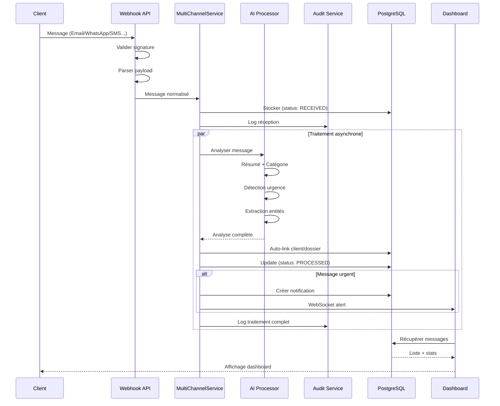
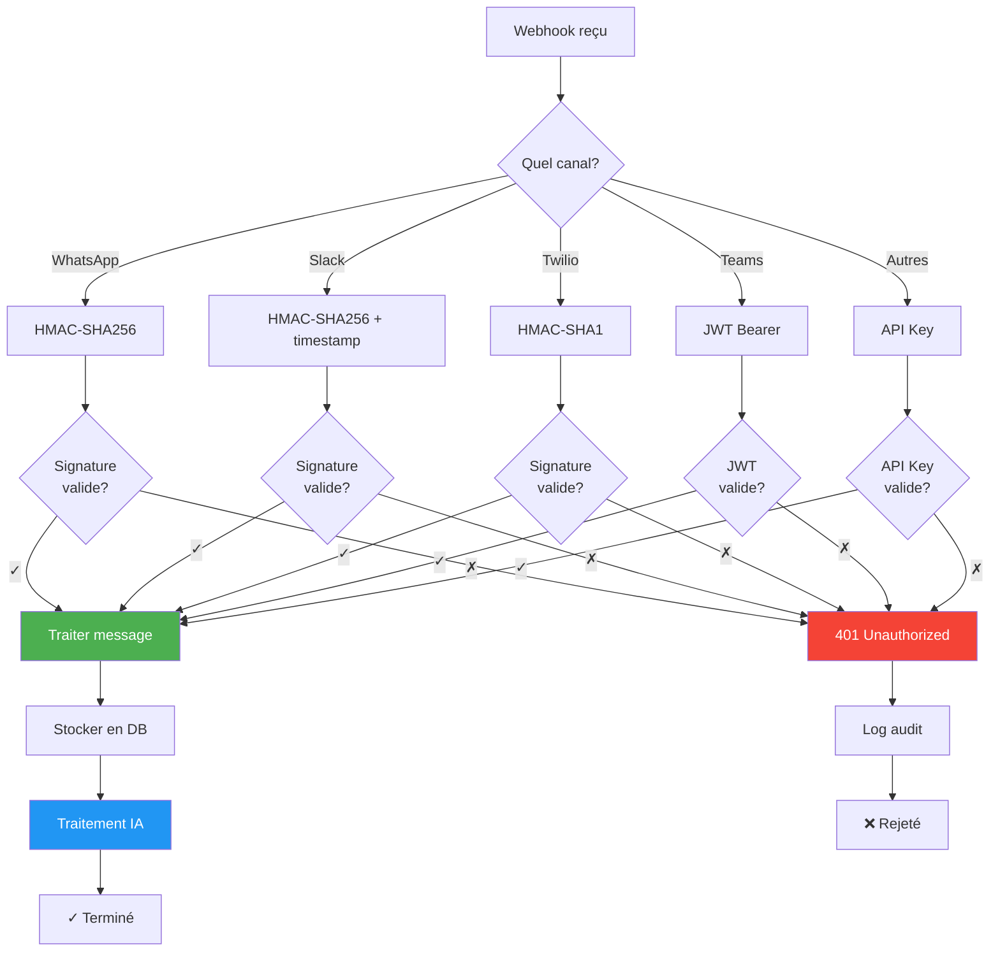
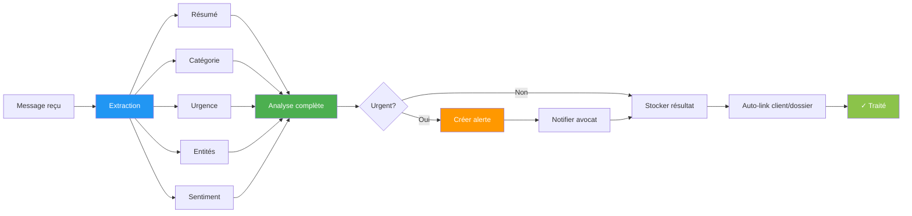
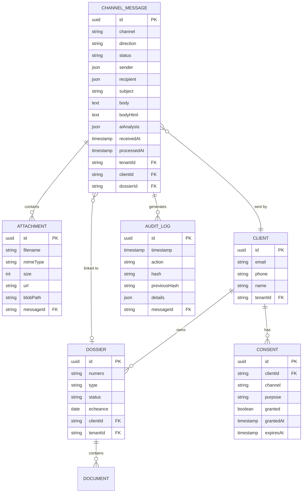
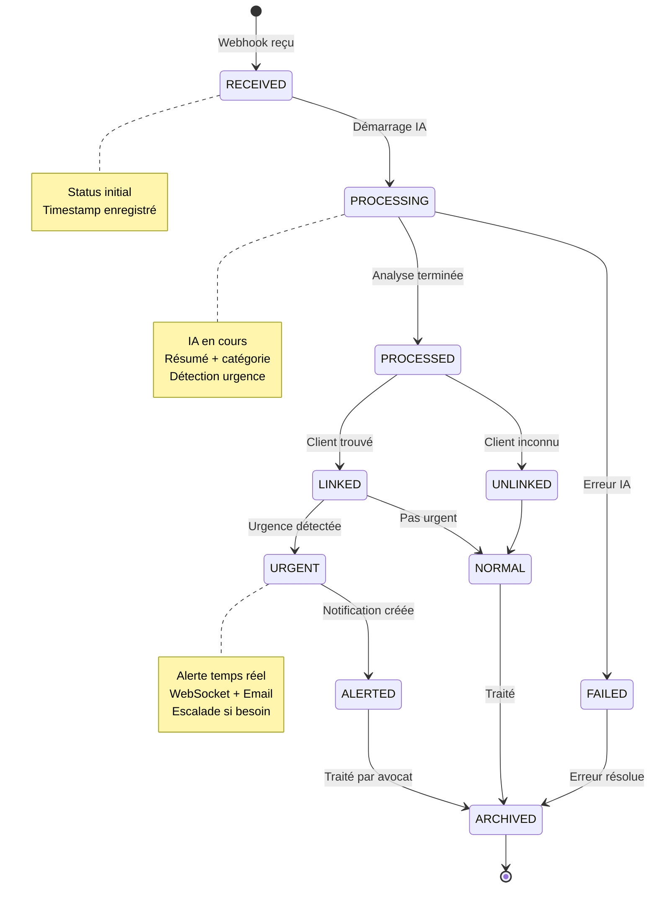
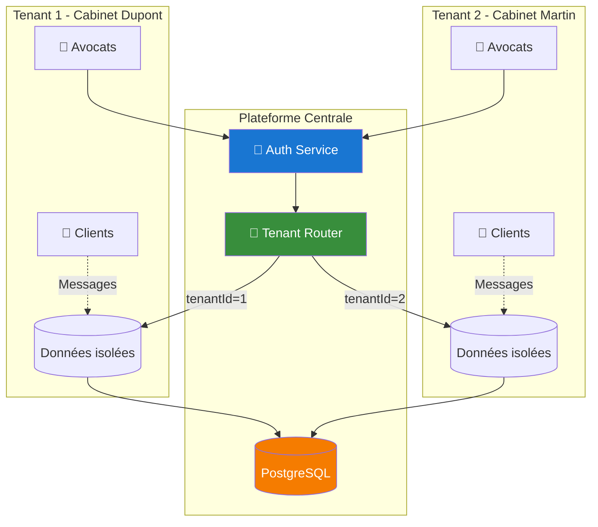
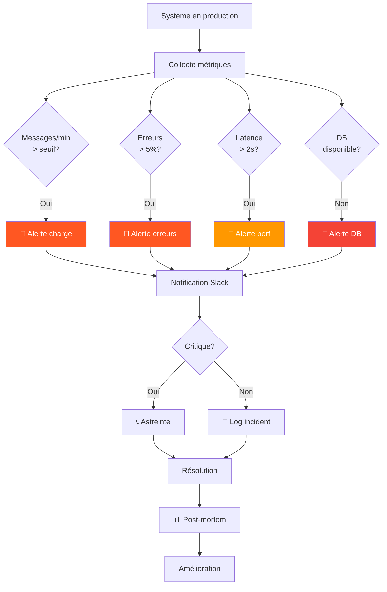
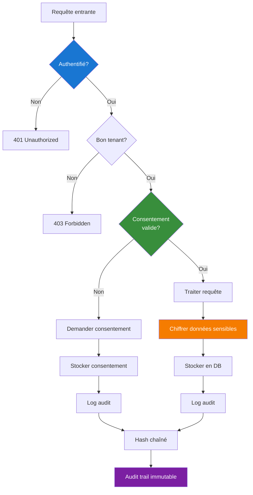
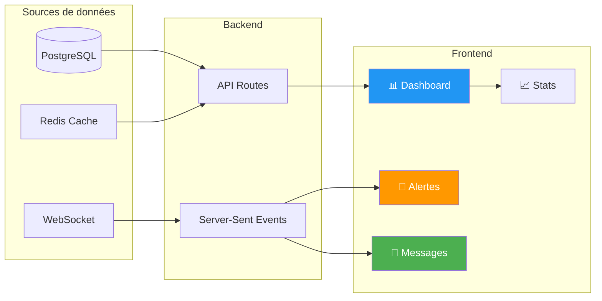

# 📊 DIAGRAMMES SYSTÈME — IA POSTE MANAGER

## 🔄 Flux complet de traitement d'un message



---

## 🏗️ Architecture des canaux

```mermaid
graph TB
    subgraph "Canaux Externes"
        Email[📧 Email]
        WA[💬 WhatsApp]
        SMS[📱 SMS]
        Voice[📞 Voice]
        Slack[💼 Slack]
        Teams[👥 Teams]
        Form[📝 Forms]
        Doc[📄 Documents]
    end
    
    subgraph "Webhook Router"
        Router[/api/webhooks/channel/[channel]]
        Router --> Validate{Valider<br/>signature?}
        Validate -->|✓| Parse[Parser payload]
        Validate -->|✗| Reject[401 Unauthorized]
        Parse --> Normalize[Normaliser format]
    end
    
    subgraph "Core Services"
        MCS[MultiChannelService]
        AIS[AI Processor]
        AuditS[Audit Service]
        NotifS[Notification Service]
    end
    
    subgraph "Stockage"
        PG[(PostgreSQL)]
        Blob[Azure Blob Storage]
        KV[Azure Key Vault]
    end
    
    Email --> Router
    WA --> Router
    SMS --> Router
    Voice --> Router
    Slack --> Router
    Teams --> Router
    Form --> Router
    Doc --> Router
    
    Normalize --> MCS
    MCS --> AIS
    MCS --> AuditS
    MCS --> NotifS
    
    MCS --> PG
    AIS --> PG
    AuditS --> PG
    NotifS --> PG
    
    Doc --> Blob
    Router -.Secrets.-> KV
    
    style Email fill:#e3f2fd
    style WA fill:#e8f5e9
    style SMS fill:#fff3e0
    style Voice fill:#fce4ec
    style Slack fill:#f3e5f5
    style Teams fill:#e0f2f1
    style Form fill:#fff9c4
    style Doc fill:#ffebee
    
    style MCS fill:#1976d2,color:#fff
    style AIS fill:#388e3c,color:#fff
    style AuditS fill:#f57c00,color:#fff
    style NotifS fill:#7b1fa2,color:#fff
```

---

## 🔐 Validation des webhooks



---

## 🧠 Traitement IA



---

## 📊 Modèle de données



---

## 🔄 Cycle de vie d'un message



---

## 🏢 Architecture multi-tenant



---

## 📈 Monitoring & Alertes



---

## 🔐 Sécurité & RGPD



---

## 📊 Dashboard temps réel


