# Threat Model - MemoLib

Date: 2026-04-03
Version: 1.0.0
Methode: STRIDE + DFD + Attack Trees
Scope: Application complete (Next.js frontend + API + DB + services externes)

---

## 1. Data Flow Diagram (DFD) - Niveau 0

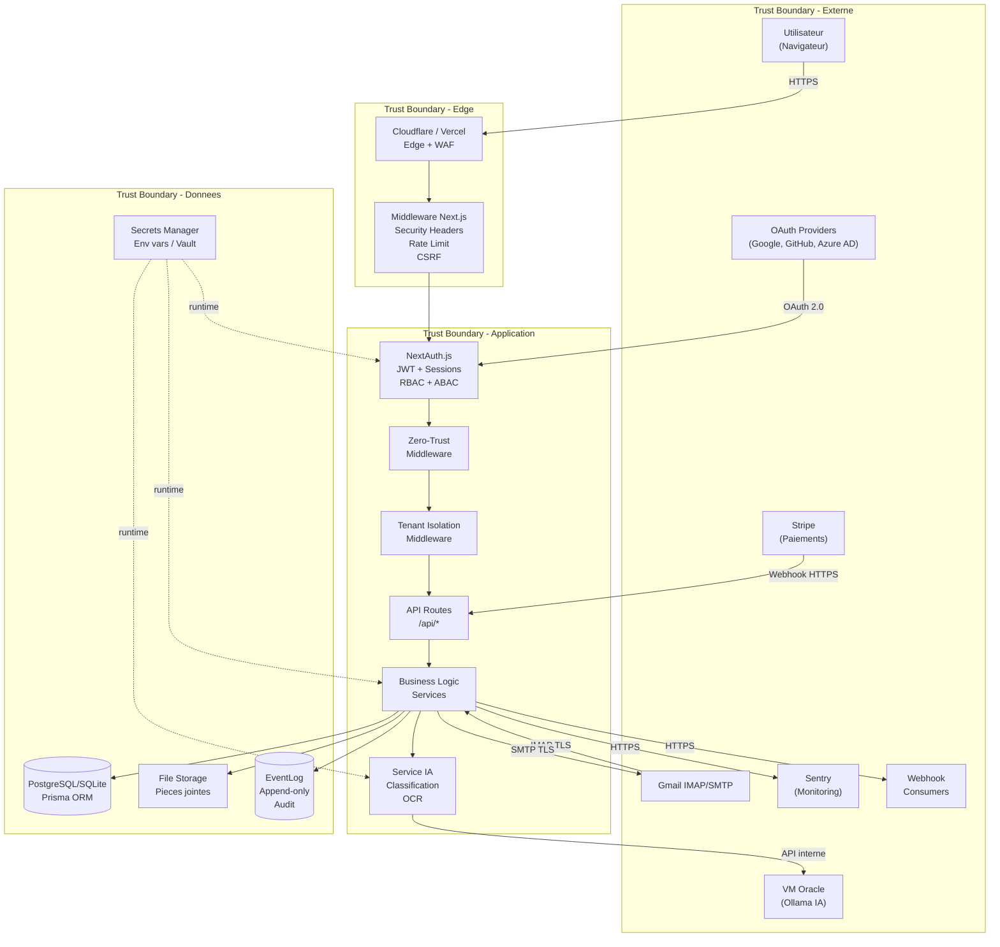

---

## 2. DFD Niveau 1 - Flux Authentification

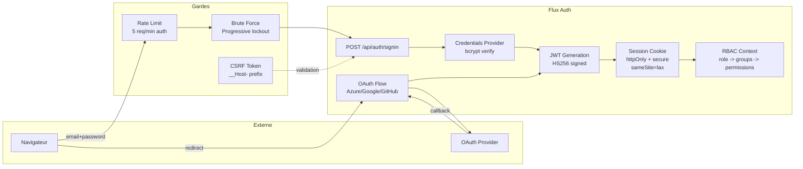

---

## 3. DFD Niveau 1 - Flux Email Ingestion

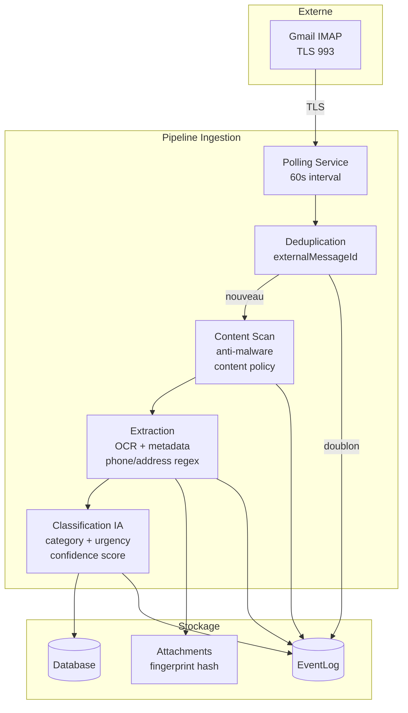

---

## 4. Analyse STRIDE par composant

### 4.1 Matrice STRIDE

```mermaid
block-beta
    columns 7
    block:header
        H0["Composant"]
        H1["Spoofing"]
        H2["Tampering"]
        H3["Repudiation"]
        H4["Info Disc."]
        H5["DoS"]
        H6["Elev. Priv."]
    end
    block:auth
        A0["Auth/JWT"]
        A1["MOYEN"]
        A2["BAS"]
        A3["BAS"]
        A4["MOYEN"]
        A5["HAUT"]
        A6["MOYEN"]
    end
    block:api
        B0["API Routes"]
        B1["BAS"]
        B2["MOYEN"]
        B3["BAS"]
        B4["MOYEN"]
        B5["MOYEN"]
        B6["MOYEN"]
    end
    block:email
        C0["Email IMAP"]
        C1["HAUT"]
        C2["MOYEN"]
        C3["HAUT"]
        C4["MOYEN"]
        C5["HAUT"]
        C6["BAS"]
    end
    block:ia
        D0["Service IA"]
        D1["BAS"]
        D2["HAUT"]
        D3["MOYEN"]
        D4["HAUT"]
        D5["MOYEN"]
        D6["BAS"]
    end
    block:db
        E0["Database"]
        E1["BAS"]
        E2["MOYEN"]
        E3["BAS"]
        E4["HAUT"]
        E5["MOYEN"]
        E6["MOYEN"]
    end
    block:tenant
        F0["Multi-tenant"]
        F1["MOYEN"]
        F2["MOYEN"]
        F3["BAS"]
        F4["CRITIQUE"]
        F5["BAS"]
        F6["HAUT"]
    end
```

### 4.2 Detail par menace

#### S - Spoofing (Usurpation)

| Vecteur | Risque | Controle existant | Gap |
|---|---|---|---|
| Faux OAuth callback | Moyen | Redirect URI whitelist | Valider state param |
| Email source forgee | Haut | Aucun | Verifier DKIM/DMARC/SPF |
| JWT forge | Bas | NEXTAUTH_SECRET signe | Rotation cles periodique |
| Session hijack | Moyen | httpOnly + secure cookie | SameSite=strict en prod |
| Demo credentials leak | Haut | Env vars pour demo | Desactiver demo en prod |

#### T - Tampering (Alteration)

| Vecteur | Risque | Controle existant | Gap |
|---|---|---|---|
| Modification payload API | Moyen | Zod validation partielle | Validation exhaustive tous endpoints |
| Prompt injection IA | Haut | Seuil confiance | Sanitize input avant IA, allowlist prompts |
| Alteration PJ en transit | Moyen | TLS | Hash SHA-256 pre/post stockage |
| Modification EventLog | Moyen | Append-only logique | WORM technique + chainage crypto |
| Tampering session cookie | Bas | JWT signe HS256 | Migrer vers RS256 |

#### R - Repudiation (Contestation)

| Vecteur | Risque | Controle existant | Gap |
|---|---|---|---|
| Contestation action utilisateur | Bas | EventLog + audit | Signature acteur sur events critiques |
| Contestation email envoye | Haut | Aucun | Hash signe pre-dispatch |
| Contestation classification IA | Moyen | Confidence score | Logger model version + prompt hash |
| Contestation validation | Bas | EventLog USER_VALIDATED | Horodatage certifie (TSA) |

#### I - Information Disclosure (Fuite)

| Vecteur | Risque | Controle existant | Gap |
|---|---|---|---|
| Fuite cross-tenant | Critique | Tenant isolation middleware | Tests automatises cross-tenant |
| PII dans logs | Haut | Logger structure | Masquage PII automatique |
| PII vers IA externe | Haut | Aucun | Redaction PII avant envoi IA |
| Erreurs verboses | Moyen | Error handler | Messages generiques en prod |
| Secrets dans code | Moyen | .env + gitignore | GitGuardian + pre-commit hook |
| Exposition headers serveur | Bas | X-Powered-By vide | Confirme en prod |

#### D - Denial of Service

| Vecteur | Risque | Controle existant | Gap |
|---|---|---|---|
| Brute force auth | Haut | Rate limit 5/min + lockout | IP-based + account-based combine |
| Flood API | Moyen | Rate limit 100/min | WAF Cloudflare rules |
| Flood email ingestion | Haut | Aucun | Quota par source + circuit breaker |
| Upload fichiers massifs | Moyen | Aucun explicite | Limite taille + type MIME |
| Saturation IA | Moyen | Fallback mode | Queue + timeout + circuit breaker |

#### E - Elevation of Privilege

| Vecteur | Risque | Controle existant | Gap |
|---|---|---|---|
| Client accede admin | Haut | RBAC middleware | Tests automatises par role |
| Cross-tenant escalation | Critique | Tenant isolation | Audit + pentest regulier |
| IDOR sur ressources | Moyen | Prisma where tenant | Verification systematique ownership |
| Bypass validation humaine | Moyen | Human-in-the-loop | Gate technique hard-block |
| Demo mode en prod | Haut | Env var check | Kill switch automatique |

---

## 5. Attack Trees

### 5.1 Compromission de compte

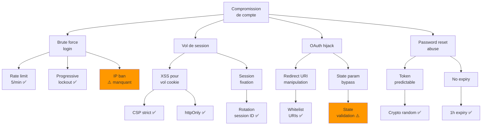

### 5.2 Fuite de donnees cross-tenant

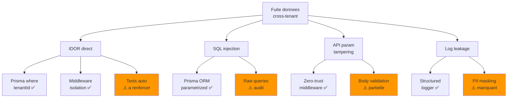

### 5.3 Compromission pipeline IA

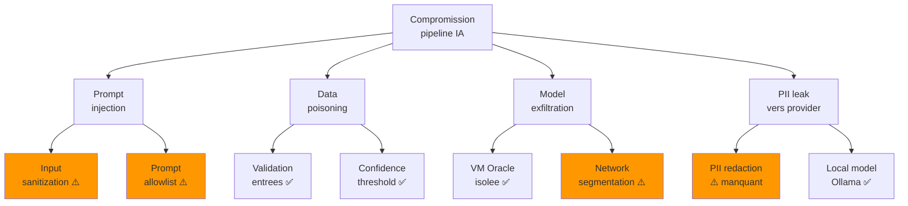

---

## 6. Trust Boundaries Map

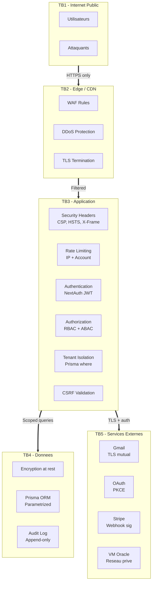

---

## 7. Controles de securite existants

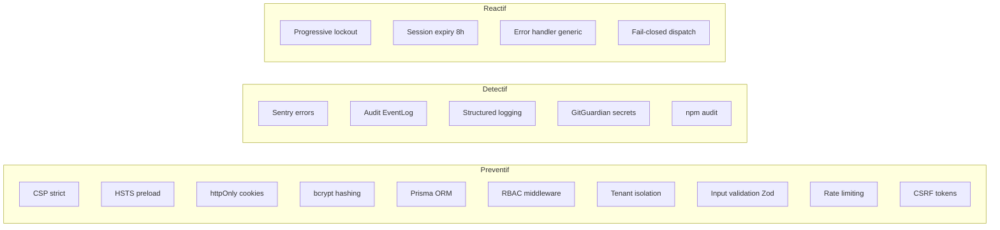

---

## 8. Gaps prioritises et plan de remediation

### P0 - Critique (avant go-live)

| # | Gap | Composant | Remediation | Effort |
|---|---|---|---|---|
| 1 | Demo mode actif en prod | Auth | Kill switch `DEMO_MODE !== 'true'` en prod | 1h |
| 2 | PII non masquees dans logs | Logger | Filtre PII automatique dans structured-logger | 4h |
| 3 | Pas de verification DKIM/SPF emails | Ingestion | Valider headers auth email entrant | 4h |
| 4 | Pas de limite upload fichiers | API | Max 10MB + whitelist MIME types | 2h |

### P1 - Haut (sprint suivant)

| # | Gap | Composant | Remediation | Effort |
|---|---|---|---|---|
| 5 | Prompt injection IA non protege | IA Service | Sanitize + allowlist prompts | 8h |
| 6 | PII envoyees vers IA | IA Service | Redaction PII pre-traitement | 8h |
| 7 | Tests cross-tenant insuffisants | Tests | Suite de tests isolation automatisee | 8h |
| 8 | Pas de quota email ingestion | Ingestion | Rate limit par source + circuit breaker | 4h |
| 9 | Raw SQL queries non auditees | Database | Audit + migration vers Prisma pur | 4h |
| 10 | State param OAuth non valide | Auth | Validation PKCE + state | 2h |

### P2 - Moyen (backlog)

| # | Gap | Composant | Remediation | Effort |
|---|---|---|---|---|
| 11 | EventLog sans immutabilite crypto | Audit | Chainage hash SHA-256 | 8h |
| 12 | Pas de rotation cles JWT | Auth | Rotation automatique 90j | 4h |
| 13 | Network segmentation VM Oracle | Infra | VLAN/firewall rules | 4h |
| 14 | Pas de pentest automatise | CI/CD | OWASP ZAP dans pipeline | 8h |

---

## 9. Workflow de validation du threat model

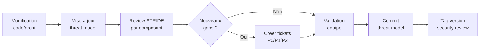

### Checklist de validation

- [ ] Tous les composants sont representes dans le DFD
- [ ] Chaque trust boundary est identifiee
- [ ] Analyse STRIDE complete par composant
- [ ] Attack trees mis a jour pour nouveaux vecteurs
- [ ] Gaps P0 ont des tickets crees
- [ ] Controles existants valides par tests
- [ ] Document versionne et commite

---

## 10. Integration CI/CD

Declencheurs de re-evaluation du threat model:

- Ajout d'un nouveau provider OAuth
- Modification du middleware auth/security/zero-trust/tenant-isolation
- Ajout d'un endpoint API sensible (auth, paiement, admin)
- Modification du pipeline IA ou connexion VM Oracle
- Changement de base de donnees ou ORM
- Ajout d'un service externe (webhook, API tierce)

Fichiers surveilles:

```
src/middleware/security.ts
src/middleware/zero-trust.ts
src/middleware/auth.ts
src/middleware/tenant-isolation.ts
src/app/api/auth/[...nextauth]/route.ts
src/lib/security.ts
src/lib/auth/**
prisma/schema.prisma
```

---

## 11. Lien avec VM Oracle (IA)

La VM Oracle heberge Ollama pour les taches IA lourdes.

Menaces specifiques:

| Menace | Risque | Controle |
|---|---|---|
| Acces non autorise a la VM | Haut | SSH key-only + firewall |
| Exfiltration donnees via model | Moyen | Reseau prive + pas d'internet sortant |
| Prompt injection | Haut | Sanitize cote MemoLib avant envoi |
| Indisponibilite | Moyen | Fallback local + timeout 30s |

Architecture reseau cible:

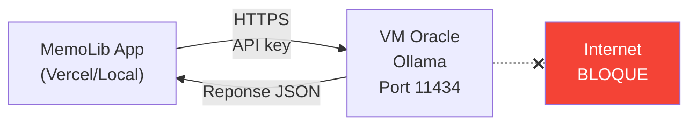

---

Document genere pour review threat model.
Diagrammes compatibles Mermaid (GitHub/GitLab/VS Code).
