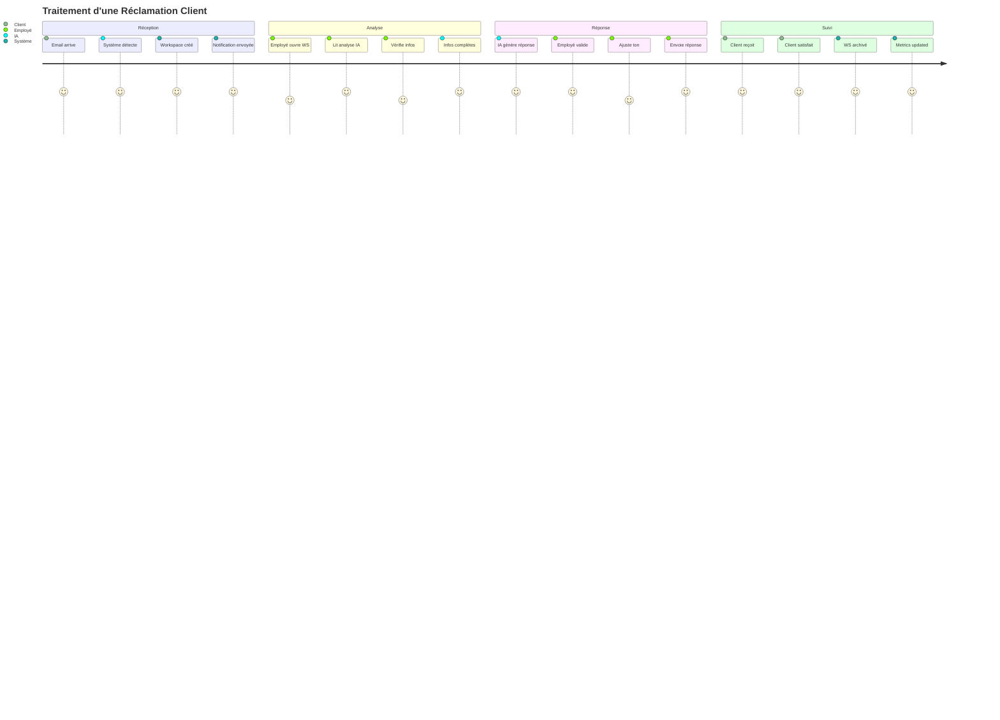

# 🎨 SPÉCIFICATIONS UI/UX — IA POSTE MANAGER

**Date**: 28 Décembre 2025  
**Version**: 1.0.0-mvp  
**Type**: Mockups Textuels Détaillés  
**Standard**: Figma-like Documentation

---

## 📐 PRINCIPES DE DESIGN

### Design System
- **Palette**: Bleu professionnel (#2563EB), Gris neutre (#64748B), Vert succès (#10B981), Rouge alerte (#EF4444)
- **Typographie**: Inter (UI), Source Code Pro (Code/Logs)
- **Espacement**: Système 8px (8, 16, 24, 32, 48, 64px)
- **Coins arrondis**: 8px (cards), 4px (inputs), 16px (modals)
- **Ombres**: Soft (0 2px 8px rgba(0,0,0,0.1)), Medium (0 4px 16px rgba(0,0,0,0.15))

### Accessibilité (RGAA AA)
- ✅ Contraste minimum 4.5:1
- ✅ Navigation clavier complète
- ✅ Screen reader compatible
- ✅ Mode haute-visibilité
- ✅ Textes redimensionnables jusqu'à 200%

### Responsive
- **Desktop**: 1280px+ (full features)
- **Tablet**: 768-1279px (layout adapté)
- **Mobile**: 320-767px (mobile-first)

---

## 🖥️ ÉCRAN 1 : DASHBOARD PRINCIPAL

### Vue d'ensemble
**Route**: `/dashboard`  
**Utilisateur**: Employé authentifié  
**Objectif**: Vue centralisée de tous les workspaces actifs

### Layout Structure
```
┌─────────────────────────────────────────────────────────────────┐
│ HEADER (Fixe - 64px)                                           │
│ ┌──────────┬────────────────────────────────┬─────────────────┐│
│ │ Logo     │ Barre recherche globale        │ User Menu       ││
│ │ [Icon]   │ [🔍 Rechercher un workspace...] │ [👤] [🔔] [⚙️] ││
│ └──────────┴────────────────────────────────┴─────────────────┘│
├─────────────────────────────────────────────────────────────────┤
│ SIDEBAR (240px - Collapsible)     │ MAIN CONTENT               │
│ ┌─────────────────────────────┐  │                            │
│ │ 📊 Dashboard                │  │ ┌────────────────────────┐ │
│ │ 📬 Workspaces (12)          │◄──┼─┤ KPIs Summary          │ │
│ │ ⏱️  En attente (5)          │  │ │ ┌─────┬─────┬─────┐    │ │
│ │ ✅ Traités (7)              │  │ │ │ 12  │ 5   │ 7   │    │ │
│ │ 🔥 Urgents (2)              │  │ │ │Total│Pend.│Done │    │ │
│ │                             │  │ │ └─────┴─────┴─────┘    │ │
│ │ 📁 Archives                 │  │ └────────────────────────┘ │
│ │ 📈 Analytics                │  │                            │
│ │ ⚙️  Paramètres              │  │ ┌────────────────────────┐ │
│ │                             │  │ │ Filtres & Actions      │ │
│ │ ─────────────────────       │  │ │ [Tous] [Urgents]       │ │
│ │ 💡 Suggestions IA (3)       │  │ │ [En cours] [Terminés]  │ │
│ │ ⚠️  Alertes (1)             │  │ │                        │ │
│ └─────────────────────────────┘  │ │ [+ Nouveau Workspace]  │ │
│                                   │ └────────────────────────┘ │
│                                   │                            │
│                                   │ WORKSPACES LIST            │
│                                   │ ┌────────────────────────┐ │
│                                   │ │ 🔥 URGENT              │ │
│                                   │ │ Réclamation Client X   │ │
│                                   │ │ Reçu il y a 2h         │ │
│                                   │ │ [Voir] [Traiter]       │ │
│                                   │ └────────────────────────┘ │
│                                   │                            │
│                                   │ ┌────────────────────────┐ │
│                                   │ │ ⏱️ EN ATTENTE          │ │
│                                   │ │ Demande Info Produit   │ │
│                                   │ │ Reçu il y a 5h         │ │
│                                   │ │ [Voir] [Traiter]       │ │
│                                   │ └────────────────────────┘ │
│                                   │                            │
│                                   │ [Charger plus...]          │
└─────────────────────────────────────────────────────────────────┘
```

### Composants Détaillés

#### 1.1 Header
```
┌─────────────────────────────────────────────────────────────┐
│ ┌────────┐  ┌──────────────────────────┐  ┌──────────────┐ │
│ │ [LOGO] │  │ 🔍 [Recherche globale...] │  │ 👤 J. Dupont │ │
│ │ IA PM  │  │                          │  │ [▼]          │ │
│ └────────┘  └──────────────────────────┘  └──────────────┘ │
│                                            🔔 (2) ⚙️       │
└─────────────────────────────────────────────────────────────┘
```

**Éléments**:
- **Logo**: 40x40px, cliquable (retour dashboard)
- **Barre recherche**: 
  - Placeholder: "Rechercher un workspace, client, mot-clé..."
  - Auto-complétion après 3 caractères
  - Raccourci: `Ctrl+K` (⌘K sur Mac)
  - Recherche en temps réel (debounce 300ms)
- **Icône utilisateur**: 
  - Avatar 32x32px (initiales si pas de photo)
  - Dropdown menu:
    - Mon profil
    - Mes préférences
    - Documentation
    - Se déconnecter
- **Notifications** (🔔):
  - Badge rouge si > 0 notifications
  - Dropdown avec liste des 5 dernières
  - "Tout voir" → page notifications
- **Paramètres** (⚙️):
  - Accès rapide réglages

**États**:
- Normal: Fond blanc, ombre légère
- Scroll: Fond blanc opaque, ombre plus marquée

#### 1.2 Sidebar Navigation
```
┌─────────────────────────────┐
│ NAVIGATION                  │
├─────────────────────────────┤
│ ▶ 📊 Dashboard              │ ← Actif (fond bleu clair)
│   📬 Workspaces (12)        │
│     ⏱️ En attente (5)       │
│     ✅ Traités (7)          │
│     🔥 Urgents (2)          │
│   📁 Archives               │
│   📈 Analytics              │
│   ⚙️ Paramètres             │
├─────────────────────────────┤
│ SMART INSIGHTS              │
├─────────────────────────────┤
│ 💡 Suggestions (3)          │
│   • Fusionner WS #45 & #47  │
│   • Répondre avant 17h WS#12│
│   • Archiver 5 anciens WS   │
│                             │
│ ⚠️ Alertes (1)              │
│   • SLA dépassé WS #34      │
└─────────────────────────────┘
```

**Interactions**:
- Hover: Fond gris clair
- Actif: Fond bleu clair + bordure gauche bleue (4px)
- Collapse/Expand: Animation slide 200ms
- Badges numériques: Mise à jour temps réel

#### 1.3 KPI Cards
```
┌──────────────────────────────────────────────────────┐
│ VUE D'ENSEMBLE                    📅 Aujourd'hui     │
├──────────────────────────────────────────────────────┤
│ ┌─────────┐ ┌─────────┐ ┌─────────┐ ┌─────────┐    │
│ │   12    │ │    5    │ │    7    │ │    2    │    │
│ │  Total  │ │ Attente │ │ Traités │ │ Urgents │    │
│ │ ──────  │ │ ──────  │ │ ──────  │ │ ──────  │    │
│ │ +2 ↑    │ │ -1 ↓    │ │ +3 ↑    │ │ = ─     │    │
│ └─────────┘ └─────────┘ └─────────┘ └─────────┘    │
└──────────────────────────────────────────────────────┘
```

**Détails**:
- Taille: 4 cards égales, responsive (2x2 sur mobile)
- Icônes dynamiques selon valeur
- Variation vs hier: Vert (↑ positif), Rouge (↓ négatif), Gris (=)
- Hover: Tooltip avec détails

#### 1.4 Workspace Card
```
┌────────────────────────────────────────────────────┐
│ 🔥 URGENT                          ⏱️ Il y a 2h    │
├────────────────────────────────────────────────────┤
│ Réclamation - Produit défectueux                  │
│ Client: SARL Dupont & Associés                    │
│                                                    │
│ 📧 Email • 🏷️ Commercial • 👤 Non assigné        │
│                                                    │
│ IA: "Client mécontent, infos complètes,           │
│      réponse type disponible"                     │
│                                                    │
│ ┌──────────────┐ ┌──────────────┐ ┌─────────┐    │
│ │ 👁️ Voir      │ │ ✍️ Traiter   │ │ ⋯ Plus  │    │
│ └──────────────┘ └──────────────┘ └─────────┘    │
└────────────────────────────────────────────────────┘
```

**Éléments**:
- **Badge priorité**: 🔥 Urgent (rouge), ⏱️ Normal (jaune), ✅ Traité (vert)
- **Timestamp**: Relatif (il y a 2h) ou absolu (28 déc. 14:30)
- **Résumé IA**: 2 lignes max, tronqué avec "..."
- **Tags**: Canal, catégorie, assignation
- **Actions**:
  - Voir: Ouvre workspace détaillé
  - Traiter: Workflow de traitement
  - Plus: Menu contextuel (archiver, réassigner, etc.)

**États**:
- Normal: Fond blanc, ombre soft
- Hover: Ombre medium, scale 1.01
- Sélectionné: Bordure bleue 2px
- Traité: Opacité 0.6, badge vert

---

## 🔍 ÉCRAN 2 : WORKSPACE DÉTAILLÉ

### Vue d'ensemble
**Route**: `/workspace/:id`  
**Utilisateur**: Employé  
**Objectif**: Voir tout le contexte, historique, et agir

### Layout Structure
```
┌─────────────────────────────────────────────────────────────────┐
│ HEADER WORKSPACE                                                │
│ ┌─────────────────────────────────────────────────────────────┐ │
│ │ ← Retour  │  WS #00123  │  🔥 URGENT  │  Actions ▼         │ │
│ └─────────────────────────────────────────────────────────────┘ │
├─────────────────────────────────────────────────────────────────┤
│ LEFT PANEL (60%)              │ RIGHT PANEL (40%)               │
│                               │                                 │
│ TIMELINE & MESSAGES           │ IA ASSISTANT                    │
│ ┌───────────────────────────┐ │ ┌─────────────────────────────┐│
│ │ 📧 Message initial        │ │ │ 🤖 Analyse IA               ││
│ │ De: client@example.com    │ │ │                             ││
│ │ Reçu: 28 déc. 12:30       │ │ │ Intention détectée:         ││
│ │                           │ │ │ • Réclamation produit       ││
│ │ "Bonjour, j'ai reçu un    │ │ │                             ││
│ │  produit défectueux..."   │ │ │ Infos disponibles:          ││
│ │                           │ │ │ ✅ Nom client               ││
│ │ [Contenu complet ▼]       │ │ │ ✅ N° commande              ││
│ └───────────────────────────┘ │ │ ✅ Description problème     ││
│                               │ │                             ││
│ ┌───────────────────────────┐ │ │ Actions suggérées:          ││
│ │ 🤖 IA a analysé           │ │ │ 1. Vérifier stock           ││
│ │ • Sentiment: Mécontent    │ │ │ 2. Proposer remplacement    ││
│ │ • Priorité: Urgente       │ │ │ 3. Offrir geste commercial  ││
│ │ • Infos complètes: ✅     │ │ │                             ││
│ └───────────────────────────┘ │ │ [Générer réponse]           ││
│                               │ └─────────────────────────────┘││
│ ┌───────────────────────────┐ │                                 │
│ │ 📝 Formulaire envoyé      │ │ MÉTADONNÉES                     │
│ │ Envoyé: 28 déc. 12:35     │ │ ┌─────────────────────────────┐│
│ │ [Voir formulaire]         │ │ │ Canal: 📧 Email             ││
│ │ └───────────────────────┘ │ │ │ Catégorie: Commercial       ││
│                               │ │ Assigné: Jean D.            ││
│ ┌───────────────────────────┐ │ │ SLA: 4h restantes          ││
│ │ ✅ Client a répondu       │ │ │ Tags: #réclamation #prod    ││
│ │ Reçu: 28 déc. 13:10       │ │ └─────────────────────────────┘│
│ │ [Voir réponse]            │ │                                 │
│ └───────────────────────────┘ │ HISTORIQUE CLIENT               │
│                               │ ┌─────────────────────────────┐│
│ ┌───────────────────────────┐ │ │ Workspaces liés (2):        ││
│ │ ✍️ ZONE RÉPONSE           │ │ │ • WS #00098 (Nov 2025)     ││
│ │                           │ │ │ • WS #00045 (Août 2025)    ││
│ │ [Mode rédaction ▼]        │ │ │                             ││
│ │ ┌─────────────────────┐   │ │ │ Valeur client: 12.5K€       ││
│ │ │ Madame, Monsieur,   │   │ │ │ Satisfaction: 4.2/5         ││
│ │ │                     │   │ │ └─────────────────────────────┘│
│ │ │ [Texte généré IA]   │   │ │                                 │
│ │ │                     │   │ │                                 │
│ │ └─────────────────────┘   │ │                                 │
│ │                           │ │                                 │
│ │ [📎] [😊] [🔗] [AI✨]     │ │                                 │
│ │                           │ │                                 │
│ │ ┌──────────┐ ┌──────────┐│ │                                 │
│ │ │ Envoyer  │ │ Sauver   ││ │                                 │
│ │ └──────────┘ └──────────┘│ │                                 │
│ └───────────────────────────┘ │                                 │
└─────────────────────────────────────────────────────────────────┘
```

### Composants Détaillés

#### 2.1 Header Workspace
```
┌─────────────────────────────────────────────────────────┐
│ ← Retour Dashboard    WS #00123    🔥 URGENT           │
│                                                          │
│ [Archiver] [Réassigner] [Exporter] [⋯ Plus d'actions]  │
└─────────────────────────────────────────────────────────┘
```

**Éléments**:
- Breadcrumb cliquable: Dashboard > Workspaces > WS #00123
- Numéro WS: Copie au clic (toast confirmation)
- Badge priorité dynamique
- Actions dropdown:
  - Archiver
  - Réassigner à un collègue
  - Exporter (PDF/JSON)
  - Marquer comme spam
  - Fusionner avec autre WS
  - Historique des modifications

#### 2.2 Timeline Message
```
┌─────────────────────────────────────────────────────┐
│ 📧 MESSAGE INITIAL              28 déc. 2025 12:30 │
├─────────────────────────────────────────────────────┤
│ De: contact@sarl-dupont.fr                         │
│ À: support@votre-entreprise.fr                     │
│ Objet: Problème commande #CMD-2025-1234            │
│                                                     │
│ Bonjour,                                           │
│                                                     │
│ J'ai reçu ma commande #CMD-2025-1234 ce matin      │
│ et malheureusement le produit est défectueux.      │
│ La référence REF-ABC-123 ne fonctionne pas.        │
│                                                     │
│ Je souhaiterais un échange ou un remboursement.    │
│                                                     │
│ Cordialement,                                      │
│ M. Dupont                                          │
│                                                     │
│ [Voir pièces jointes (2)] [Répondre]              │
└─────────────────────────────────────────────────────┘
```

**Features**:
- Affichage message original (HTML → texte lisible)
- Détection automatique:
  - Numéros commande (cliquables → système externe)
  - Emails (cliquables → nouveau message)
  - Références produits (cliquables → fiche produit)
  - Dates, montants, etc.
- Pièces jointes: Preview inline ou téléchargement
- Actions rapides: Répondre, Transférer, Imprimer

#### 2.3 IA Analysis Panel
```
┌─────────────────────────────────────────────────┐
│ 🤖 ANALYSE INTELLIGENTE                        │
├─────────────────────────────────────────────────┤
│ INTENTION DÉTECTÉE                             │
│ 🎯 Réclamation produit défectueux              │
│    Confiance: 95%                              │
│                                                 │
│ SENTIMENT CLIENT                                │
│ 😟 Mécontent mais poli                         │
│    Score: 3/10 (négatif)                       │
│                                                 │
│ INFORMATIONS COLLECTÉES                         │
│ ✅ Nom client: M. Dupont                       │
│ ✅ Email: contact@sarl-dupont.fr               │
│ ✅ N° commande: CMD-2025-1234                  │
│ ✅ Référence produit: REF-ABC-123              │
│ ✅ Description problème: Produit ne fonctionne │
│ ✅ Demande: Échange ou remboursement           │
│                                                 │
│ INFORMATIONS MANQUANTES                         │
│ ⚠️ Aucune - Dossier complet                    │
│                                                 │
│ ACTIONS RECOMMANDÉES                            │
│ 1. ✅ Vérifier disponibilité stock (Auto)      │
│ 2. 💬 Proposer échange sous 48h                │
│ 3. 🎁 Offrir geste commercial (-10%)           │
│ 4. 📊 Mettre à jour CRM                        │
│                                                 │
│ PRIORISATION IA                                 │
│ 🔥 URGENT - Répondre avant 16:30               │
│    Raison: Client VIP, SLA 4h, sentiment négatif│
│                                                 │
│ ┌─────────────────────────────────────────────┐│
│ │ [✨ Générer réponse automatique]            ││
│ │ [📋 Générer formulaire complémentaire]      ││
│ │ [🔄 Re-analyser]                            ││
│ └─────────────────────────────────────────────┘│
└─────────────────────────────────────────────────┘
```

**Intelligence**:
- Analyse en temps réel (< 2s)
- Scores de confiance visibles
- Explications claires (pas de boîte noire)
- Actions suggérées avec priorités
- Réanalyse possible si contexte change

#### 2.4 Éditeur de Réponse
```
┌─────────────────────────────────────────────────────┐
│ ✍️ RÉDIGER LA RÉPONSE                              │
├─────────────────────────────────────────────────────┤
│ Mode: [IA Complète ▼] [Manuel] [IA Assistée]      │
│                                                     │
│ Ton: [Professionnel ▼] [Amical] [Formel]          │
│ Langue: [Français ▼] [Anglais] [Espagnol]         │
│                                                     │
│ ┌─────────────────────────────────────────────────┐│
│ │ Objet: RE: Problème commande #CMD-2025-1234    ││
│ │                                                 ││
│ │ Madame, Monsieur,                               ││
│ │                                                 ││
│ │ Nous sommes sincèrement désolés d'apprendre    ││
│ │ que votre produit REF-ABC-123 est défectueux.  ││
│ │                                                 ││
│ │ Nous avons vérifié nos stocks et pouvons vous  ││
│ │ proposer un échange immédiat. Un nouveau       ││
│ │ produit vous sera expédié sous 48h en         ││
│ │ livraison express (offerte).                   ││
│ │                                                 ││
│ │ En guise de compensation pour ce désagrément,  ││
│ │ nous vous offrons également une réduction de   ││
│ │ 10% sur votre prochaine commande (code: SORRY10)││
│ │                                                 ││
│ │ Notre service client reste à votre disposition.││
│ │                                                 ││
│ │ Cordialement,                                  ││
│ │ L'équipe Support                               ││
│ │                                                 ││
│ │ ─────────────────────────                      ││
│ │ ✨ Généré par IA - Relu par Jean D.           ││
│ └─────────────────────────────────────────────────┘│
│                                                     │
│ [📎 Joindre] [😊 Émojis] [🔗 Liens] [✨ Améliorer]│
│                                                     │
│ Qualité IA: ⭐⭐⭐⭐⭐ (9.2/10)                      │
│ Vérifications:                                      │
│ ✅ Orthographe                                     │
│ ✅ Grammaire                                       │
│ ✅ Ton approprié                                   │
│ ✅ Informations exactes                            │
│ ⚠️ Validation humaine recommandée (1er contact VIP)│
│                                                     │
│ ┌────────────┐ ┌────────────┐ ┌────────────┐      │
│ │ 📧 Envoyer │ │ 💾 Sauver  │ │ 👁️ Prévisualiser│ │
│ └────────────┘ └────────────┘ └────────────┘      │
└─────────────────────────────────────────────────────┘
```

**Modes de rédaction**:
1. **IA Complète**: IA génère tout (user valide)
2. **IA Assistée**: User écrit, IA suggère améliorations
3. **Manuel**: User écrit seul (IA désactivée)

**Features**:
- Auto-save toutes les 10s
- Suggestions temps réel (grammaire, ton, etc.)
- Templates réutilisables
- Variables dynamiques ({nom_client}, {num_commande})
- Preview avant envoi (rendu email réel)
- Historique des versions (undo/redo infini)

#### 2.5 Métadonnées & Context Panel
```
┌─────────────────────────────────────────┐
│ 📊 MÉTADONNÉES                         │
├─────────────────────────────────────────┤
│ Canal: 📧 Email                        │
│ Catégorie: 🏷️ Commercial              │
│ Priorité: 🔥 Urgent                    │
│ Assigné: 👤 Jean Dupont                │
│                                         │
│ SLA: ⏱️ 3h 42min restantes            │
│ [──────────■──] 75% écoulé             │
│                                         │
│ Tags: #réclamation #produit #vip       │
│ [+ Ajouter tag]                        │
│                                         │
│ ─────────────────────────               │
│                                         │
│ 📈 HISTORIQUE CLIENT                   │
├─────────────────────────────────────────┤
│ SARL Dupont & Associés                 │
│                                         │
│ Client depuis: Janv 2024               │
│ Valeur totale: 12.500€                 │
│ Commandes: 23                          │
│ Satisfaction: ⭐⭐⭐⭐☆ (4.2/5)        │
│                                         │
│ Workspaces précédents (2):             │
│ • WS #00098 - Demande devis (Nov)      │
│   ✅ Traité en 2h                      │
│ • WS #00045 - Info livraison (Août)    │
│   ✅ Traité en 1h                      │
│                                         │
│ [Voir fiche client complète →]         │
│                                         │
│ ─────────────────────────               │
│                                         │
│ 🔗 WORKSPACES LIÉS                     │
├─────────────────────────────────────────┤
│ Aucun pour le moment                   │
│                                         │
│ [Lier à un autre WS]                   │
└─────────────────────────────────────────┘
```

**Données affichées**:
- Métadonnées éditables (catégorie, priorité, tags)
- SLA dynamique avec barre de progression
- Historique client depuis CRM (si intégré)
- Workspaces liés (même client, même sujet)
- Suggestions de liens automatiques par IA

---

## 📋 ÉCRAN 3 : FORMULAIRE INTELLIGENT

### Vue d'ensemble
**Route**: `/workspace/:id/form` ou Modal  
**Utilisateur**: Client ou Employé  
**Objectif**: Collecter informations manquantes

### Layout (Modal)
```
┌─────────────────────────────────────────────────────┐
│ ✖️                  INFORMATIONS COMPLÉMENTAIRES    │
├─────────────────────────────────────────────────────┤
│                                                     │
│ Pour traiter votre demande efficacement, nous      │
│ avons besoin de quelques informations              │
│ supplémentaires :                                  │
│                                                     │
│ ┌─────────────────────────────────────────────────┐│
│ │ 1. Numéro de commande *                        ││
│ │ ┌─────────────────────────────────────────────┐││
│ │ │ CMD-                                        │││
│ │ └─────────────────────────────────────────────┘││
│ │ Format: CMD-YYYY-XXXX                          ││
│ └─────────────────────────────────────────────────┘│
│                                                     │
│ ┌─────────────────────────────────────────────────┐│
│ │ 2. Date de réception                           ││
│ │ ┌─────────────────────────────────────────────┐││
│ │ │ 📅 Sélectionner une date...                │││
│ │ └─────────────────────────────────────────────┘││
│ └─────────────────────────────────────────────────┘│
│                                                     │
│ ┌─────────────────────────────────────────────────┐│
│ │ 3. Description du problème *                   ││
│ │ ┌─────────────────────────────────────────────┐││
│ │ │                                             │││
│ │ │ Décrivez précisément le problème rencontré  │││
│ │ │                                             │││
│ │ │                                             │││
│ │ └─────────────────────────────────────────────┘││
│ │ 0/500 caractères                               ││
│ └─────────────────────────────────────────────────┘│
│                                                     │
│ ┌─────────────────────────────────────────────────┐│
│ │ 4. Pièces jointes (optionnel)                  ││
│ │ ┌─────────────────────────────────────────────┐││
│ │ │ 📎 Glissez vos fichiers ici                │││
│ │ │    ou cliquez pour sélectionner            │││
│ │ │                                             │││
│ │ │ Formats: JPG, PNG, PDF (max 10Mo)          │││
│ │ └─────────────────────────────────────────────┘││
│ └─────────────────────────────────────────────────┘│
│                                                     │
│ * Champs obligatoires                              │
│                                                     │
│ ┌──────────────────────┐ ┌──────────────────────┐ │
│ │ ← Précédent          │ │ Envoyer →            │ │
│ └──────────────────────┘ └──────────────────────┘ │
│                                                     │
│ 🔒 Vos données sont chiffrées et sécurisées        │
└─────────────────────────────────────────────────────┘
```

### Types de Champs

#### 3.1 Input Texte
```
┌─────────────────────────────────────────┐
│ Label du champ *                        │
│ ┌─────────────────────────────────────┐ │
│ │ Texte saisi...                      │ │
│ └─────────────────────────────────────┘ │
│ ℹ️ Aide contextuelle si nécessaire     │
└─────────────────────────────────────────┘
```

**États**:
- Normal: Bordure grise
- Focus: Bordure bleue, ombre
- Erreur: Bordure rouge, message erreur en rouge
- Succès: Bordure verte, icône ✓
- Désactivé: Fond gris clair, texte gris

**Validations**:
- Temps réel (après blur)
- Messages d'erreur clairs
- Suggestions si format incorrect

#### 3.2 Sélecteur Date
```
┌─────────────────────────────────────────┐
│ Date de l'événement *                   │
│ ┌─────────────────────────────────────┐ │
│ │ 📅 28/12/2025              [▼]     │ │
│ └─────────────────────────────────────┘ │
│                                         │
│ [Calendrier popup si clic sur ▼]       │
└─────────────────────────────────────────┘
```

#### 3.3 Upload Fichier
```
┌─────────────────────────────────────────┐
│ Pièces jointes                          │
│ ┌─────────────────────────────────────┐ │
│ │ 📎 Glissez vos fichiers ici        │ │
│ │    ou cliquez pour sélectionner    │ │
│ │                                     │ │
│ │ JPG, PNG, PDF - Max 10Mo par fichier│ │
│ └─────────────────────────────────────┘ │
│                                         │
│ Fichiers ajoutés (2):                  │
│ • facture.pdf (1.2Mo) [✖️]            │
│ • photo.jpg (850Ko) [✖️]              │
└─────────────────────────────────────────┘
```

**Features**:
- Drag & drop
- Multi-upload
- Progress bar par fichier
- Preview images
- Validation taille/format
- Suppression individuelle

#### 3.4 Accessibilité
- **Navigation clavier**: Tab/Shift+Tab entre champs
- **Screen reader**: Labels ARIA complets
- **Contraste**: Minimum 4.5:1
- **Erreurs**: Annoncées vocalement
- **Aide**: Tooltips accessibles au focus clavier

---

## 📊 ÉCRAN 4 : ANALYTICS & REPORTING

### Vue d'ensemble
**Route**: `/analytics`  
**Utilisateur**: Manager/Admin  
**Objectif**: Métriques performance et insights

### Layout
```
┌─────────────────────────────────────────────────────────────────┐
│ 📈 ANALYTICS & REPORTING                                       │
├─────────────────────────────────────────────────────────────────┤
│ Période: [Aujourd'hui ▼] [Cette semaine] [Ce mois] [Personnalisé]│
│ Comparaison: vs. [Semaine dernière ▼]                          │
├─────────────────────────────────────────────────────────────────┤
│ KPIs PRINCIPAUX                                                 │
│ ┌─────────┬─────────┬─────────┬─────────┬─────────┐           │
│ │ Total   │ Traités │ Temps   │ Satisf. │ Économie││           │
│ │ 156     │ 142     │ 2.3h    │ 94%     │ 18.5K€  ││           │
│ │ +12↑    │ +15↑    │ -0.5↓   │ +2%↑    │ +3K↑    ││           │
│ └─────────┴─────────┴─────────┴─────────┴─────────┘           │
├─────────────────────────────────────────────────────────────────┤
│ GRAPHIQUES                                                      │
│ ┌───────────────────────────┬───────────────────────────┐      │
│ │ Volume par jour           │ Temps de traitement       │      │
│ │ [Graphique ligne]         │ [Graphique barre]         │      │
│ │                           │                           │      │
│ │   150│      ●─────●       │   5h│ ████                │      │
│ │      │    ●─        ●     │     │ ███                 │      │
│ │   100│  ●─                │   3h│ ████ ███            │      │
│ │      │●─                  │     │ ████ ███ ██         │      │
│ │    50│                    │   1h│ ████ ███ ██ ██      │      │
│ │      └──────────────────  │     └──────────────────   │      │
│ │      L M M J V S D        │      L  M  J  V  S        │      │
│ └───────────────────────────┴───────────────────────────┘      │
│                                                                 │
│ ┌───────────────────────────┬───────────────────────────┐      │
│ │ Canaux de réception       │ Catégories de demandes    │      │
│ │ [Graphique camembert]     │ [Graphique donut]         │      │
│ │                           │                           │      │
│ │     Email 60%             │   Commercial 40%          │      │
│ │     Chat 25%              │   Technique 35%           │      │
│ │     SMS 10%               │   Admin 15%               │      │
│ │     Autre 5%              │   Autre 10%               │      │
│ └───────────────────────────┴───────────────────────────┘      │
├─────────────────────────────────────────────────────────────────┤
│ TOP INSIGHTS IA                                                 │
│ 💡 Le lundi reçoit 40% plus de messages que la moyenne         │
│ 💡 Les réclamations sont traitées 2x plus vite avec IA         │
│ 💡 3 clients VIP nécessitent attention particulière            │
│ ⚠️ Pic de charge attendu jeudi 30 déc (+25%)                  │
│                                                                 │
│ [Voir rapport complet PDF] [Exporter données CSV]             │
└─────────────────────────────────────────────────────────────────┘
```

### Composants Détaillés

#### 4.1 KPI Card
```
┌─────────────────────┐
│ TOTAL WORKSPACES    │
├─────────────────────┤
│       156           │
│                     │
│ +12 vs hier ↑       │
│ (+8.3%)             │
│                     │
│ ▁▂▃▅▆█ Tendance    │
└─────────────────────┘
```

#### 4.2 Graphique Ligne (Tendance)
```
Volume de messages (7 derniers jours)

  150│                    ●─────●
     │               ●────
  100│          ●────
     │     ●────
   50│●────
     └─────────────────────────────
      L   M   M   J   V   S   D

Légende: ● Cette semaine  ○ Semaine dernière
```

**Interactions**:
- Hover: Tooltip avec valeur exacte
- Zoom: Scroll pour zoomer période
- Export: PNG, SVG, PDF

---

## ⚙️ ÉCRAN 5 : PARAMÈTRES

### Layout
```
┌─────────────────────────────────────────────────────────────────┐
│ ⚙️ PARAMÈTRES                                                   │
├─────────────────────────────────────────────────────────────────┤
│ SIDEBAR                       │ CONTENT                         │
│ ┌───────────────────────────┐│                                 │
│ │ 👤 Mon Profil             ││ MON PROFIL                      │
│ │ 🔔 Notifications          ││ ┌─────────────────────────────┐ │
│ │ 🎨 Apparence              ││ │ Photo de profil             │ │
│ │ 🔐 Sécurité & Confidentialité││ [Avatar 100x100]          │ │
│ │ 🌐 Langue & Région        ││ │ [Modifier photo]            │ │
│ │ 🤖 IA & Automatisation    ││ └─────────────────────────────┘ │
│ │ 📊 Canaux                 ││                                 │
│ │ 🏷️ Catégories & Tags      ││ Informations personnelles       │
│ │ 📧 Signatures             ││ • Nom: Jean Dupont              │
│ │ ⚡ Intégrations           ││ • Email: j.dupont@entreprise.fr │
│ │ 💳 Facturation            ││ • Rôle: Gestionnaire Support    │
│ │ 📜 Logs d'audit           ││ • Département: Service Client   │
│ └───────────────────────────┘│                                 │
│                               │ [Modifier] [Changer mot de passe]│
│                               │                                 │
│                               │ Préférences de travail          │
│                               │ ☐ Recevoir workspaces urgents   │
│                               │ ☑ Activer mode absence          │
│                               │ ☑ Afficher suggestions IA       │
│                               │                                 │
│                               │ [Sauvegarder les modifications] │
└─────────────────────────────────────────────────────────────────┘
```

### Sections Importantes

#### 5.1 Notifications
```
┌─────────────────────────────────────────────────┐
│ 🔔 NOTIFICATIONS                               │
├─────────────────────────────────────────────────┤
│ Email                                           │
│ ☑ Nouveau workspace assigné                    │
│ ☑ Workspace urgent (< 2h SLA)                  │
│ ☐ Réponse client reçue                         │
│ ☑ Rapport quotidien (9h00)                     │
│                                                 │
│ Dans l'application                              │
│ ☑ Notifications temps réel                     │
│ ☑ Son pour urgences                            │
│ ☐ Notifications desktop                        │
│                                                 │
│ Mobile (si app installée)                       │
│ ☑ Push notifications                           │
│ ☐ SMS pour urgences critiques                  │
│                                                 │
│ [Enregistrer]                                  │
└─────────────────────────────────────────────────┘
```

#### 5.2 IA & Automatisation
```
┌─────────────────────────────────────────────────┐
│ 🤖 IA & AUTOMATISATION                         │
├─────────────────────────────────────────────────┤
│ Niveau d'autonomie IA                           │
│ ○ Basique (suggestions uniquement)             │
│ ● Avancée (génération + suggestions)           │
│ ○ Complète (réponses auto sans validation)     │
│                                                 │
│ Réponses automatiques                           │
│ ☑ Activer pour messages simples                │
│ ☐ Activer pour tous les messages                │
│ ☑ Toujours demander validation humaine         │
│                                                 │
│ Génération de formulaires                       │
│ ☑ Automatique si infos manquantes              │
│ ☑ Mode accessible par défaut                   │
│                                                 │
│ Priorisation                                    │
│ ☑ Laisser IA gérer les priorités               │
│ ☐ Toujours marquer VIP comme urgent            │
│                                                 │
│ Qualité minimale des réponses IA                │
│ [──────■──────] 7/10                           │
│                                                 │
│ [Enregistrer] [Restaurer par défaut]           │
└─────────────────────────────────────────────────┘
```

#### 5.3 Sécurité
```
┌─────────────────────────────────────────────────┐
│ 🔐 SÉCURITÉ & CONFIDENTIALITÉ                  │
├─────────────────────────────────────────────────┤
│ Authentification                                │
│ ☑ Authentification à deux facteurs (2FA)       │
│ [Configurer 2FA]                               │
│                                                 │
│ Sessions actives (3)                            │
│ • Chrome (Windows) - Actuelle                  │
│ • Firefox (Windows) - il y a 2h [Déconnecter] │
│ • Mobile App - il y a 1j [Déconnecter]         │
│                                                 │
│ Données personnelles (RGPD)                     │
│ [Télécharger mes données]                      │
│ [Supprimer mon compte]                         │
│                                                 │
│ Chiffrement                                     │
│ ✅ Données chiffrées AES-256                   │
│ ✅ Communications TLS 1.3                      │
│                                                 │
│ Logs d'activité                                 │
│ [Voir mes logs des 30 derniers jours]          │
└─────────────────────────────────────────────────┘
```

---

## 📱 ÉCRAN 6 : VERSION MOBILE

### Dashboard Mobile
```
┌─────────────────────┐
│ ☰  IA Poste  🔔(2) │
├─────────────────────┤
│ 📊 VUE D'ENSEMBLE   │
│                     │
│ ┌─────┬─────┬─────┐│
│ │ 12  │  5  │  7  ││
│ │Total│Pend.│Done ││
│ └─────┴─────┴─────┘│
│                     │
│ WORKSPACES          │
│ ┌─────────────────┐ │
│ │🔥 URGENT        │ │
│ │Réclamation      │ │
│ │Client X         │ │
│ │Il y a 2h        │ │
│ │                 │ │
│ │[Voir] [Traiter] │ │
│ └─────────────────┘ │
│                     │
│ ┌─────────────────┐ │
│ │⏱️ EN ATTENTE    │ │
│ │Demande info     │ │
│ │Il y a 5h        │ │
│ │                 │ │
│ │[Voir] [Traiter] │ │
│ └─────────────────┘ │
│                     │
│ [Charger plus...]   │
│                     │
├─────────────────────┤
│ 🏠  📬  📊  ⚙️     │ (Bottom Navigation)
└─────────────────────┘
```

### Workspace Mobile
```
┌─────────────────────┐
│ ← WS #123    ⋯ Plus│
├─────────────────────┤
│ 🔥 URGENT           │
│ Réclamation produit │
│                     │
│ ┌─────────────────┐ │
│ │ 🤖 IA           │ │
│ │ • Réclamation   │ │
│ │ • Infos OK ✅   │ │
│ │ • Répondre vite │ │
│ │                 │ │
│ │ [Générer rép.]  │ │
│ └─────────────────┘ │
│                     │
│ 📧 MESSAGE          │
│ ┌─────────────────┐ │
│ │ De: client@...  │ │
│ │ 28 déc. 12:30   │ │
│ │                 │ │
│ │ "Bonjour,       │ │
│ │ j'ai reçu..."   │ │
│ │                 │ │
│ │ [Lire plus ▼]   │ │
│ └─────────────────┘ │
│                     │
│ ✍️ RÉPONSE          │
│ ┌─────────────────┐ │
│ │ Madame, Monsieur│ │
│ │                 │ │
│ │ Nous sommes...  │ │
│ │                 │ │
│ │ [Éditer]        │ │
│ └─────────────────┘ │
│                     │
│ [📧 Envoyer]        │
└─────────────────────┘
```

**Adaptations Mobile**:
- Bottom navigation (thumbs-friendly)
- Swipe gestures (retour, actions rapides)
- Cards empilées verticalement
- Boutons grande taille (44x44px min)
- Moins de texte, plus d'icônes
- Mode hors-ligne partiel

---

## 🎯 PARCOURS UTILISATEUR COMPLET

### Scénario : Nouvelle Réclamation Client



---

## ✅ CHECKLIST UI/UX

### Accessibilité
- [ ] Contraste 4.5:1 minimum partout
- [ ] Navigation clavier complète
- [ ] Labels ARIA sur tous les éléments interactifs
- [ ] Textes alt pour images
- [ ] Annonces vocales pour actions critiques
- [ ] Mode haute visibilité disponible
- [ ] Zoom 200% sans perte de fonctionnalité

### Performance
- [ ] Chargement initial < 3s
- [ ] Interactions < 100ms
- [ ] Lazy loading images
- [ ] Code splitting par route
- [ ] Cache agressif des assets
- [ ] Optimisation mobile (< 1s)

### Responsive
- [ ] Mobile 320px+ fonctionne
- [ ] Tablet 768px+ optimisé
- [ ] Desktop 1280px+ full features
- [ ] Touch-friendly (44x44px min)
- [ ] Pas de scroll horizontal

### Sécurité UI
- [ ] Inputs sanitizés
- [ ] XSS prevention
- [ ] CSRF tokens
- [ ] Pas de secrets dans le DOM
- [ ] Logout auto après inactivité
- [ ] Confirmation pour actions destructives

---

**Créé le**: 28 Décembre 2025  
**Version**: 1.0.0  
**Designer**: GitHub Copilot  
**Status**: ✅ Ready for Development

**Next**: [Backlog MVP Priorisé](BACKLOG_MVP.md)
