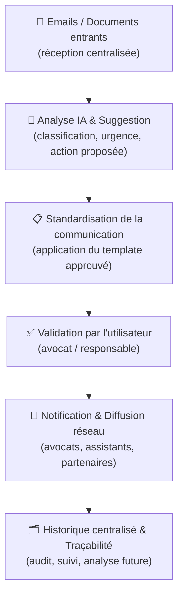
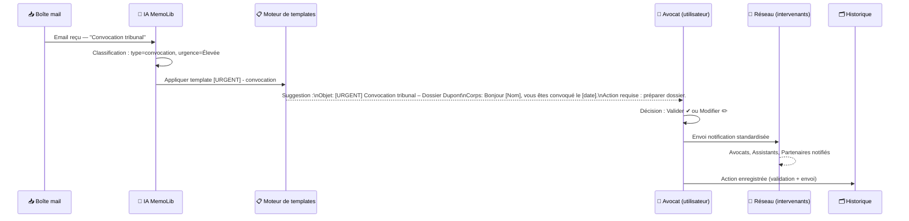

# 📊 Workflow de Standardisation des Communications — MemoLib

**Date**: 2026-04-01  
**Version**: 1.0.0

---

## 🎯 Objectif

Ce document décrit et visualise le workflow complet de traitement des communications dans MemoLib, depuis la réception d'un email ou document jusqu'à sa traçabilité dans l'historique centralisé.

---

## 1️⃣ Vue globale du workflow

---

## 2️⃣ Détail de chaque étape

### 📧 Étape 1 — Emails / Documents entrants

- Réception centralisée de tous les emails et documents entrants.
- Sources : comptes Gmail (IMAP), documents joints, notes internes.
- Déduplication automatique par `messageId` unique.

### 🤖 Étape 2 — Analyse IA & Suggestion

L'IA classe chaque message selon :

| Critère   | Exemples de valeurs                                      |
|-----------|----------------------------------------------------------|
| **Type**  | Convocation tribunal, litige, contrat, demande client    |
| **Urgence** | Élevée, Moyenne, Faible                               |
| **Action proposée** | "Préparer défense", "Proposer rendez-vous", "Envoyer devis" |

### 📋 Étape 3 — Standardisation de la communication

- Application d'un **template pré-approuvé** correspondant au type de message.
- Structure uniforme : **Objet**, **Corps**, **Ton**, **Ordre de priorité**.
- Complétion automatique : salutations, mentions légales, destinataires.

### ✅ Étape 4 — Validation par l'utilisateur

L'avocat ou responsable dispose de deux actions :

| Action | Comportement |
|--------|-------------|
| **✔ Valider** | Le message est envoyé tel quel selon le standard réseau |
| **✏️ Modifier** | L'utilisateur ajuste le contenu avant l'envoi |

- **Valider** : le message est envoyé tel quel selon le standard.
- **Modifier** : l'utilisateur ajuste le contenu avant envoi.

### 🔔 Étape 5 — Notification & Diffusion réseau

- Envoi du message standardisé à tous les intervenants concernés.
- Destinataires possibles : Avocats, Assistants, Partenaires.
- Format identique pour tous, garantissant clarté et homogénéité.

### 🗂️ Étape 6 — Historique centralisé & Traçabilité

- Enregistrement immuable de chaque action, email et validation (via `EventLog`).
- Consultable pour audit, suivi de dossier et analyse future.
- Conforme aux exigences RGPD de traçabilité.

---

## 3️⃣ Exemple concret — Convocation tribunal

### Diagramme de séquence

### Résultat du template standardisé

| Champ  | Contenu                                                              |
|--------|----------------------------------------------------------------------|
| **Objet** | `[URGENT] Convocation tribunal – Dossier Dupont`                |
| **Corps** | Bonjour [Nom], vous êtes convoqué le [date]. Action requise : préparer dossier. |
| **Ton**   | Professionnel, direct, conforme au standard réseau              |
| **Actions** | `✔ Valider` ou `✏️ Modifier`                              |

---

## 4️⃣ Tableau récapitulatif des modules

| Module         | Fonction principale                | Exemple                                  |
|----------------|-----------------------------------|------------------------------------------|
| **Emails**     | Réception centralisée             | Email "Convocation tribunal"             |
| **IA**         | Analyse + suggestion              | Urgence élevée → préparer défense        |
| **Standardisation** | Templates automatiques       | Objet + corps formatés pour le réseau    |
| **Validation** | Contrôle humain                   | Avocat valide ou modifie                 |
| **Réseau**     | Communication centralisée         | Notifications uniformes à tous les rôles |
| **Historique** | Traçabilité & audit               | Toutes les actions loggées               |

---

## 5️⃣ Valeur stratégique

- **Réduction des erreurs** : format uniforme, pas d'ambiguïté.
- **Gain de temps** : l'IA propose, l'utilisateur valide en un clic.
- **Communication fluide** : tous les intervenants reçoivent le même message clair.
- **Traçabilité complète** : historique immuable pour chaque dossier.
- **Adoption rapide** : le réseau s'habitue à un langage commun.

---

*Diagrammes générés avec [Mermaid.js](https://mermaid.js.org/) — compatibles GitHub, GitLab et la plupart des outils de documentation.*
