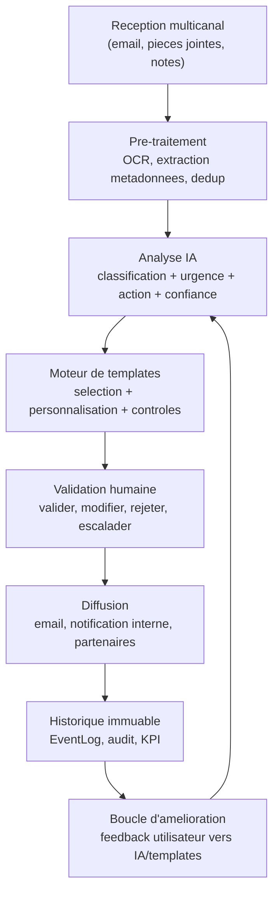
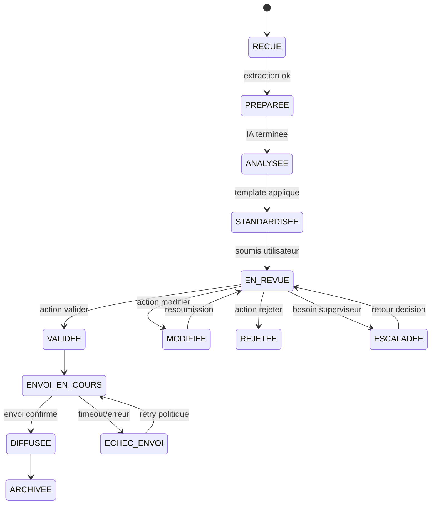
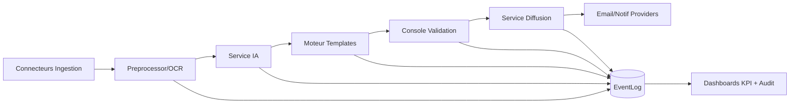
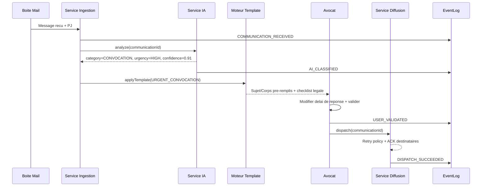

# Workflow Avance de Standardisation des Communications - MemoLib

Date: 2026-04-02  
Version: 2.0.0
Statut: Reference produit + technique

---

## 1. Objectif et perimetre

Ce document definit le workflow cible de gestion des communications MemoLib avec un niveau exploitable par:

- Equipe Produit (regles metier, UX de validation, priorisation).
- Equipe Technique (architecture, modeles de donnees, evenements, SLA).
- Equipe Compliance (traçabilite, RGPD, audit, retention).

Le flux couvre de bout en bout:

1. Ingestion des messages (email, document, note interne).
2. Analyse IA (classification, priorite, action suggeree, confiance).
3. Standardisation par templates gouvernes.
4. Validation humaine avec garde-fous.
5. Diffusion multi-acteurs et accusés de reception.
6. Historisation immuable et observabilite.

---

## 2. Principes de conception

- Human-in-the-loop obligatoire pour tout envoi externe.
- Zero perte d'information: chaque etat est journalise.
- Idempotence sur ingestion et diffusion.
- Explainability IA: justification minimale des suggestions.
- Privacy by design: minimisation des donnees personnelles exposees.
- Fail-safe: en cas d'erreur, bascule en file d'attente/revue manuelle.

---

## 3. Vue globale du workflow

---

## 4. Machine a etats (etat de communication)

---

## 5. Regles metier critiques

| Regle | Description | Implementation attendue |
|---|---|---|
| RB-01 Deduplication | Un message entrant est unique par `externalMessageId` + `sourceSystem`. | Contrainte unique + upsert idempotent. |
| RB-02 Validation obligatoire | Toute communication externe requiert validation humaine. | Blocage hard au niveau service diffusion. |
| RB-03 Seuil de confiance IA | Si `confidence < threshold`, passage automatique en revue prioritaire. | Parametre par tenant/type de dossier. |
| RB-04 Escalade urgence | Urgence Elevee non validee sous X minutes => escalade. | Scheduler + notifications superviseur. |
| RB-05 Tracabilite complete | Toute transition d'etat doit etre journalisee. | EventLog append-only obligatoire. |
| RB-06 Conformite template | Envoi interdit si clauses legales requises manquantes. | Validateur de schema template pre-envoi. |
| RB-07 Confidentialite role-based | Chaque role voit uniquement les dossiers autorises. | ACL/ABAC appliquees sur lecture/ecriture. |

---

## 6. Detail des etapes avancees

### 6.1 Ingestion et pre-traitement

- Sources: IMAP/SMTP, upload document, notes internes.
- Pipeline:
1. Verification integrite du payload.
2. Extraction texte (OCR si PDF/image).
3. Normalisation encodage/date/langue.
4. Deduplication et correlation dossier.

Sortie attendue:

- `communicationId` interne stable.
- `sourceMetadata` complete.
- `attachmentsFingerprint` pour preuve d'integrite.

### 6.2 Analyse IA et suggestion

Champs minimaux produits par l'IA:

- `category` (ex: convocation, contrat, litige, relance client).
- `urgency` (`HIGH`, `MEDIUM`, `LOW`).
- `proposedAction` (action concrete).
- `confidence` (0..1).
- `rationale` (2-4 points expliquant la proposition).

Regles de securisation IA:

- Si confiance faible: tag `REQUIRES_MANUAL_REVIEW`.
- Si contenu sensible detecte: masquage partiel dans notifications.
- Si categorie inconnue: fallback template generic + revue forcee.

### 6.3 Standardisation par templates

Un template contient:

- Objet standardise (prefixes urgence, reference dossier).
- Corps structure (contexte, faits, action requise, delais).
- Mentions legales dynamiques.
- Variables obligatoires et facultatives.

Validation template pre-envoi:

- Variables obligatoires resolues.
- Ton conforme au registre (professionnel, neutre, empathique).
- Longueur et lisibilite (phrases courtes, CTA explicite).

### 6.4 Validation humaine et garde-fous UX

Actions disponibles:

- `VALIDER`: envoi sans modification.
- `MODIFIER`: edition assistée, re-verification automatique.
- `REJETER`: stop workflow avec motif obligatoire.
- `ESCALADER`: transfert au role superviseur.

Fonctionnalites necessaires:

- Diff visuel (suggestion IA vs version finale).
- Alerte si suppression de clause legale.
- Raccourcis de validation rapide pour cas repetitifs.

### 6.5 Diffusion et notification reseau

Canaux:

- Externe: email client/partenaire.
- Interne: notifications role-based (avocat, assistant, manager).

Garanties:

- Retries avec backoff exponentiel sur erreur transitoire.
- Journal d'accuses de reception par destinataire.
- Idempotence d'envoi par `dispatchKey`.

### 6.6 Historique, audit et analytique

`EventLog` doit capturer:

- Qui (`actorId`, `actorRole`).
- Quoi (`eventType`, `entityId`, `before/after state`).
- Quand (`timestamp`, fuseau UTC).
- Pourquoi (`reasonCode`, `comment`).

Exemples d'evenements:

- `COMMUNICATION_RECEIVED`
- `AI_CLASSIFIED`
- `TEMPLATE_APPLIED`
- `USER_VALIDATED`
- `DISPATCH_SUCCEEDED`
- `DISPATCH_FAILED`
- `ESCALATION_TRIGGERED`

---

## 7. Architecture logique cible

Composants minimaux:

- Service Ingestion.
- Service Analyse IA.
- Service Template/Standardisation.
- Service Validation Workflow.
- Service Dispatch/Notification.
- Service EventLog/Audit.
- Dashboards observabilite.

---

## 8. Modele de donnees minimum

### Table `Communication`

| Champ | Type | Notes |
|---|---|---|
| `id` | UUID | PK |
| `tenantId` | UUID | Multi-tenant |
| `externalMessageId` | String | Unicite par source |
| `sourceSystem` | Enum | IMAP, Upload, Internal |
| `category` | Enum | Classification IA/humaine |
| `urgency` | Enum | HIGH, MEDIUM, LOW |
| `status` | Enum | machine a etats |
| `confidence` | Decimal | 0..1 |
| `proposedAction` | String | action suggeree |
| `finalSubject` | String | apres validation |
| `finalBody` | Text | apres validation |
| `createdAt` | DateTime | UTC |
| `updatedAt` | DateTime | UTC |

### Table `CommunicationEvent` (append-only)

| Champ | Type | Notes |
|---|---|---|
| `id` | UUID | PK |
| `communicationId` | UUID | FK |
| `eventType` | Enum | voir catalogue |
| `actorType` | Enum | USER, SYSTEM |
| `actorId` | UUID/String | nullable system |
| `payload` | JSON | details metier |
| `occurredAt` | DateTime | UTC |

### Table `Template`

| Champ | Type | Notes |
|---|---|---|
| `id` | UUID | PK |
| `code` | String | ex `URGENT_CONVOCATION_V2` |
| `version` | Integer | versionning |
| `status` | Enum | DRAFT, APPROVED, RETIRED |
| `schema` | JSON | variables requises |
| `content` | Text/JSON | sujet + corps |

---

## 9. API interne (contrats simplifies)

| Endpoint | Role |
|---|---|
| `POST /communications/ingest` | Cree une communication brute |
| `POST /communications/{id}/analyze` | Lance analyse IA |
| `POST /communications/{id}/standardize` | Applique template |
| `POST /communications/{id}/review` | Valider/modifier/rejeter/escalader |
| `POST /communications/{id}/dispatch` | Declenche diffusion |
| `GET /communications/{id}/timeline` | Renvoie historique complet |

Codes fonctionnels recommandes:

- `409_CONFLICT_DUPLICATE_MESSAGE`
- `422_TEMPLATE_VALIDATION_FAILED`
- `428_HUMAN_APPROVAL_REQUIRED`
- `503_DISPATCH_PROVIDER_UNAVAILABLE`

---

## 10. Securite, conformite et gouvernance

### Exigences securite

- Chiffrement au repos et en transit (TLS 1.2+).
- Signature ou hash des pieces jointes.
- Journal d'acces consultable (who/when/what).
- Gestion stricte des secrets via vault.

### RGPD et retention

- Base legale documentee par type de communication.
- Droit d'acces et export des donnees.
- Politique de retention configurable (ex: 5 ans).
- Purge/anonymisation automatique a echeance.

### Gouvernance templates

- Workflow d'approbation a 2 niveaux pour templates sensibles.
- Historique des versions et rollback rapide.
- Tests de conformite avant publication template.

---

## 11. SLA, SLO et KPI de pilotage

### SLO operationnels cibles

- Temps ingestion -> proposition IA (P95): <= 60 s.
- Temps proposition -> validation humaine (median): <= 15 min.
- Taux d'echec diffusion apres retries: < 1%.
- Exhaustivite de tracabilite event log: 100%.

### KPI metier

- Taux de messages auto-standardises sans retouche.
- Taux d'escalade par categorie.
- Delai moyen de traitement par urgence.
- Taux de conformite template (zero clause manquante).
- Satisfaction utilisateur sur la qualite de suggestion IA.

---

## 12. Gestion des erreurs et plans de reprise

| Cas | Detection | Action immediate | Reprise |
|---|---|---|---|
| Echec OCR | exception extraction | marquage `PREPROCESSING_FAILED` | file manuelle + retry batch |
| IA indisponible | timeout/service down | fallback mode regles | relance differée |
| Template invalide | validation schema | blocage envoi | correction template + reprocess |
| Echec provider email | bounce/timeout | retries backoff | bascule provider secondaire |
| EventLog indisponible | ecriture KO | mode degrade bloque diffusion | replay events depuis queue |

---

## 13. Exemple avance - Convocation tribunal urgente

Resultat attendu:

- Message standardise, legalement conforme, diffuse aux bons acteurs.
- Historique complet consultable pour audit.
- Signal de feedback reinjecte pour ameliorer les prochaines suggestions.

---

## 14. Roadmap d'implementation recommandee

### Phase 1 (MVP fiable)

1. Ingestion + dedup + EventLog append-only.
2. Classification IA de base + seuil de confiance.
3. Templates versionnes + validation humaine.
4. Diffusion email + retries + accusés de reception.

### Phase 2 (industrialisation)

1. Escalade automatique et SLA monitoring.
2. Console review avancee (diff, checklist legal).
3. Dashboard KPI temps reel.
4. Gouvernance templates avec approbation.

### Phase 3 (optimisation continue)

1. Feedback loop IA (reinforcement par validation humaine).
2. Personnalisation par tenant/secteur.
3. Detection proactive des risques de non-conformite.

---

## 15. Checklist de readiness production

- Idempotence verifiee sur ingestion/diffusion.
- Tests d'integration du workflow complet (happy path + erreurs).
- Journalisation securisee et auditable activee.
- Alerting sur SLO critiques configure.
- Procedure de rollback templates et provider email testee.
- Retention/purge RGPD automatisee et verifiee.

---

## 16. Valeur strategique (version avancee)

- Cohérence operationnelle: meme standard de communication pour tous les dossiers.
- Reduction du risque legal: clauses obligatoires controlees avant envoi.
- Productivite augmentee: IA utile mais encadree par validation humaine.
- Gouvernance et audit solides: chaque decision est explicable et tracable.
- Scalabilite multi-acteurs: processus robuste pour cabinets et reseaux partenaires.

---

## 17. Documents operationnels associes

- Plan d'execution excellence (backlog P0/P1/P2, KPI/SLO, release 6 sprints):
    `docs/EXCELLENCE_BACKLOG_SLO_RELEASE.md`
- Validation diagrammes + threat model review:
    `docs/THREAT_MODEL_REVIEW_APP_DIAGRAMS.md`

---

Diagrammes generes avec Mermaid.js, compatibles GitHub/GitLab/outils de documentation modernes.
