# 🏗️ ARCHITECTURE IA POSTE MANAGER

## Diagramme d'Architecture Technique

```mermaid
flowchart TD

A[Canaux entrants<br/>Email · Chat · SMS · Formulaires · API] --> B[Connecteurs sécurisés]

B --> C[Moteur IA Locale]

C --> C1[Analyse sémantique]
C --> C2[Détection intention]
C --> C3[Infos manquantes]
C --> C4[Priorisation]
C --> C5[Raisonnement humain simulé]

C --> D[Workspace Dynamique]

D --> D1[Résumé intelligent]
D --> D2[Historique & logs]
D --> D3[Actions suggérées]
D --> D4[Prédictions]

D --> E{Infos complètes ?}

E -- Non --> F[Formulaire interactif<br/>Accessible & multi-langues]
F --> D

E -- Oui --> G[Génération réponse IA]

G --> H{Complexité élevée ?}

H -- Oui --> I[IA externe contrôlée]
H -- Non --> J[IA locale]

I --> K[Validation humaine optionnelle]
J --> K

K --> L[Envoi multi-canal]

L --> M[Journalisation RGPD]

M --> N[Dashboard utilisateur]

N --> O[Reporting · Optimisation · Support]

subgraph Sécurité & Conformité
S1[Chiffrement]
S2[OAuth2 / RBAC]
S3[Anonymisation]
S4[Archivage configurable]
end

S1 --- B
S2 --- C
S3 --- M
S4 --- M
```

## Flux de Données Détaillé

```mermaid
sequenceDiagram
    participant U as Utilisateur
    participant C as Connecteur
    participant AI as Moteur IA
    participant W as Workspace
    participant F as Formulaire
    participant R as Générateur Réponse
    participant S as Système Envoi

    U->>C: Email/Message entrant
    C->>AI: Analyse sémantique
    AI->>W: Création workspace
    W->>AI: Détection infos manquantes
    
    alt Infos manquantes
        AI->>F: Génération formulaire
        F->>U: Demande infos
        U->>F: Saisie données
        F->>W: Mise à jour workspace
    end
    
    W->>R: Génération réponse
    R->>AI: Validation qualité
    
    alt Complexité élevée
        AI->>R: IA externe
    else Complexité normale
        AI->>R: IA locale
    end
    
    R->>S: Envoi réponse
    S->>U: Réponse finale
    W->>W: Archivage & logs
```



## Architecture Technique par Couches

```mermaid
graph TB
    subgraph "Couche Présentation"
        UI[Interface Utilisateur]
        API[API REST]
        WS[WebSocket]
    end
    
    subgraph "Couche Métier"
        WM[Workspace Manager]
        AIE[AI Engine]
        FM[Form Manager]
        RM[Response Manager]
    end
    
    subgraph "Couche Données"
        DB[(Base de Données)]
        CACHE[(Cache Redis)]
        FILES[(Fichiers)]
    end
    
    subgraph "Couche Infrastructure"
        SEC[Sécurité]
        LOG[Logging]
        MON[Monitoring]
    end
    
    UI --> API
    API --> WM
    WM --> AIE
    AIE --> FM
    FM --> RM
    RM --> DB
    WM --> CACHE
    
    SEC -.-> API
    LOG -.-> WM
    MON -.-> AIE
```



## Spécialisation Légale (Extension)

```mermaid
flowchart LR
    subgraph "Modules Juridiques"
        CIVIL[Droit Civil]
        PENAL[Droit Pénal]
        COMM[Droit Commercial]
        SOCIAL[Droit Social]
    end
    
    subgraph "IA Juridique"
        JURIS[Analyse Jurisprudence]
        DELAI[Calcul Délais]
        REF[Références Légales]
    end
    
    subgraph "Templates Légaux"
        DEMEURE[Mises en demeure]
        ASSIGN[Assignations]
        CONCL[Conclusions]
        CORRESP[Correspondance]
    end
    
    CIVIL --> JURIS
    PENAL --> DELAI
    COMM --> REF
    SOCIAL --> JURIS
    
    JURIS --> DEMEURE
    DELAI --> ASSIGN
    REF --> CONCL
    JURIS --> CORRESP
```

